# Repeating Earthquake Activity at RCM

## Waveforms
[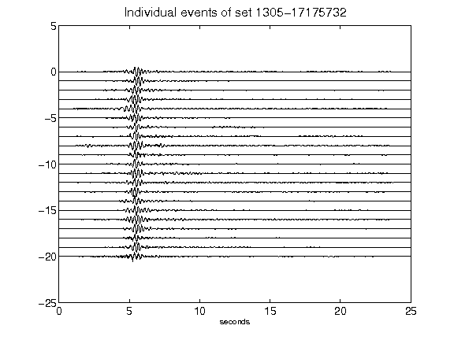](figures/1305-17175732_AllEv.png)[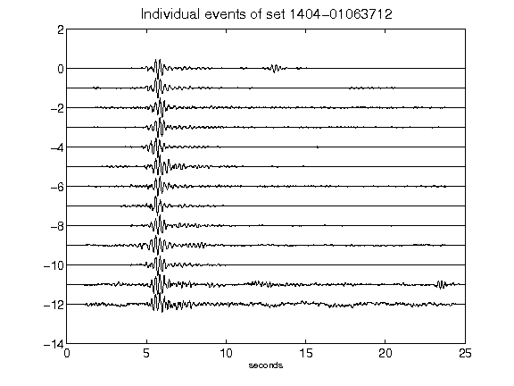](figures/1404-01063712_AllEv.png)[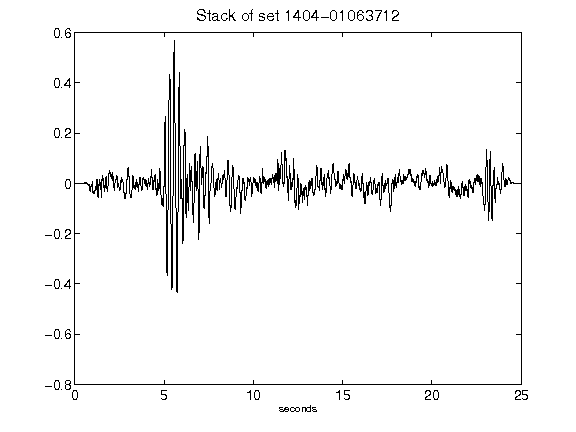](figures/1404-01063712_Stack.png)[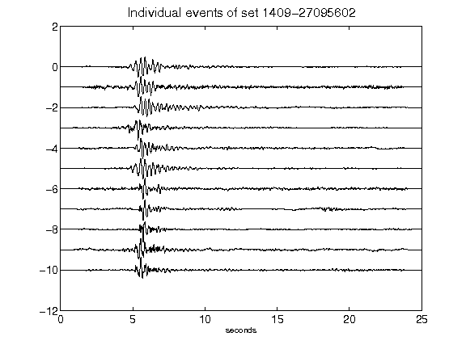](figures/1409-27095602_AllEv.png)[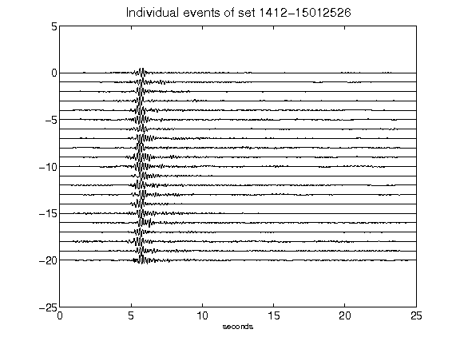](figures/1412-15012526_AllEv.png)[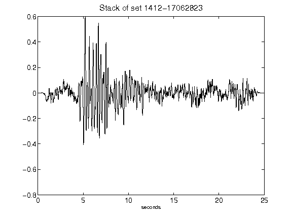](figures/1412-17062823_Stack.png)[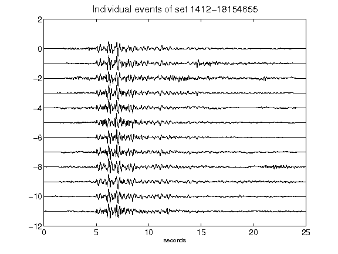](figures/1412-18154655_AllEv.png)[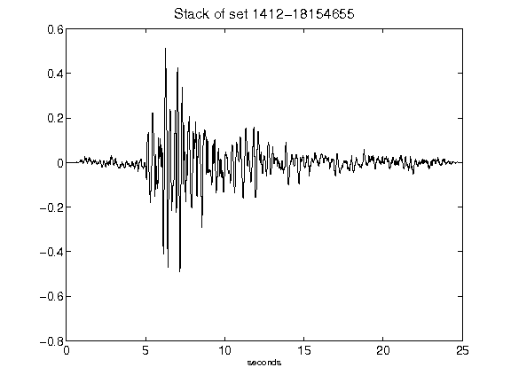](figures/1412-18154655_Stack.png)[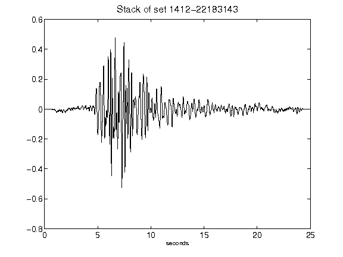](figures/1412-22183143_Stack.png)[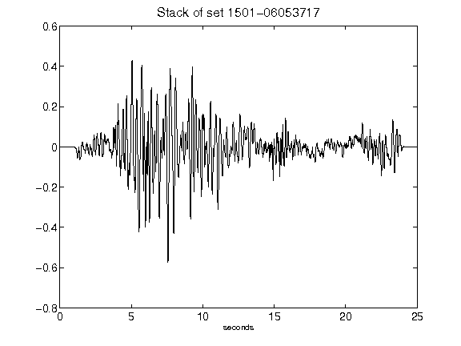](figures/1501-06053717_Stack.png)[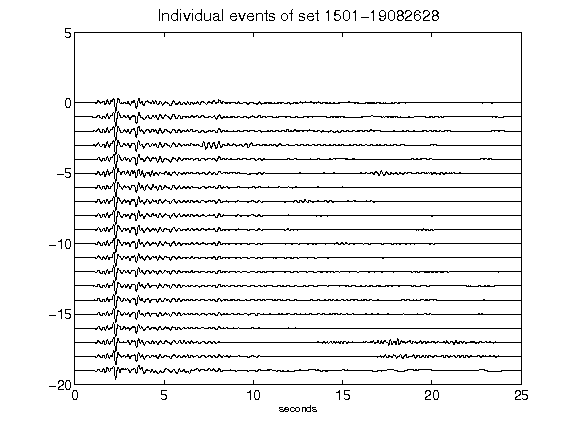](figures/1501-19082628_AllEv.png)[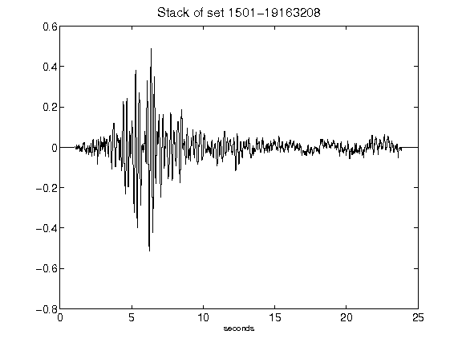](figures/1501-19163208_Stack.png)[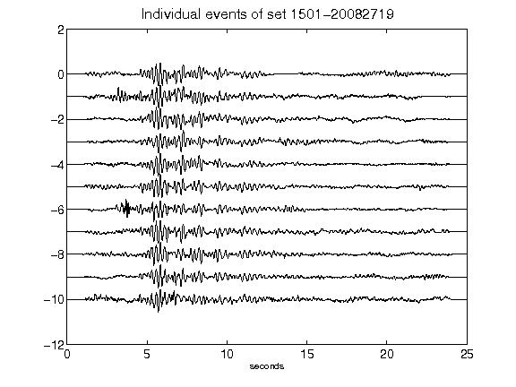](figures/1501-20082719_AllEv.png)