# Repeating Earthquake Activity at RCM

## Waveforms
[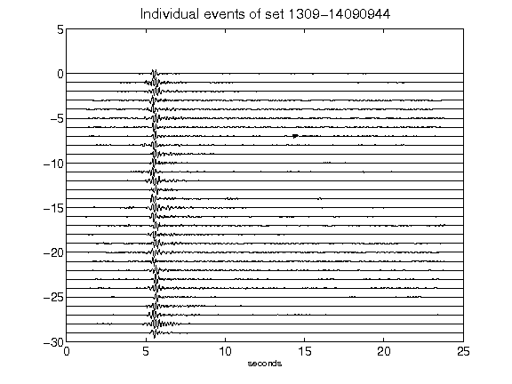](figures/1309-14090944_AllEv.png)[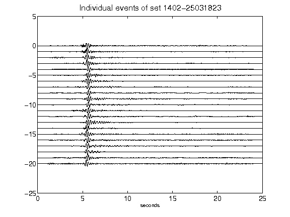](figures/1402-25031823_AllEv.png)[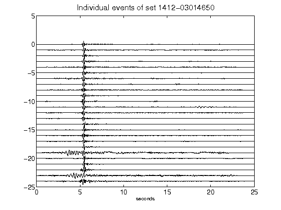](figures/1412-03014650_AllEv.png)[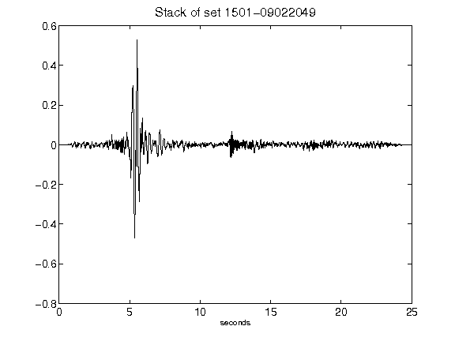](figures/1501-09022049_Stack.png)[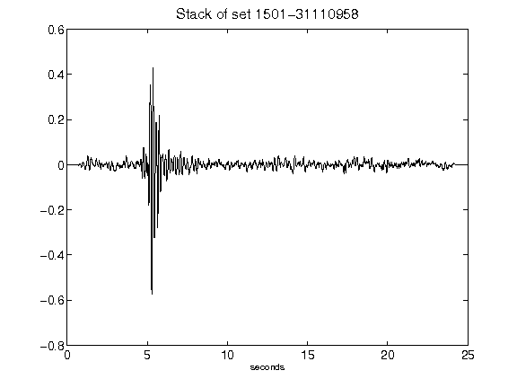](figures/1501-31110958_Stack.png)[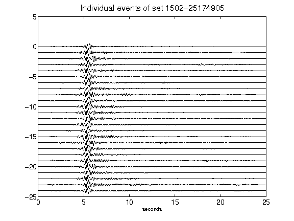](figures/1502-25174905_AllEv.png)[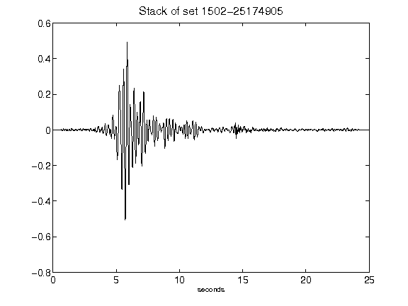](figures/1502-25174905_Stack.png)[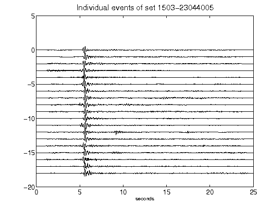](figures/1503-23044005_AllEv.png)[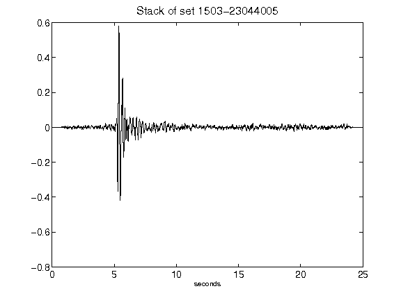](figures/1503-23044005_Stack.png)[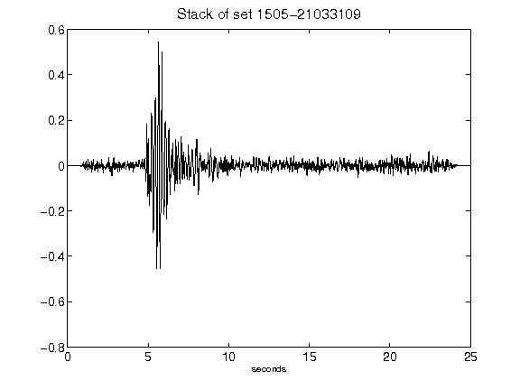](figures/1505-21033109_Stack.png)[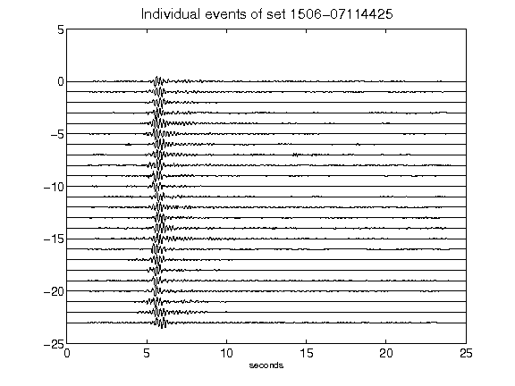](figures/1506-07114425_AllEv.png)[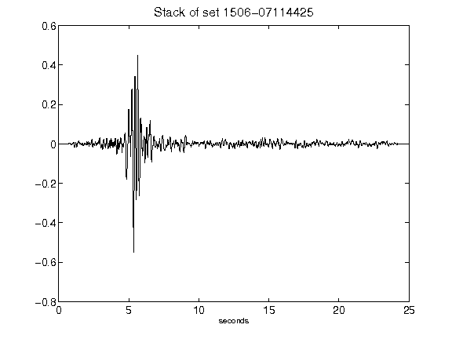](figures/1506-07114425_Stack.png)[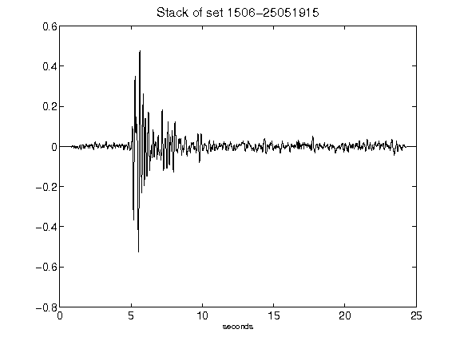](figures/1506-25051915_Stack.png)[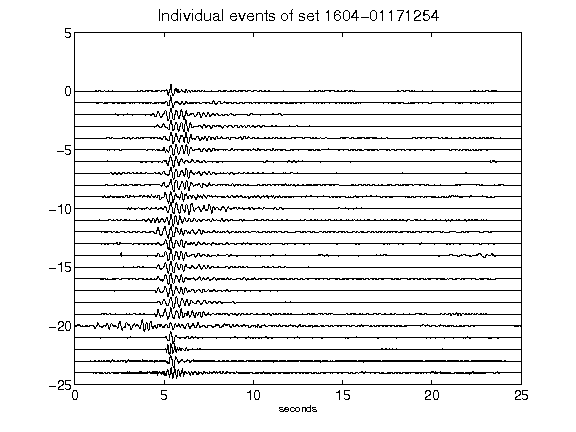](figures/1604-01171254_AllEv.png)[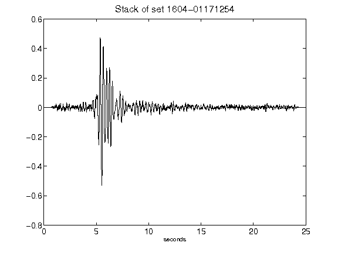](figures/1604-01171254_Stack.png)[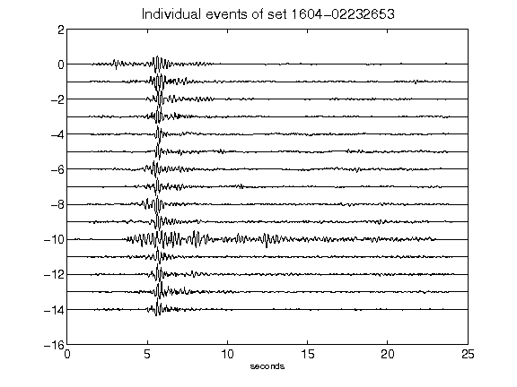](figures/1604-02232653_AllEv.png)[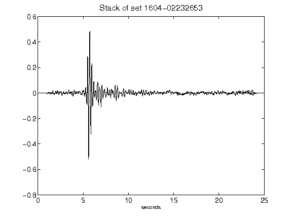](figures/1604-02232653_Stack.png)[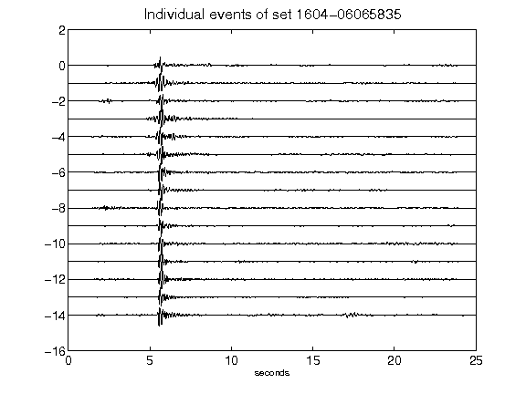](figures/1604-06065835_AllEv.png)[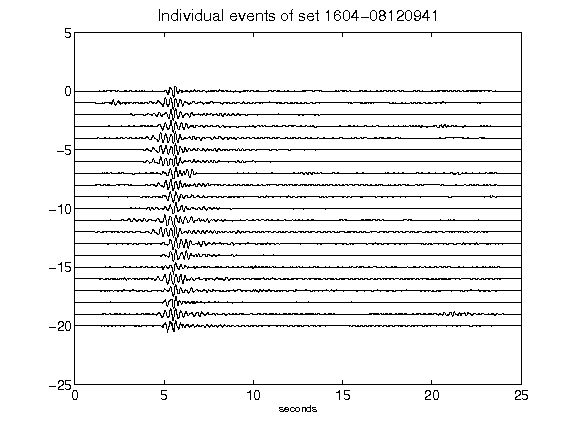](figures/1604-08120941_AllEv.png)[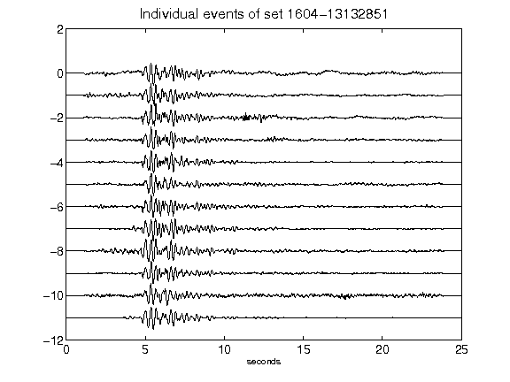](figures/1604-13132851_AllEv.png)[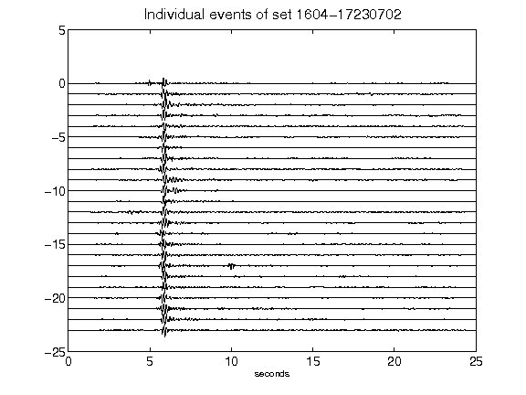](figures/1604-17230702_AllEv.png)[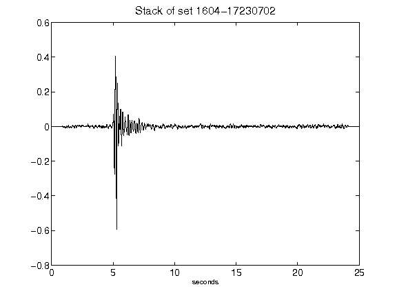](figures/1604-17230702_Stack.png)[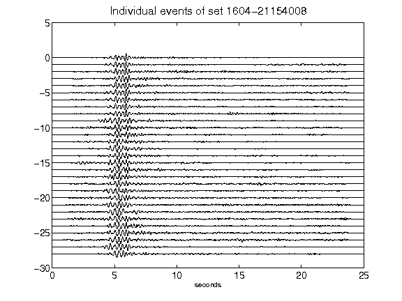](figures/1604-21154008_AllEv.png)[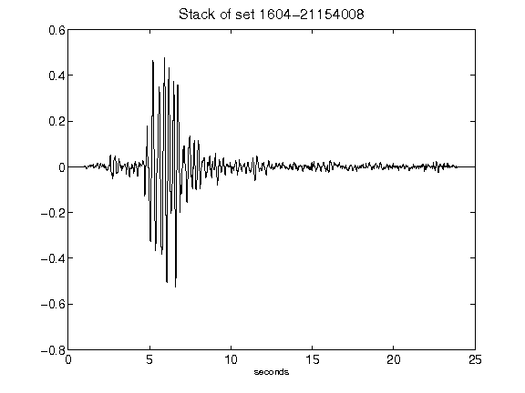](figures/1604-21154008_Stack.png)[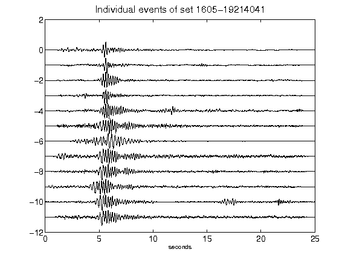](figures/1605-19214041_AllEv.png)