# Repeating Earthquake Activity at RCM

## Waveforms
[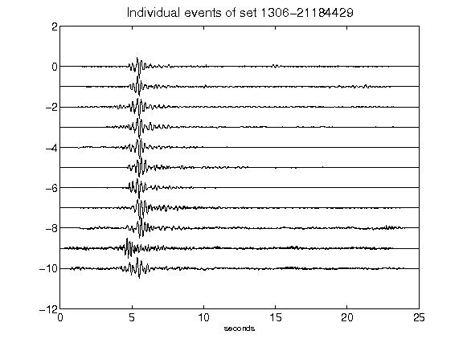](figures/1306-21184429_AllEv.png)[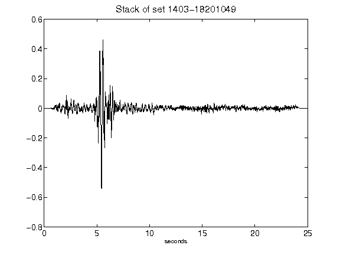](figures/1403-18201049_Stack.png)[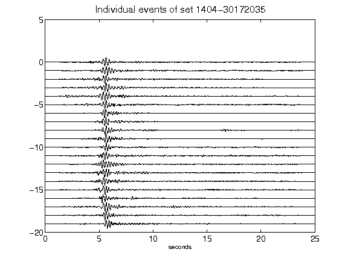](figures/1404-30172035_AllEv.png)[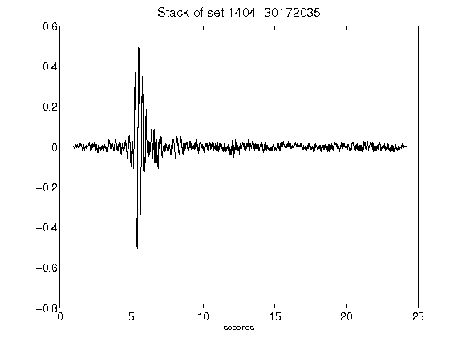](figures/1404-30172035_Stack.png)[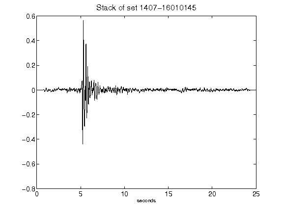](figures/1407-16010145_Stack.png)[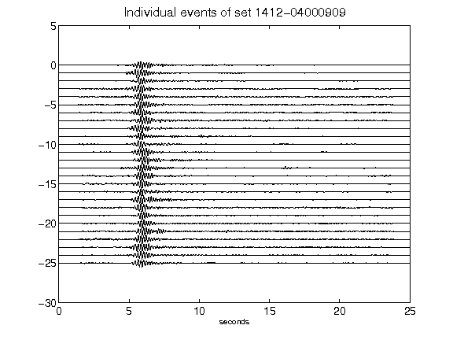](figures/1412-04000909_AllEv.png)[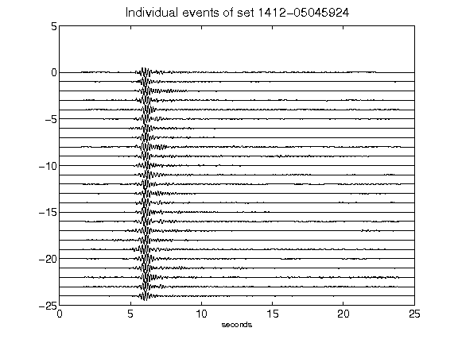](figures/1412-05045924_AllEv.png)[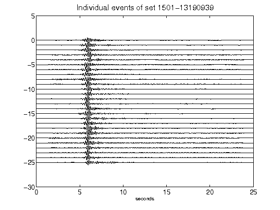](figures/1501-13190939_AllEv.png)[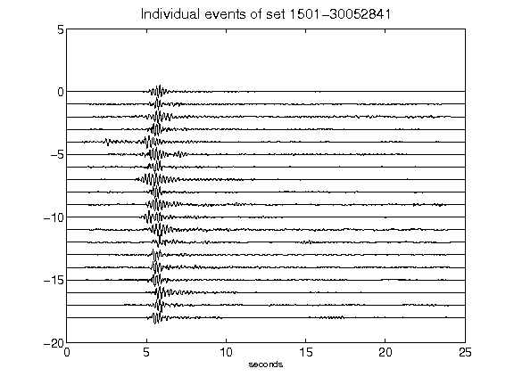](figures/1501-30052841_AllEv.png)[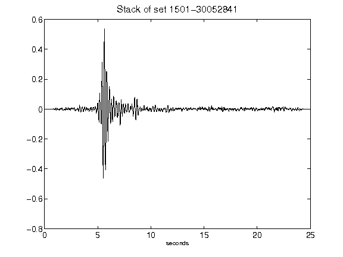](figures/1501-30052841_Stack.png)[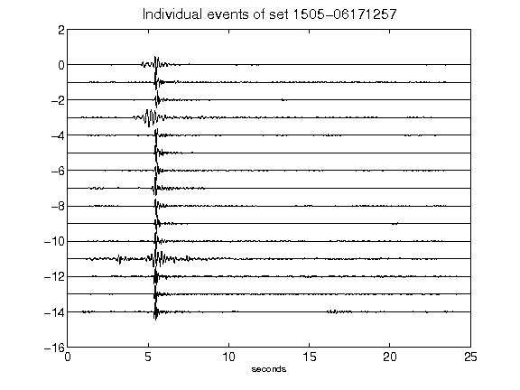](figures/1505-06171257_AllEv.png)[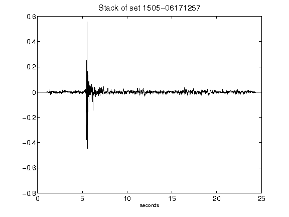](figures/1505-06171257_Stack.png)[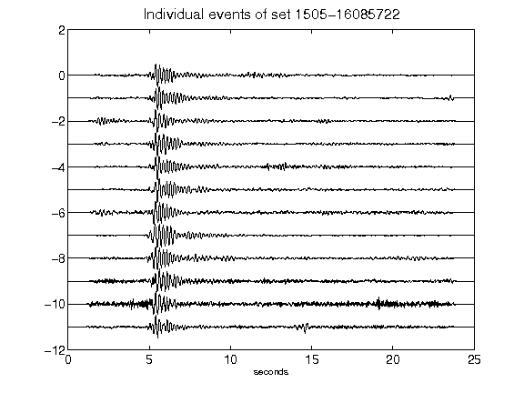](figures/1505-16085722_AllEv.png)[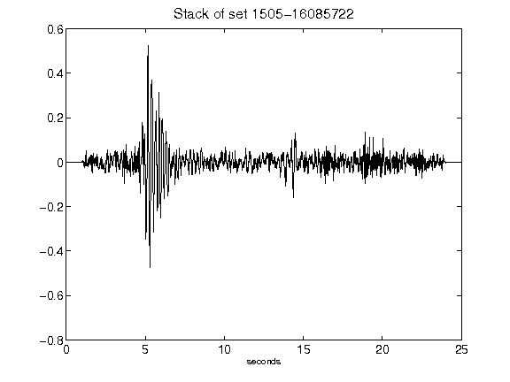](figures/1505-16085722_Stack.png)[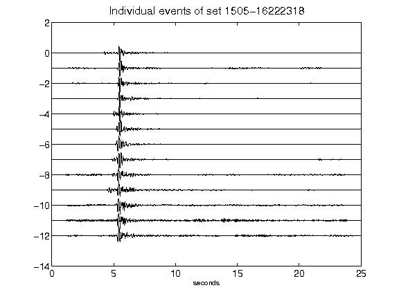](figures/1505-16222318_AllEv.png)[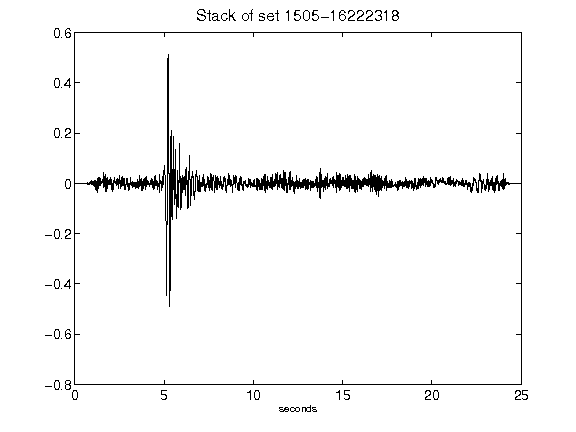](figures/1505-16222318_Stack.png)[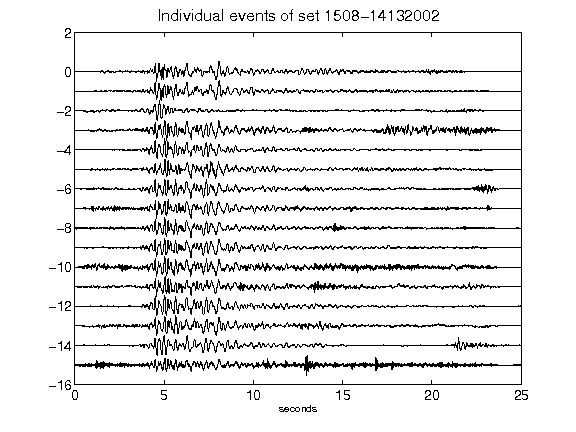](figures/1508-14132002_AllEv.png)[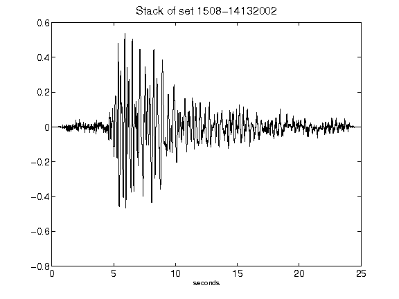](figures/1508-14132002_Stack.png)