# Repeating Earthquake Activity at RCM

## Waveforms
[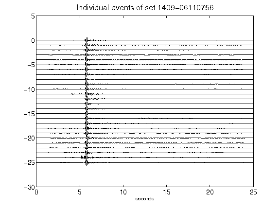](figures/1409-06110756_AllEv.png)[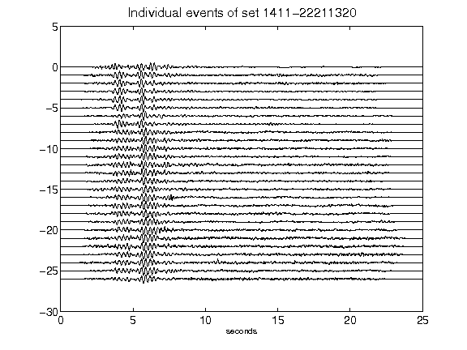](figures/1411-22211320_AllEv.png)[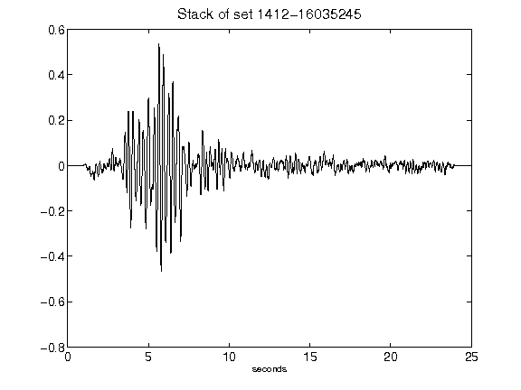](figures/1412-16035245_Stack.png)[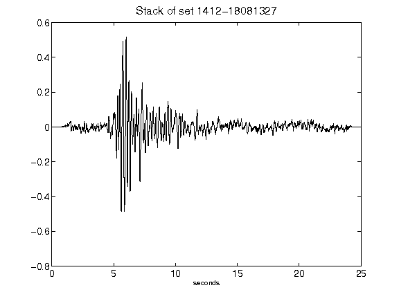](figures/1412-18081327_Stack.png)[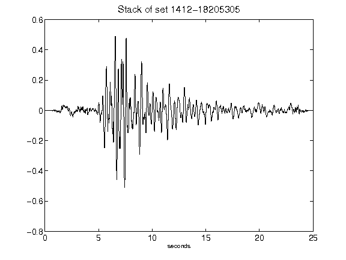](figures/1412-18205305_Stack.png)[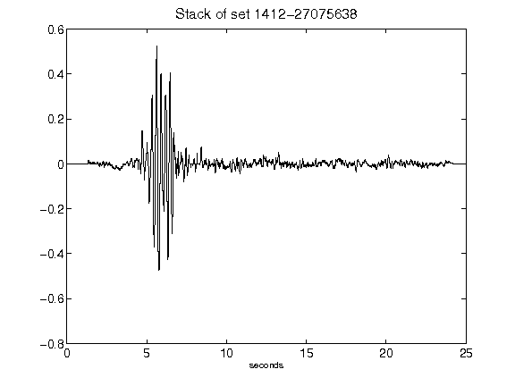](figures/1412-27075638_Stack.png)[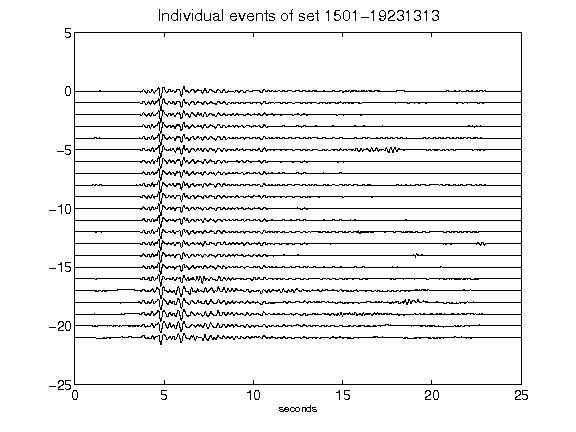](figures/1501-19231313_AllEv.png)[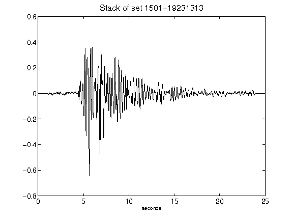](figures/1501-19231313_Stack.png)[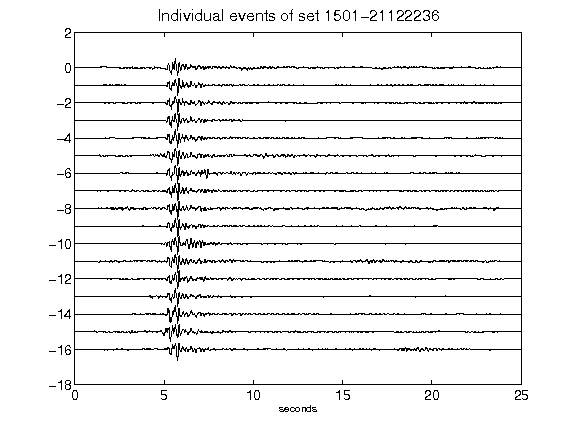](figures/1501-21122236_AllEv.png)[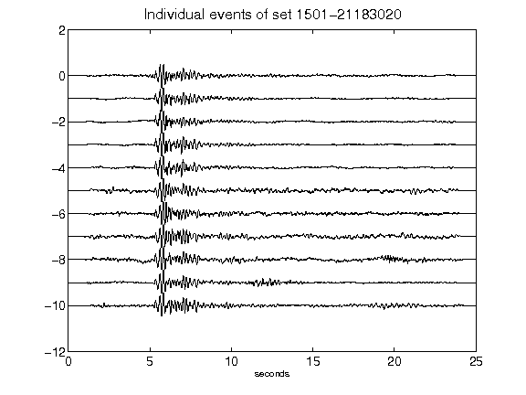](figures/1501-21183020_AllEv.png)[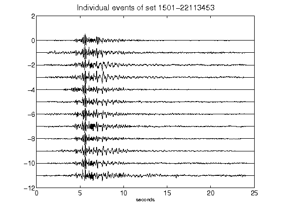](figures/1501-22113453_AllEv.png)[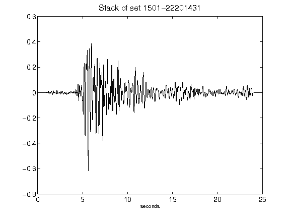](figures/1501-22201431_Stack.png)[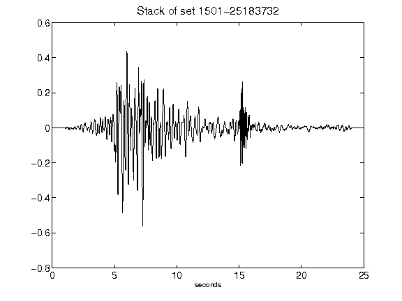](figures/1501-25183732_Stack.png)[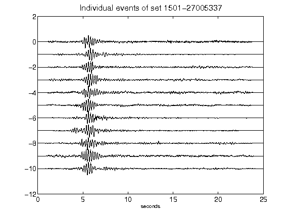](figures/1501-27005337_AllEv.png)[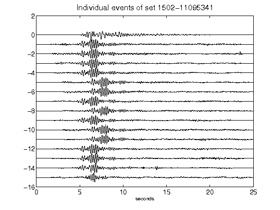](figures/1502-11095341_AllEv.png)[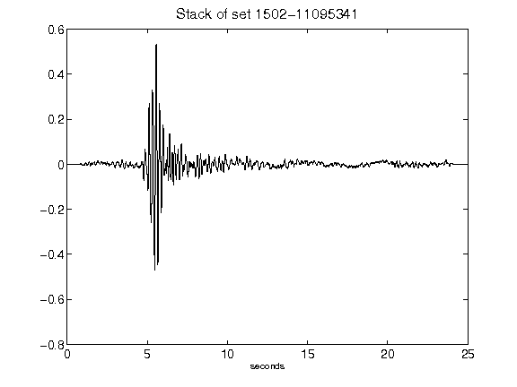](figures/1502-11095341_Stack.png)