# Repeating Earthquake Activity at RCM

## Waveforms
[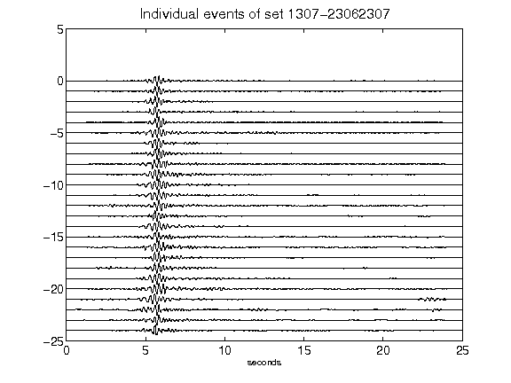](figures/1307-23062307_AllEv.png)[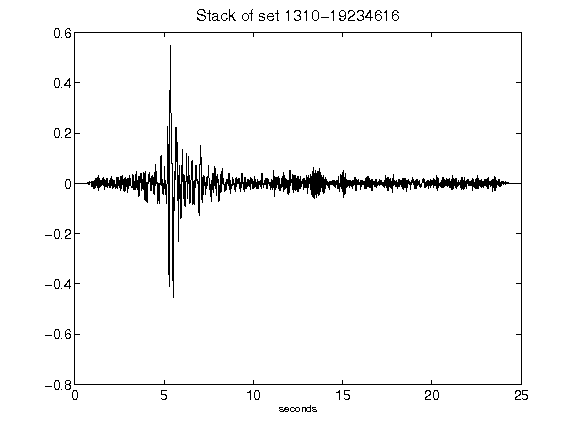](figures/1310-19234616_Stack.png)[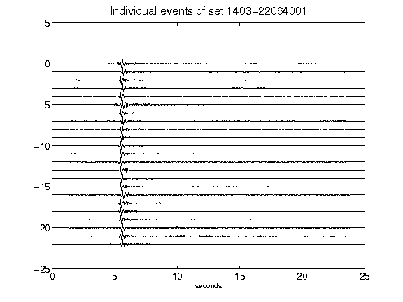](figures/1403-22064001_AllEv.png)[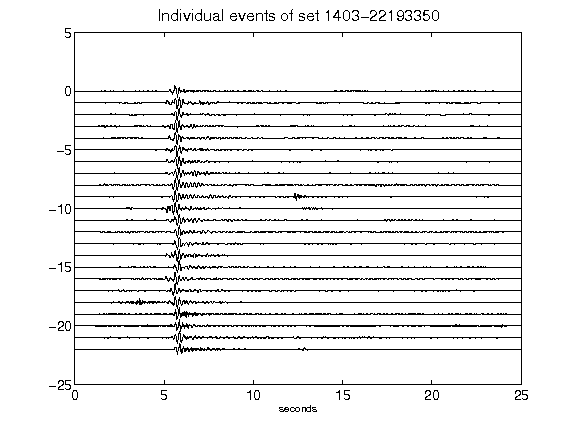](figures/1403-22193350_AllEv.png)[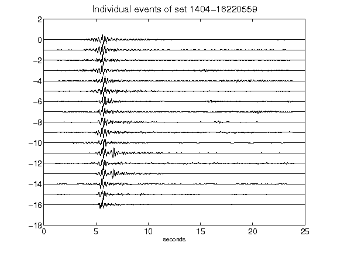](figures/1404-16220559_AllEv.png)[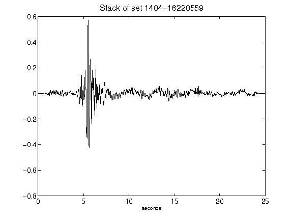](figures/1404-16220559_Stack.png)[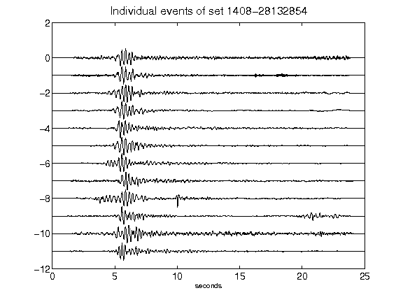](figures/1408-28132854_AllEv.png)[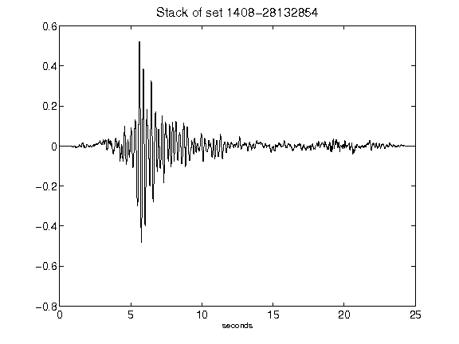](figures/1408-28132854_Stack.png)[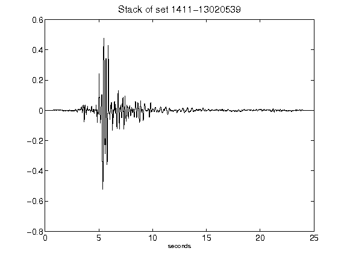](figures/1411-13020539_Stack.png)[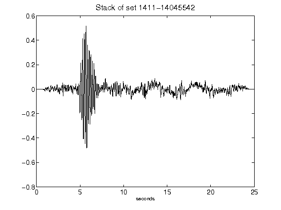](figures/1411-14045542_Stack.png)[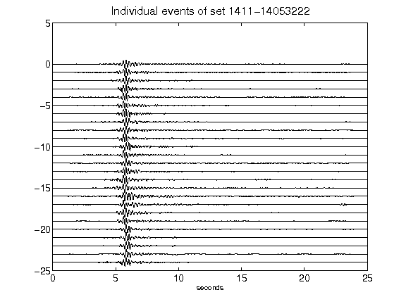](figures/1411-14053222_AllEv.png)[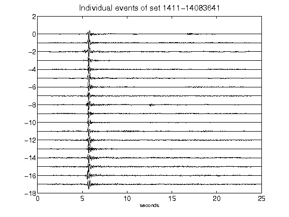](figures/1411-14083641_AllEv.png)[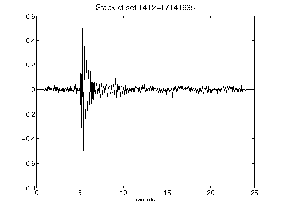](figures/1412-17141935_Stack.png)[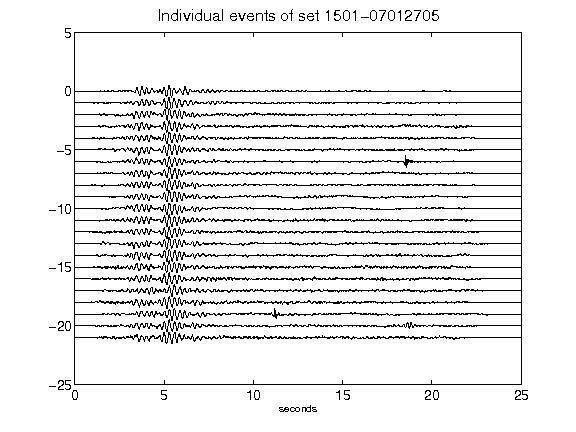](figures/1501-07012705_AllEv.png)[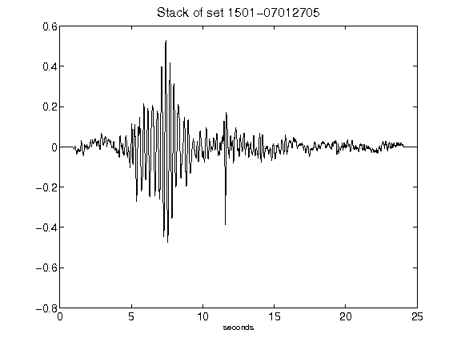](figures/1501-07012705_Stack.png)[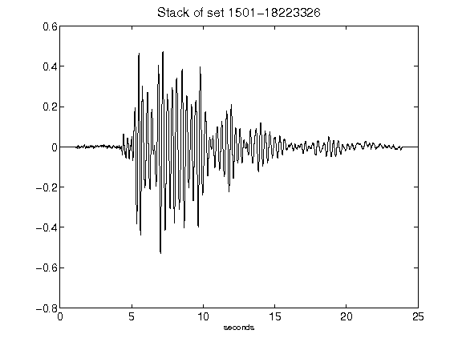](figures/1501-18223326_Stack.png)[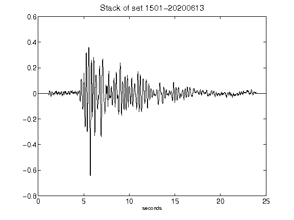](figures/1501-20200613_Stack.png)[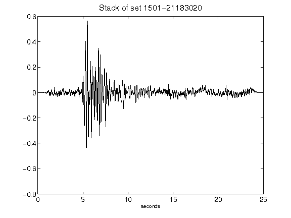](figures/1501-21183020_Stack.png)[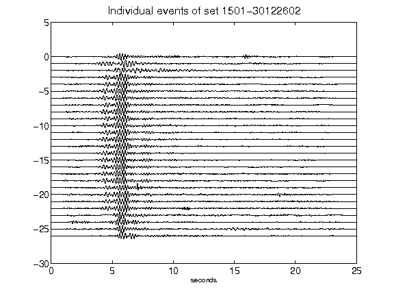](figures/1501-30122602_AllEv.png)[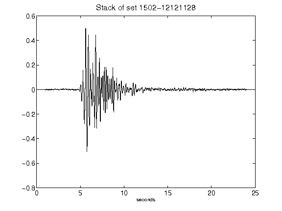](figures/1502-12121128_Stack.png)[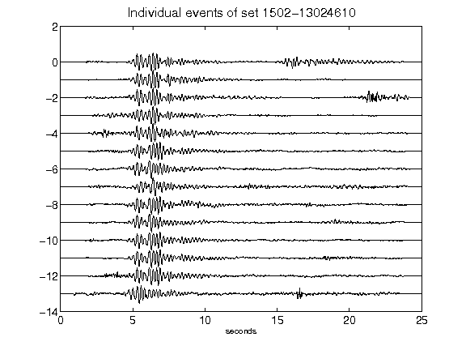](figures/1502-13024610_AllEv.png)[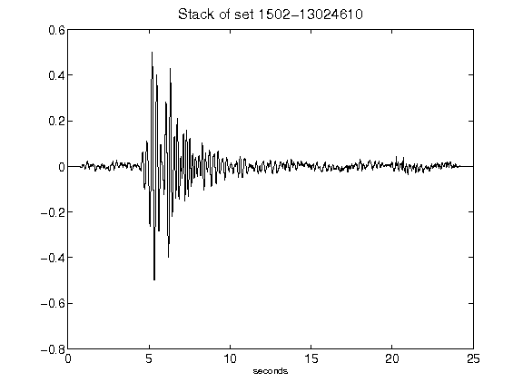](figures/1502-13024610_Stack.png)