# Repeating Earthquake Activity at RCM

## Waveforms
[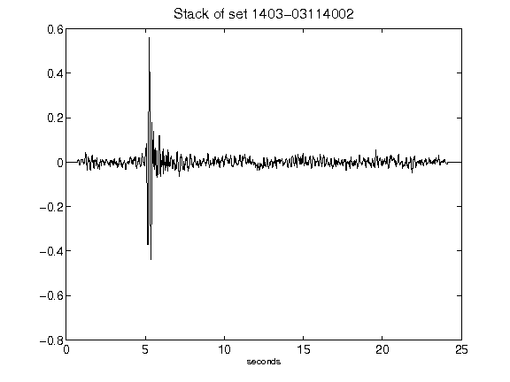](figures/1403-03114002_Stack.png)[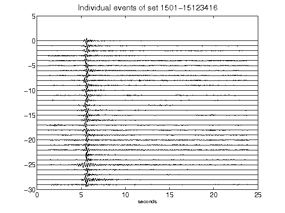](figures/1501-15123416_AllEv.png)[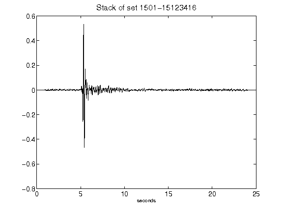](figures/1501-15123416_Stack.png)[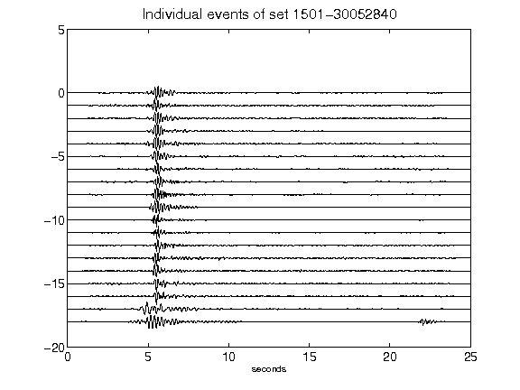](figures/1501-30052840_AllEv.png)[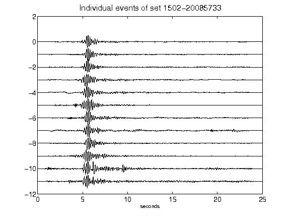](figures/1502-20085733_AllEv.png)[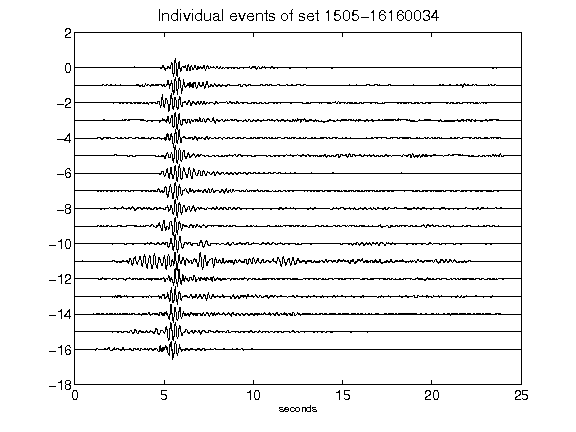](figures/1505-16160034_AllEv.png)[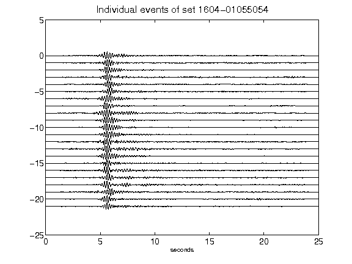](figures/1604-01055054_AllEv.png)[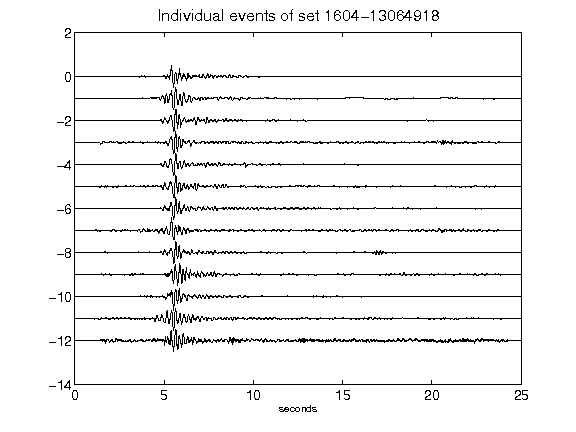](figures/1604-13064918_AllEv.png)[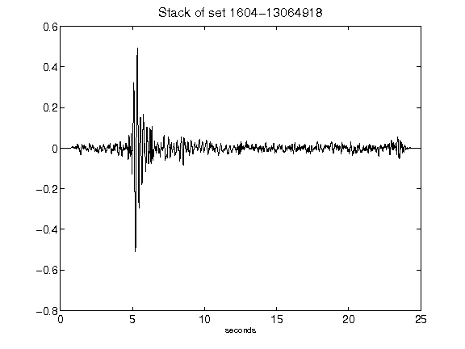](figures/1604-13064918_Stack.png)[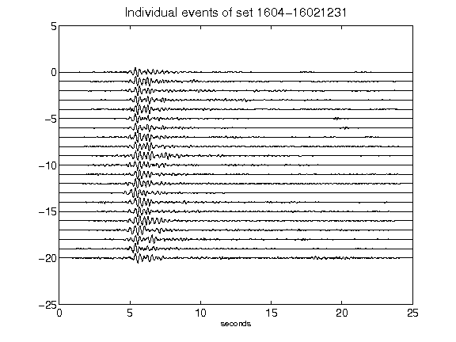](figures/1604-16021231_AllEv.png)[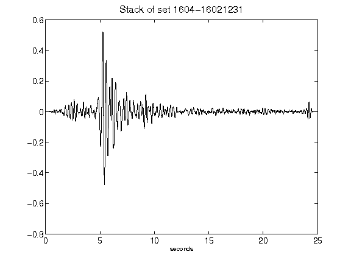](figures/1604-16021231_Stack.png)[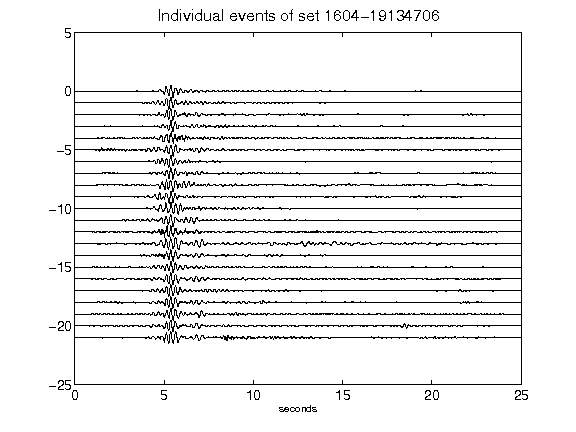](figures/1604-19134706_AllEv.png)[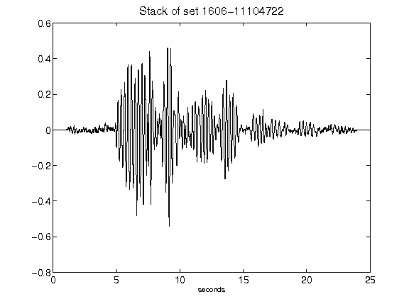](figures/1606-11104722_Stack.png)