# Repeating Earthquake Activity at RCM

## Waveforms
[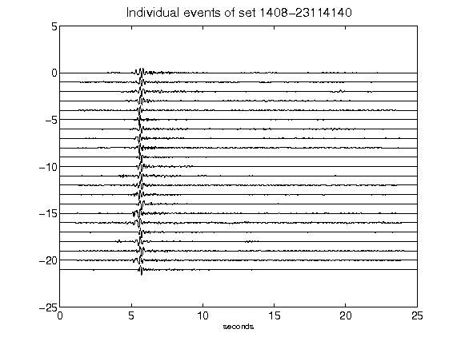](figures/1408-23114140_AllEv.png)[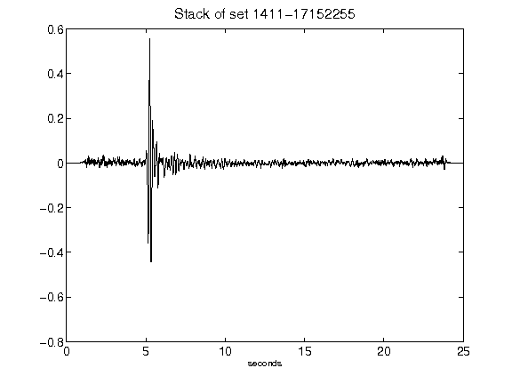](figures/1411-17152255_Stack.png)[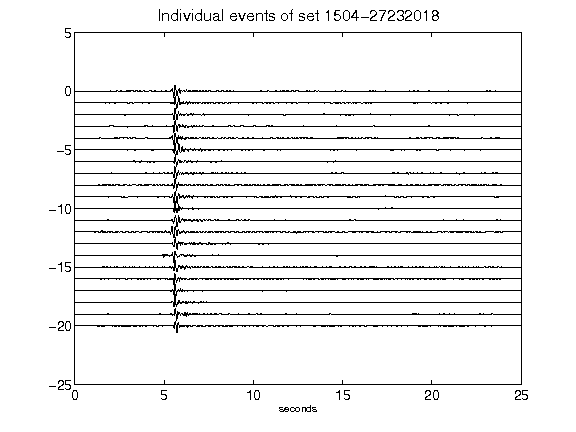](figures/1504-27232018_AllEv.png)[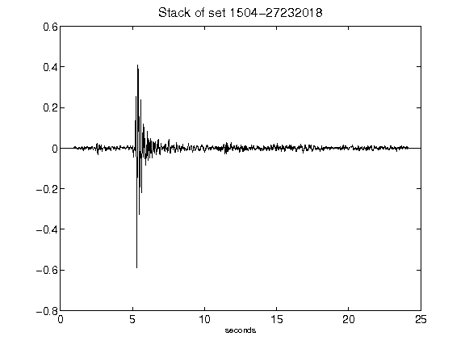](figures/1504-27232018_Stack.png)[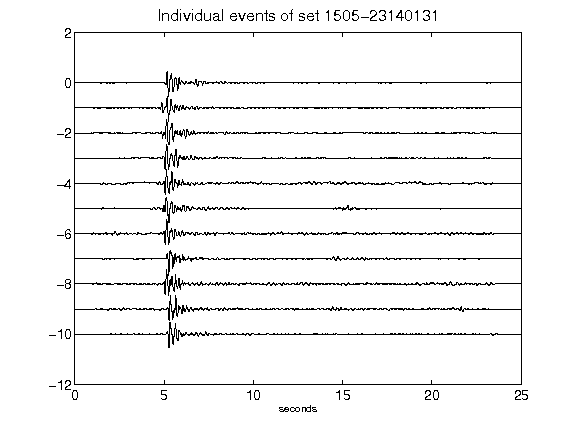](figures/1505-23140131_AllEv.png)[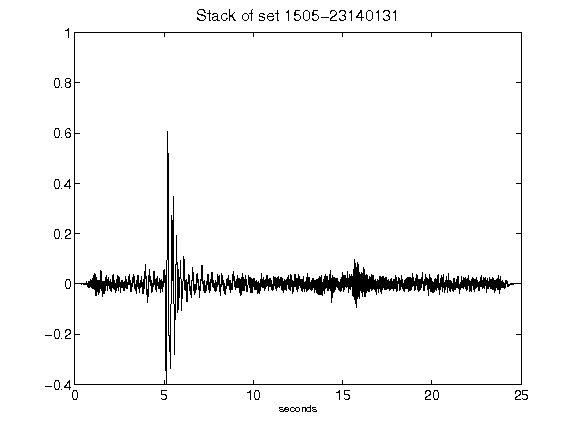](figures/1505-23140131_Stack.png)[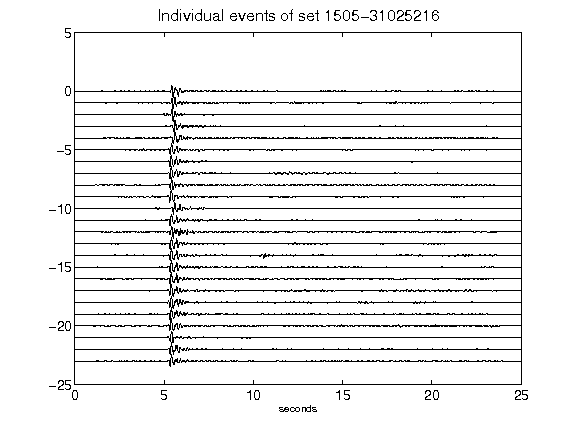](figures/1505-31025216_AllEv.png)[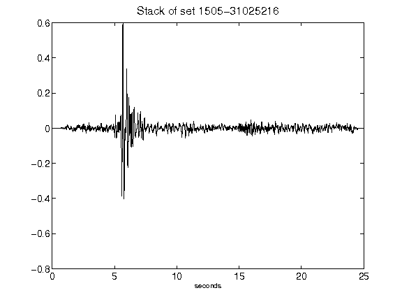](figures/1505-31025216_Stack.png)[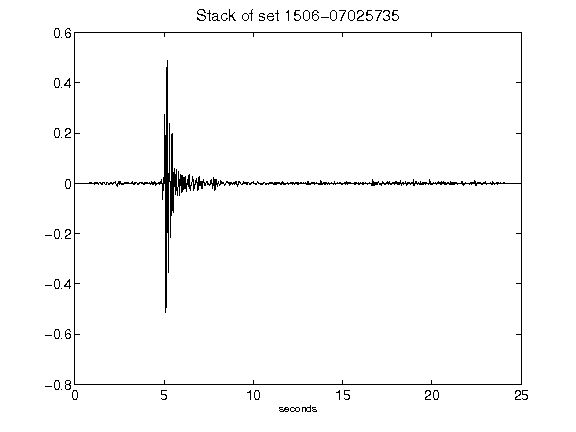](figures/1506-07025735_Stack.png)[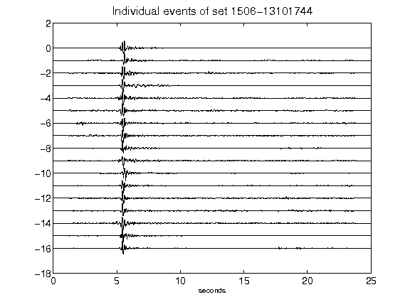](figures/1506-13101744_AllEv.png)[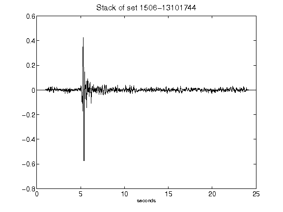](figures/1506-13101744_Stack.png)[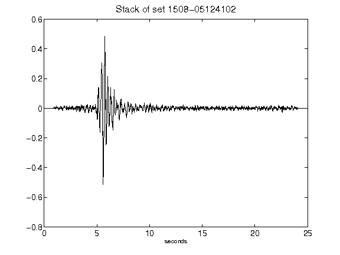](figures/1508-05124102_Stack.png)[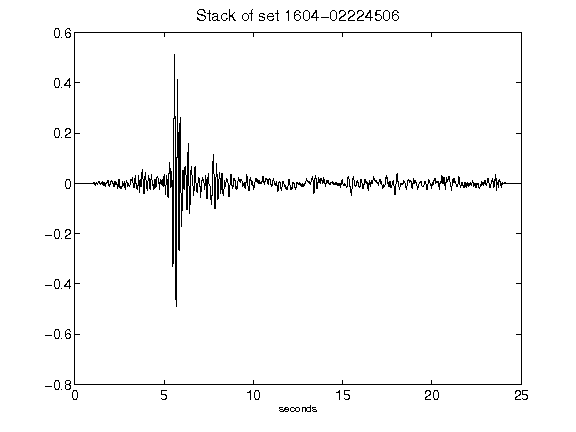](figures/1604-02224506_Stack.png)[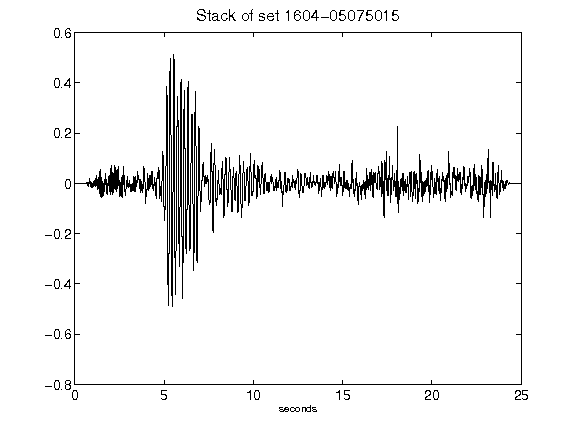](figures/1604-05075015_Stack.png)[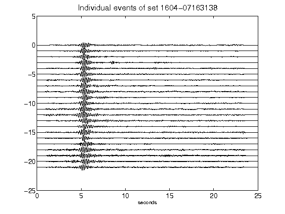](figures/1604-07163138_AllEv.png)[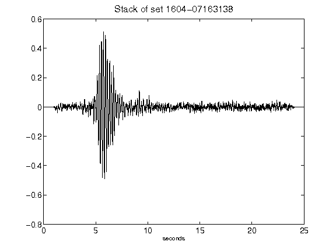](figures/1604-07163138_Stack.png)[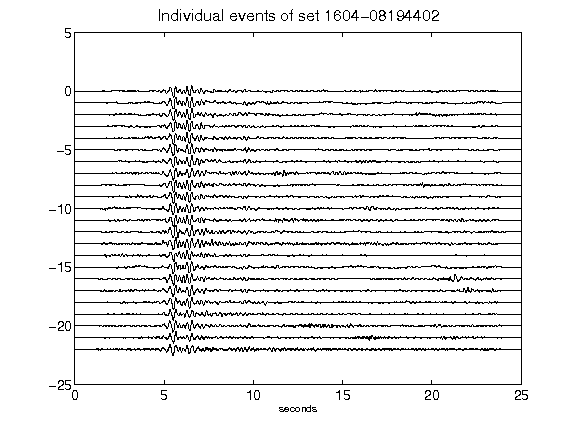](figures/1604-08194402_AllEv.png)[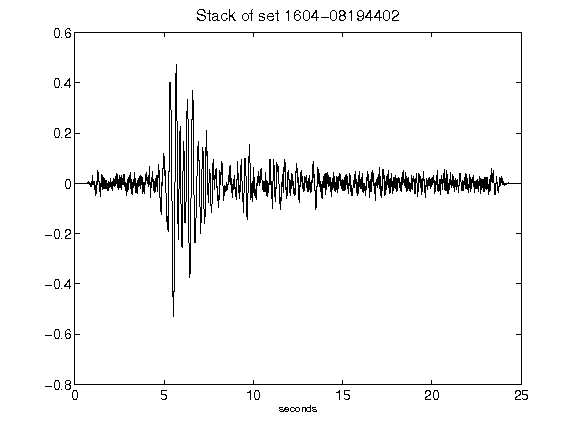](figures/1604-08194402_Stack.png)[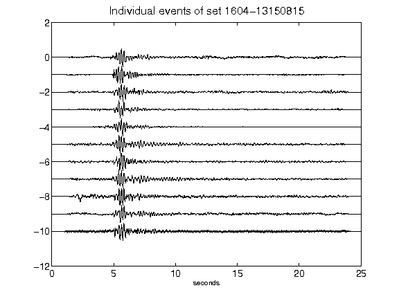](figures/1604-13150815_AllEv.png)[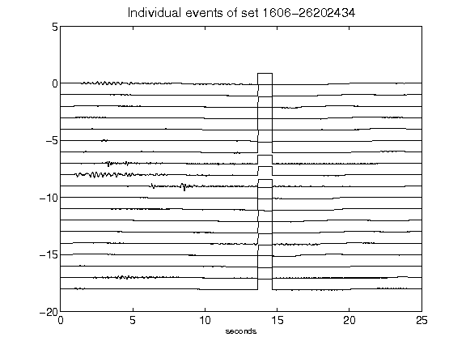](figures/1606-26202434_AllEv.png)[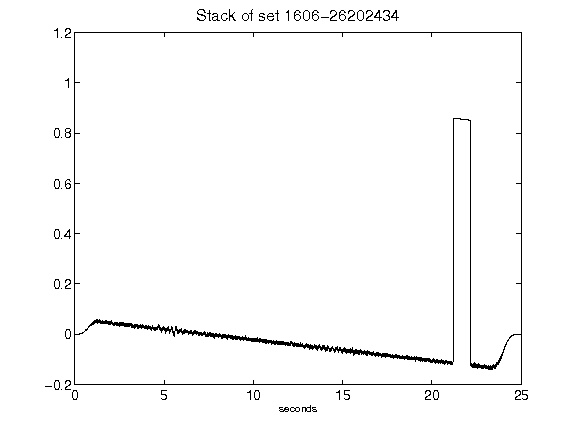](figures/1606-26202434_Stack.png)