# Repeating Earthquake Activity at RCM

## Waveforms
[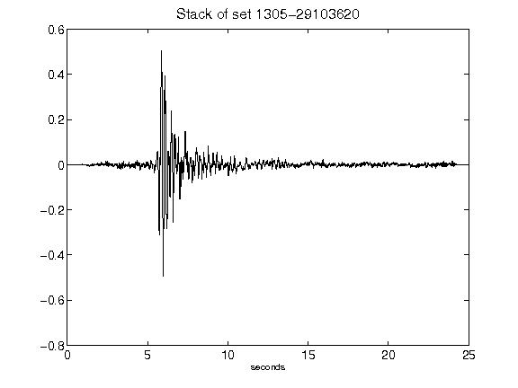](figures/1305-29103620_Stack.png)[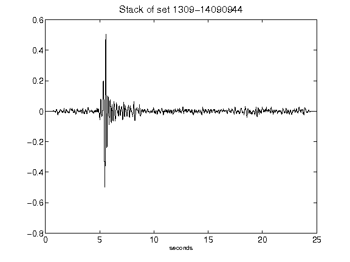](figures/1309-14090944_Stack.png)[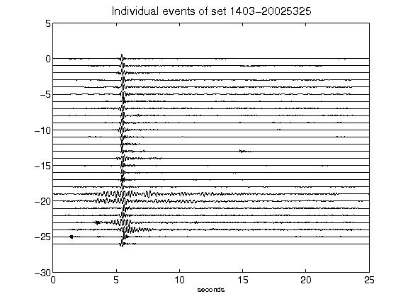](figures/1403-20025325_AllEv.png)[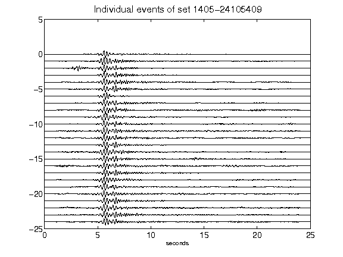](figures/1405-24105409_AllEv.png)[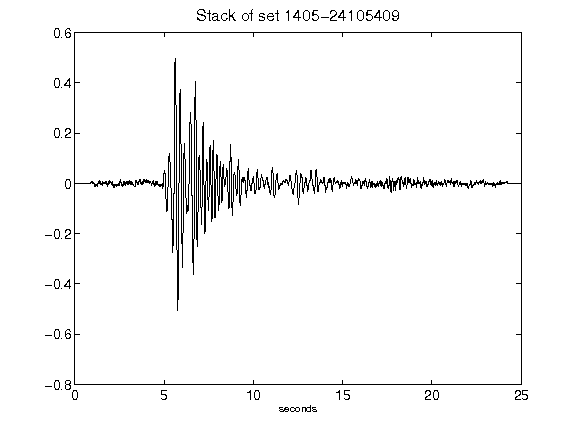](figures/1405-24105409_Stack.png)[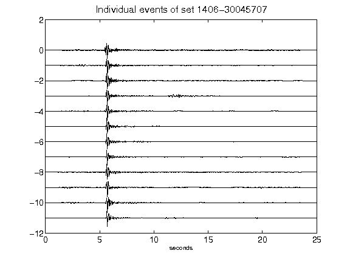](figures/1406-30045707_AllEv.png)[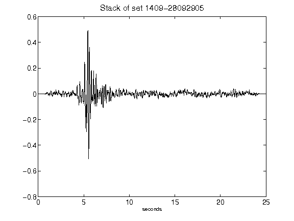](figures/1409-28092905_Stack.png)[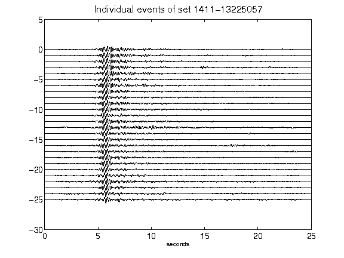](figures/1411-13225057_AllEv.png)[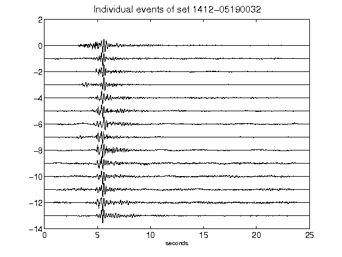](figures/1412-05190032_AllEv.png)[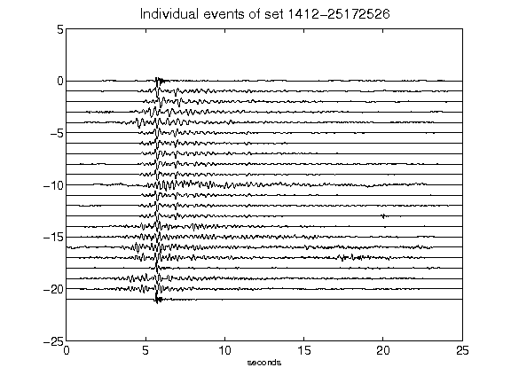](figures/1412-25172526_AllEv.png)[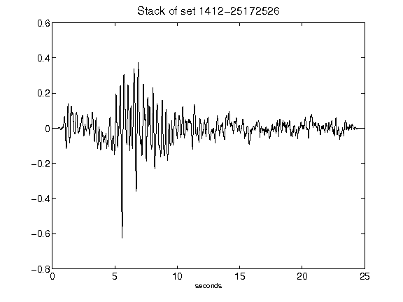](figures/1412-25172526_Stack.png)[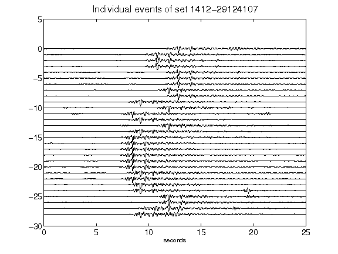](figures/1412-29124107_AllEv.png)[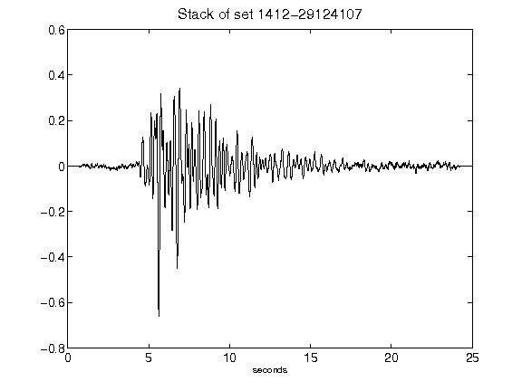](figures/1412-29124107_Stack.png)[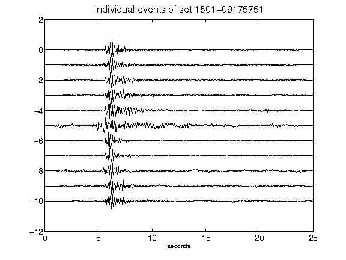](figures/1501-09175751_AllEv.png)[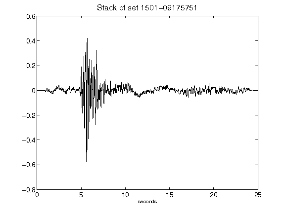](figures/1501-09175751_Stack.png)[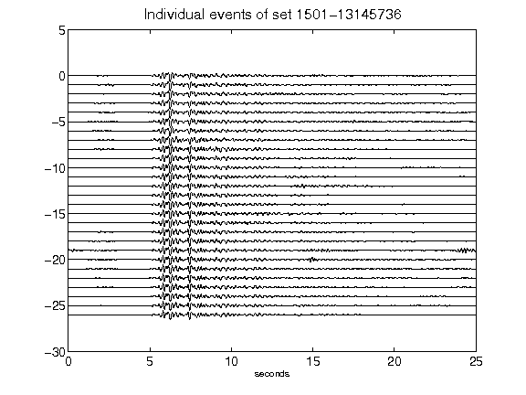](figures/1501-13145736_AllEv.png)[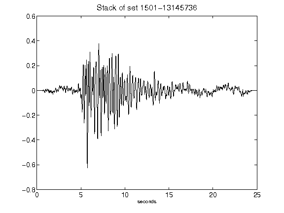](figures/1501-13145736_Stack.png)[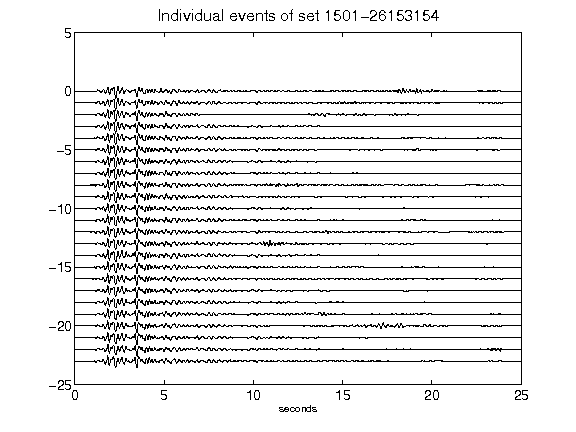](figures/1501-26153154_AllEv.png)[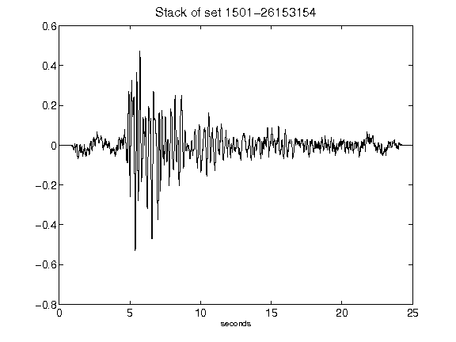](figures/1501-26153154_Stack.png)