# Repeating Earthquake Activity at RCM

## Waveforms
[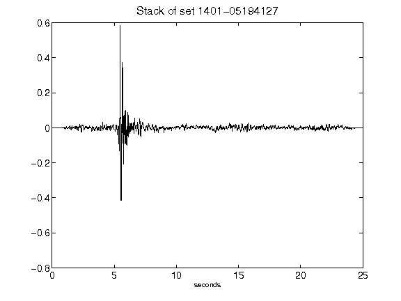](figures/1401-05194127_Stack.png)[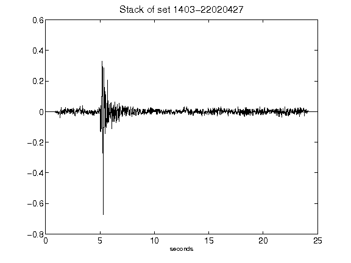](figures/1403-22020427_Stack.png)[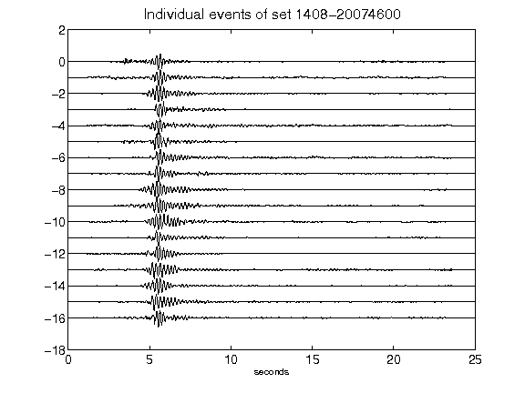](figures/1408-20074600_AllEv.png)[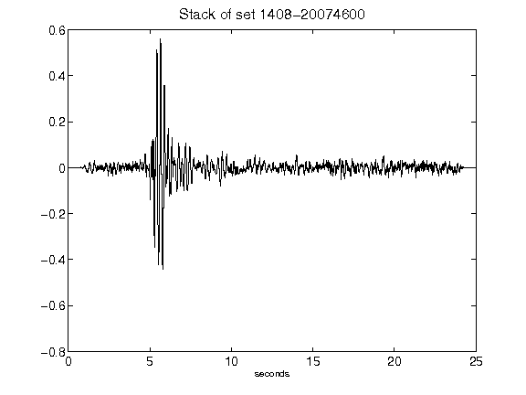](figures/1408-20074600_Stack.png)[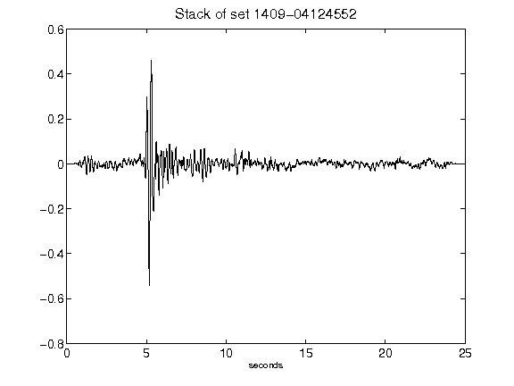](figures/1409-04124552_Stack.png)[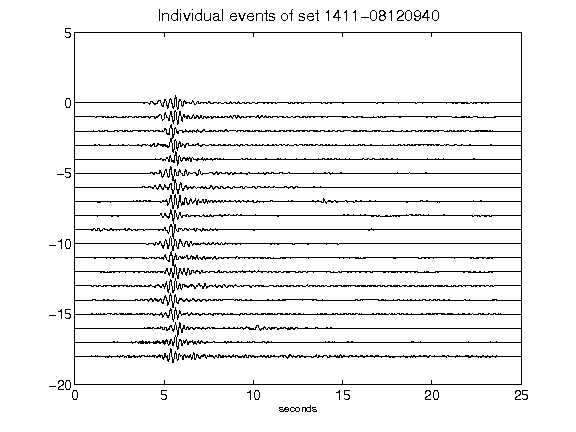](figures/1411-08120940_AllEv.png)[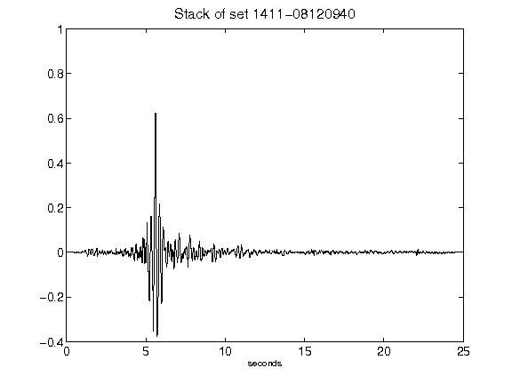](figures/1411-08120940_Stack.png)[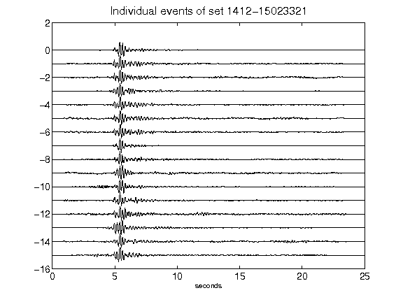](figures/1412-15023321_AllEv.png)[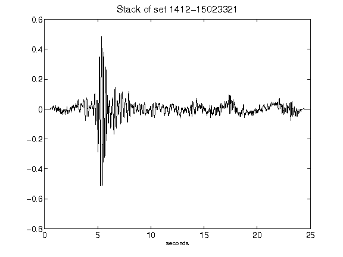](figures/1412-15023321_Stack.png)[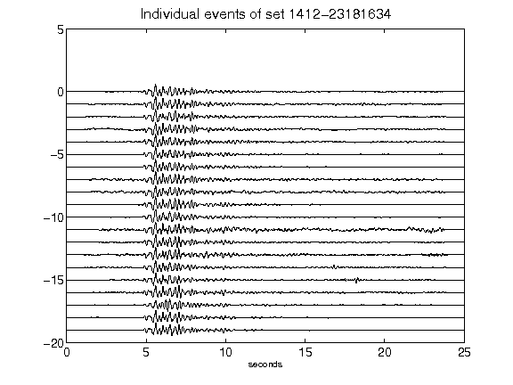](figures/1412-23181634_AllEv.png)[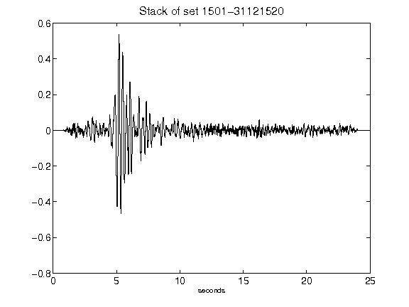](figures/1501-31121520_Stack.png)[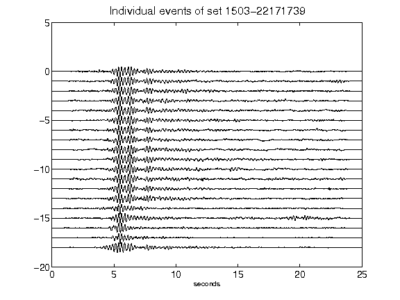](figures/1503-22171739_AllEv.png)