# Repeating Earthquake Activity at RCM

## Waveforms
[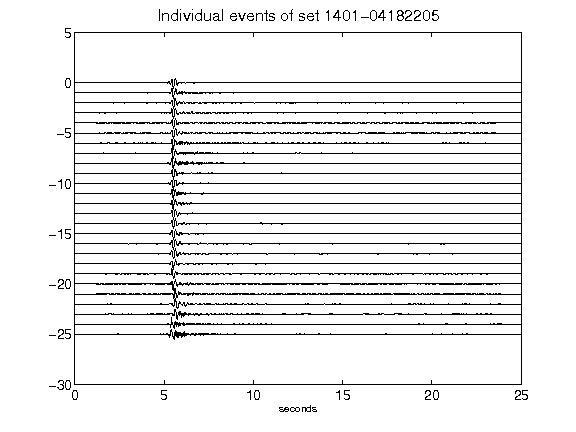](figures/1401-04182205_AllEv.png)[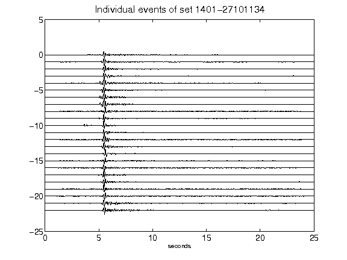](figures/1401-27101134_AllEv.png)[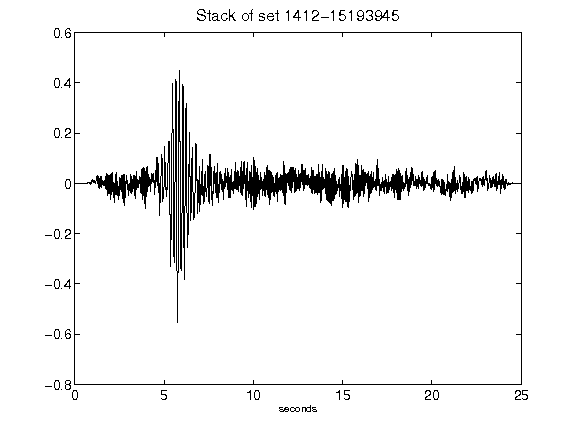](figures/1412-15193945_Stack.png)[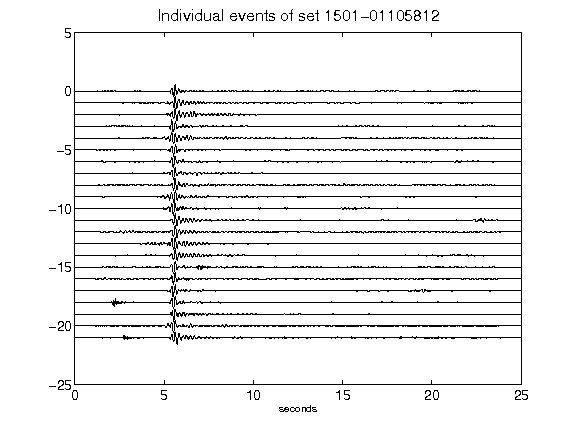](figures/1501-01105812_AllEv.png)[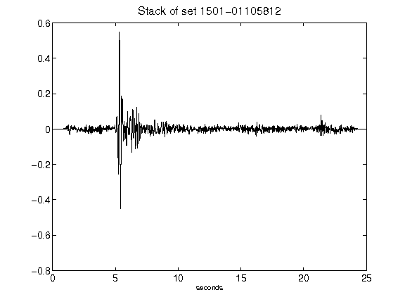](figures/1501-01105812_Stack.png)[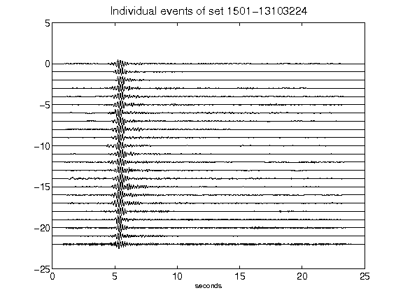](figures/1501-13103224_AllEv.png)[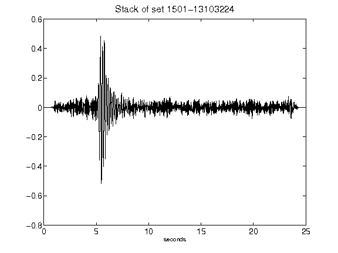](figures/1501-13103224_Stack.png)[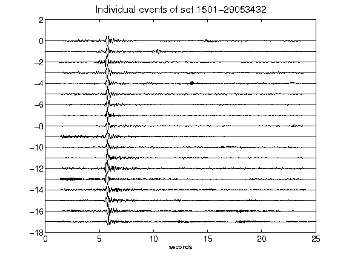](figures/1501-29053432_AllEv.png)[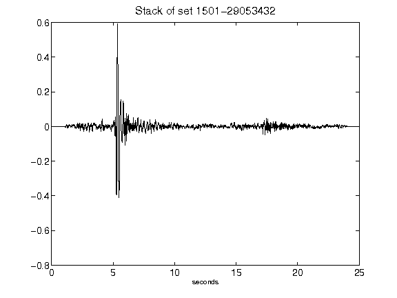](figures/1501-29053432_Stack.png)[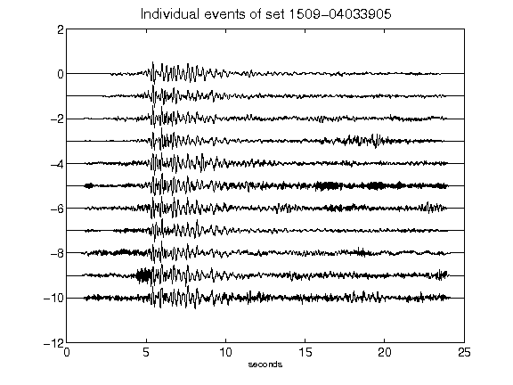](figures/1509-04033905_AllEv.png)[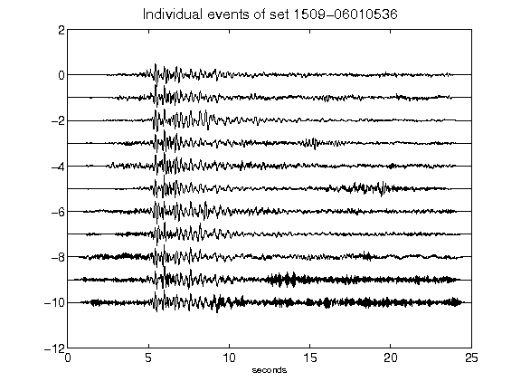](figures/1509-06010536_AllEv.png)[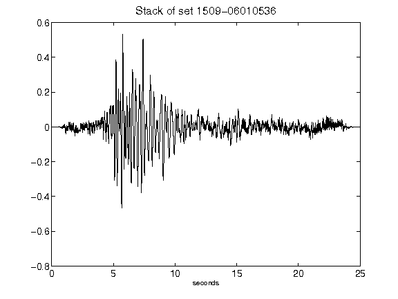](figures/1509-06010536_Stack.png)[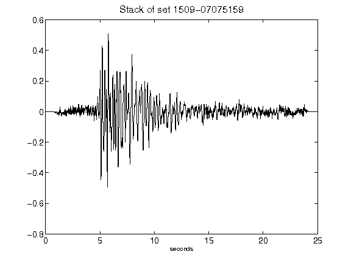](figures/1509-07075159_Stack.png)