# Repeating Earthquake Activity at RCM

## Waveforms
[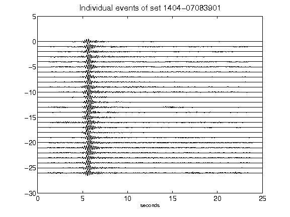](figures/1404-07083901_AllEv.png)[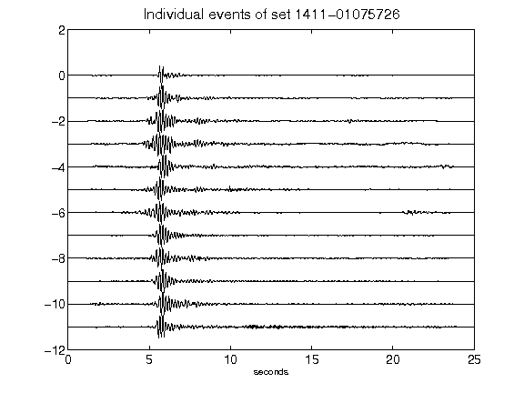](figures/1411-01075726_AllEv.png)[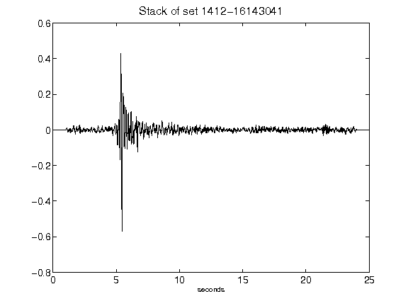](figures/1412-16143041_Stack.png)[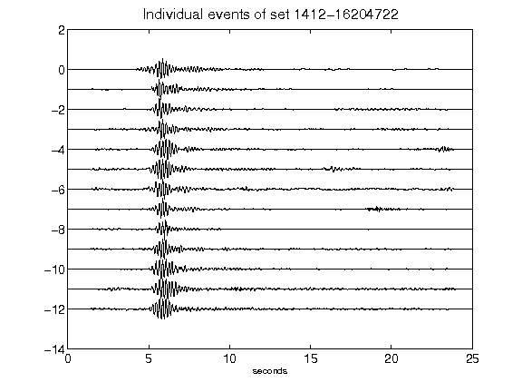](figures/1412-16204722_AllEv.png)[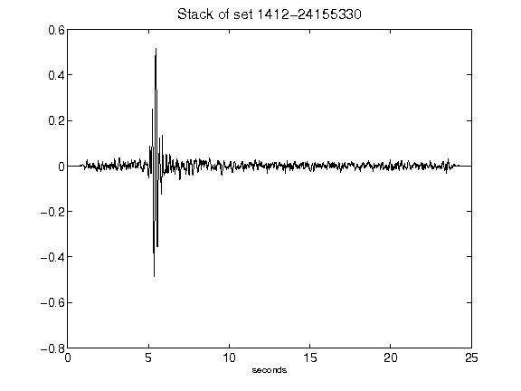](figures/1412-24155330_Stack.png)[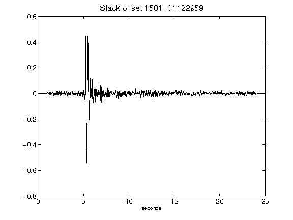](figures/1501-01122959_Stack.png)[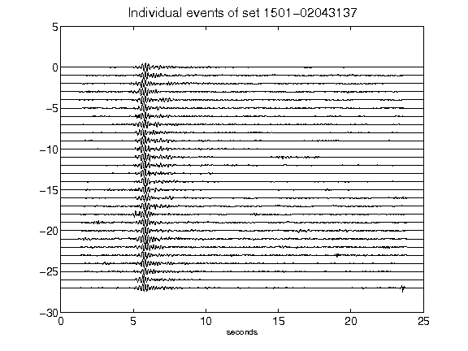](figures/1501-02043137_AllEv.png)[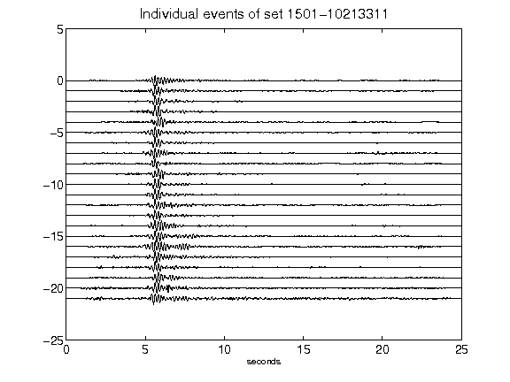](figures/1501-10213311_AllEv.png)[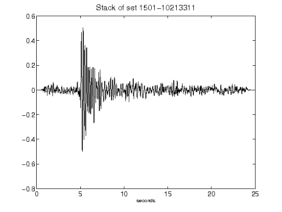](figures/1501-10213311_Stack.png)[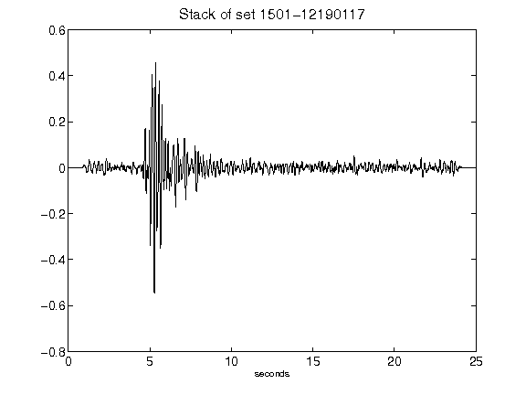](figures/1501-12190117_Stack.png)[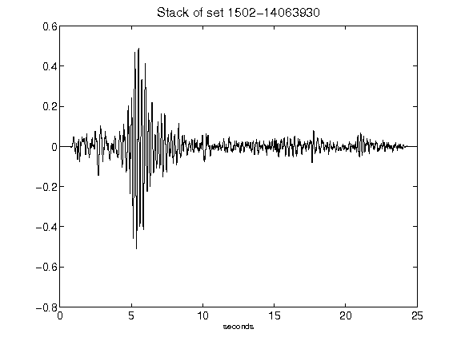](figures/1502-14063930_Stack.png)[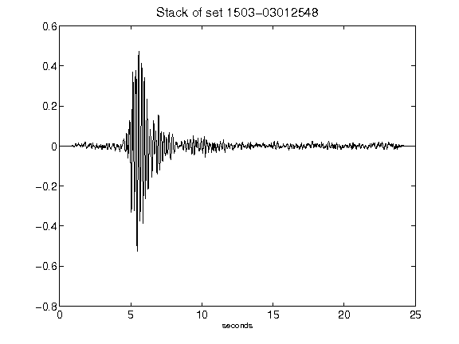](figures/1503-03012548_Stack.png)[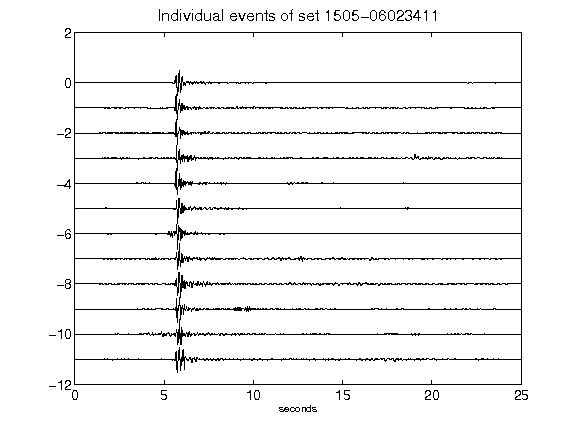](figures/1505-06023411_AllEv.png)[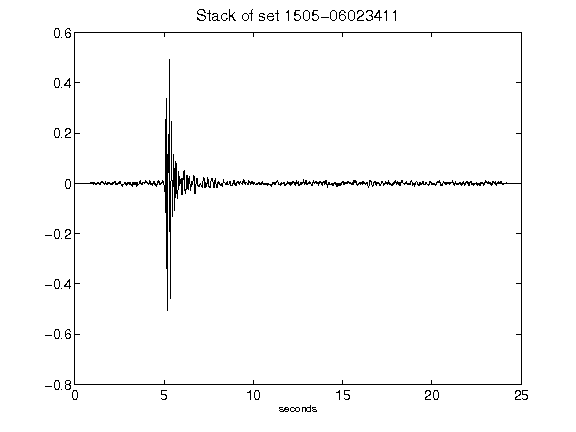](figures/1505-06023411_Stack.png)