# Repeating Earthquake Activity at RCM

## Waveforms
[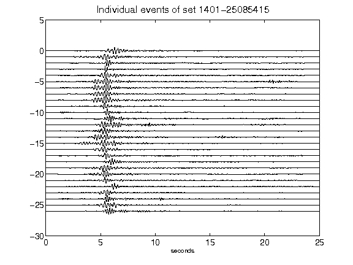](figures/1401-25085415_AllEv.png)[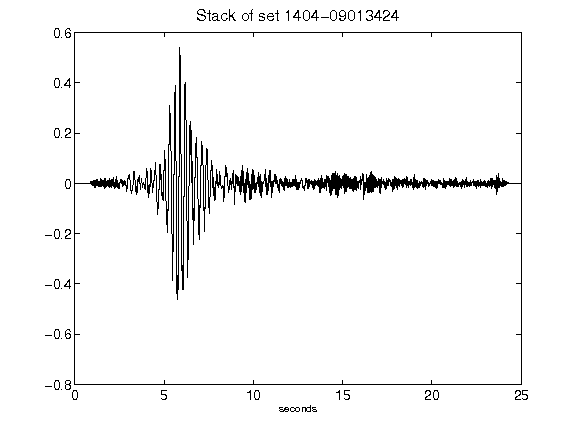](figures/1404-09013424_Stack.png)[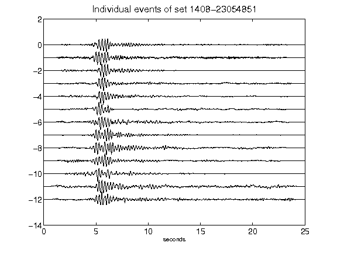](figures/1408-23054851_AllEv.png)[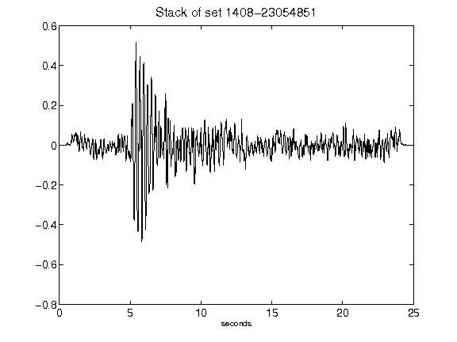](figures/1408-23054851_Stack.png)[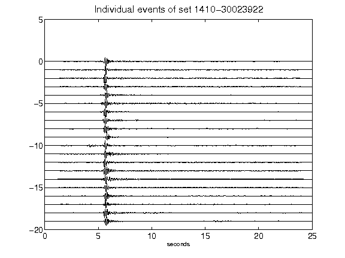](figures/1410-30023922_AllEv.png)[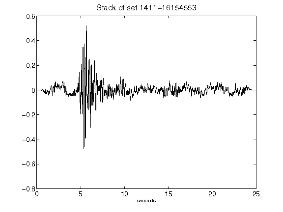](figures/1411-16154553_Stack.png)[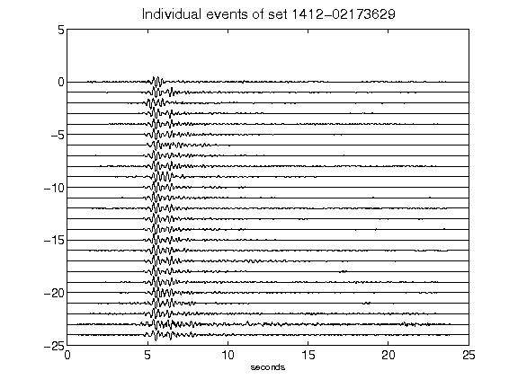](figures/1412-02173629_AllEv.png)[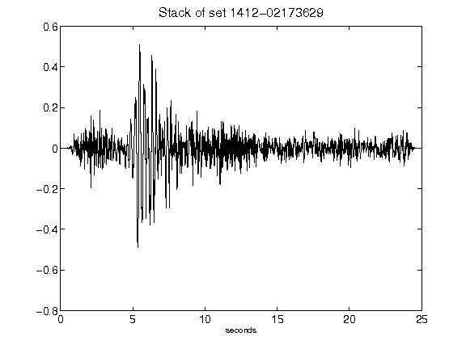](figures/1412-02173629_Stack.png)[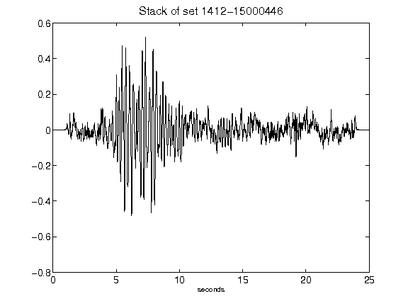](figures/1412-15000446_Stack.png)[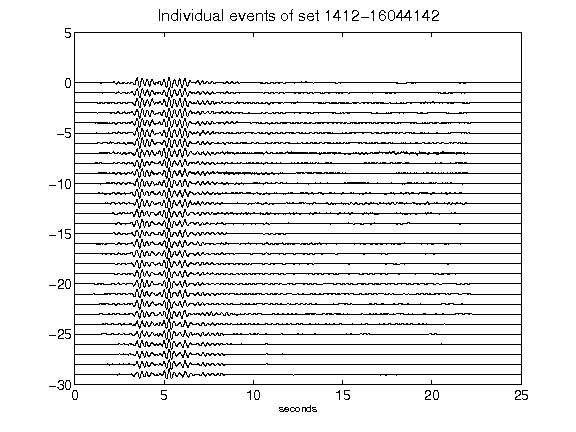](figures/1412-16044142_AllEv.png)[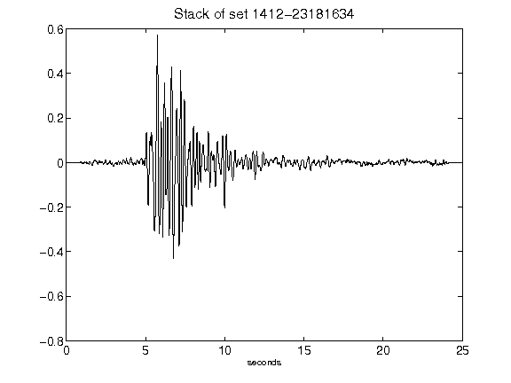](figures/1412-23181634_Stack.png)[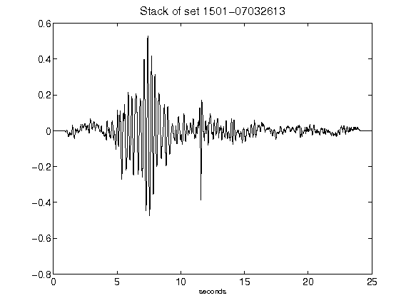](figures/1501-07032613_Stack.png)[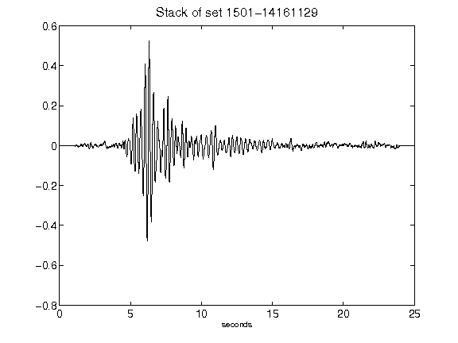](figures/1501-14161129_Stack.png)[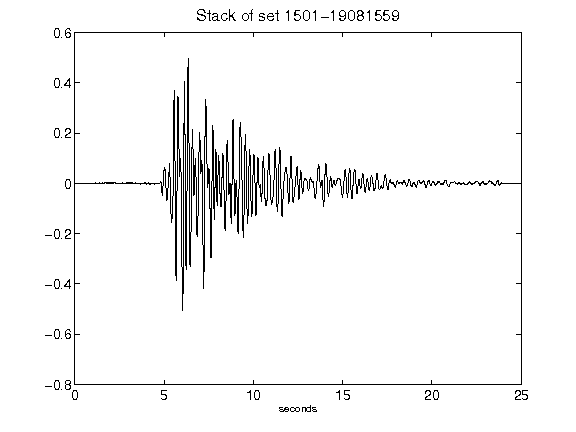](figures/1501-19081559_Stack.png)[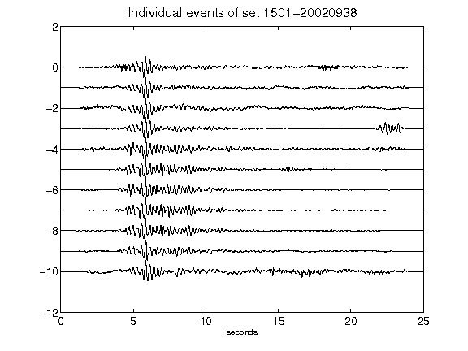](figures/1501-20020938_AllEv.png)[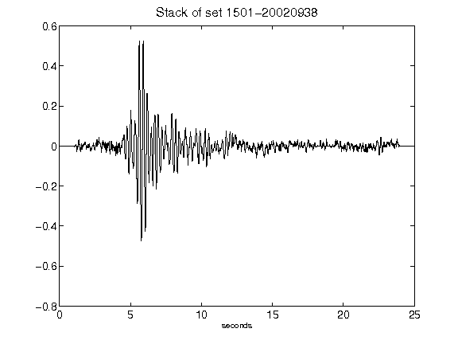](figures/1501-20020938_Stack.png)[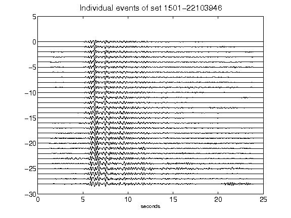](figures/1501-22103946_AllEv.png)