# Repeating Earthquake Activity at RCM

## Waveforms
[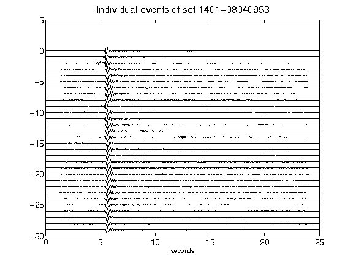](figures/1401-08040953_AllEv.png)[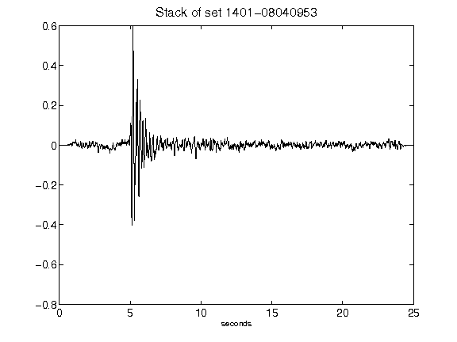](figures/1401-08040953_Stack.png)[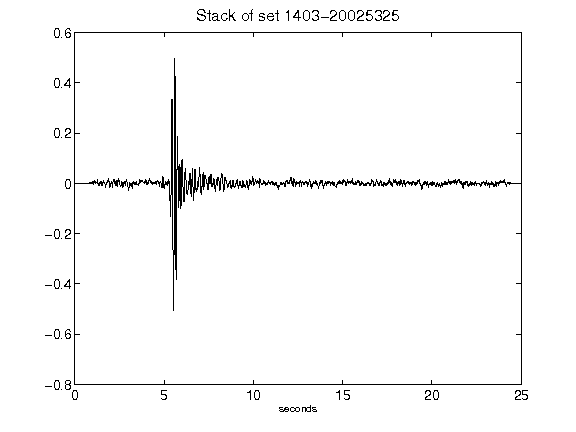](figures/1403-20025325_Stack.png)[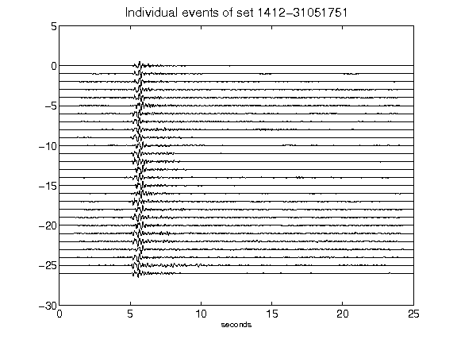](figures/1412-31051751_AllEv.png)[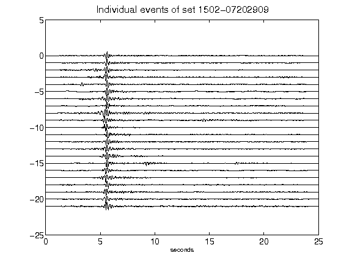](figures/1502-07202909_AllEv.png)[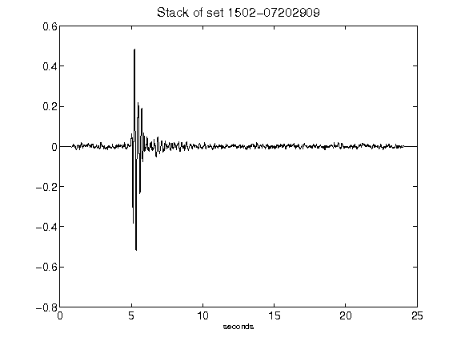](figures/1502-07202909_Stack.png)[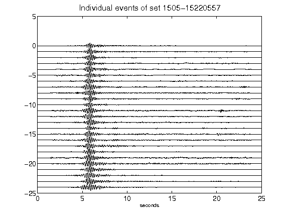](figures/1505-15220557_AllEv.png)[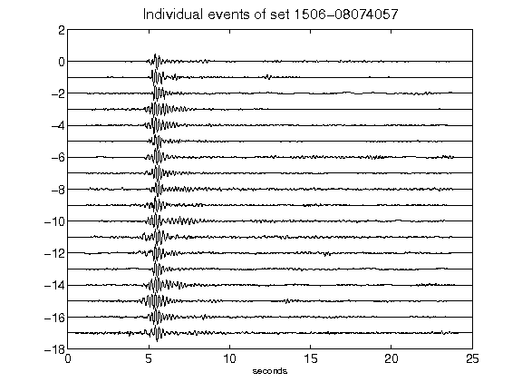](figures/1506-08074057_AllEv.png)[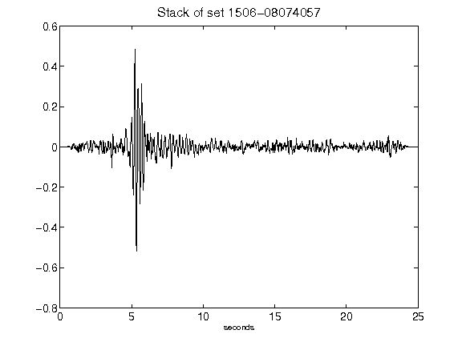](figures/1506-08074057_Stack.png)[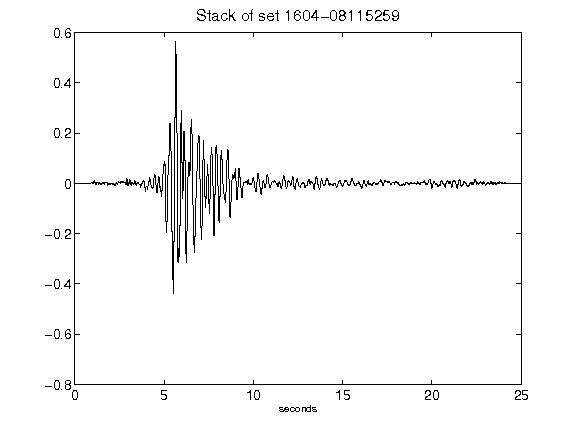](figures/1604-08115259_Stack.png)[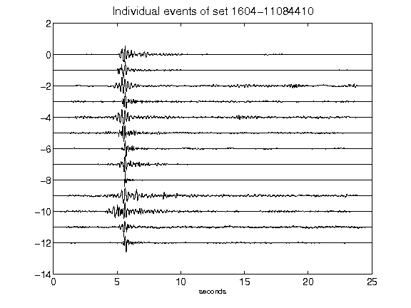](figures/1604-11084410_AllEv.png)[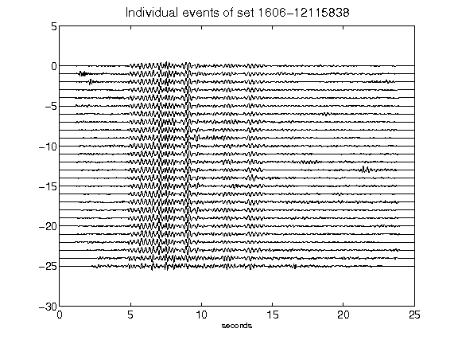](figures/1606-12115838_AllEv.png)