# Repeating Earthquake Activity at RCM

## Waveforms
[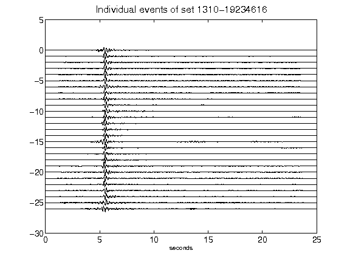](figures/1310-19234616_AllEv.png)[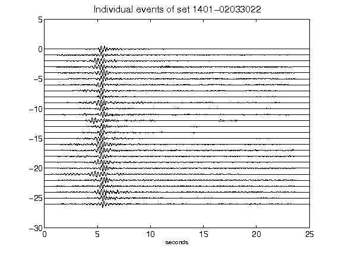](figures/1401-02033022_AllEv.png)[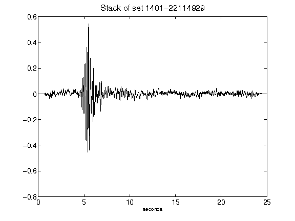](figures/1401-22114929_Stack.png)[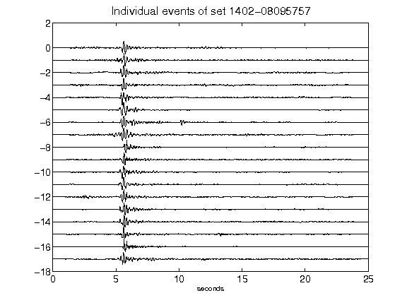](figures/1402-08095757_AllEv.png)[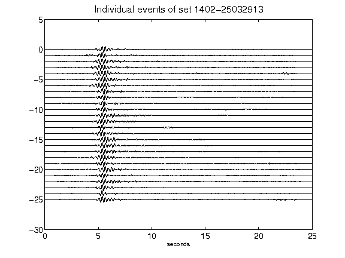](figures/1402-25032913_AllEv.png)[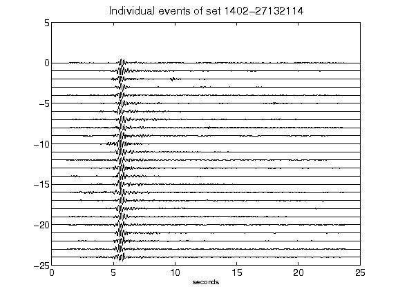](figures/1402-27132114_AllEv.png)[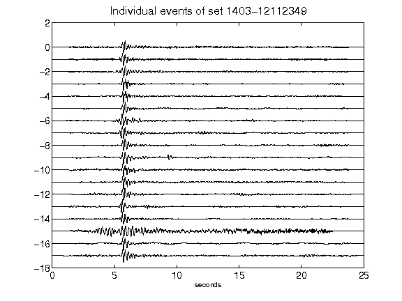](figures/1403-12112349_AllEv.png)[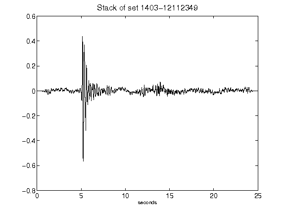](figures/1403-12112349_Stack.png)[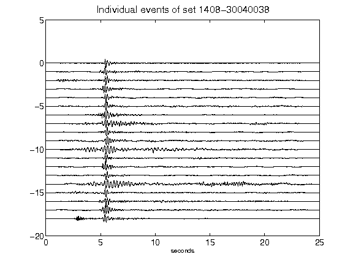](figures/1408-30040038_AllEv.png)[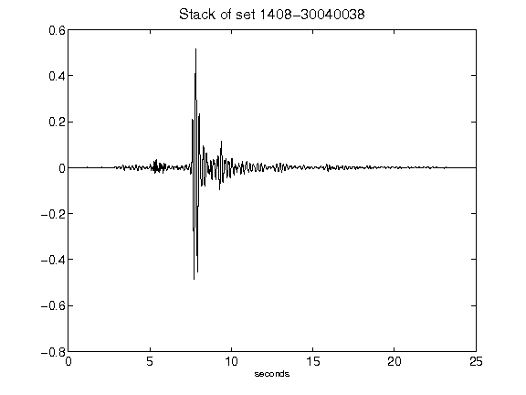](figures/1408-30040038_Stack.png)[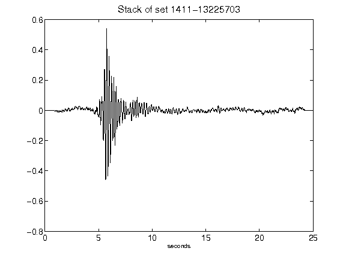](figures/1411-13225703_Stack.png)[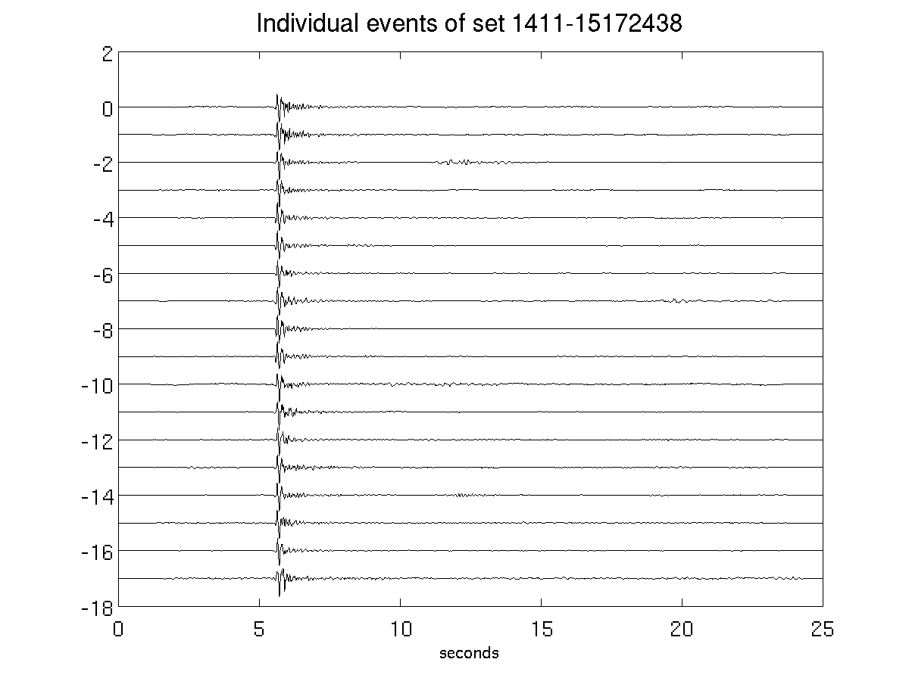](figures/1411-15172438_AllEv.png)[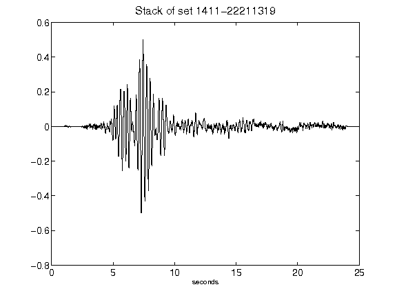](figures/1411-22211319_Stack.png)[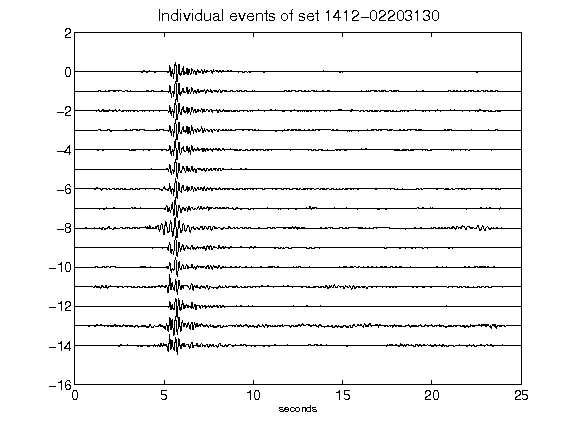](figures/1412-02203130_AllEv.png)[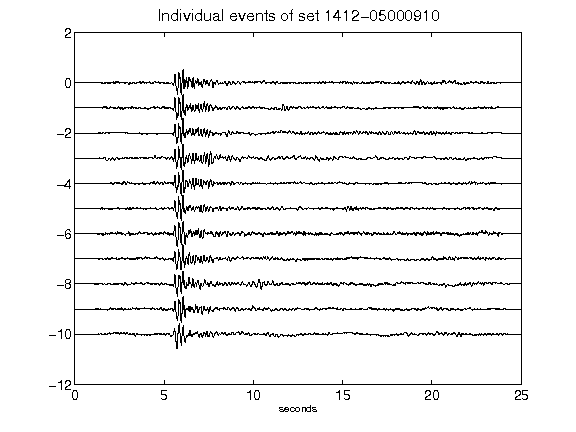](figures/1412-05000910_AllEv.png)[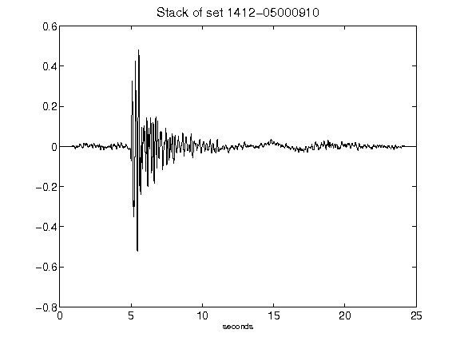](figures/1412-05000910_Stack.png)[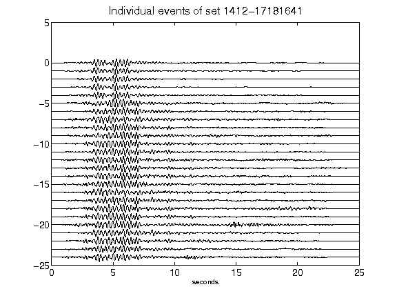](figures/1412-17181641_AllEv.png)[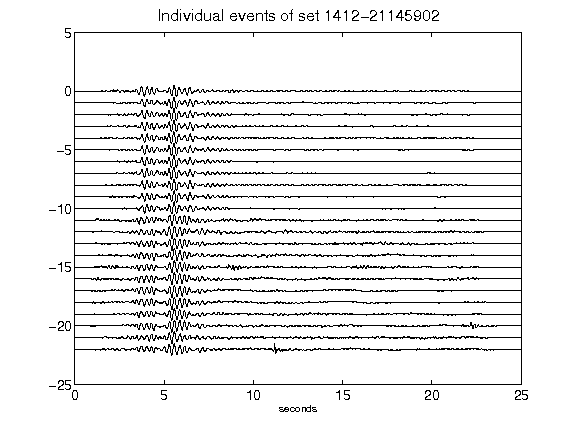](figures/1412-21145902_AllEv.png)[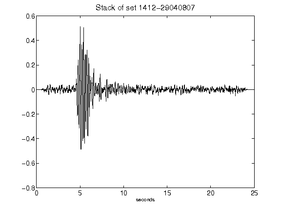](figures/1412-29040807_Stack.png)[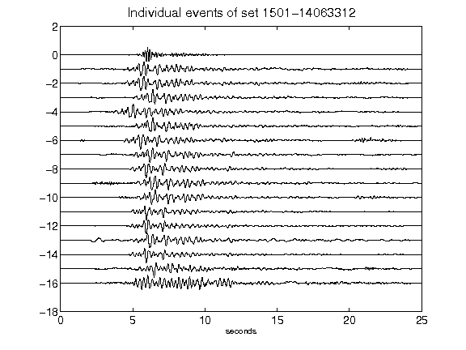](figures/1501-14063312_AllEv.png)[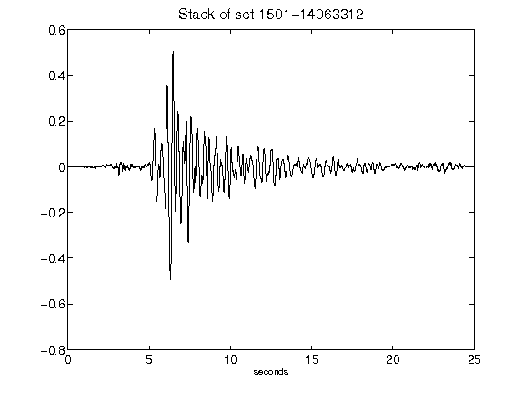](figures/1501-14063312_Stack.png)[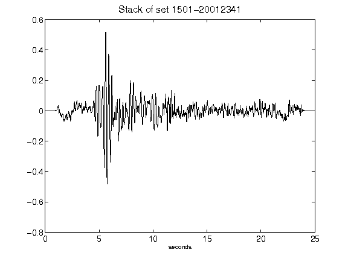](figures/1501-20012341_Stack.png)[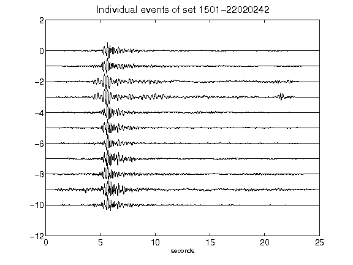](figures/1501-22020242_AllEv.png)[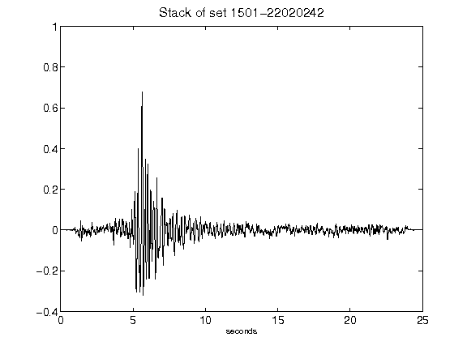](figures/1501-22020242_Stack.png)[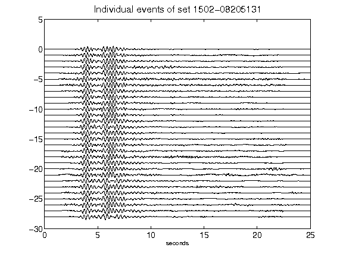](figures/1502-08205131_AllEv.png)[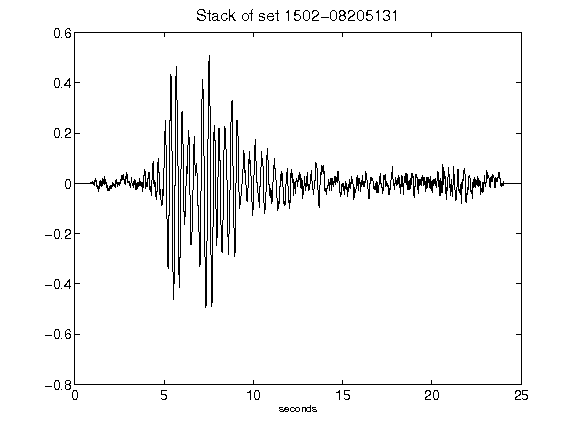](figures/1502-08205131_Stack.png)[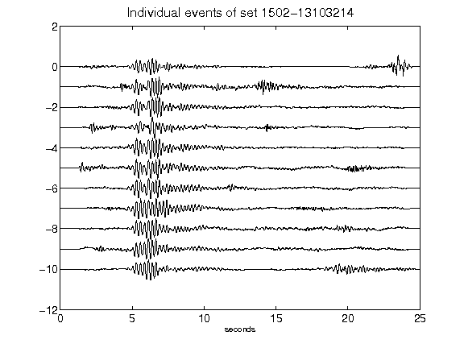](figures/1502-13103214_AllEv.png)[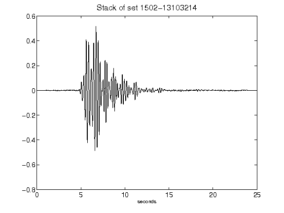](figures/1502-13103214_Stack.png)