# Repeating Earthquake Activity at RCM

## Waveforms
[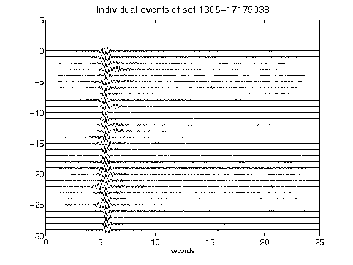](figures/1305-17175038_AllEv.png)[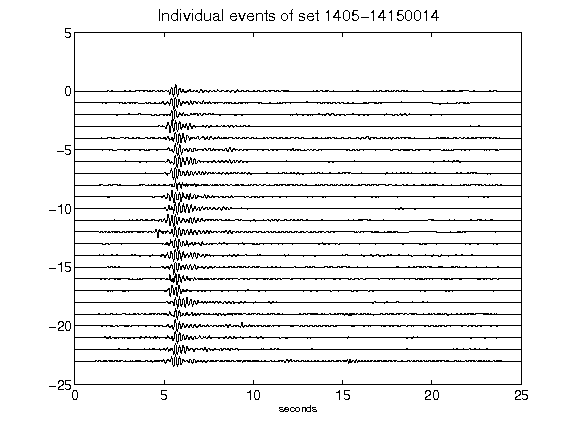](figures/1405-14150014_AllEv.png)[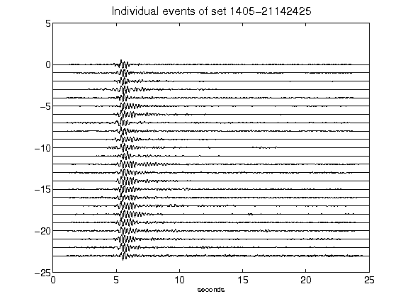](figures/1405-21142425_AllEv.png)[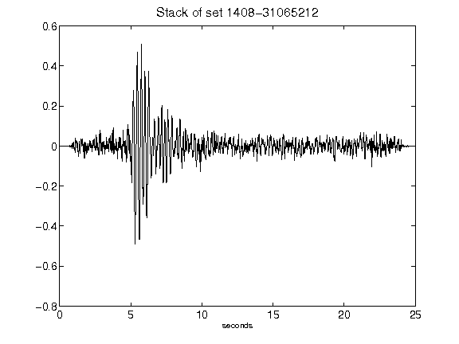](figures/1408-31065212_Stack.png)[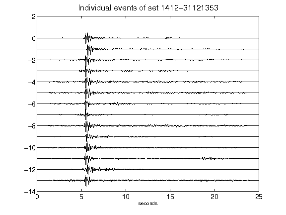](figures/1412-31121353_AllEv.png)[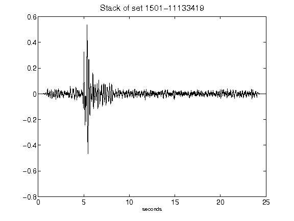](figures/1501-11133419_Stack.png)[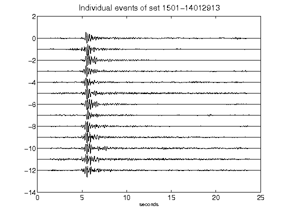](figures/1501-14012913_AllEv.png)[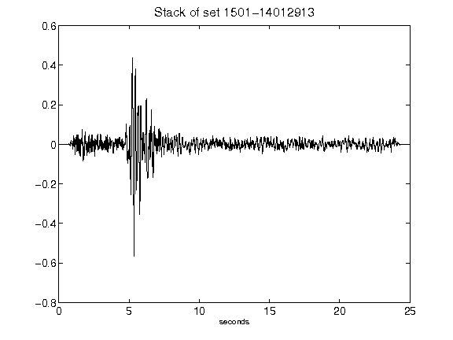](figures/1501-14012913_Stack.png)[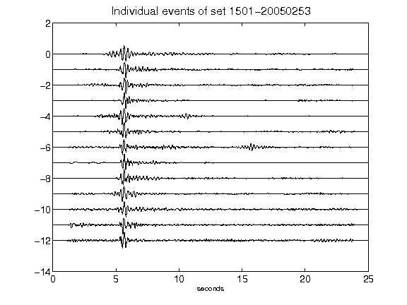](figures/1501-20050253_AllEv.png)[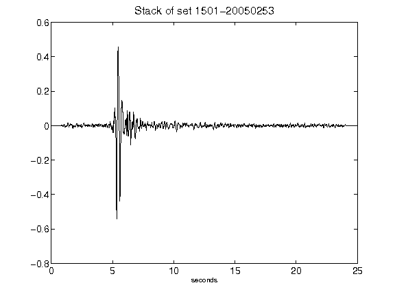](figures/1501-20050253_Stack.png)[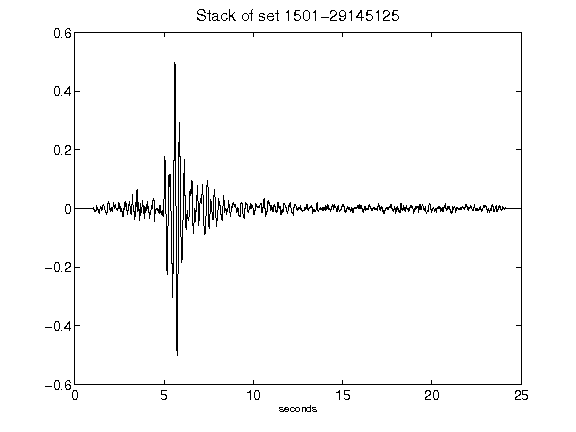](figures/1501-29145125_Stack.png)[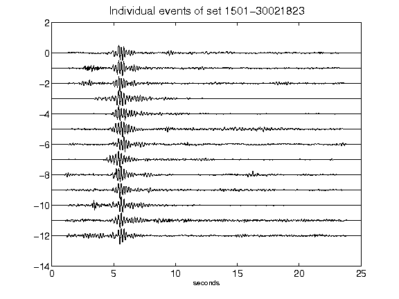](figures/1501-30021823_AllEv.png)[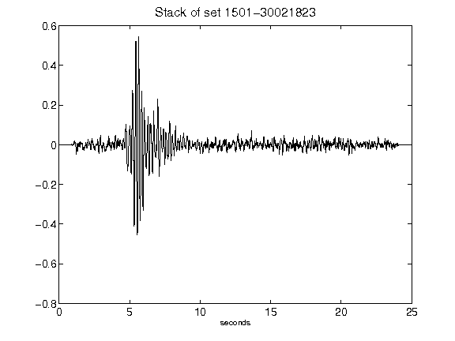](figures/1501-30021823_Stack.png)[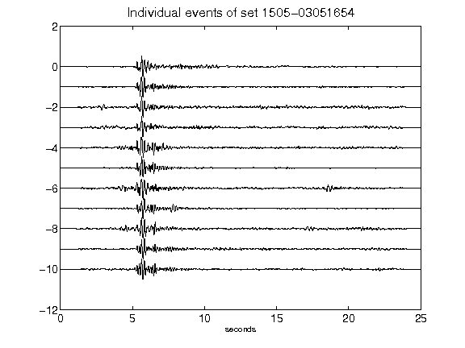](figures/1505-03051654_AllEv.png)[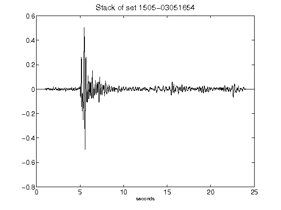](figures/1505-03051654_Stack.png)