# Repeating Earthquake Activity at RCM

## Waveforms
[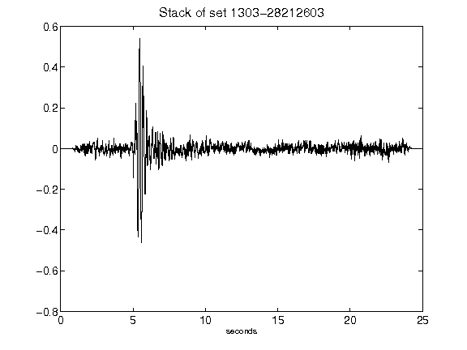](figures/1303-28212603_Stack.png)[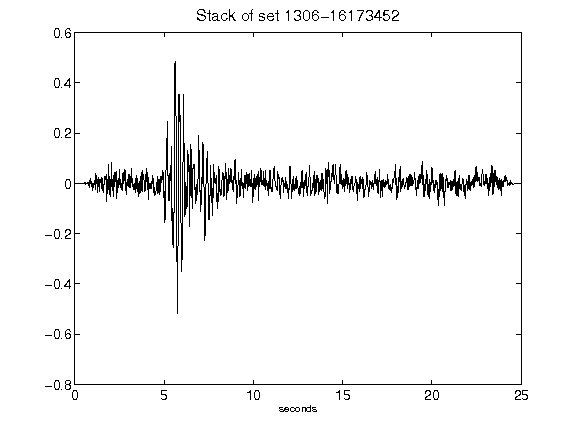](figures/1306-16173452_Stack.png)[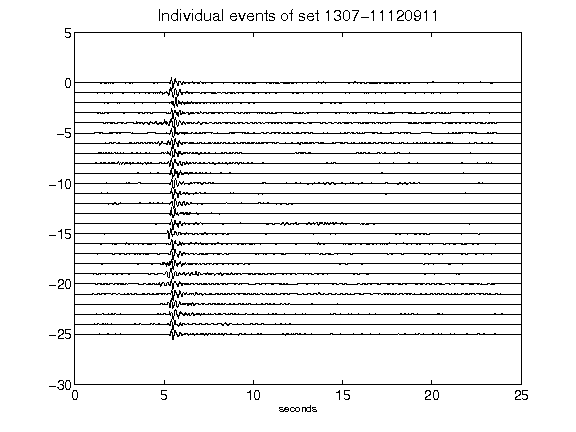](figures/1307-11120911_AllEv.png)[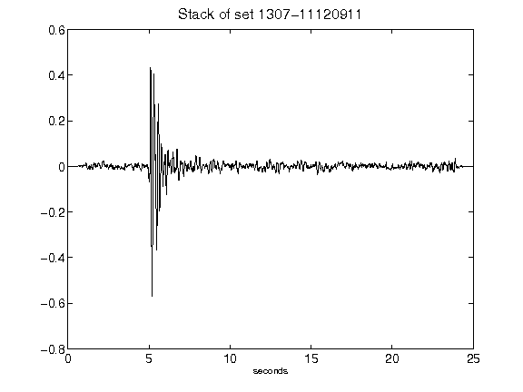](figures/1307-11120911_Stack.png)[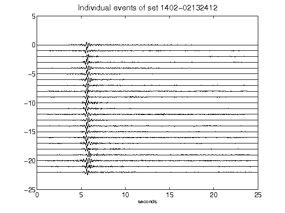](figures/1402-02132412_AllEv.png)[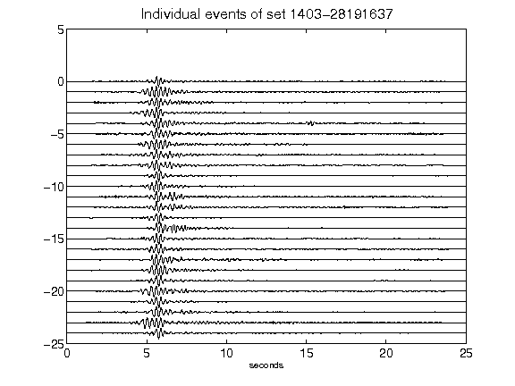](figures/1403-28191637_AllEv.png)[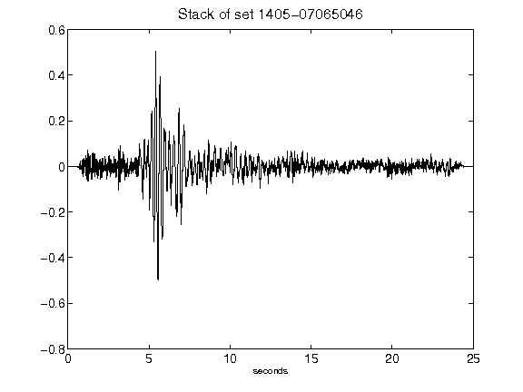](figures/1405-07065046_Stack.png)[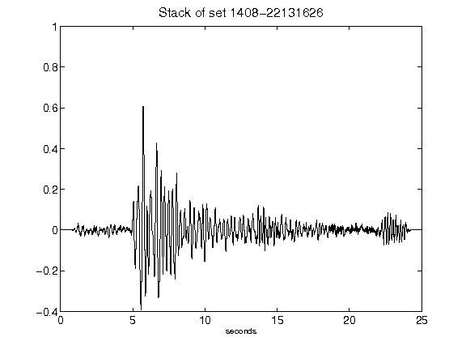](figures/1408-22131626_Stack.png)[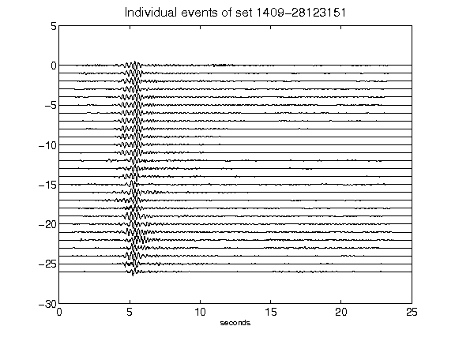](figures/1409-28123151_AllEv.png)[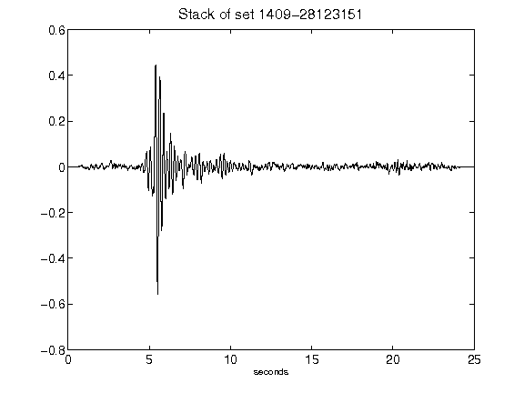](figures/1409-28123151_Stack.png)[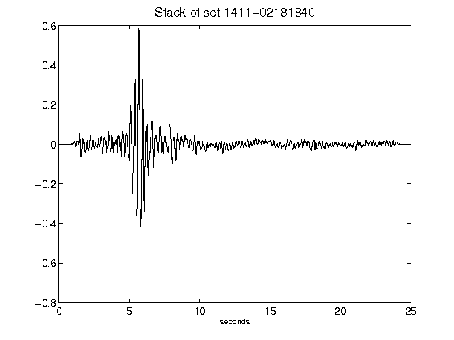](figures/1411-02181840_Stack.png)[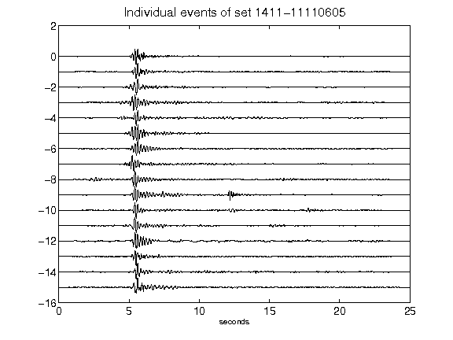](figures/1411-11110605_AllEv.png)[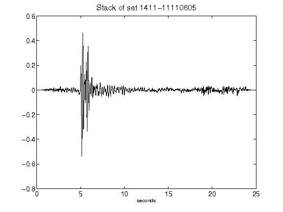](figures/1411-11110605_Stack.png)[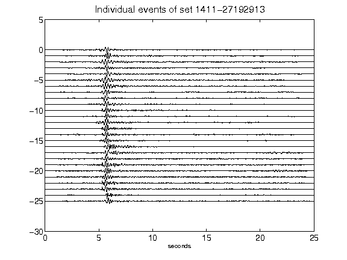](figures/1411-27192913_AllEv.png)[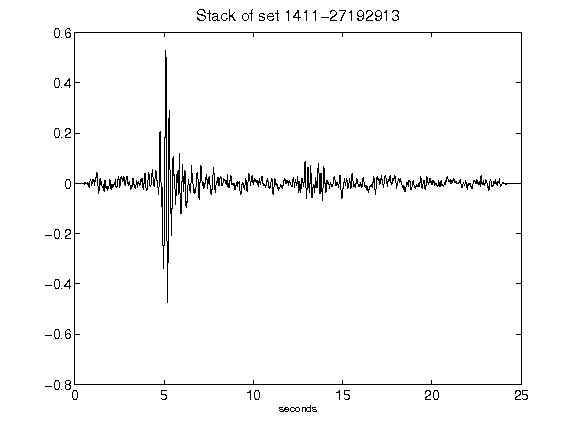](figures/1411-27192913_Stack.png)[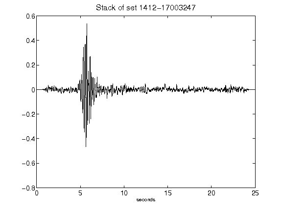](figures/1412-17003247_Stack.png)[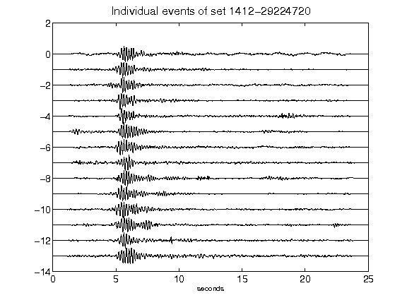](figures/1412-29224720_AllEv.png)[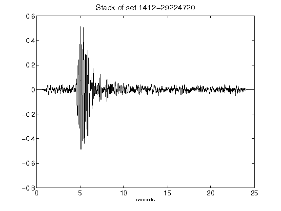](figures/1412-29224720_Stack.png)[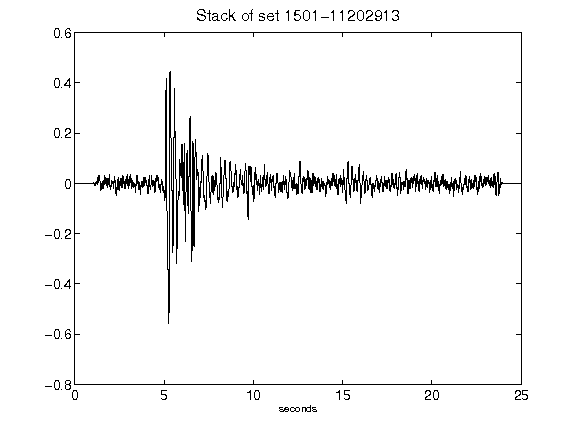](figures/1501-11202913_Stack.png)[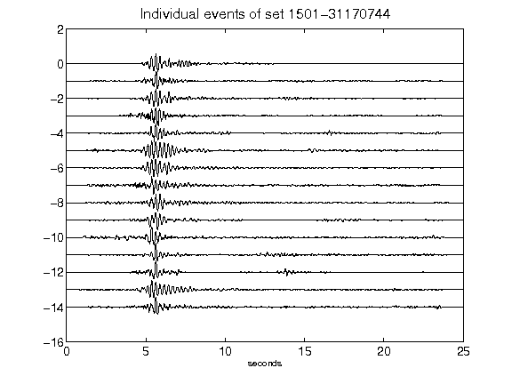](figures/1501-31170744_AllEv.png)[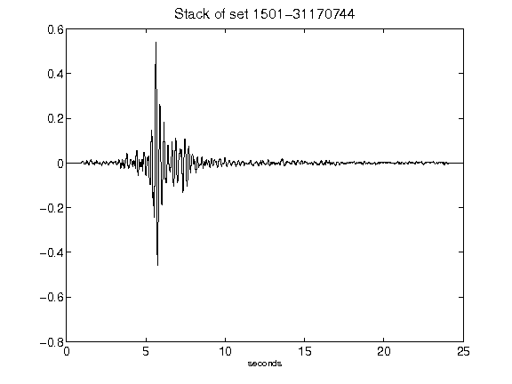](figures/1501-31170744_Stack.png)[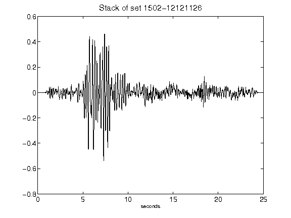](figures/1502-12121126_Stack.png)