# Repeating Earthquake Activity at RCM

## Waveforms
[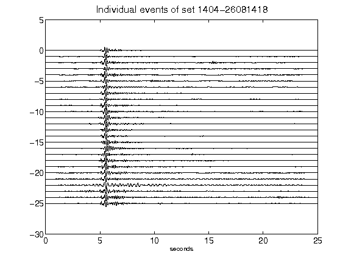](figures/1404-26081418_AllEv.png)[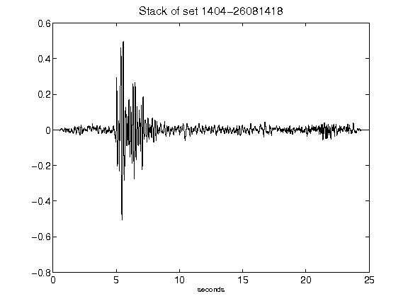](figures/1404-26081418_Stack.png)[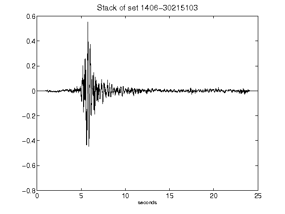](figures/1406-30215103_Stack.png)[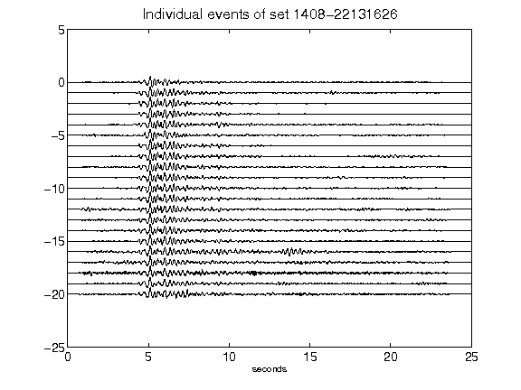](figures/1408-22131626_AllEv.png)[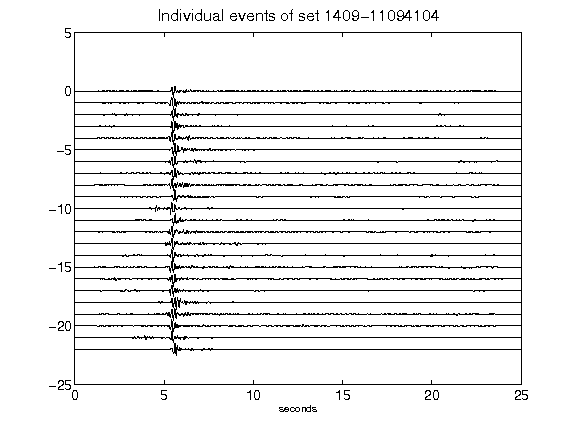](figures/1409-11094104_AllEv.png)[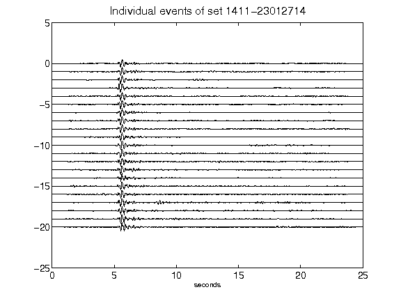](figures/1411-23012714_AllEv.png)[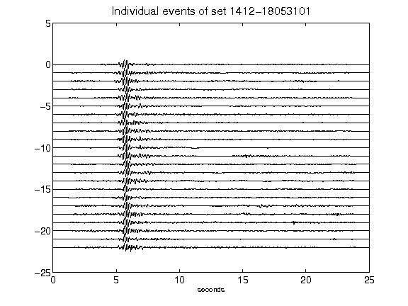](figures/1412-18053101_AllEv.png)[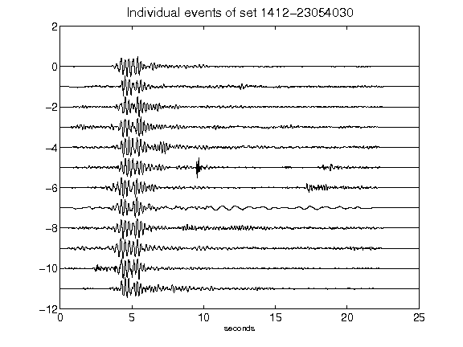](figures/1412-23054030_AllEv.png)[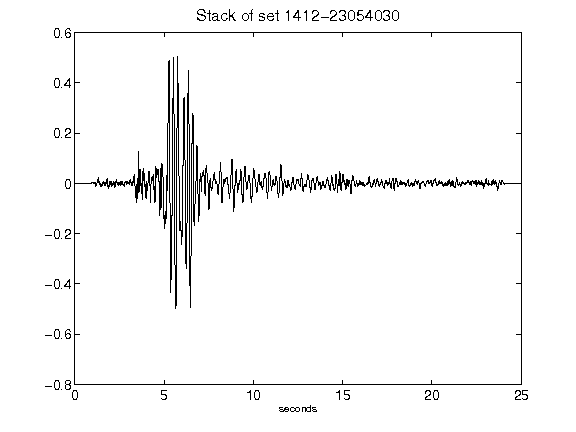](figures/1412-23054030_Stack.png)[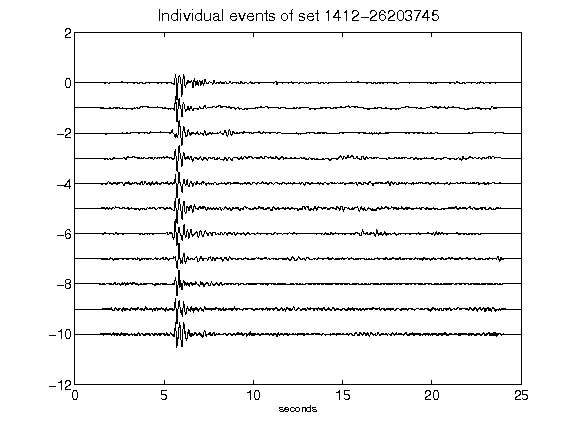](figures/1412-26203745_AllEv.png)[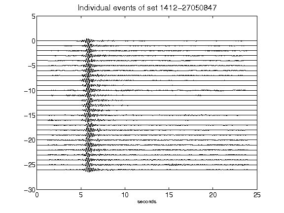](figures/1412-27050847_AllEv.png)[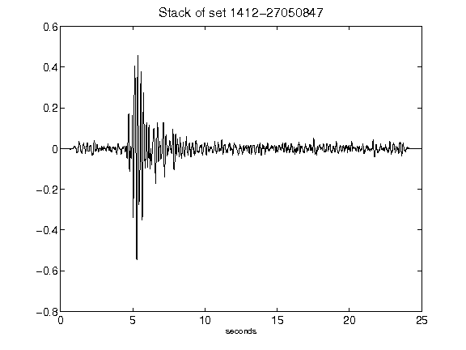](figures/1412-27050847_Stack.png)[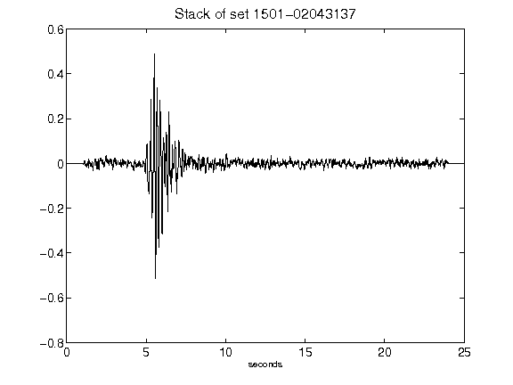](figures/1501-02043137_Stack.png)[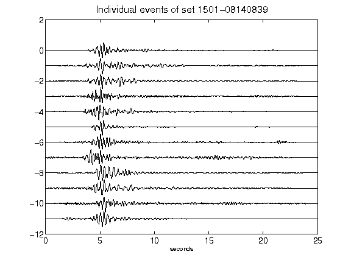](figures/1501-08140839_AllEv.png)[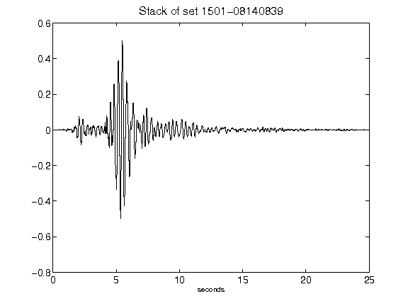](figures/1501-08140839_Stack.png)[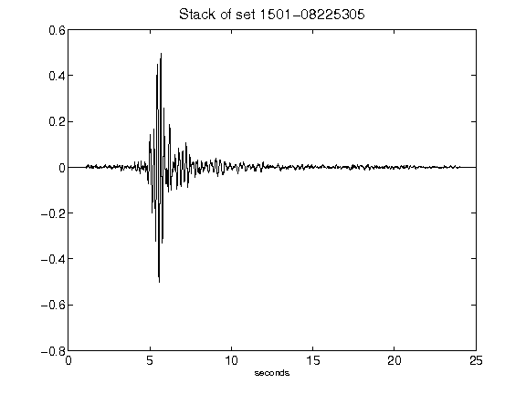](figures/1501-08225305_Stack.png)[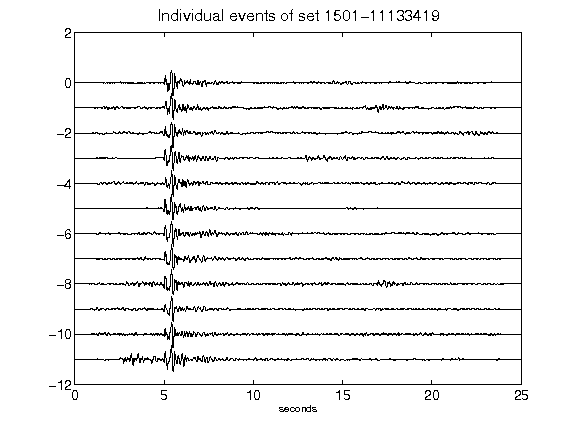](figures/1501-11133419_AllEv.png)[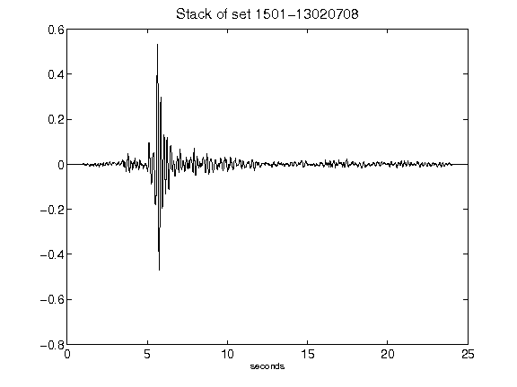](figures/1501-13020708_Stack.png)[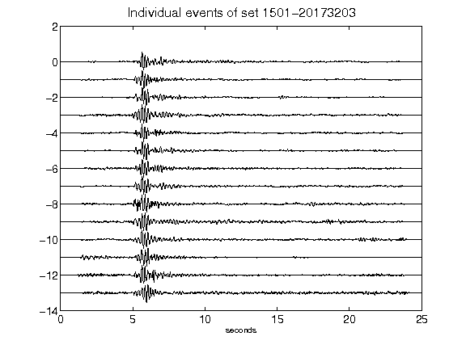](figures/1501-20173203_AllEv.png)[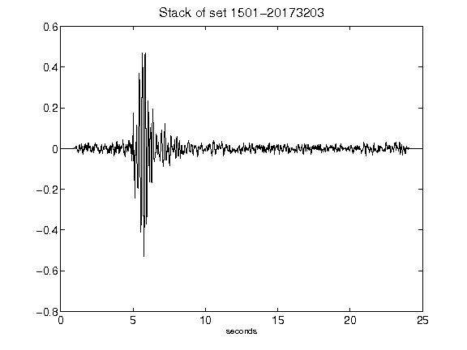](figures/1501-20173203_Stack.png)[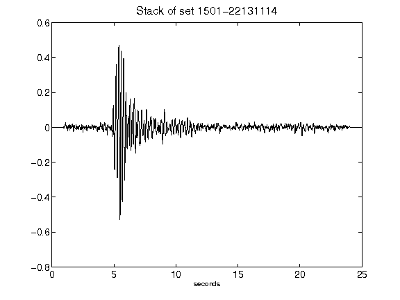](figures/1501-22131114_Stack.png)[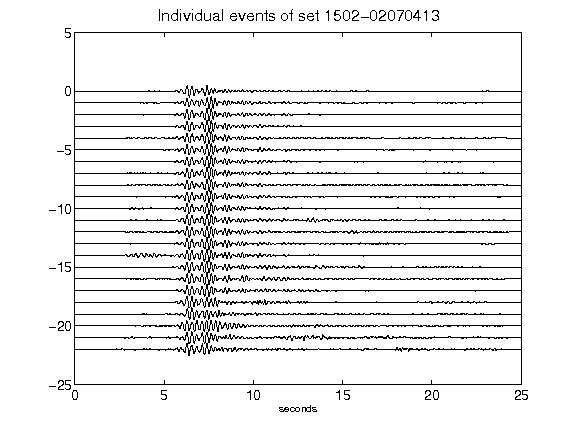](figures/1502-02070413_AllEv.png)[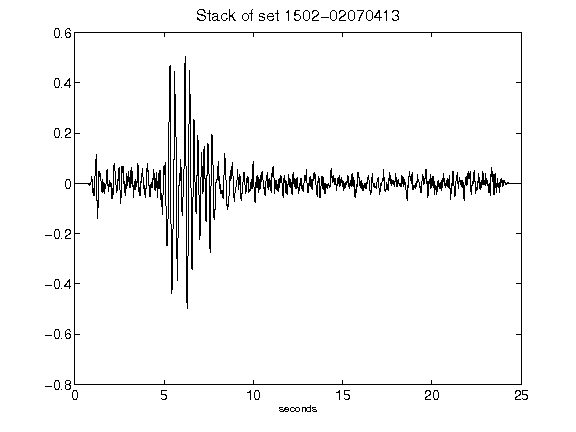](figures/1502-02070413_Stack.png)[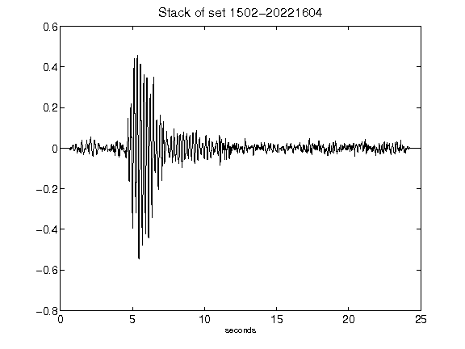](figures/1502-20221604_Stack.png)[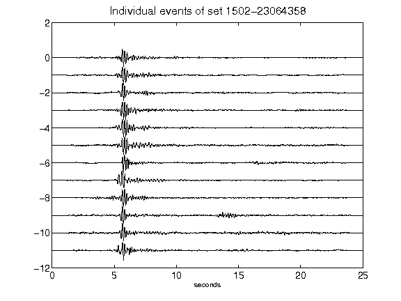](figures/1502-23064358_AllEv.png)[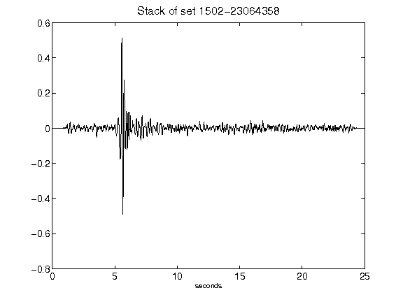](figures/1502-23064358_Stack.png)[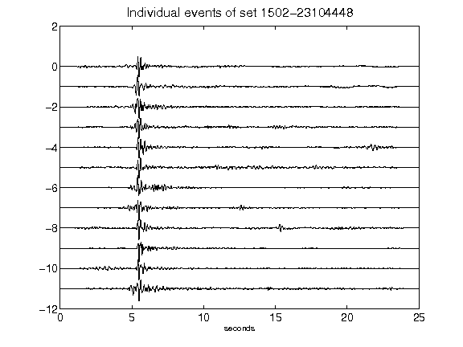](figures/1502-23104448_AllEv.png)[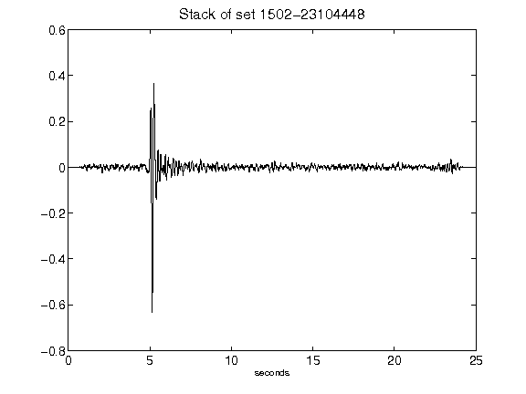](figures/1502-23104448_Stack.png)[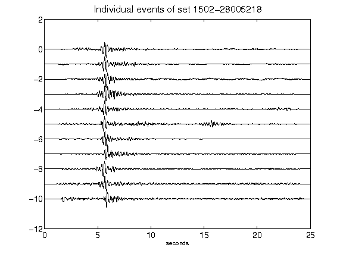](figures/1502-28005218_AllEv.png)[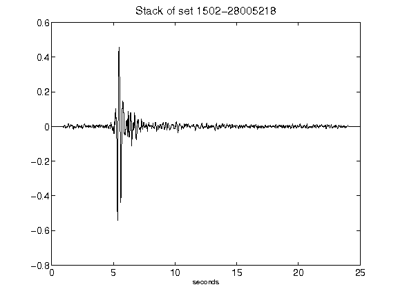](figures/1502-28005218_Stack.png)[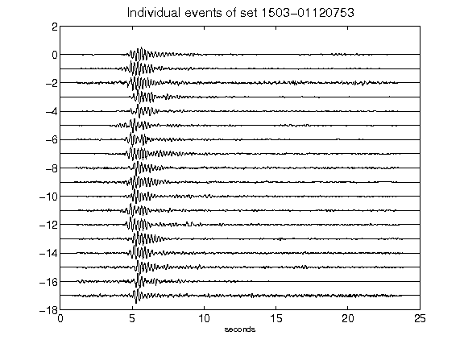](figures/1503-01120753_AllEv.png)[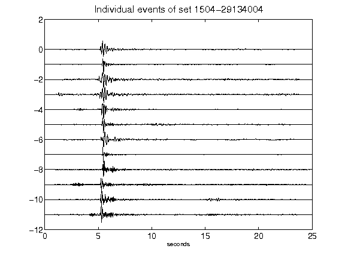](figures/1504-29134004_AllEv.png)[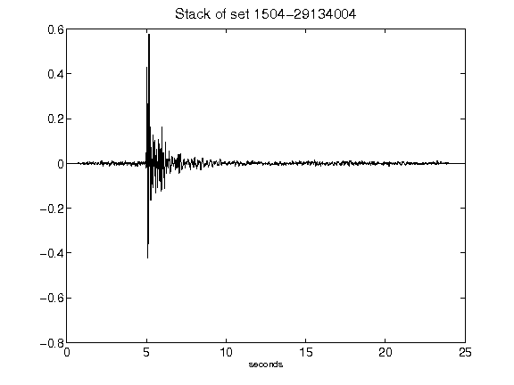](figures/1504-29134004_Stack.png)[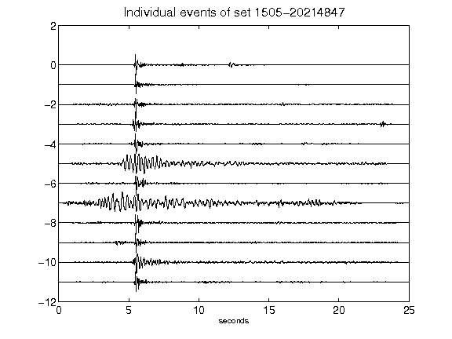](figures/1505-20214847_AllEv.png)[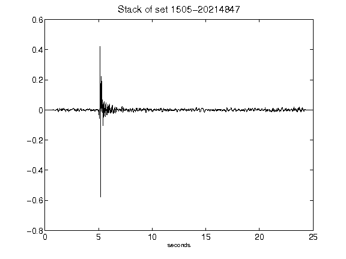](figures/1505-20214847_Stack.png)[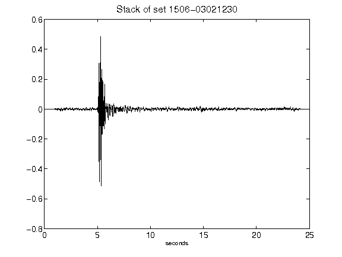](figures/1506-03021230_Stack.png)[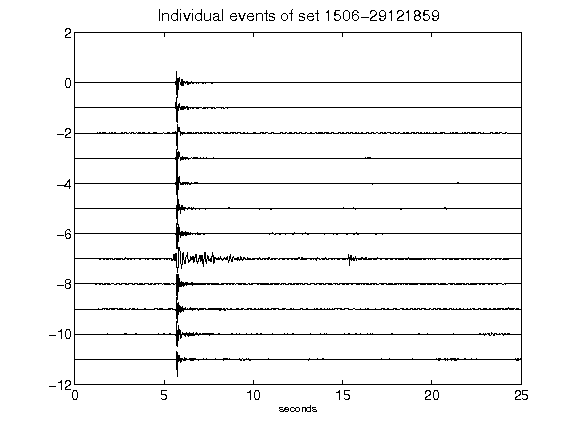](figures/1506-29121859_AllEv.png)[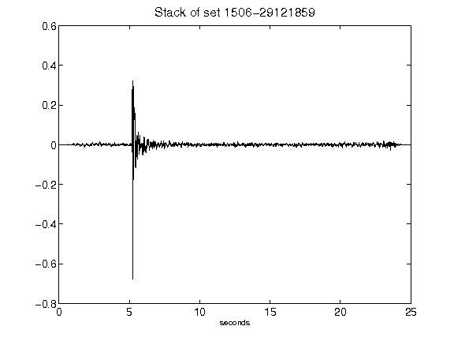](figures/1506-29121859_Stack.png)