# Repeating Earthquake Activity at RCM

## Waveforms
[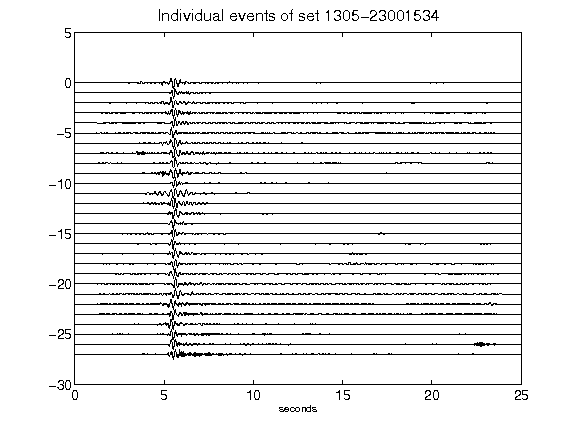](figures/1305-23001534_AllEv.png)[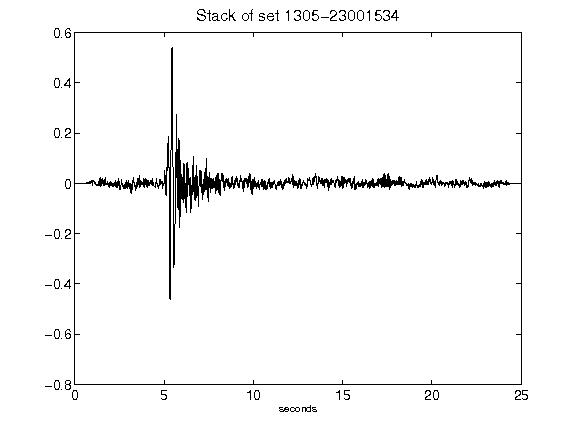](figures/1305-23001534_Stack.png)[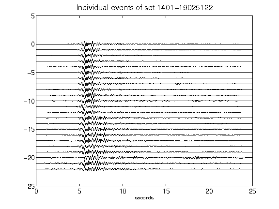](figures/1401-19025122_AllEv.png)[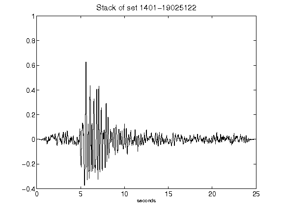](figures/1401-19025122_Stack.png)[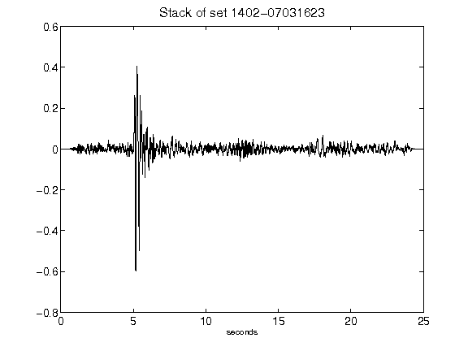](figures/1402-07031623_Stack.png)[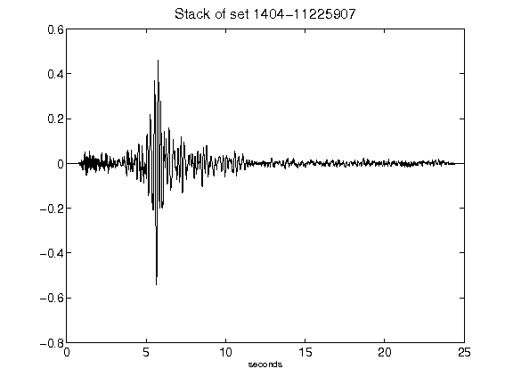](figures/1404-11225907_Stack.png)[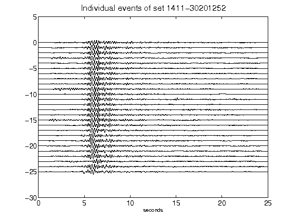](figures/1411-30201252_AllEv.png)[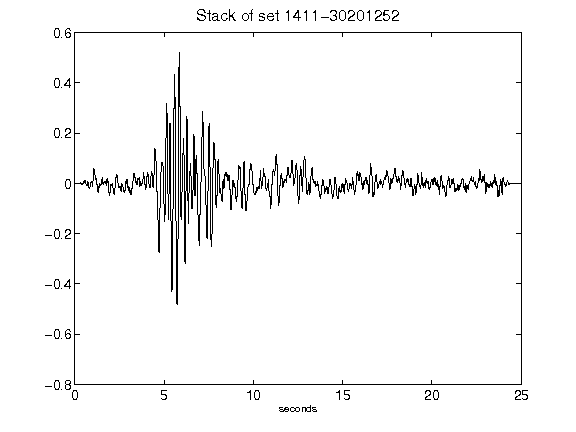](figures/1411-30201252_Stack.png)[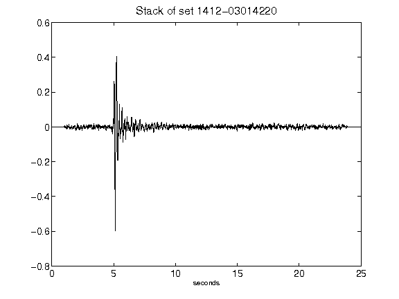](figures/1412-03014220_Stack.png)[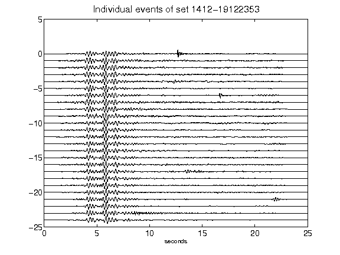](figures/1412-19122353_AllEv.png)[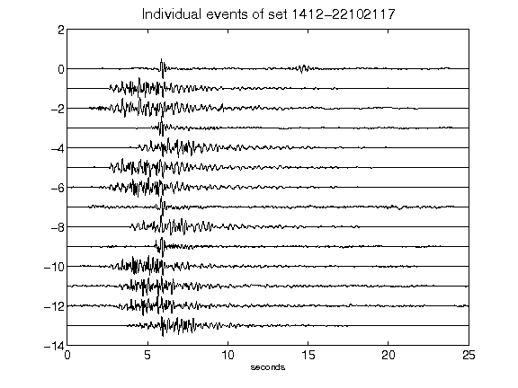](figures/1412-22102117_AllEv.png)[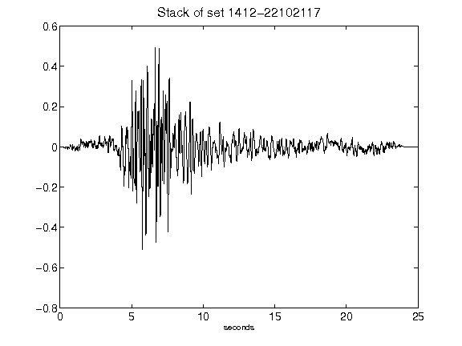](figures/1412-22102117_Stack.png)[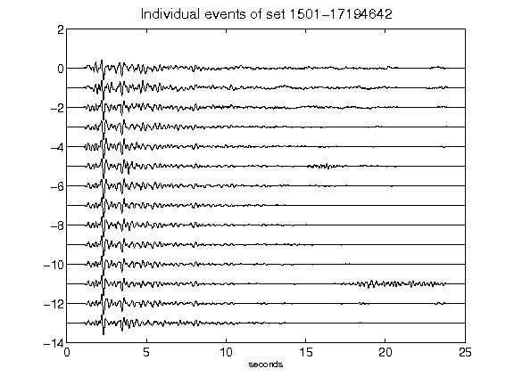](figures/1501-17194642_AllEv.png)[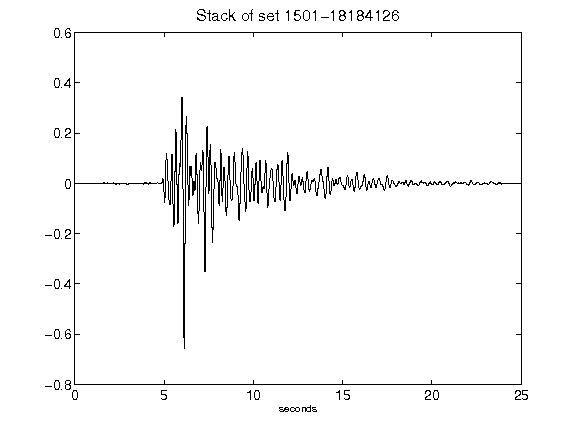](figures/1501-18184126_Stack.png)[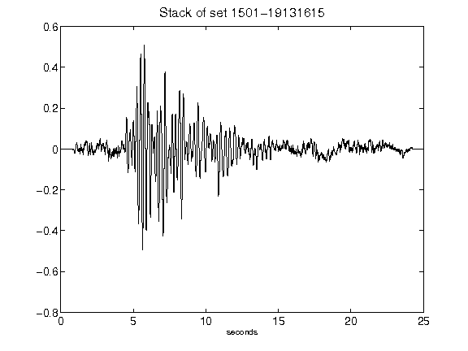](figures/1501-19131615_Stack.png)[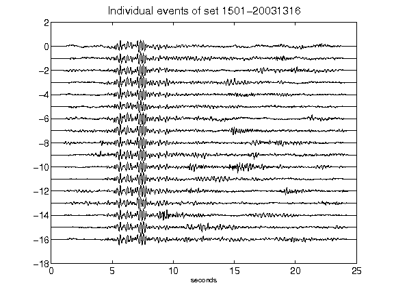](figures/1501-20031316_AllEv.png)[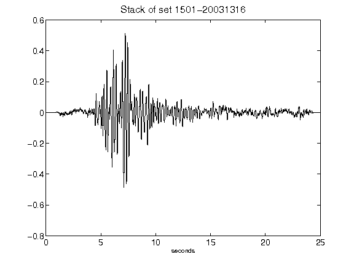](figures/1501-20031316_Stack.png)