# Repeating Earthquake Activity at RCM

## Waveforms
[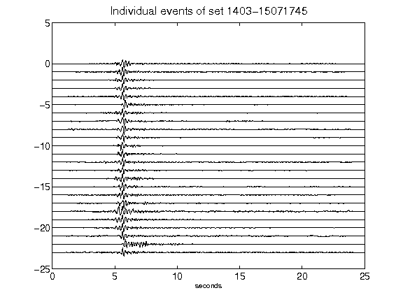](figures/1403-15071745_AllEv.png)[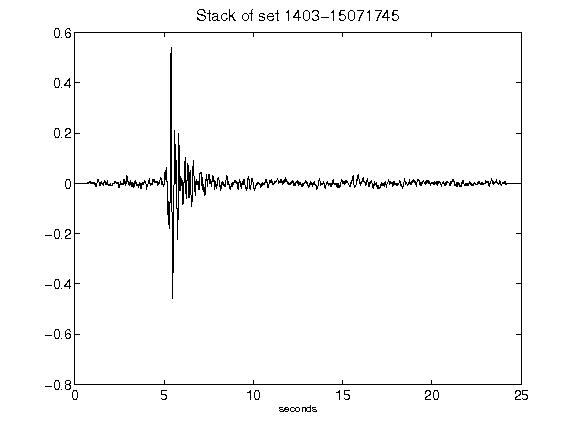](figures/1403-15071745_Stack.png)[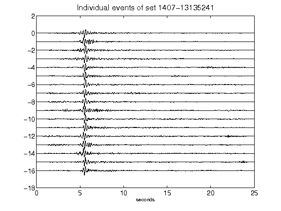](figures/1407-13135241_AllEv.png)[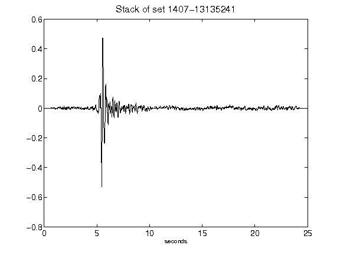](figures/1407-13135241_Stack.png)[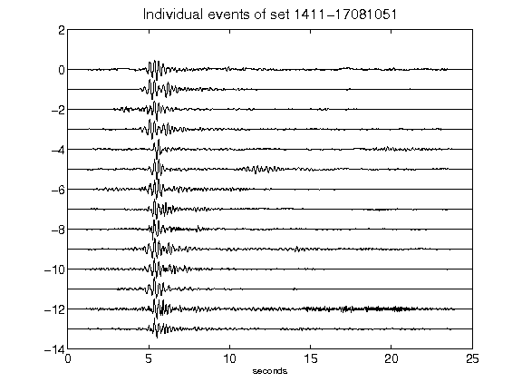](figures/1411-17081051_AllEv.png)[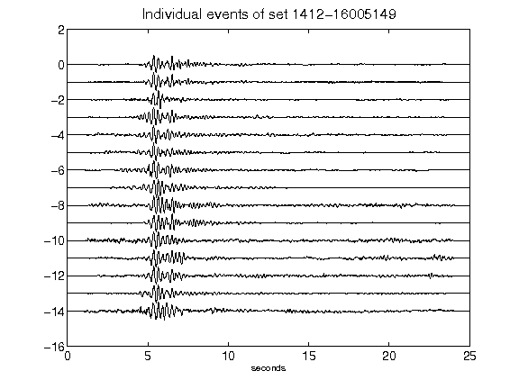](figures/1412-16005149_AllEv.png)[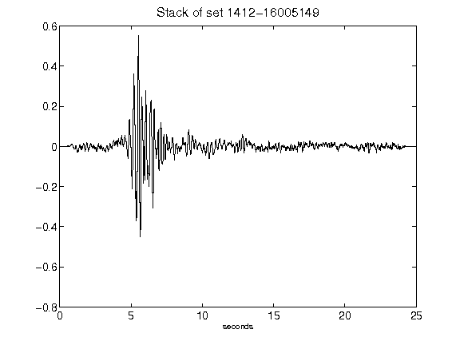](figures/1412-16005149_Stack.png)[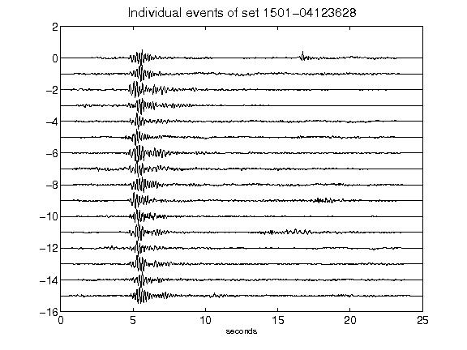](figures/1501-04123628_AllEv.png)[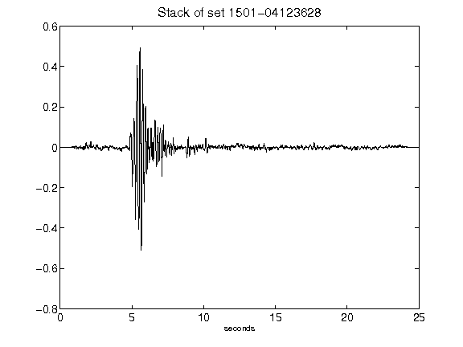](figures/1501-04123628_Stack.png)[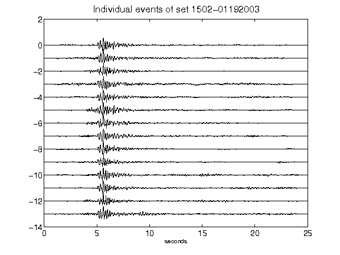](figures/1502-01192003_AllEv.png)[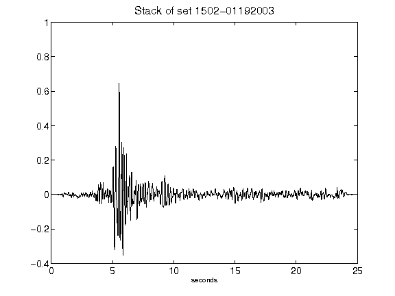](figures/1502-01192003_Stack.png)[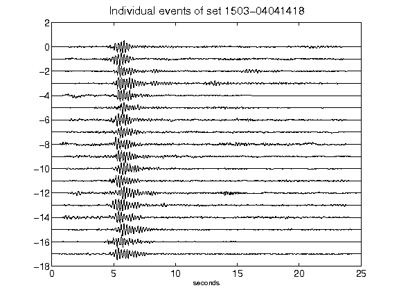](figures/1503-04041418_AllEv.png)[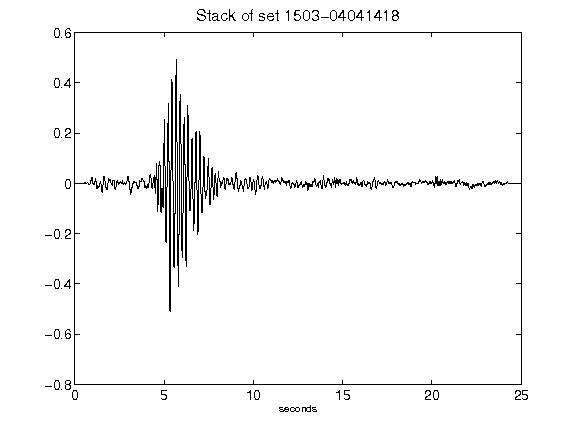](figures/1503-04041418_Stack.png)[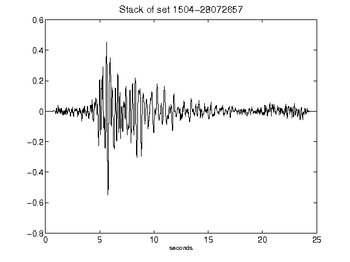](figures/1504-28072657_Stack.png)