# Repeating Earthquake Activity at RCM

## Waveforms
[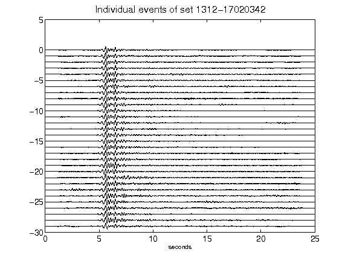](figures/1312-17020342_AllEv.png)[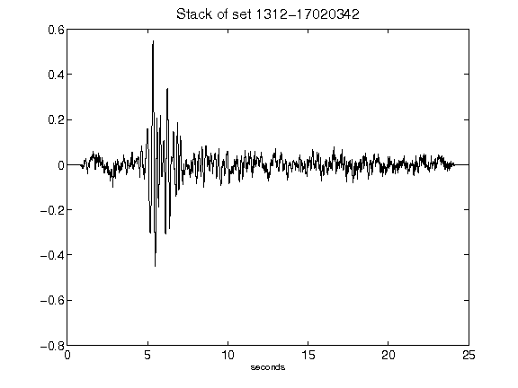](figures/1312-17020342_Stack.png)[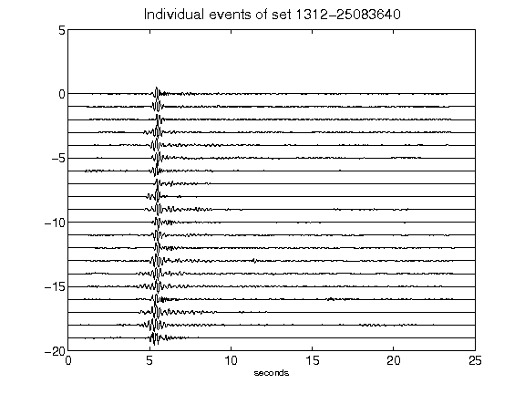](figures/1312-25083640_AllEv.png)[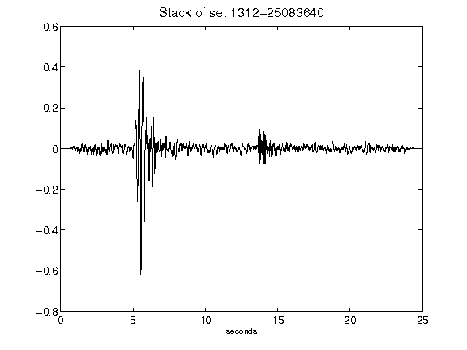](figures/1312-25083640_Stack.png)[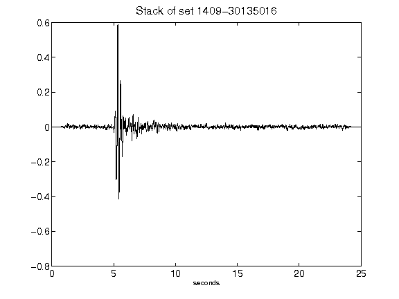](figures/1409-30135016_Stack.png)[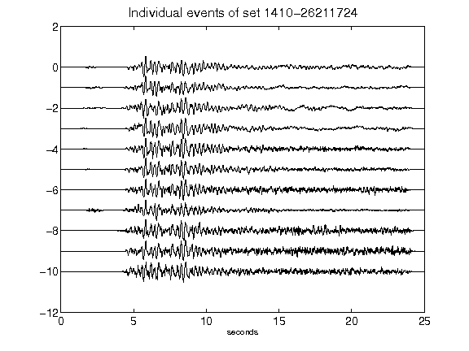](figures/1410-26211724_AllEv.png)[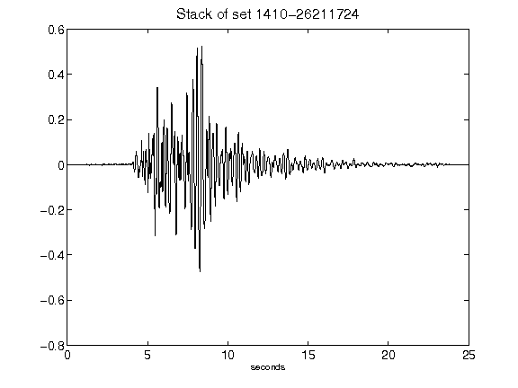](figures/1410-26211724_Stack.png)[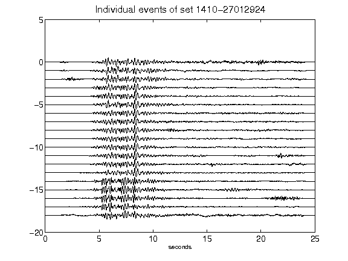](figures/1410-27012924_AllEv.png)[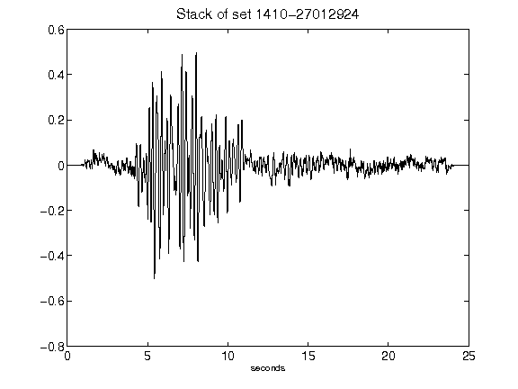](figures/1410-27012924_Stack.png)[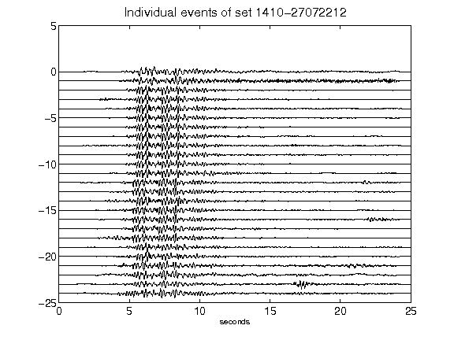](figures/1410-27072212_AllEv.png)[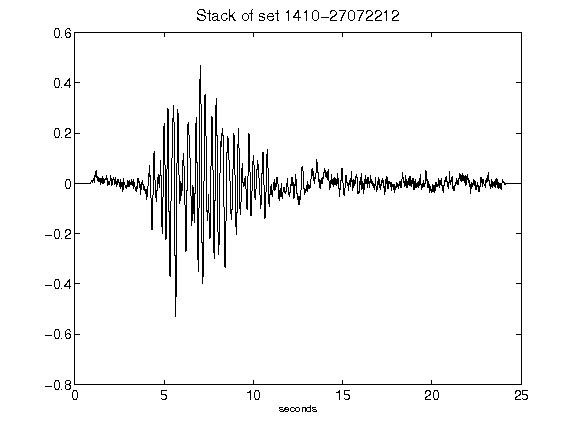](figures/1410-27072212_Stack.png)[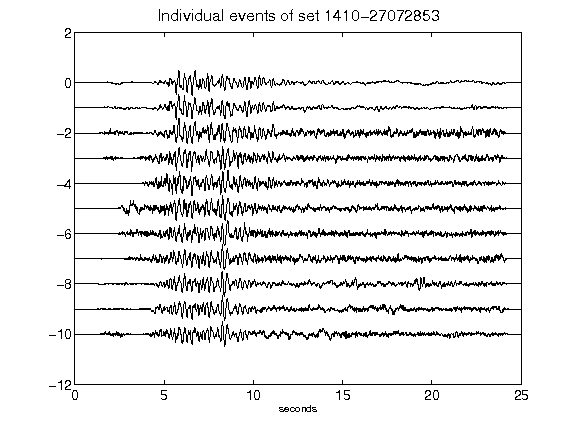](figures/1410-27072853_AllEv.png)[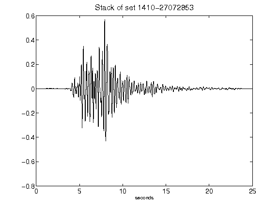](figures/1410-27072853_Stack.png)[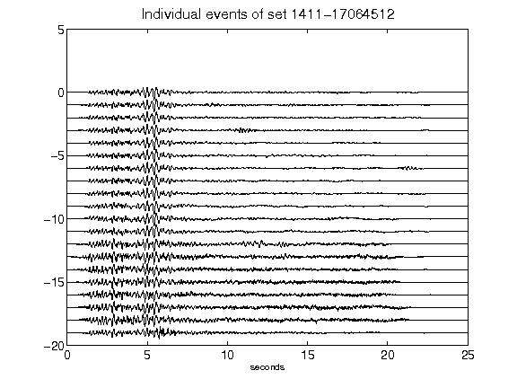](figures/1411-17064512_AllEv.png)[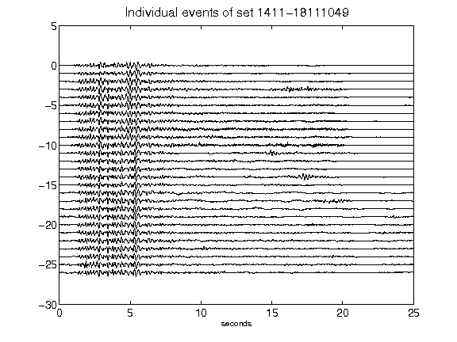](figures/1411-18111049_AllEv.png)[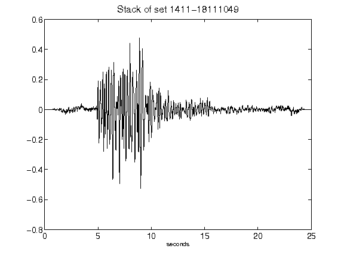](figures/1411-18111049_Stack.png)