# Repeating Earthquake Activity at RCS

## Waveforms
[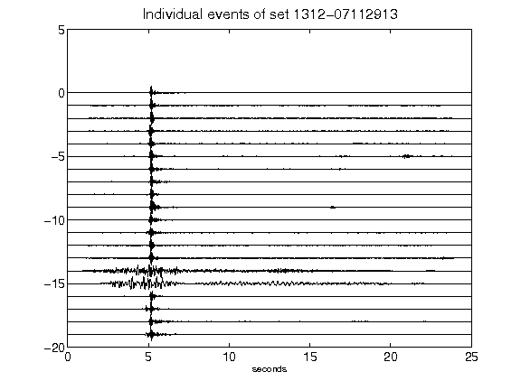](figures/1312-07112913_AllEv.png)[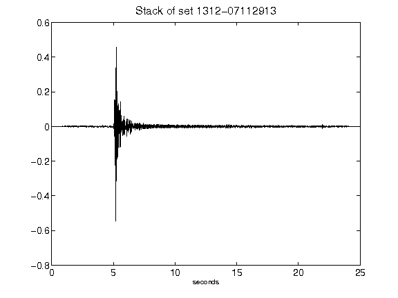](figures/1312-07112913_Stack.png)[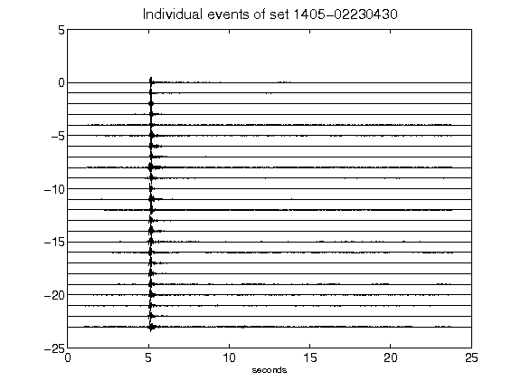](figures/1405-02230430_AllEv.png)[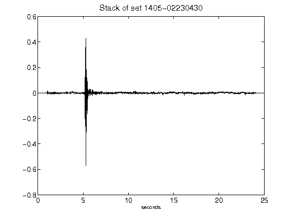](figures/1405-02230430_Stack.png)[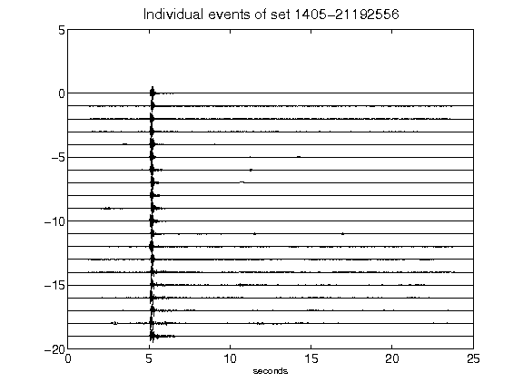](figures/1405-21192556_AllEv.png)[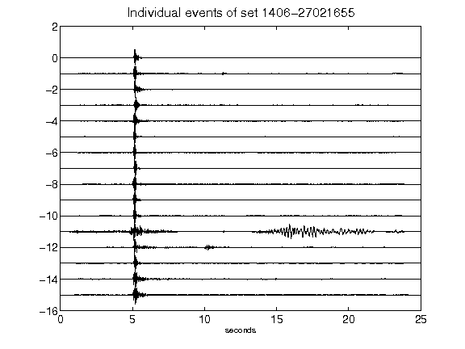](figures/1406-27021655_AllEv.png)[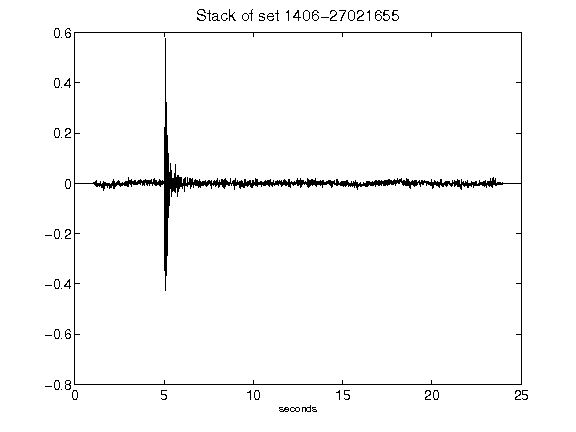](figures/1406-27021655_Stack.png)[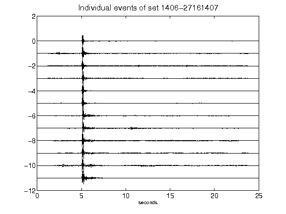](figures/1406-27161407_AllEv.png)[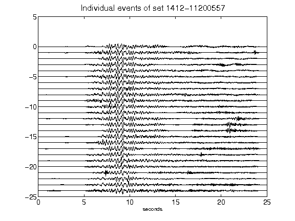](figures/1412-11200557_AllEv.png)[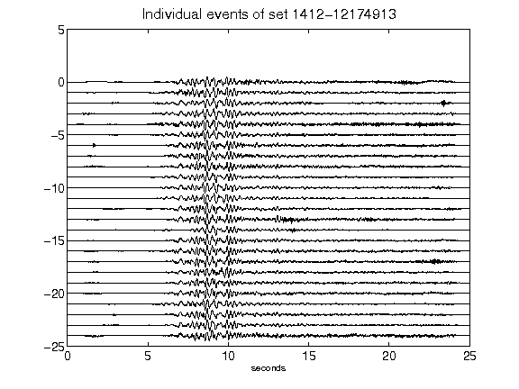](figures/1412-12174913_AllEv.png)[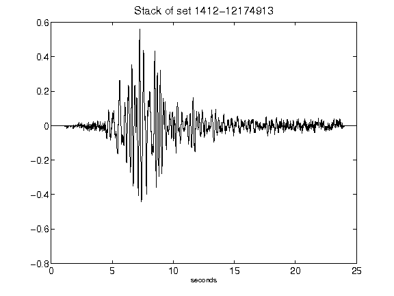](figures/1412-12174913_Stack.png)[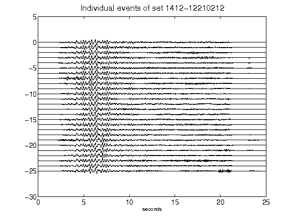](figures/1412-12210212_AllEv.png)[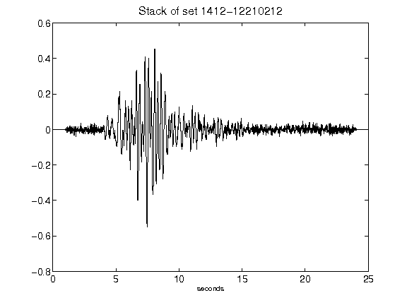](figures/1412-12210212_Stack.png)[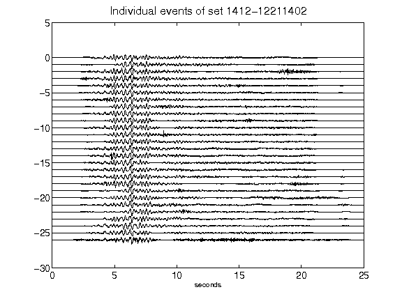](figures/1412-12211402_AllEv.png)[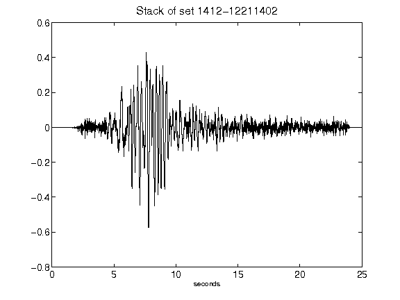](figures/1412-12211402_Stack.png)[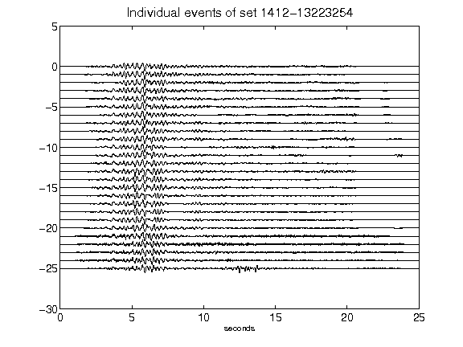](figures/1412-13223254_AllEv.png)[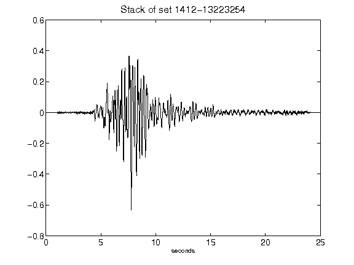](figures/1412-13223254_Stack.png)[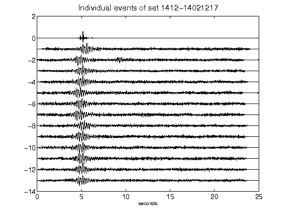](figures/1412-14021217_AllEv.png)[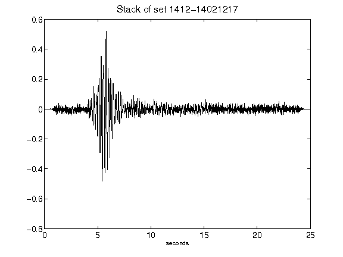](figures/1412-14021217_Stack.png)[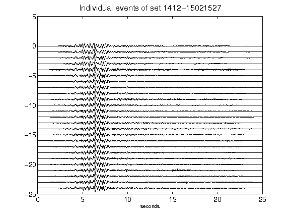](figures/1412-15021527_AllEv.png)[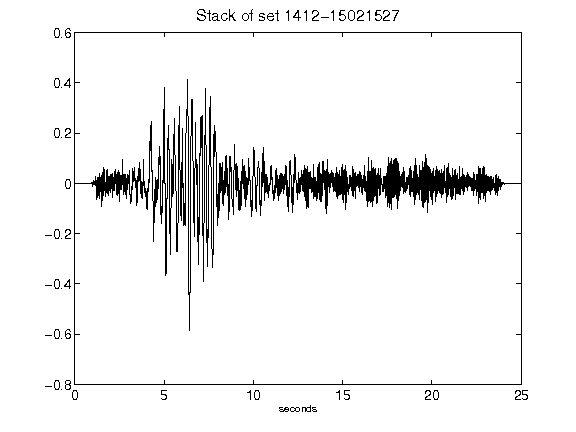](figures/1412-15021527_Stack.png)[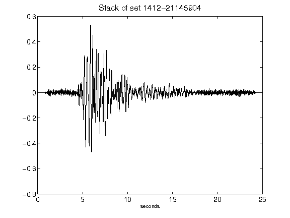](figures/1412-21145904_Stack.png)[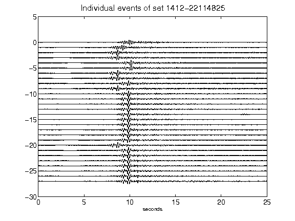](figures/1412-22114825_AllEv.png)[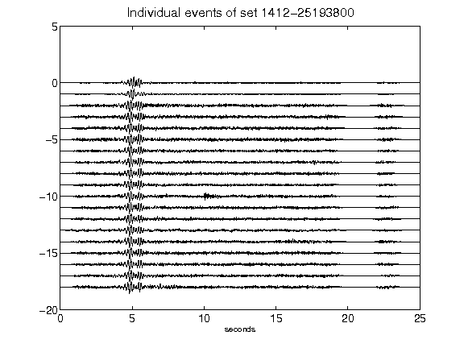](figures/1412-25193800_AllEv.png)[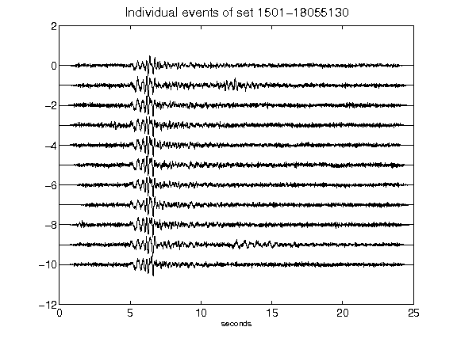](figures/1501-18055130_AllEv.png)[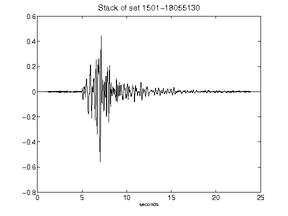](figures/1501-18055130_Stack.png)[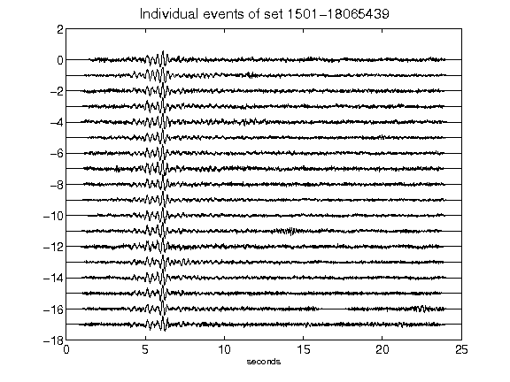](figures/1501-18065439_AllEv.png)[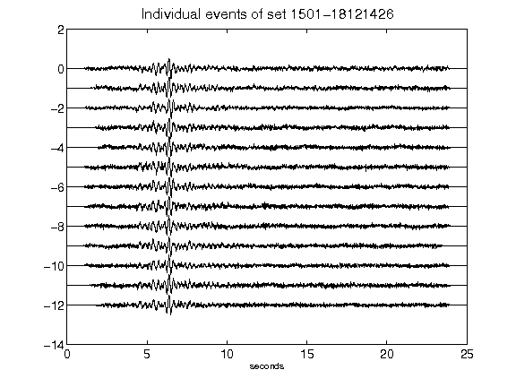](figures/1501-18121426_AllEv.png)[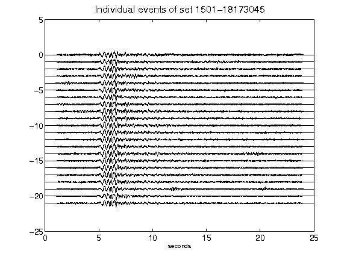](figures/1501-18173045_AllEv.png)[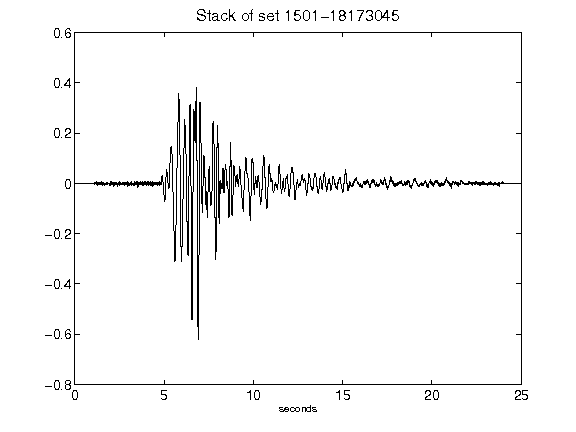](figures/1501-18173045_Stack.png)[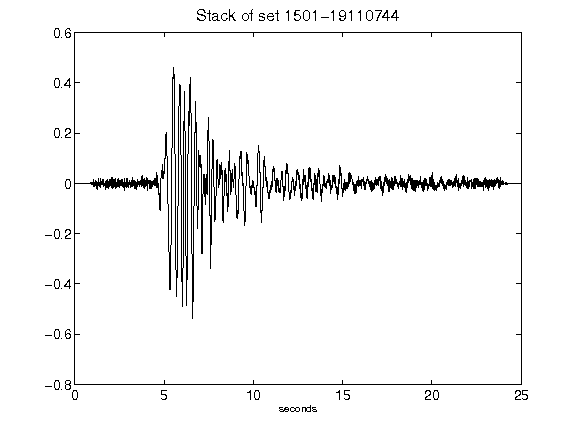](figures/1501-19110744_Stack.png)[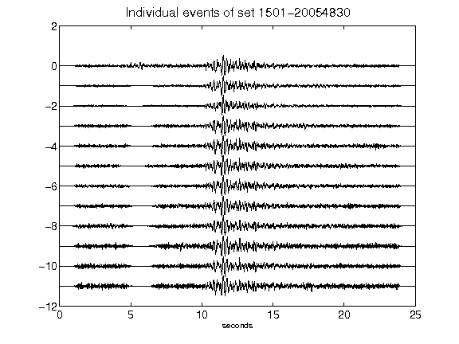](figures/1501-20054830_AllEv.png)[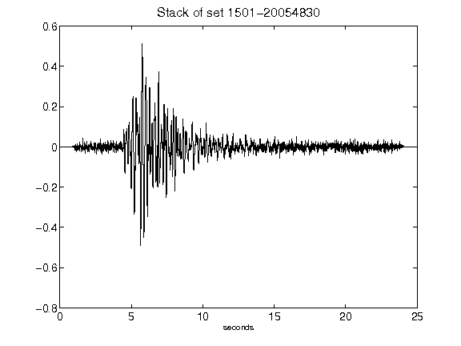](figures/1501-20054830_Stack.png)[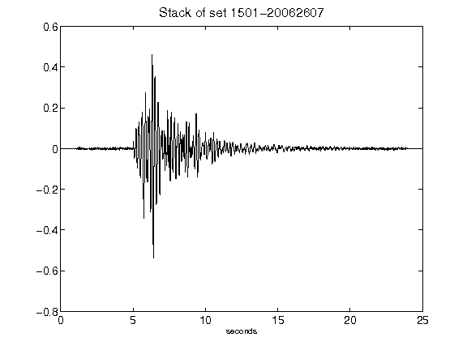](figures/1501-20062607_Stack.png)[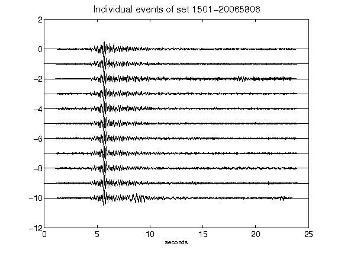](figures/1501-20065806_AllEv.png)[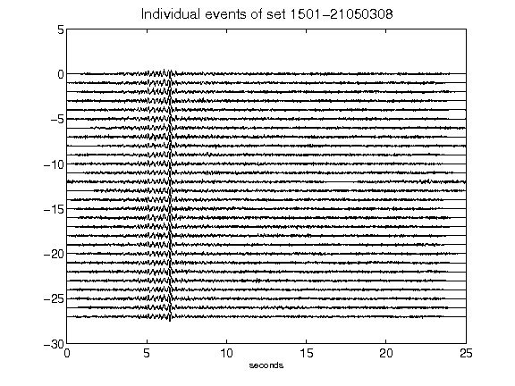](figures/1501-21050308_AllEv.png)