# Repeating Earthquake Activity at RCS

## Waveforms
[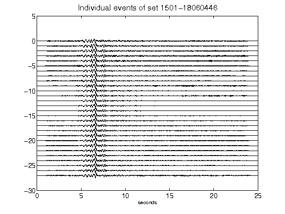](figures/1501-18060446_AllEv.png)[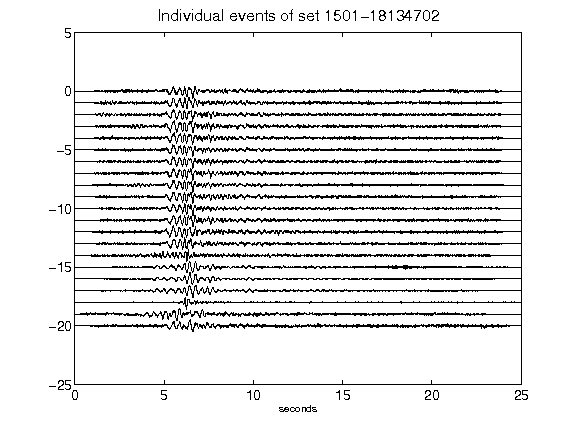](figures/1501-18134702_AllEv.png)[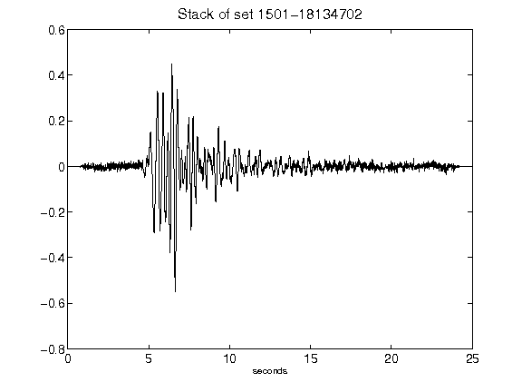](figures/1501-18134702_Stack.png)[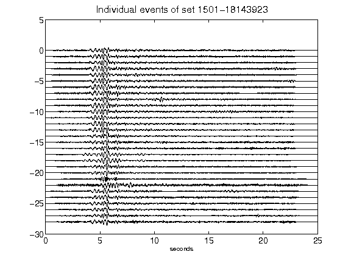](figures/1501-18143923_AllEv.png)[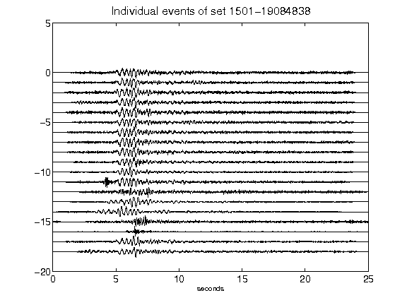](figures/1501-19084838_AllEv.png)[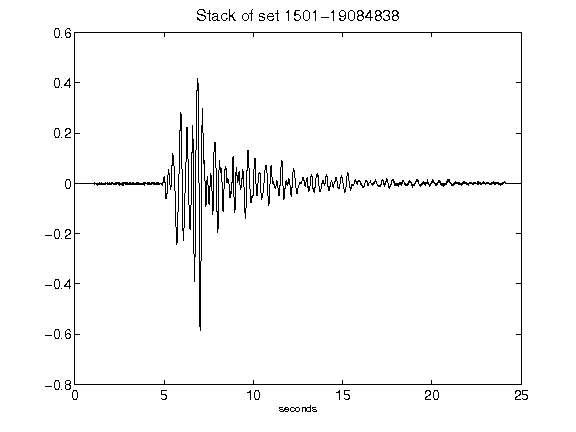](figures/1501-19084838_Stack.png)[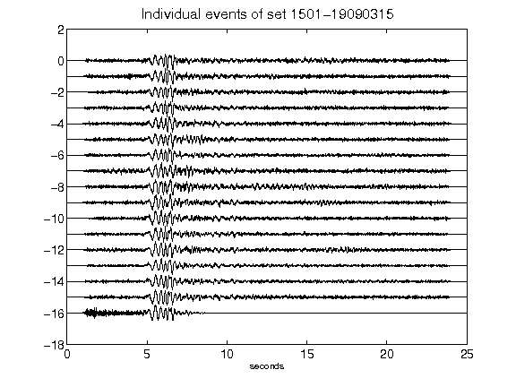](figures/1501-19090315_AllEv.png)[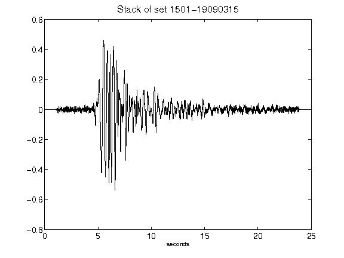](figures/1501-19090315_Stack.png)[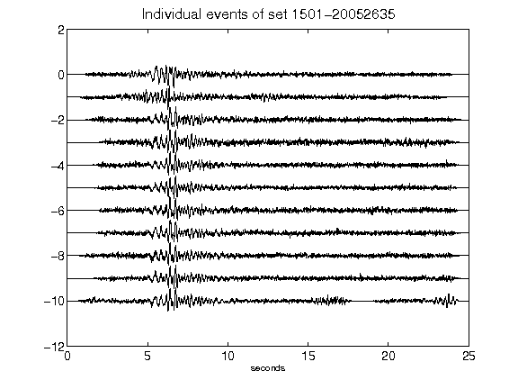](figures/1501-20052635_AllEv.png)[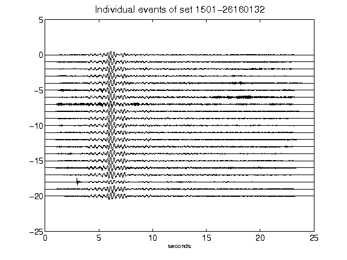](figures/1501-26160132_AllEv.png)[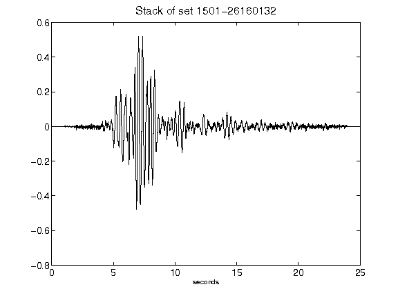](figures/1501-26160132_Stack.png)[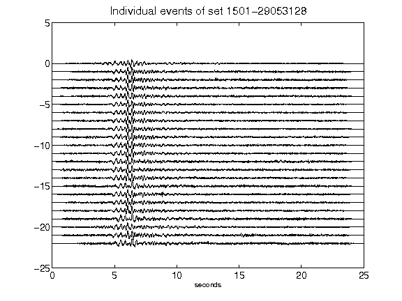](figures/1501-29053128_AllEv.png)