# Repeating Earthquake Activity at RCS

## Waveforms
[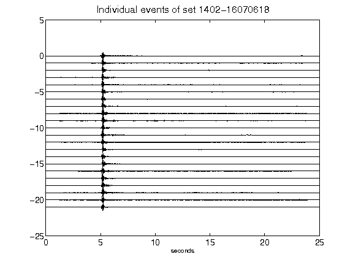](figures/1402-16070618_AllEv.png)[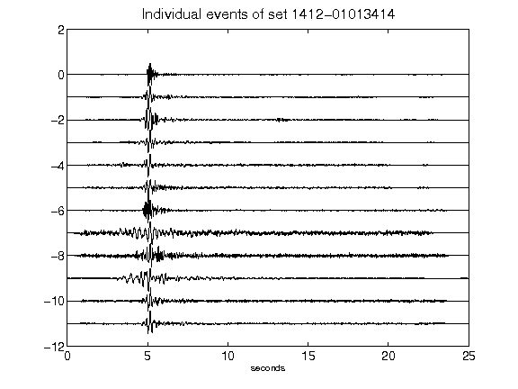](figures/1412-01013414_AllEv.png)[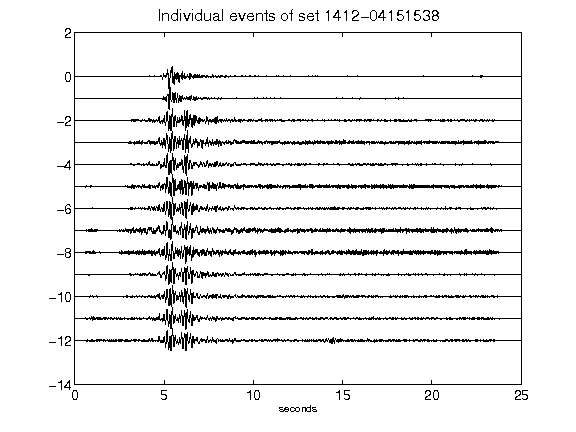](figures/1412-04151538_AllEv.png)[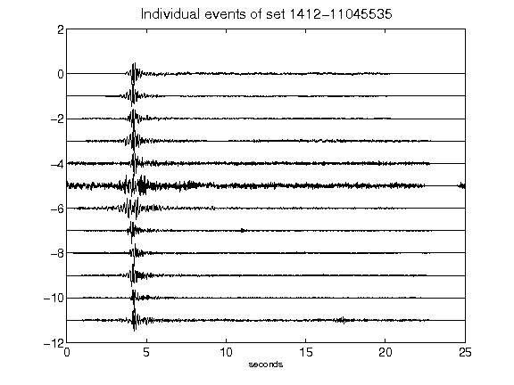](figures/1412-11045535_AllEv.png)[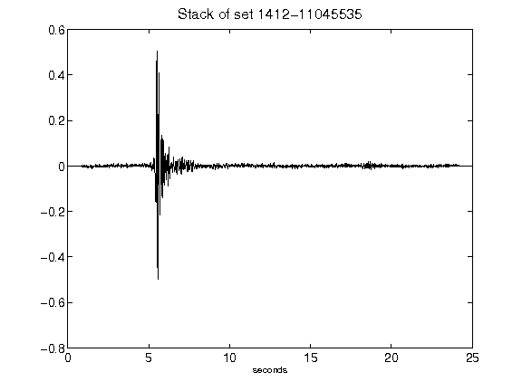](figures/1412-11045535_Stack.png)[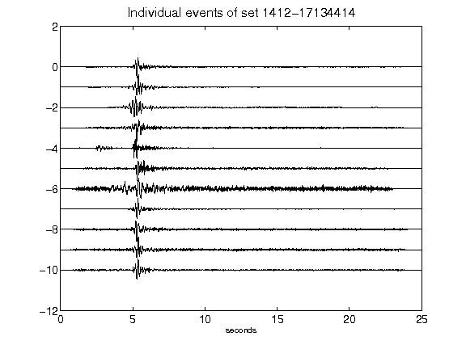](figures/1412-17134414_AllEv.png)[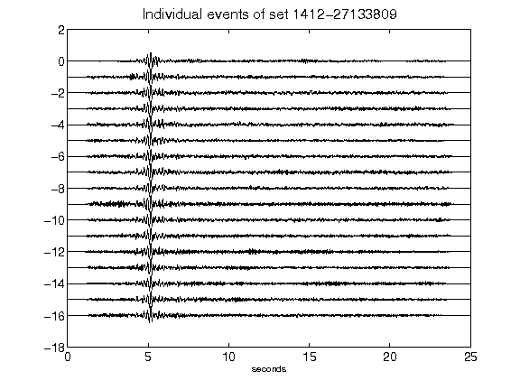](figures/1412-27133809_AllEv.png)[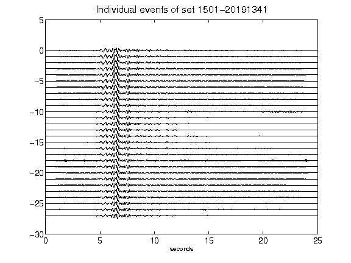](figures/1501-20191341_AllEv.png)[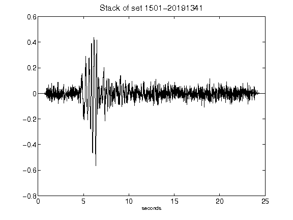](figures/1501-20191341_Stack.png)[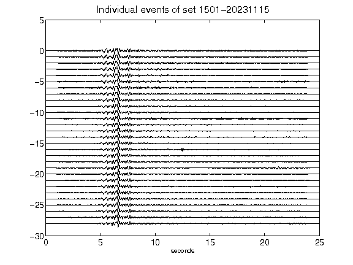](figures/1501-20231115_AllEv.png)[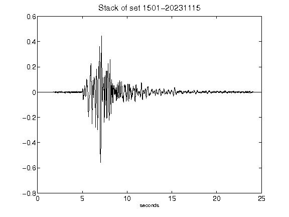](figures/1501-20231115_Stack.png)