# Repeating Earthquake Activity at RCS

## Waveforms
[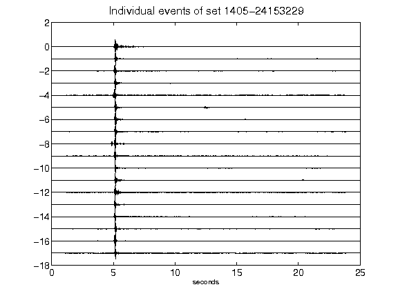](figures/1405-24153229_AllEv.png)[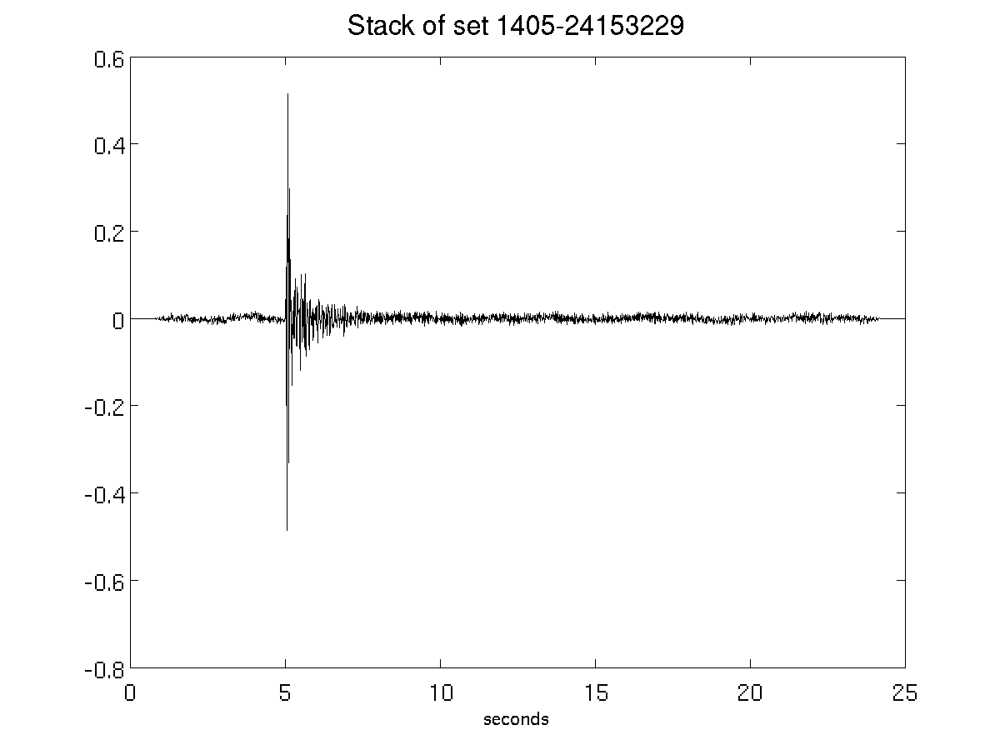](figures/1405-24153229_Stack.png)[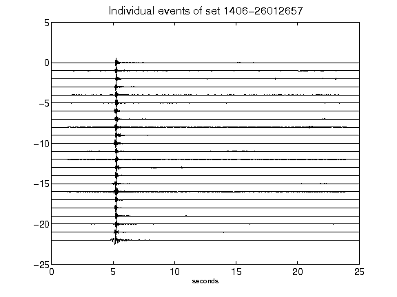](figures/1406-26012657_AllEv.png)[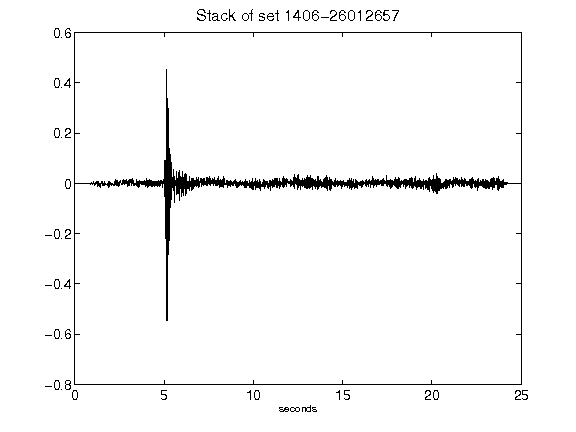](figures/1406-26012657_Stack.png)[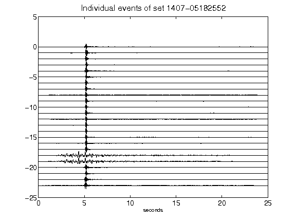](figures/1407-05182552_AllEv.png)[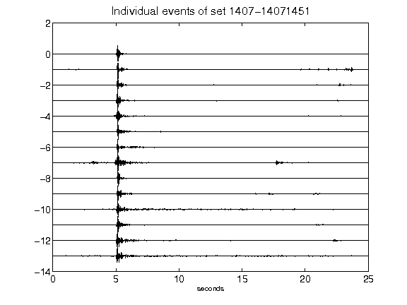](figures/1407-14071451_AllEv.png)[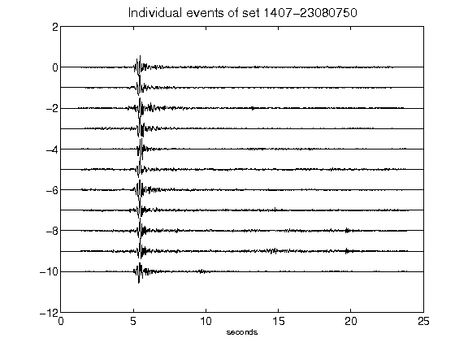](figures/1407-23080750_AllEv.png)[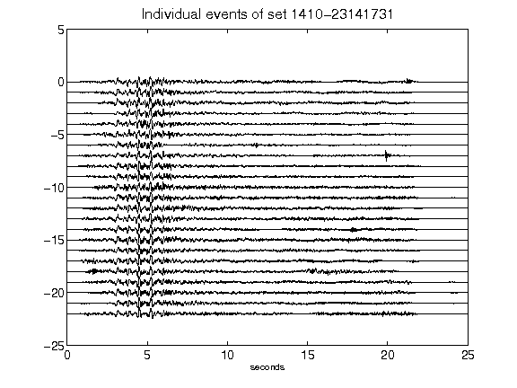](figures/1410-23141731_AllEv.png)[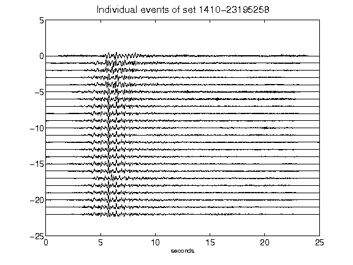](figures/1410-23195258_AllEv.png)[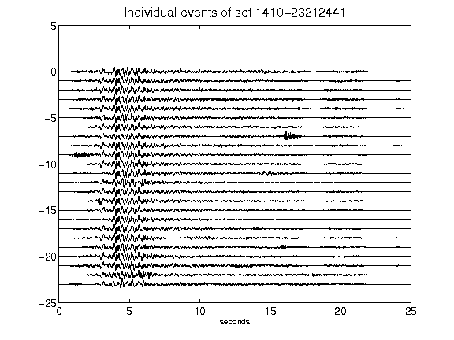](figures/1410-23212441_AllEv.png)[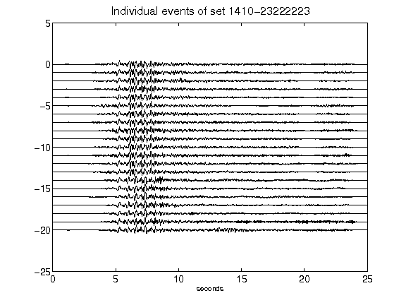](figures/1410-23222223_AllEv.png)[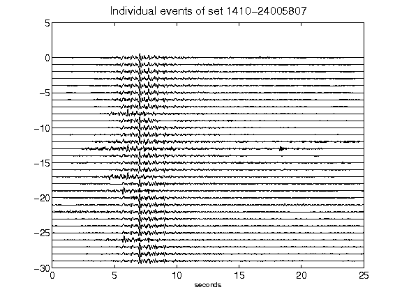](figures/1410-24005807_AllEv.png)[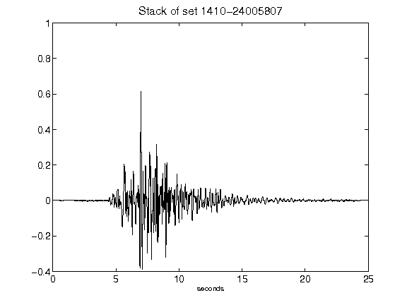](figures/1410-24005807_Stack.png)[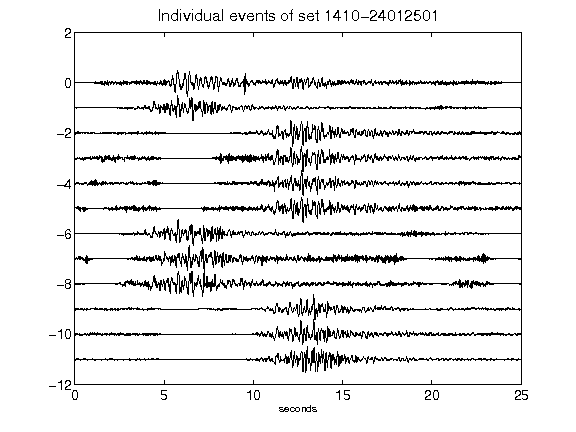](figures/1410-24012501_AllEv.png)[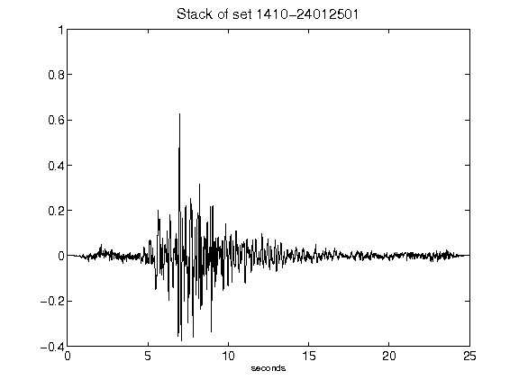](figures/1410-24012501_Stack.png)[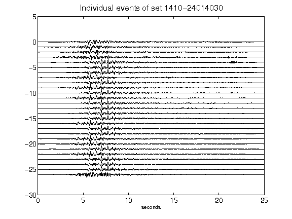](figures/1410-24014030_AllEv.png)[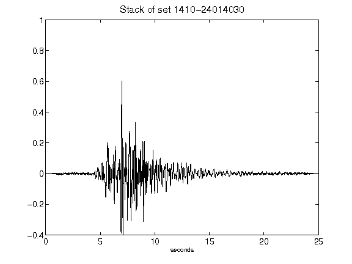](figures/1410-24014030_Stack.png)[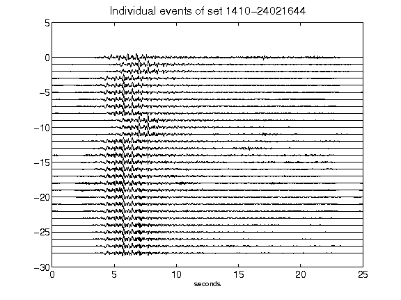](figures/1410-24021644_AllEv.png)[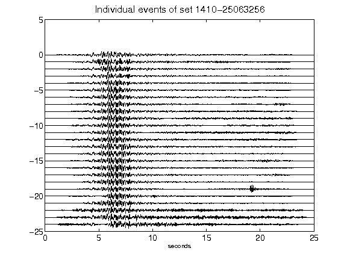](figures/1410-25063256_AllEv.png)[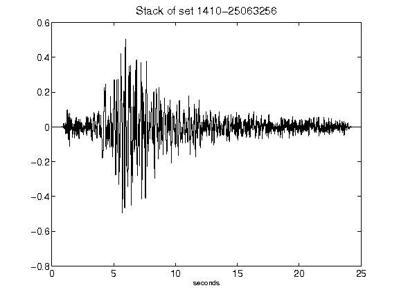](figures/1410-25063256_Stack.png)[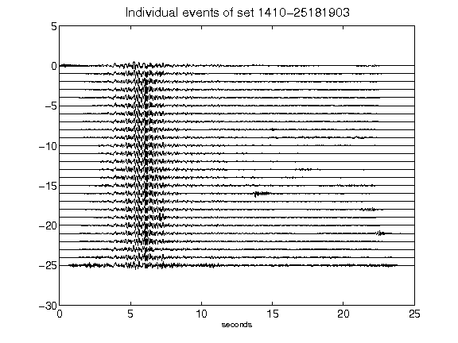](figures/1410-25181903_AllEv.png)[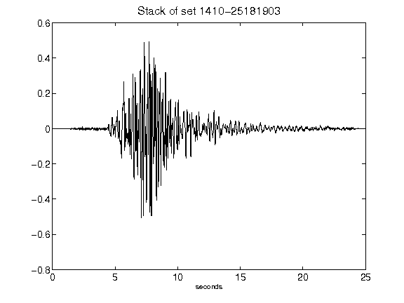](figures/1410-25181903_Stack.png)[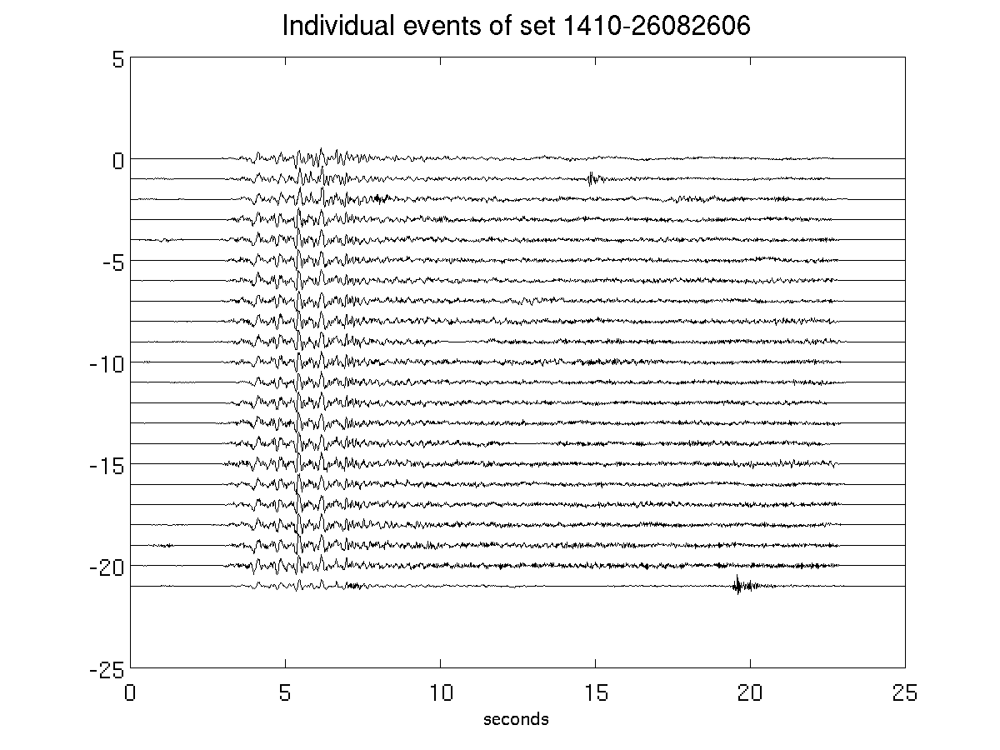](figures/1410-26082606_AllEv.png)[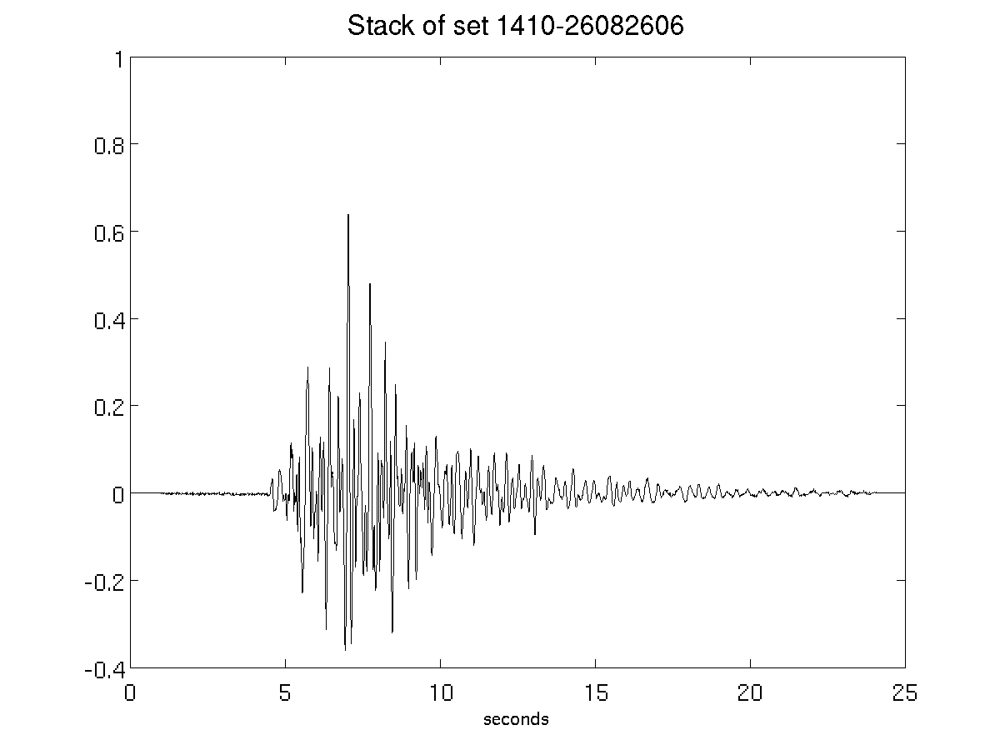](figures/1410-26082606_Stack.png)[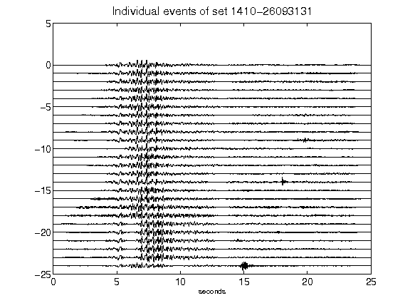](figures/1410-26093131_AllEv.png)[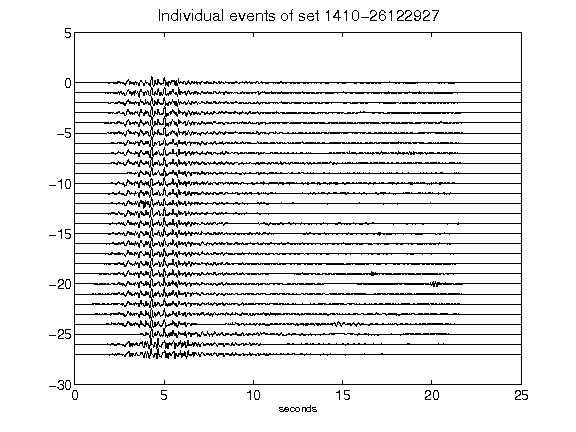](figures/1410-26122927_AllEv.png)[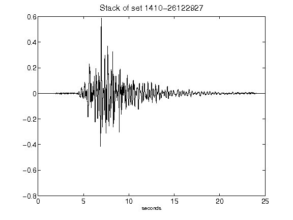](figures/1410-26122927_Stack.png)[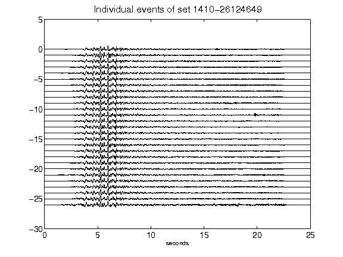](figures/1410-26124649_AllEv.png)[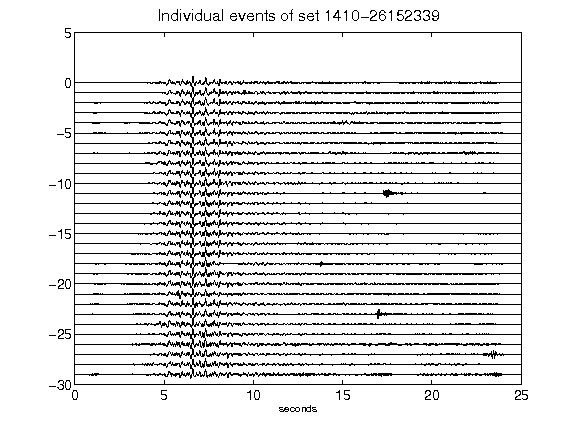](figures/1410-26152339_AllEv.png)[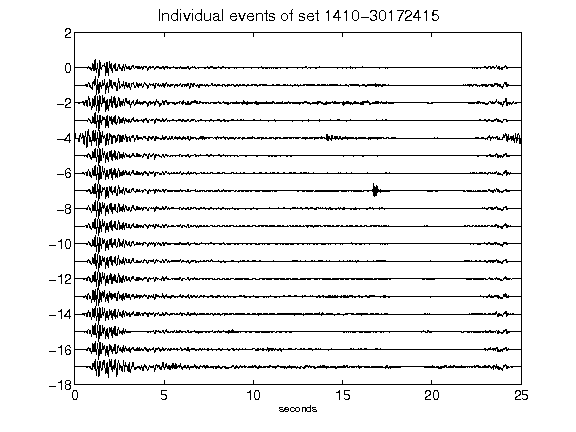](figures/1410-30172415_AllEv.png)[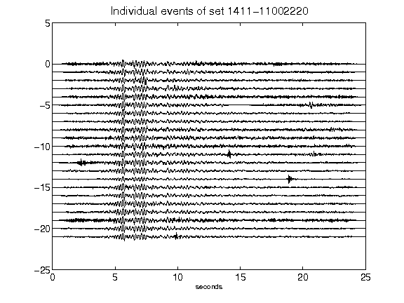](figures/1411-11002220_AllEv.png)[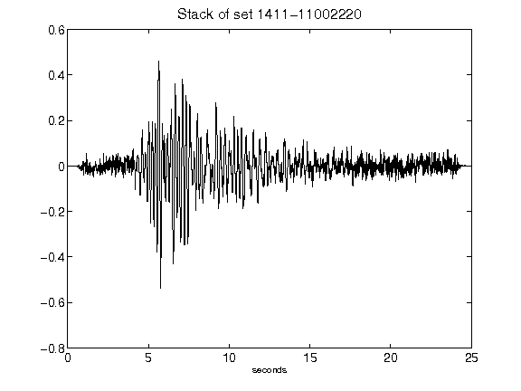](figures/1411-11002220_Stack.png)