# Repeating Earthquake Activity at RCS

## Waveforms
[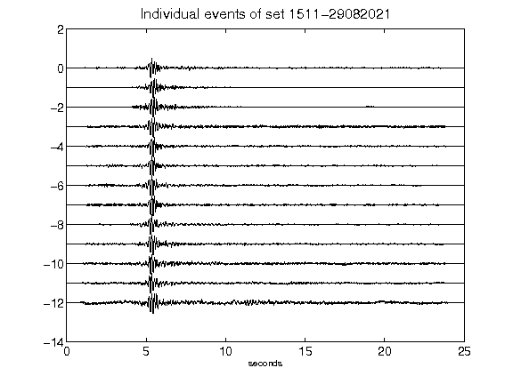](figures/1511-29082021_AllEv.png)[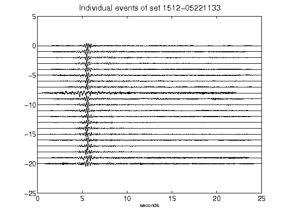](figures/1512-05221133_AllEv.png)[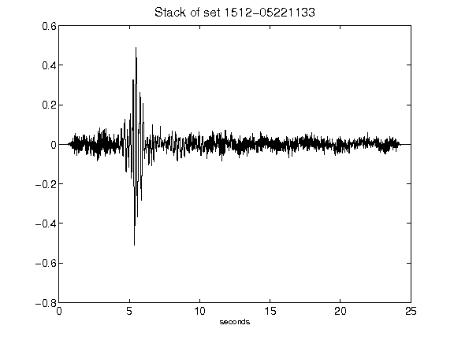](figures/1512-05221133_Stack.png)[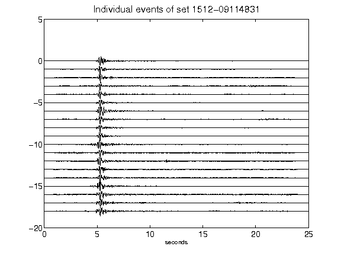](figures/1512-09114831_AllEv.png)[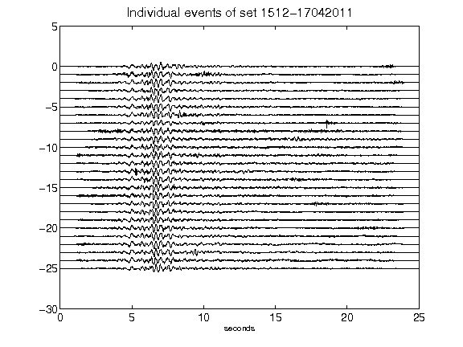](figures/1512-17042011_AllEv.png)[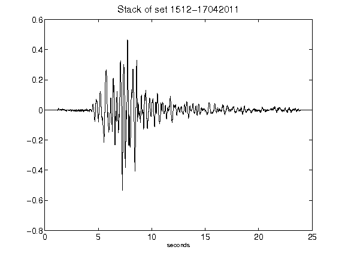](figures/1512-17042011_Stack.png)[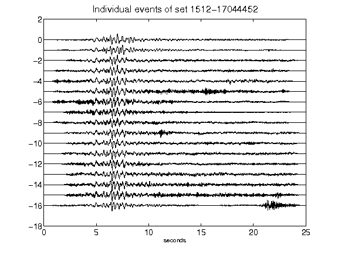](figures/1512-17044452_AllEv.png)[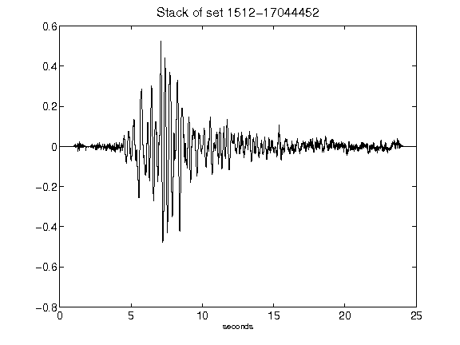](figures/1512-17044452_Stack.png)[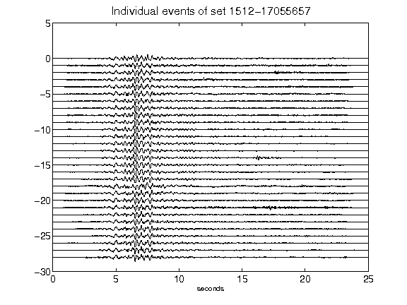](figures/1512-17055657_AllEv.png)[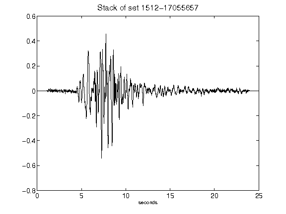](figures/1512-17055657_Stack.png)[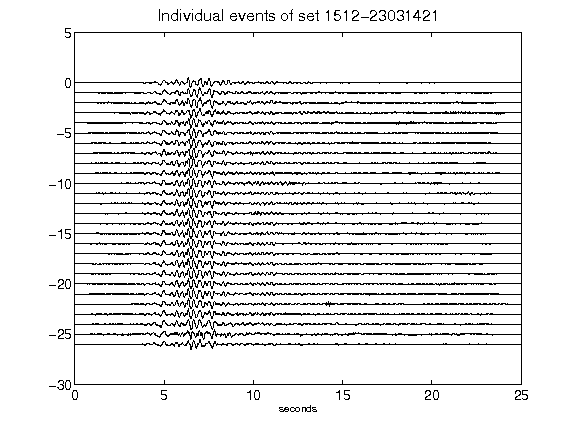](figures/1512-23031421_AllEv.png)[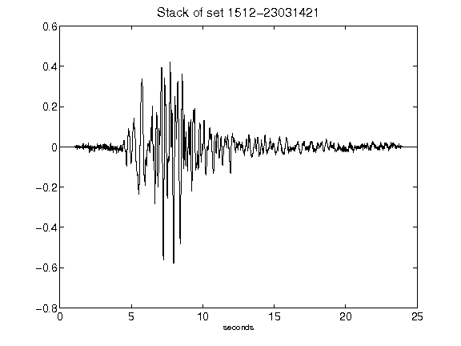](figures/1512-23031421_Stack.png)[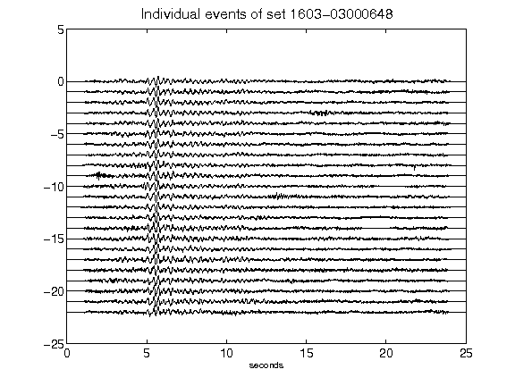](figures/1603-03000648_AllEv.png)[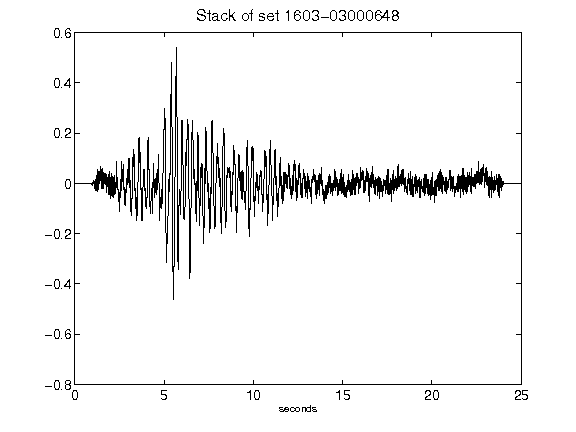](figures/1603-03000648_Stack.png)[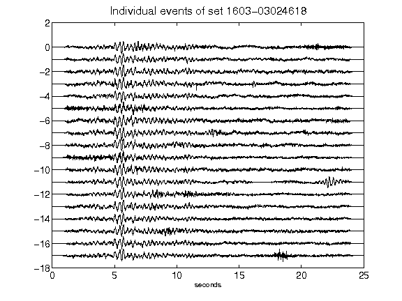](figures/1603-03024618_AllEv.png)[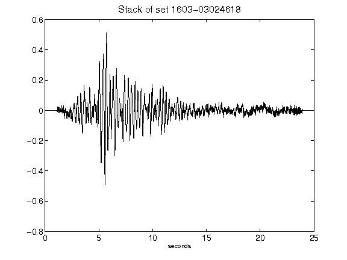](figures/1603-03024618_Stack.png)[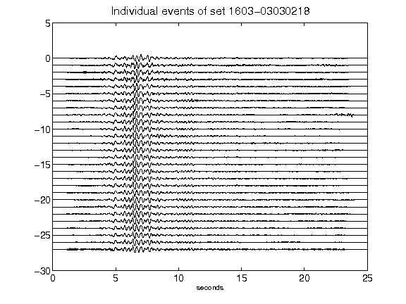](figures/1603-03030218_AllEv.png)[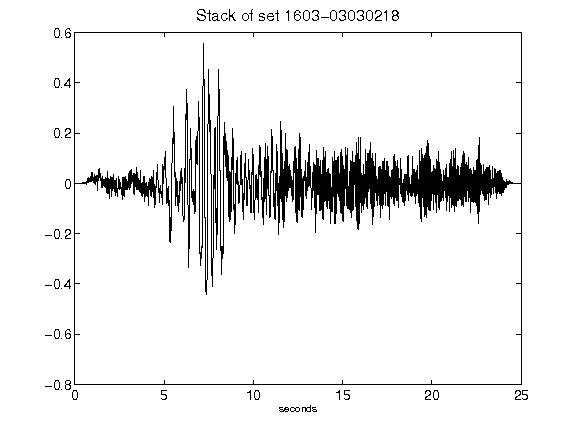](figures/1603-03030218_Stack.png)[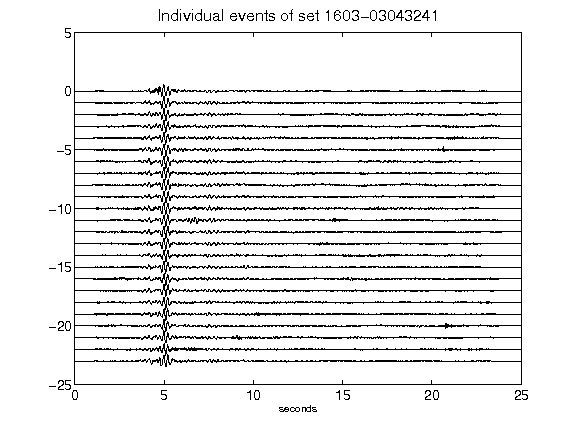](figures/1603-03043241_AllEv.png)[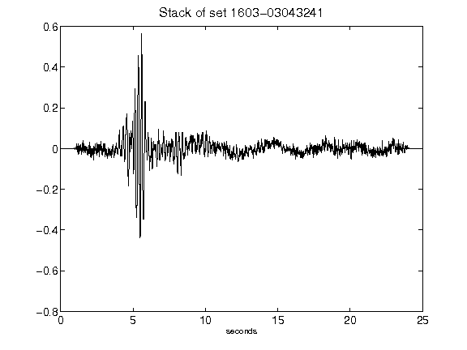](figures/1603-03043241_Stack.png)[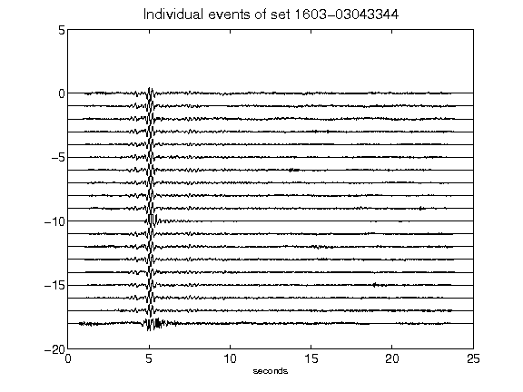](figures/1603-03043344_AllEv.png)[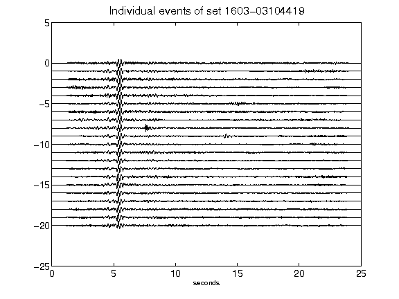](figures/1603-03104419_AllEv.png)[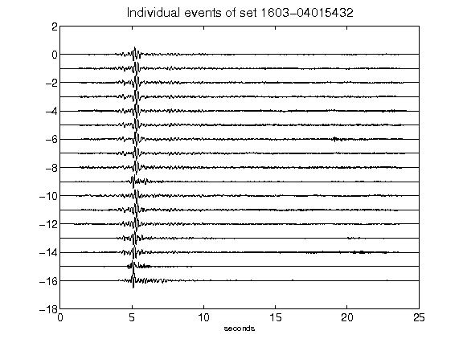](figures/1603-04015432_AllEv.png)[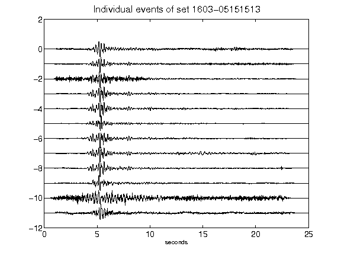](figures/1603-05151513_AllEv.png)[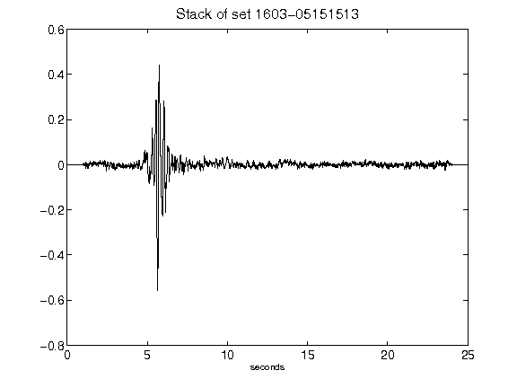](figures/1603-05151513_Stack.png)[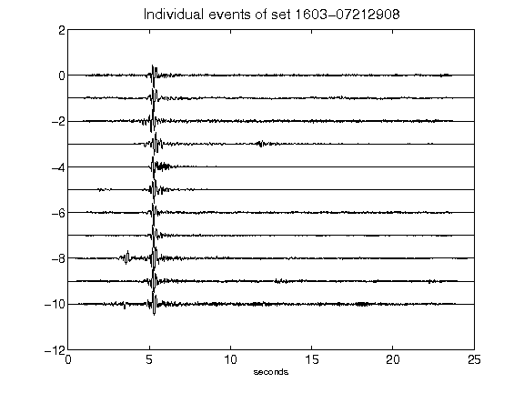](figures/1603-07212908_AllEv.png)[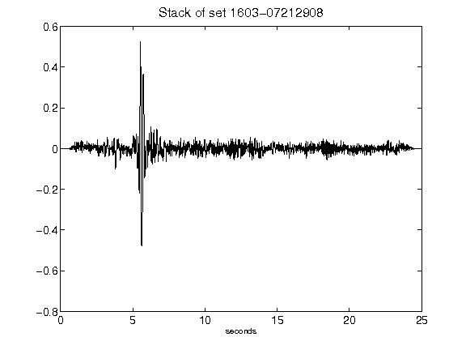](figures/1603-07212908_Stack.png)[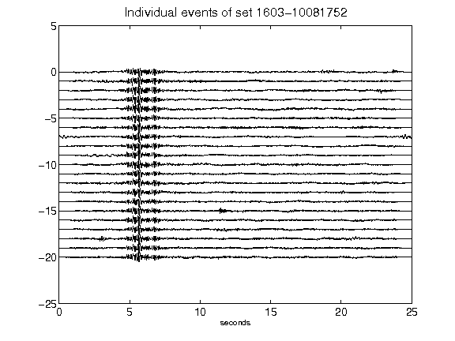](figures/1603-10081752_AllEv.png)[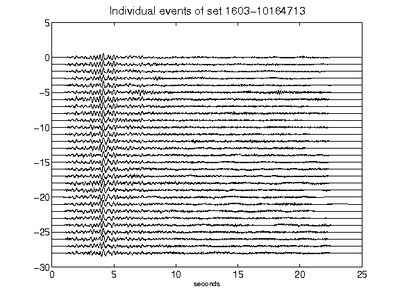](figures/1603-10164713_AllEv.png)[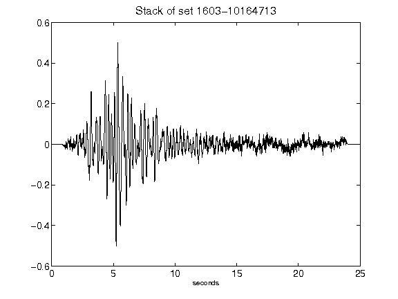](figures/1603-10164713_Stack.png)[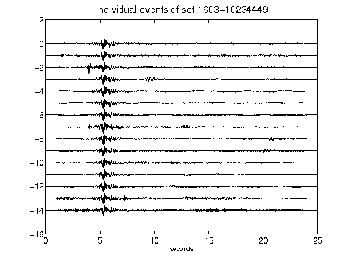](figures/1603-10234449_AllEv.png)[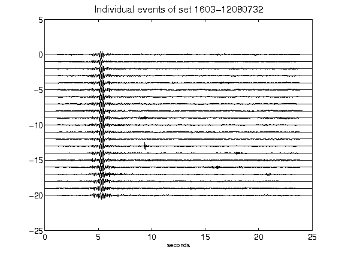](figures/1603-12080732_AllEv.png)[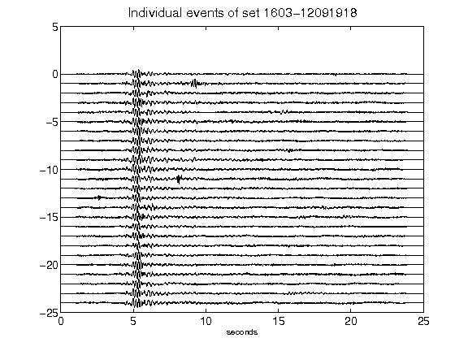](figures/1603-12091918_AllEv.png)[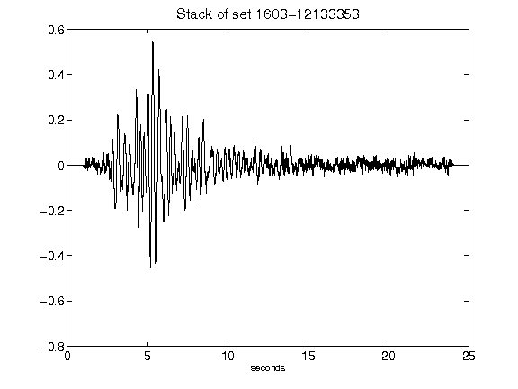](figures/1603-12133353_Stack.png)[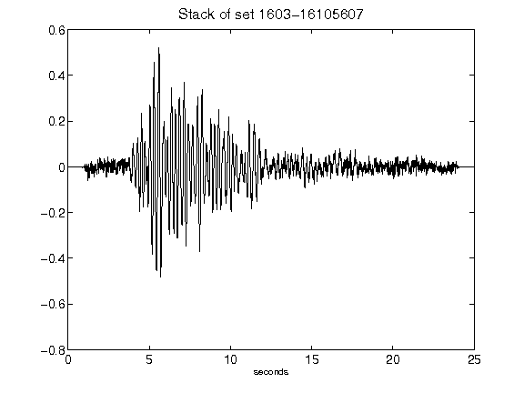](figures/1603-16105607_Stack.png)