# Repeating Earthquake Activity at RCS

## Waveforms
[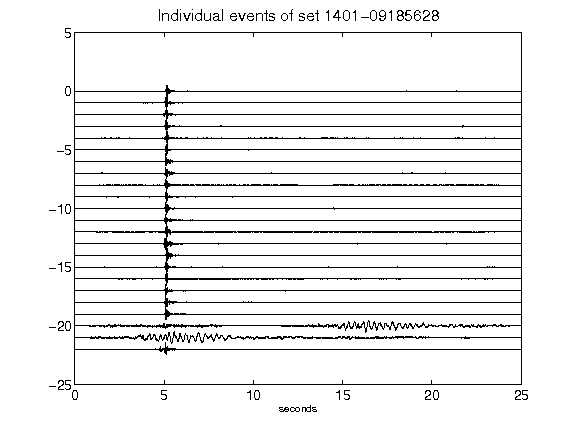](figures/1401-09185628_AllEv.png)[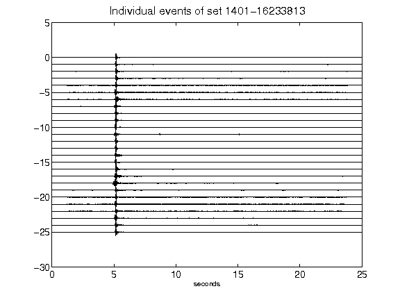](figures/1401-16233813_AllEv.png)[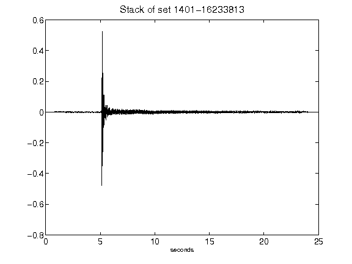](figures/1401-16233813_Stack.png)[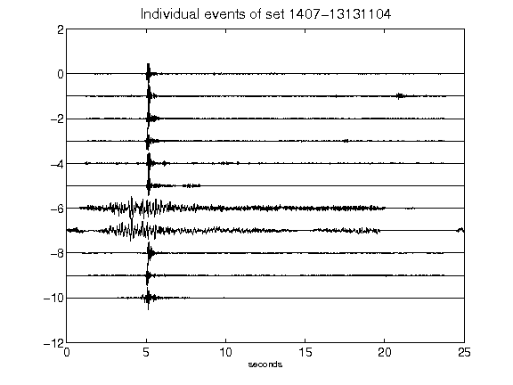](figures/1407-13131104_AllEv.png)[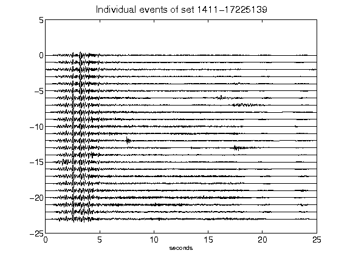](figures/1411-17225139_AllEv.png)[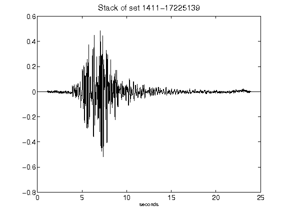](figures/1411-17225139_Stack.png)[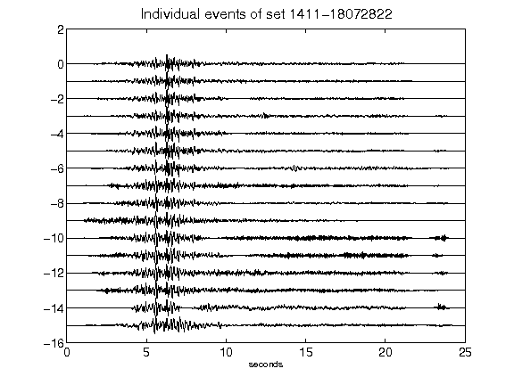](figures/1411-18072822_AllEv.png)[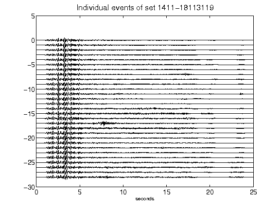](figures/1411-18113119_AllEv.png)[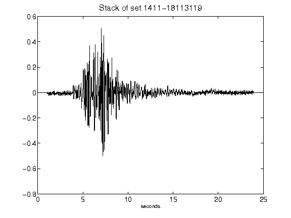](figures/1411-18113119_Stack.png)[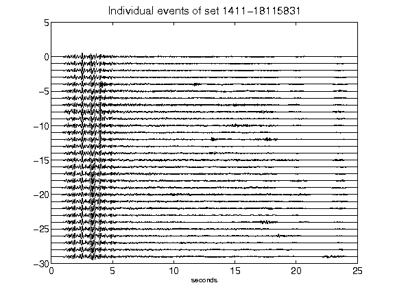](figures/1411-18115831_AllEv.png)[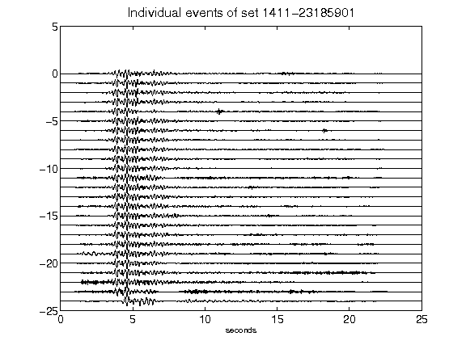](figures/1411-23185901_AllEv.png)[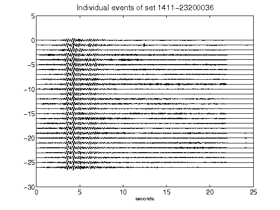](figures/1411-23200036_AllEv.png)[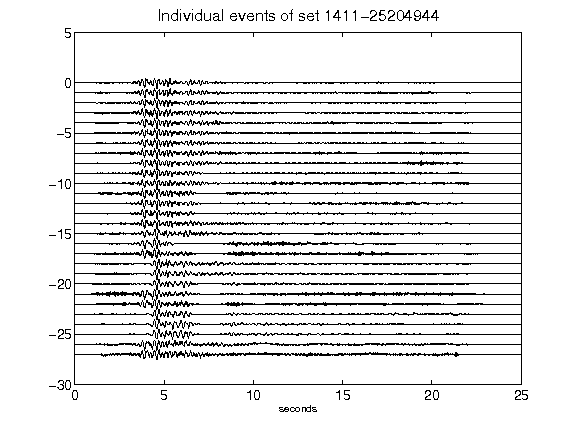](figures/1411-25204944_AllEv.png)[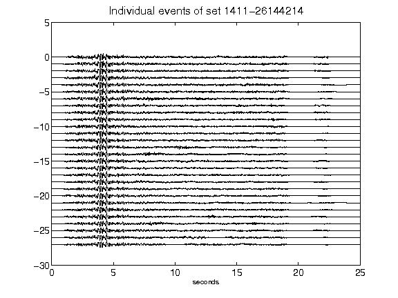](figures/1411-26144214_AllEv.png)[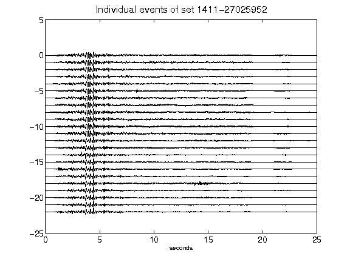](figures/1411-27025952_AllEv.png)[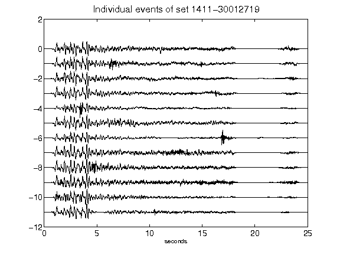](figures/1411-30012719_AllEv.png)[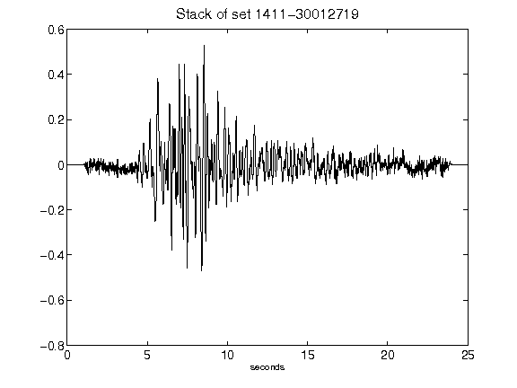](figures/1411-30012719_Stack.png)[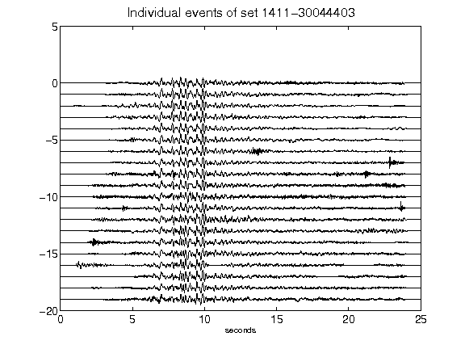](figures/1411-30044403_AllEv.png)[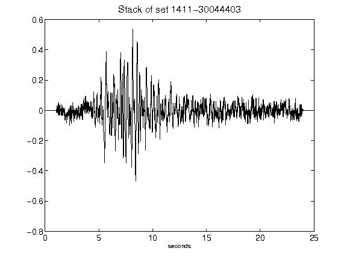](figures/1411-30044403_Stack.png)[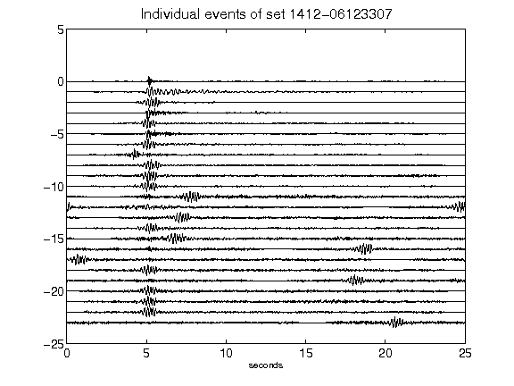](figures/1412-06123307_AllEv.png)[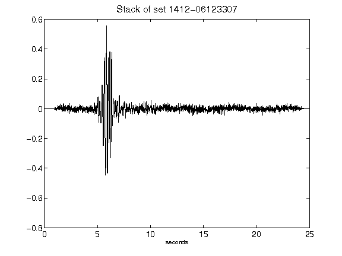](figures/1412-06123307_Stack.png)[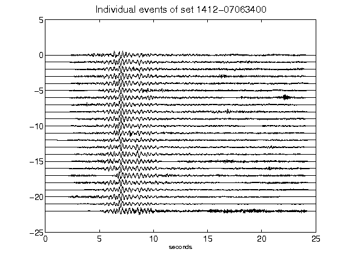](figures/1412-07063400_AllEv.png)[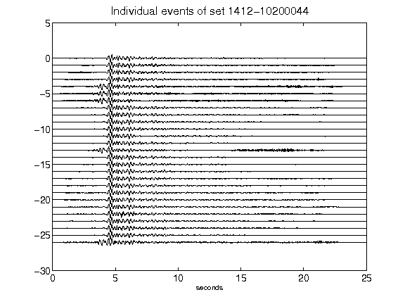](figures/1412-10200044_AllEv.png)[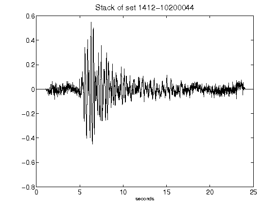](figures/1412-10200044_Stack.png)[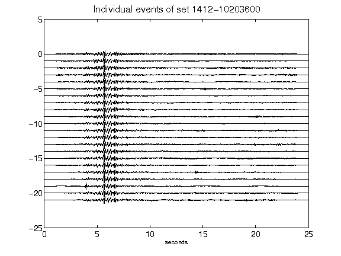](figures/1412-10203600_AllEv.png)[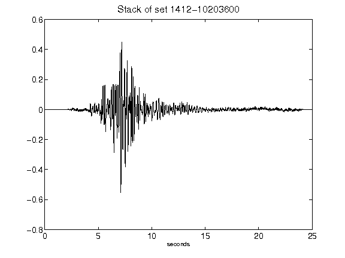](figures/1412-10203600_Stack.png)[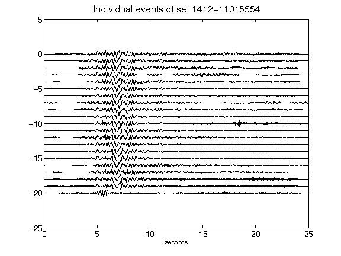](figures/1412-11015554_AllEv.png)[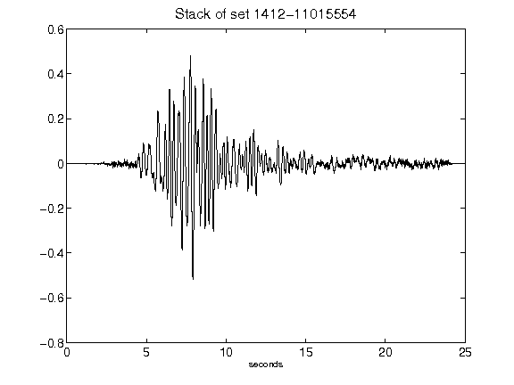](figures/1412-11015554_Stack.png)[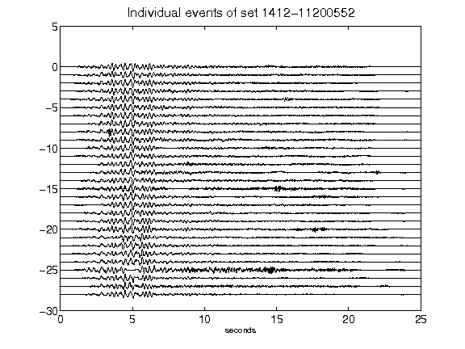](figures/1412-11200552_AllEv.png)[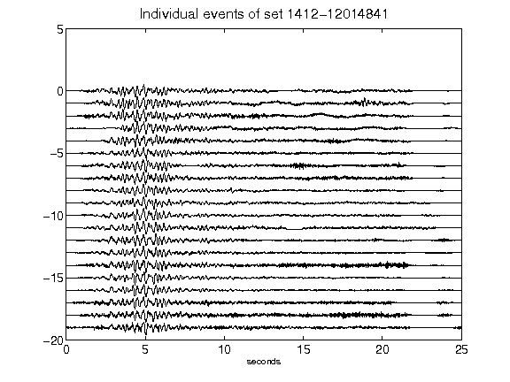](figures/1412-12014841_AllEv.png)[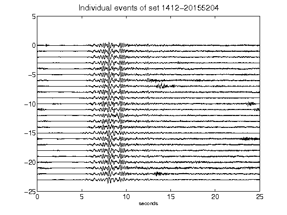](figures/1412-20155204_AllEv.png)