# Repeating Earthquake Activity at RCS

## Waveforms
[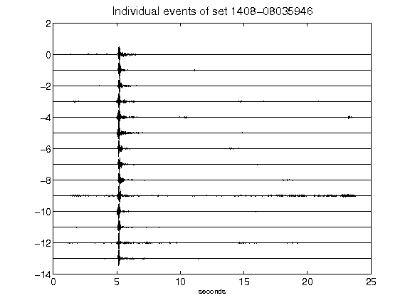](figures/1408-08035946_AllEv.png)[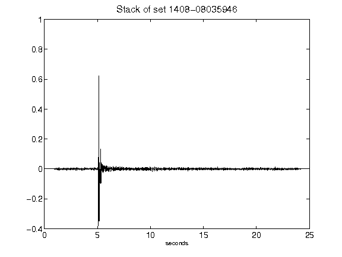](figures/1408-08035946_Stack.png)[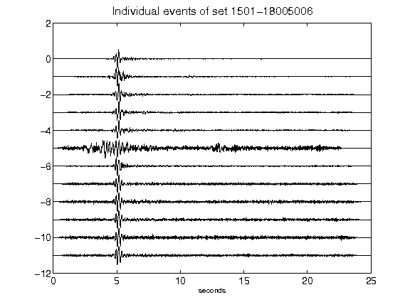](figures/1501-18005006_AllEv.png)[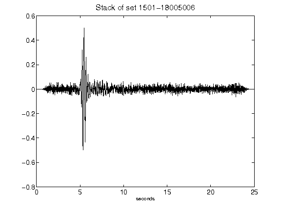](figures/1501-18005006_Stack.png)[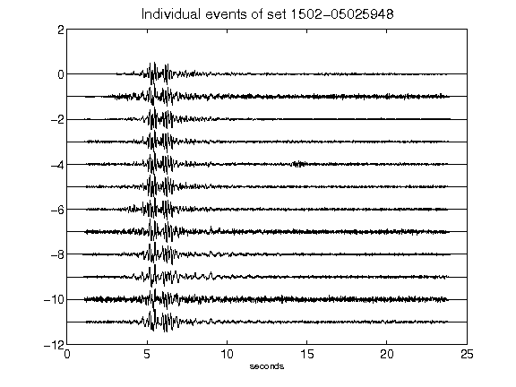](figures/1502-05025948_AllEv.png)[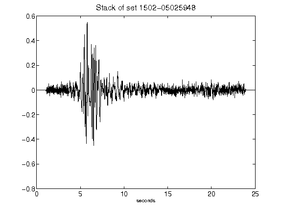](figures/1502-05025948_Stack.png)[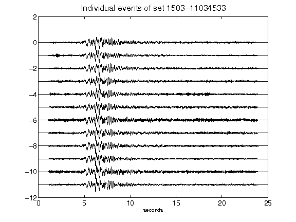](figures/1503-11034533_AllEv.png)[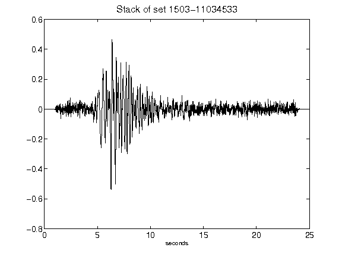](figures/1503-11034533_Stack.png)[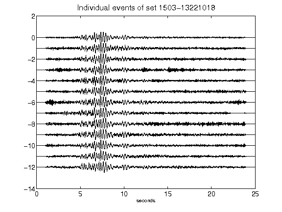](figures/1503-13221018_AllEv.png)[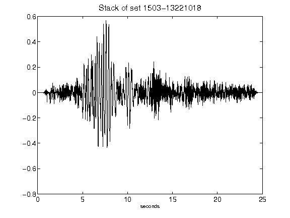](figures/1503-13221018_Stack.png)[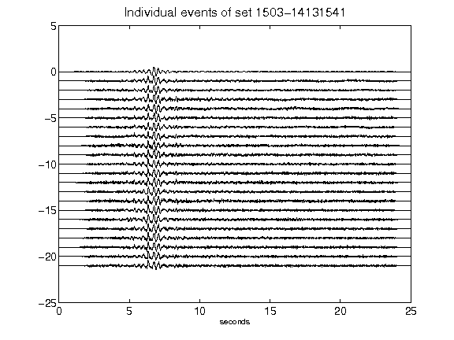](figures/1503-14131541_AllEv.png)[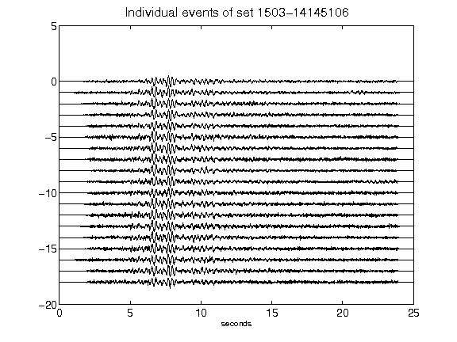](figures/1503-14145106_AllEv.png)[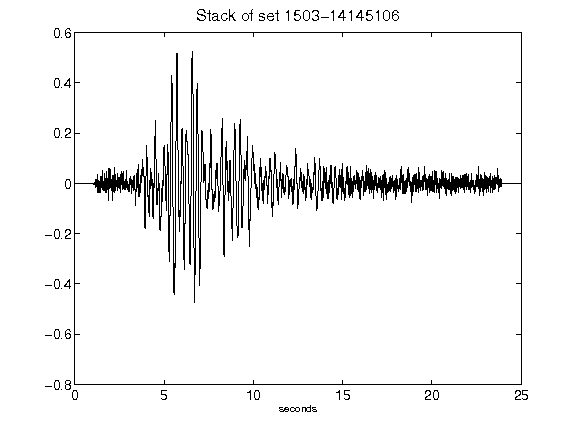](figures/1503-14145106_Stack.png)[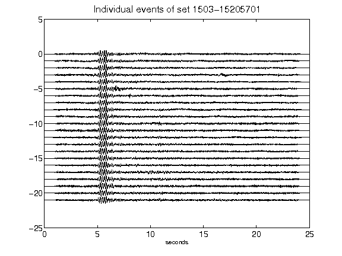](figures/1503-15205701_AllEv.png)[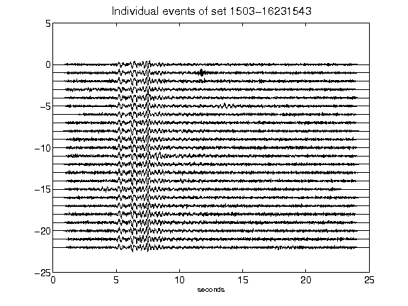](figures/1503-16231543_AllEv.png)[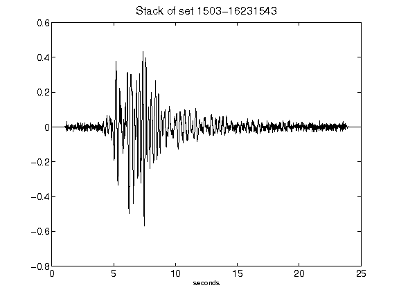](figures/1503-16231543_Stack.png)[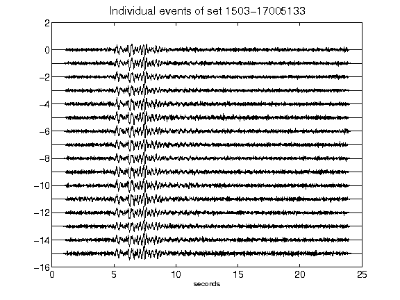](figures/1503-17005133_AllEv.png)[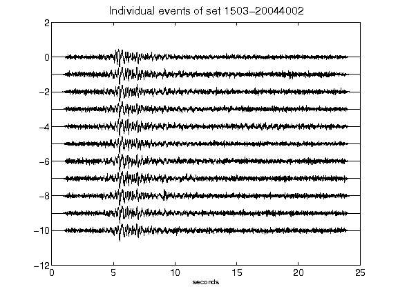](figures/1503-20044002_AllEv.png)[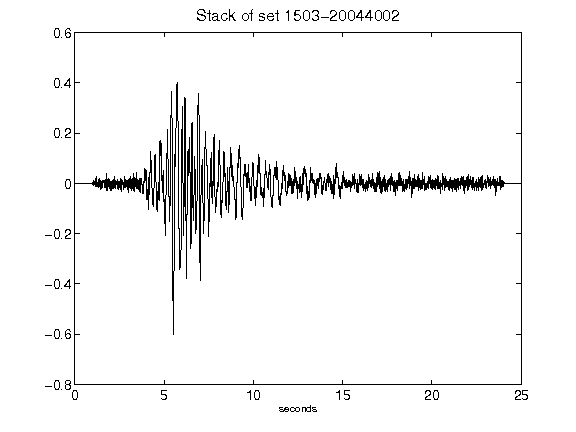](figures/1503-20044002_Stack.png)[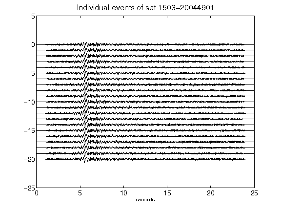](figures/1503-20044901_AllEv.png)[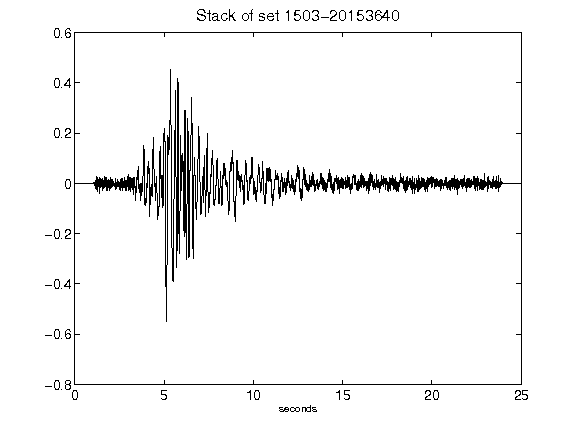](figures/1503-20153640_Stack.png)