# Repeating Earthquake Activity at RCS

## Waveforms
[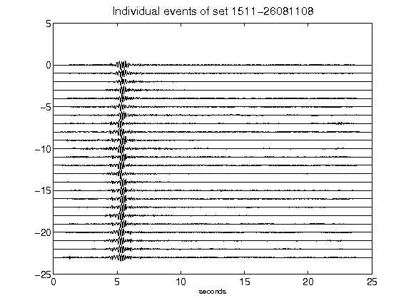](figures/1511-26081108_AllEv.png)[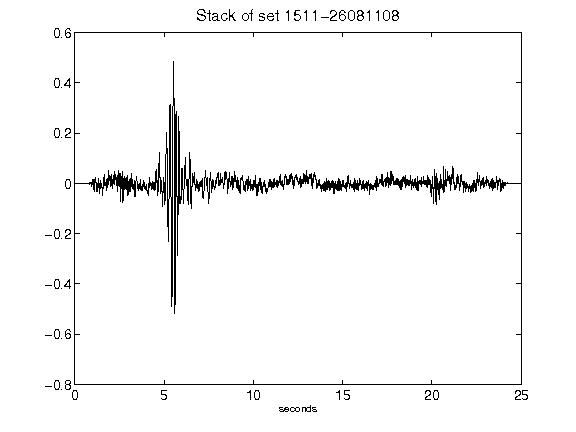](figures/1511-26081108_Stack.png)[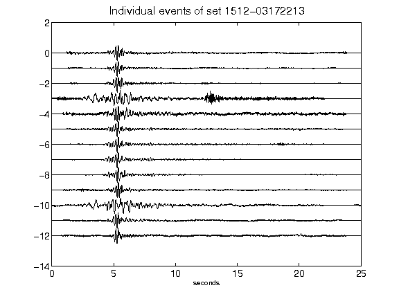](figures/1512-03172213_AllEv.png)[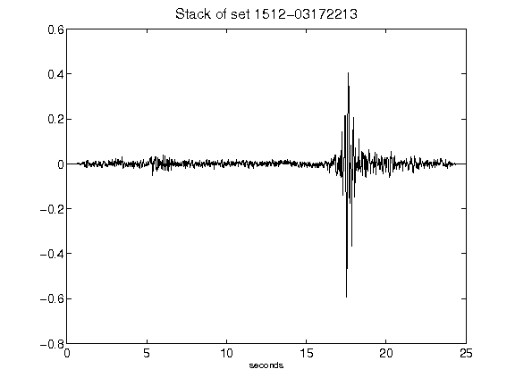](figures/1512-03172213_Stack.png)[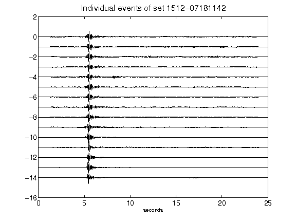](figures/1512-07181142_AllEv.png)[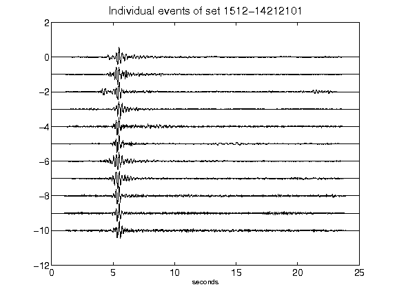](figures/1512-14212101_AllEv.png)[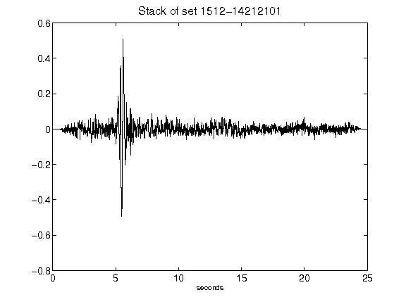](figures/1512-14212101_Stack.png)[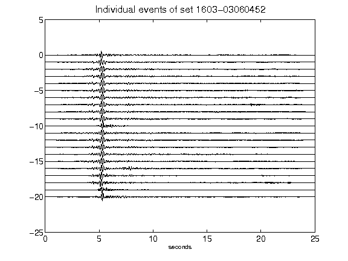](figures/1603-03060452_AllEv.png)[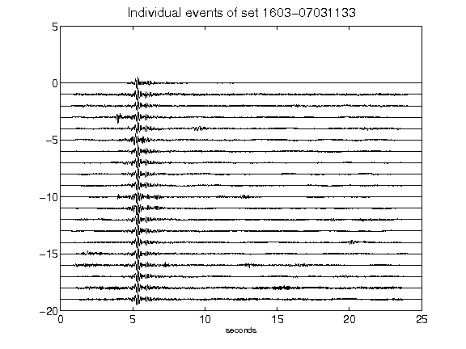](figures/1603-07031133_AllEv.png)[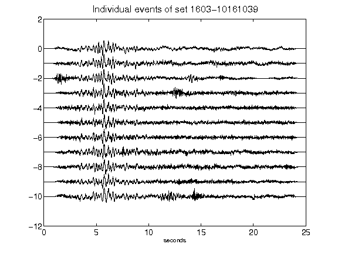](figures/1603-10161039_AllEv.png)[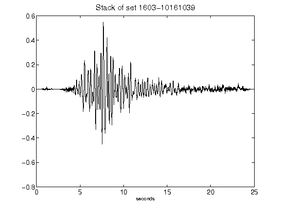](figures/1603-10161039_Stack.png)[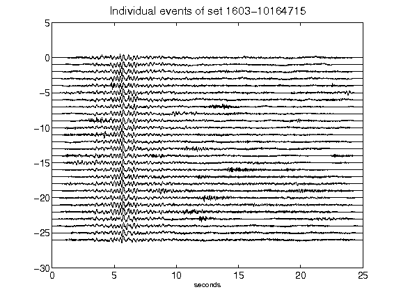](figures/1603-10164715_AllEv.png)[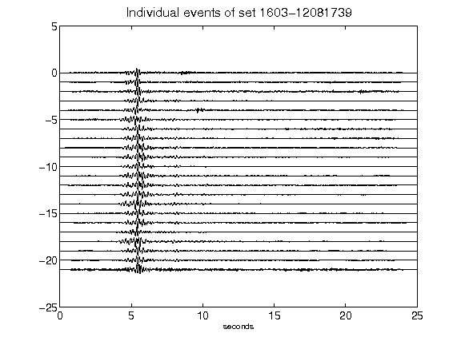](figures/1603-12081739_AllEv.png)[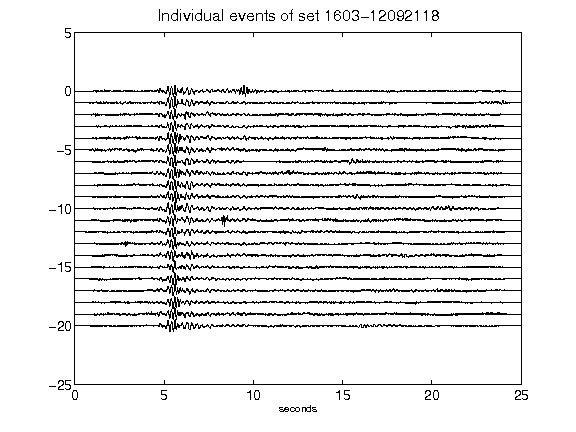](figures/1603-12092118_AllEv.png)[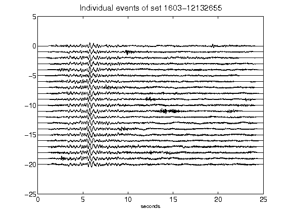](figures/1603-12132655_AllEv.png)