# Repeating Earthquake Activity at RCS

## Waveforms
[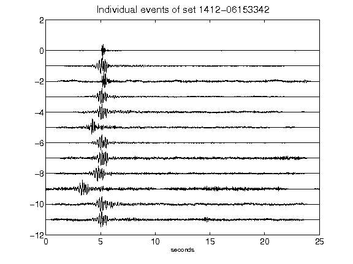](figures/1412-06153342_AllEv.png)[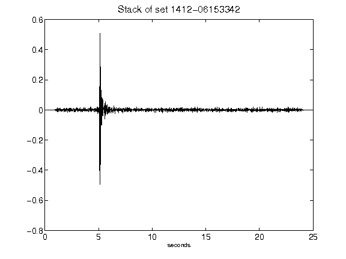](figures/1412-06153342_Stack.png)[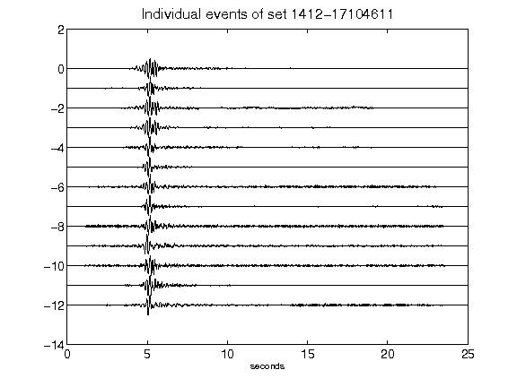](figures/1412-17104611_AllEv.png)[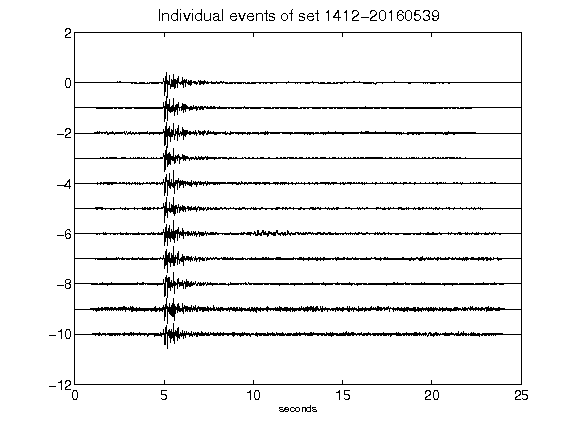](figures/1412-20160539_AllEv.png)[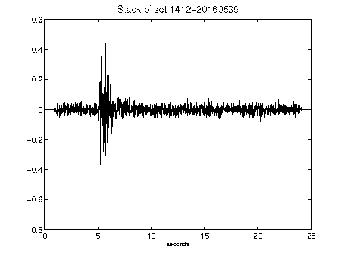](figures/1412-20160539_Stack.png)[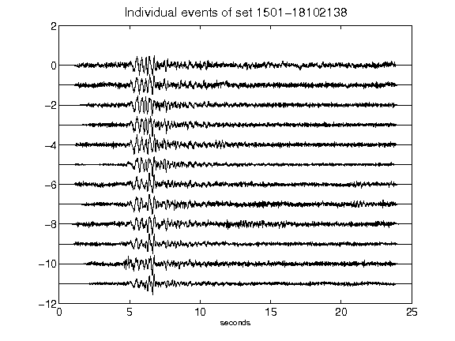](figures/1501-18102138_AllEv.png)[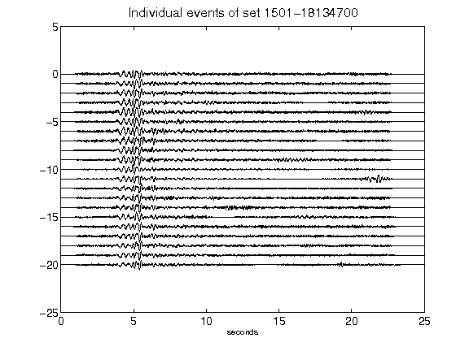](figures/1501-18134700_AllEv.png)[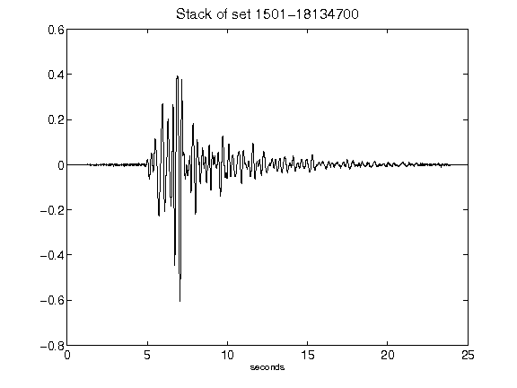](figures/1501-18134700_Stack.png)[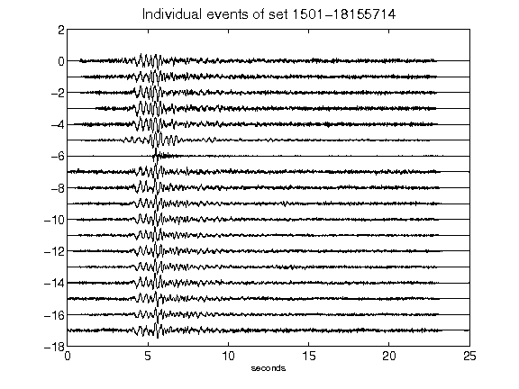](figures/1501-18155714_AllEv.png)[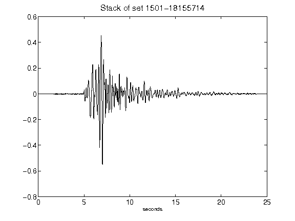](figures/1501-18155714_Stack.png)[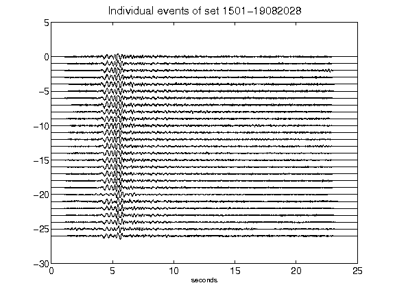](figures/1501-19082028_AllEv.png)[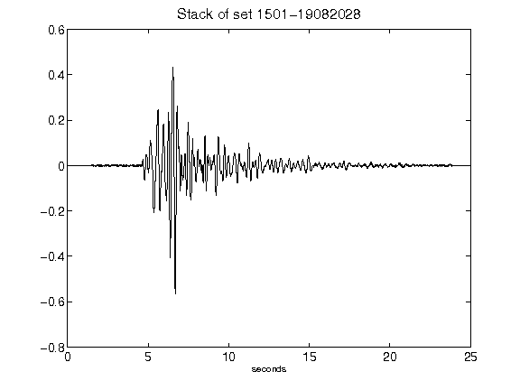](figures/1501-19082028_Stack.png)[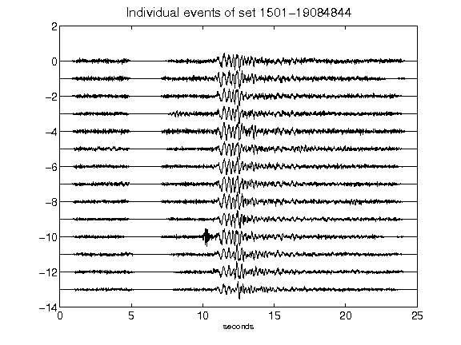](figures/1501-19084844_AllEv.png)[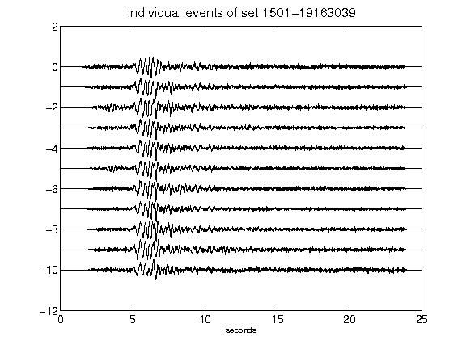](figures/1501-19163039_AllEv.png)[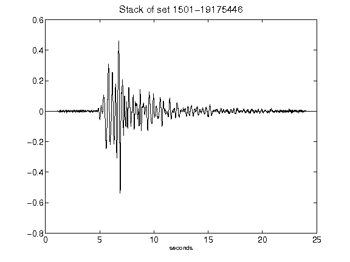](figures/1501-19175446_Stack.png)[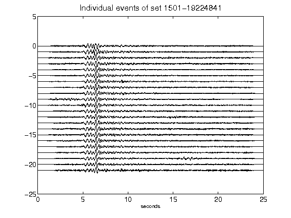](figures/1501-19224841_AllEv.png)[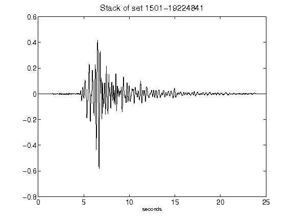](figures/1501-19224841_Stack.png)[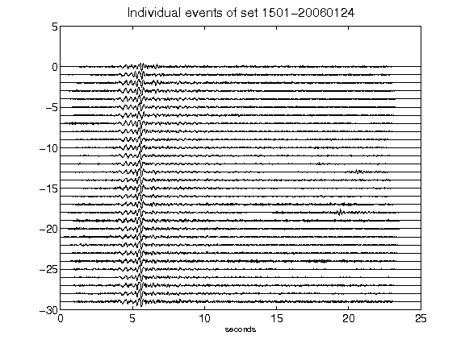](figures/1501-20060124_AllEv.png)[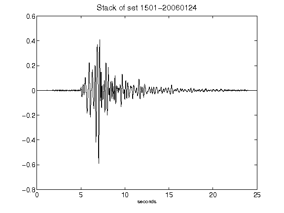](figures/1501-20060124_Stack.png)[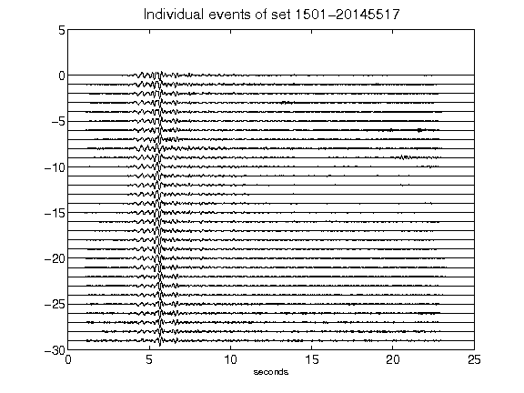](figures/1501-20145517_AllEv.png)[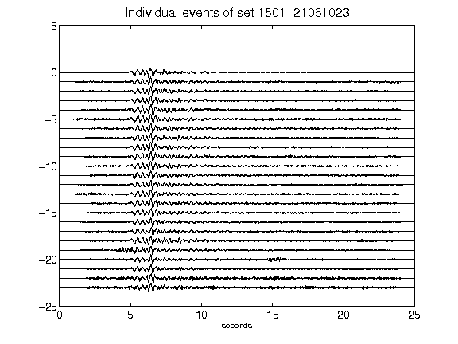](figures/1501-21061023_AllEv.png)[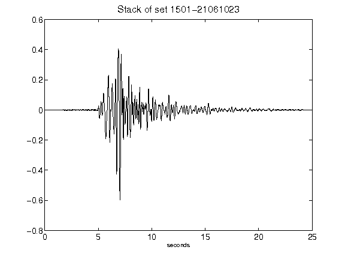](figures/1501-21061023_Stack.png)[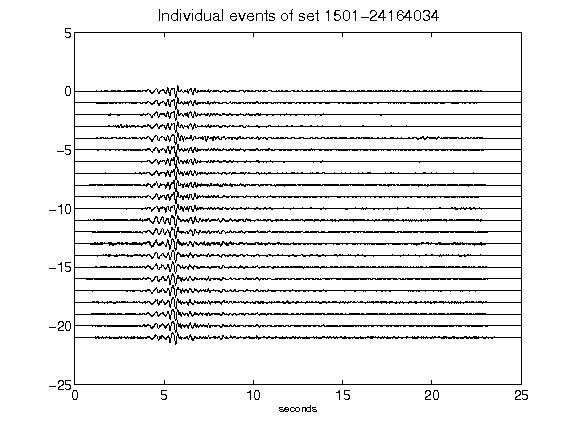](figures/1501-24164034_AllEv.png)[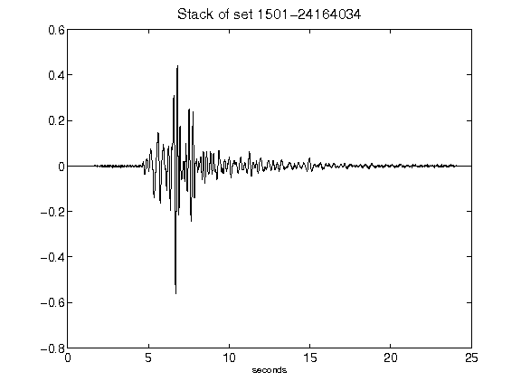](figures/1501-24164034_Stack.png)[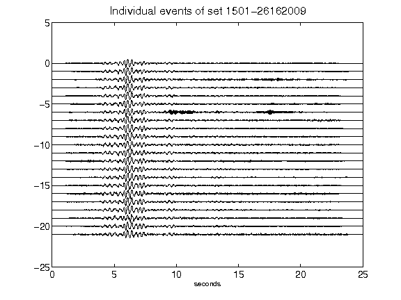](figures/1501-26162009_AllEv.png)[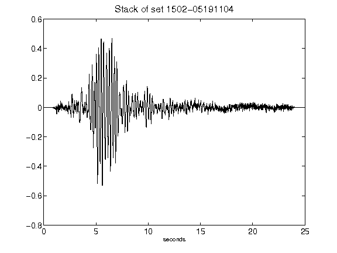](figures/1502-05191104_Stack.png)[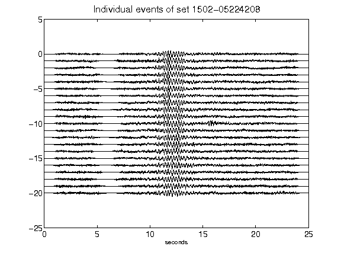](figures/1502-05224208_AllEv.png)[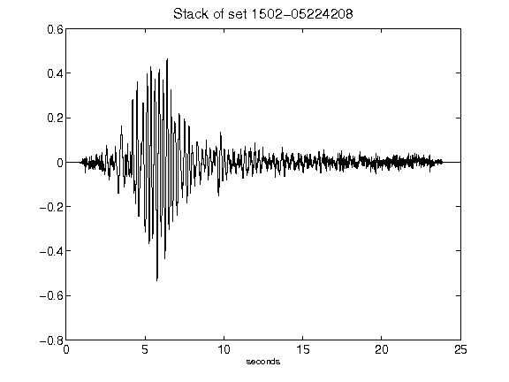](figures/1502-05224208_Stack.png)[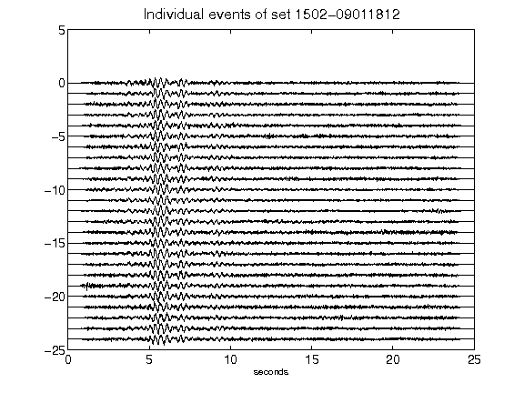](figures/1502-09011812_AllEv.png)[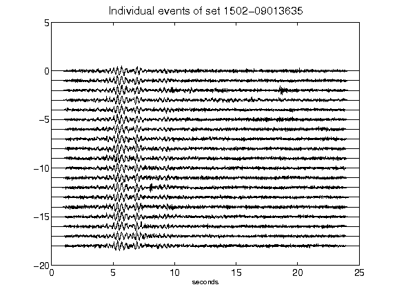](figures/1502-09013635_AllEv.png)[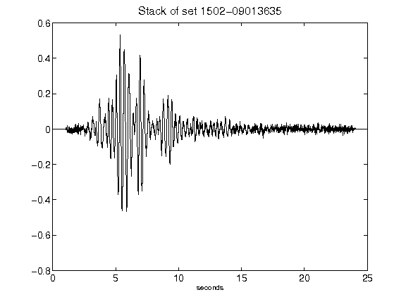](figures/1502-09013635_Stack.png)[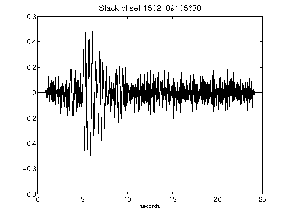](figures/1502-09105630_Stack.png)[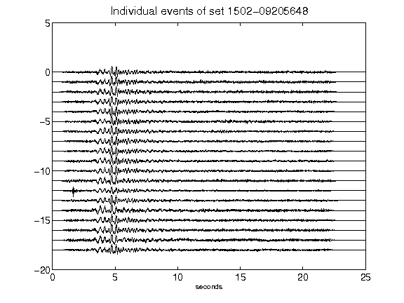](figures/1502-09205648_AllEv.png)