# Repeating Earthquake Activity at RCS

## Waveforms
[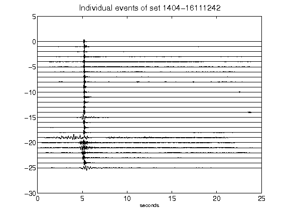](figures/1404-16111242_AllEv.png)[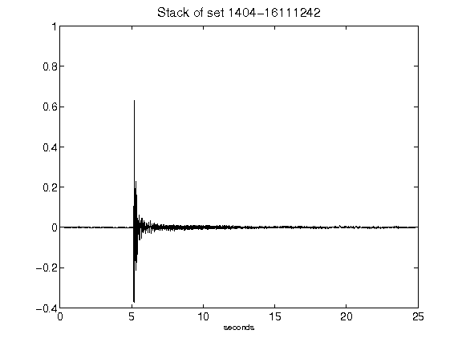](figures/1404-16111242_Stack.png)[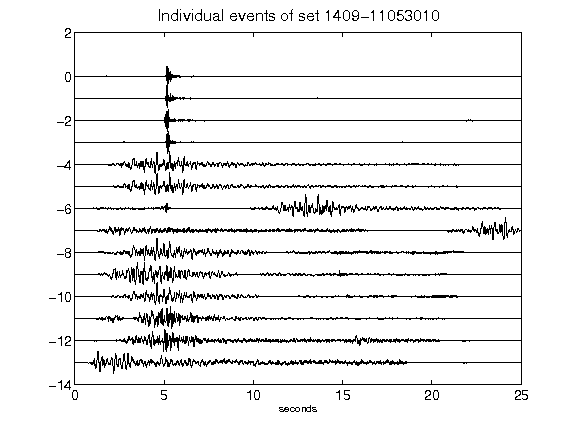](figures/1409-11053010_AllEv.png)[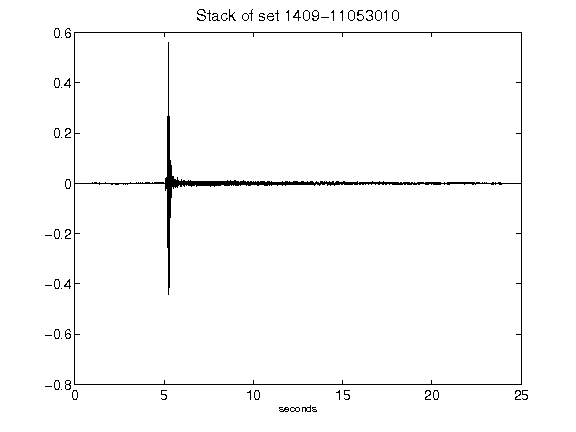](figures/1409-11053010_Stack.png)[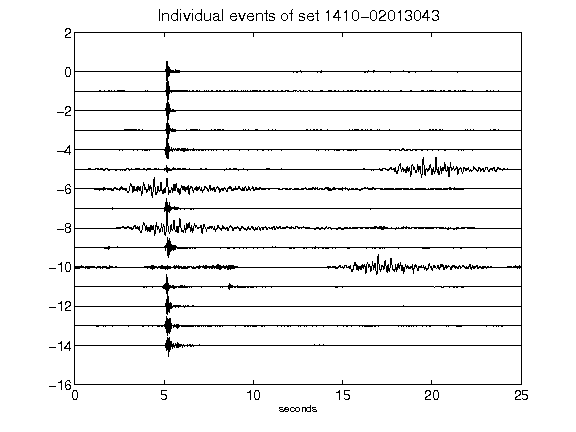](figures/1410-02013043_AllEv.png)[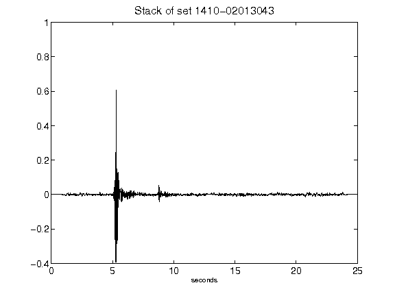](figures/1410-02013043_Stack.png)[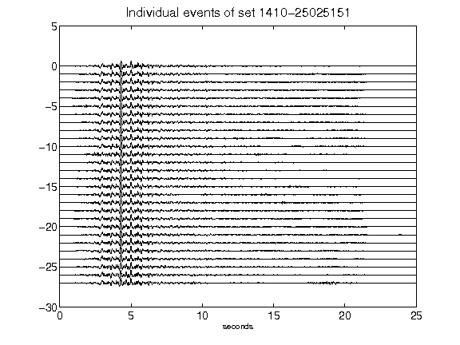](figures/1410-25025151_AllEv.png)[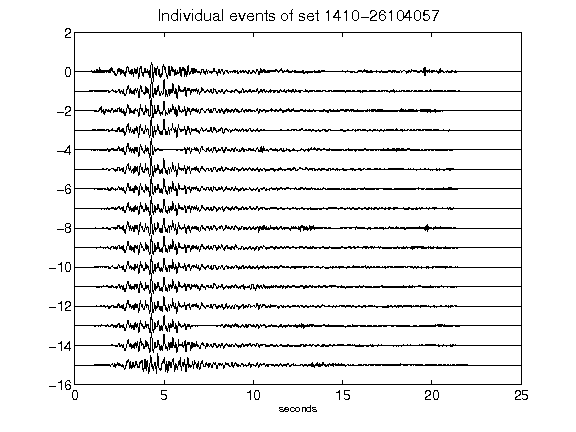](figures/1410-26104057_AllEv.png)[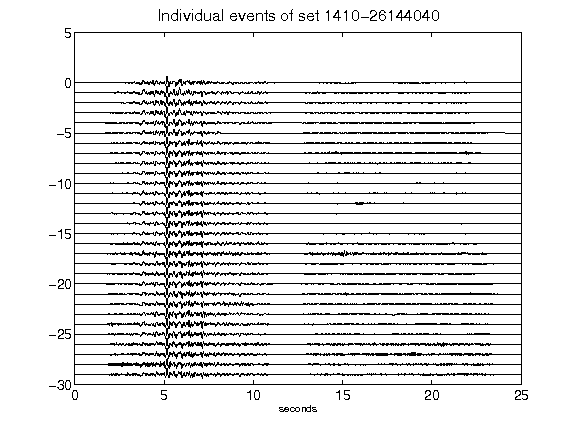](figures/1410-26144040_AllEv.png)[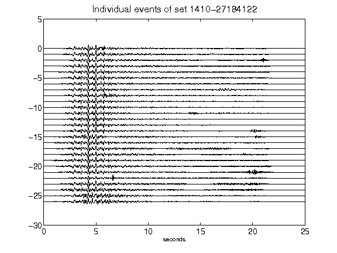](figures/1410-27184122_AllEv.png)[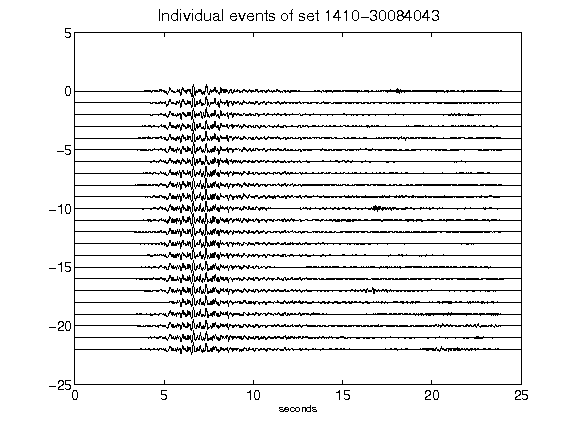](figures/1410-30084043_AllEv.png)[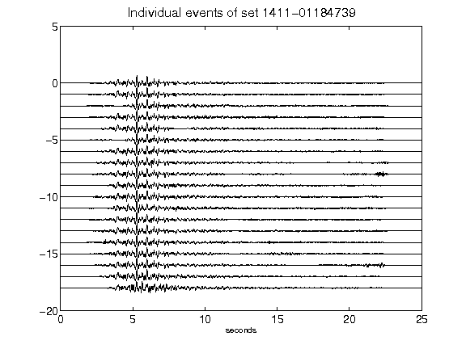](figures/1411-01184739_AllEv.png)[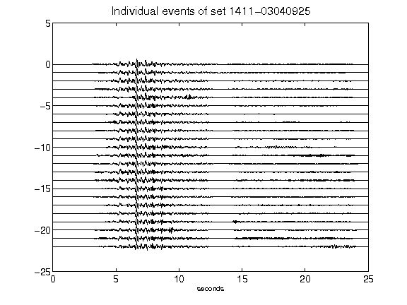](figures/1411-03040925_AllEv.png)[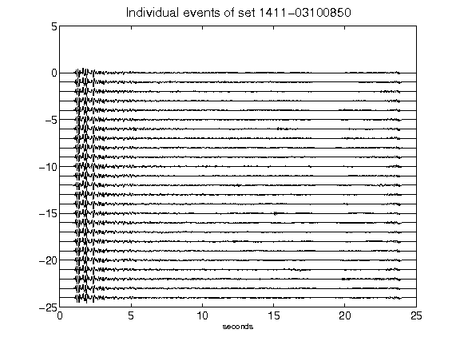](figures/1411-03100850_AllEv.png)[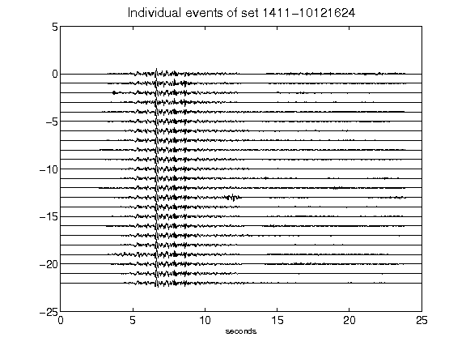](figures/1411-10121624_AllEv.png)[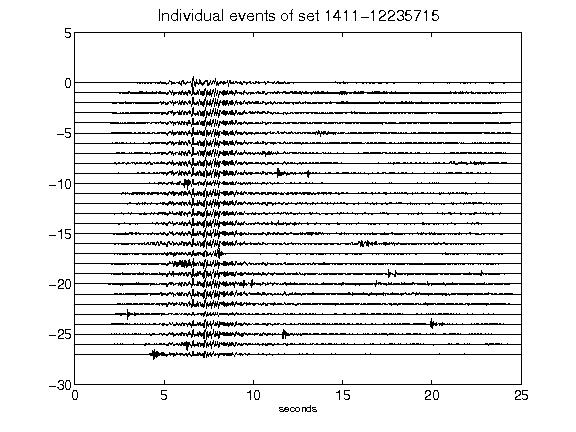](figures/1411-12235715_AllEv.png)[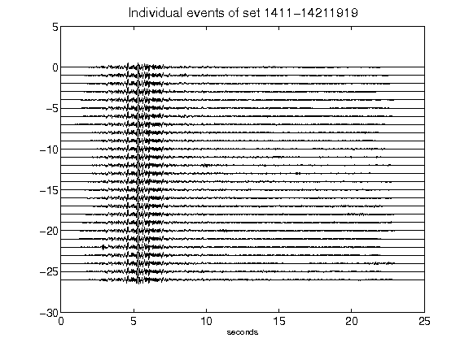](figures/1411-14211919_AllEv.png)[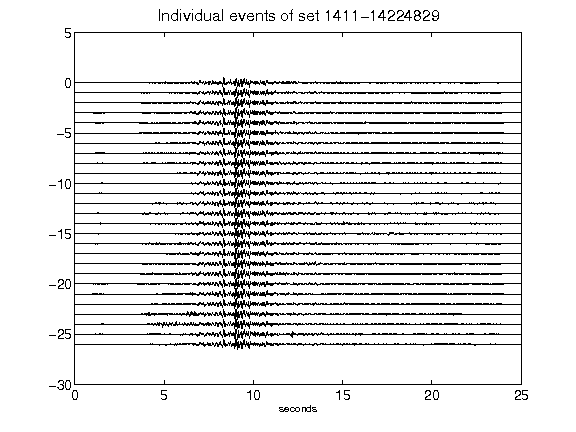](figures/1411-14224829_AllEv.png)[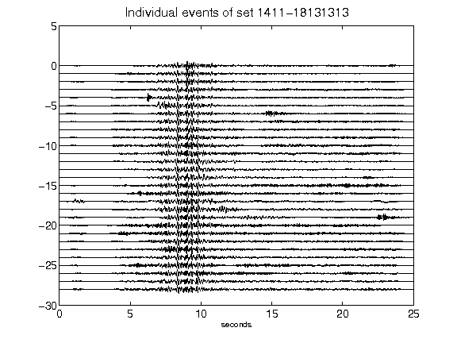](figures/1411-18131313_AllEv.png)[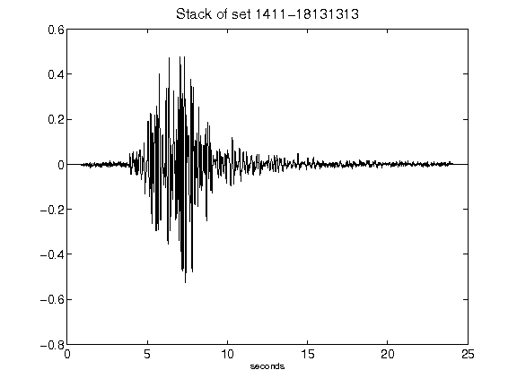](figures/1411-18131313_Stack.png)[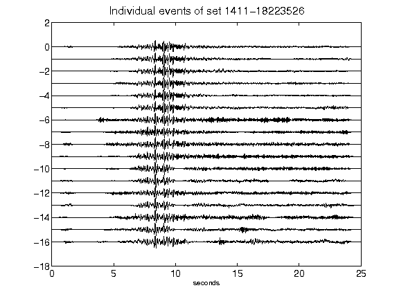](figures/1411-18223526_AllEv.png)[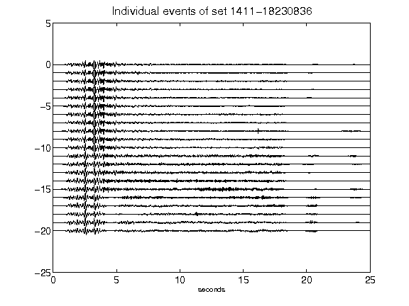](figures/1411-18230836_AllEv.png)[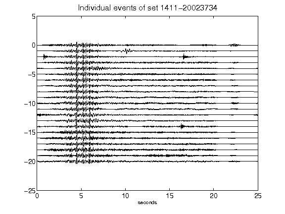](figures/1411-20023734_AllEv.png)[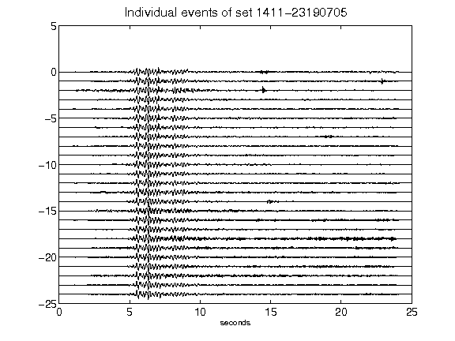](figures/1411-23190705_AllEv.png)[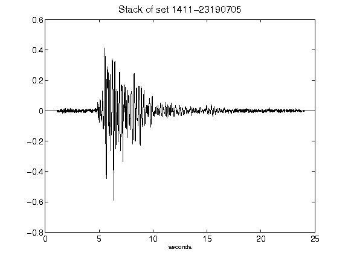](figures/1411-23190705_Stack.png)[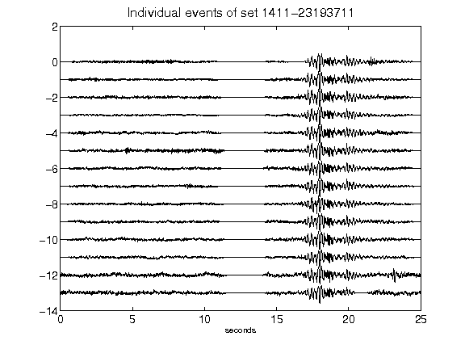](figures/1411-23193711_AllEv.png)[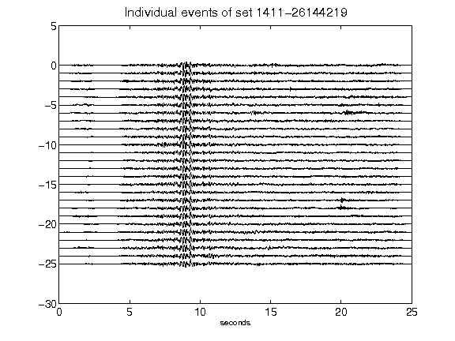](figures/1411-26144219_AllEv.png)[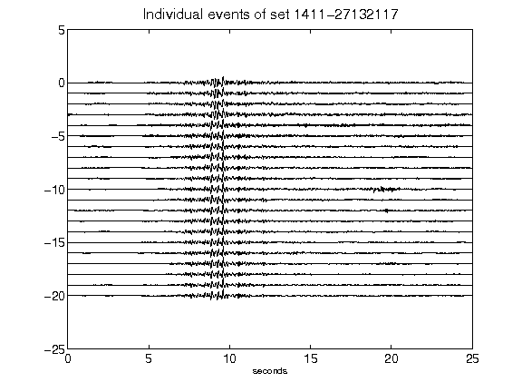](figures/1411-27132117_AllEv.png)[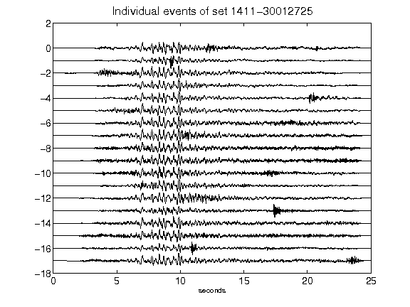](figures/1411-30012725_AllEv.png)[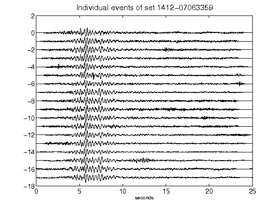](figures/1412-07063359_AllEv.png)