# Repeating Earthquake Activity at RCS

## Waveforms
[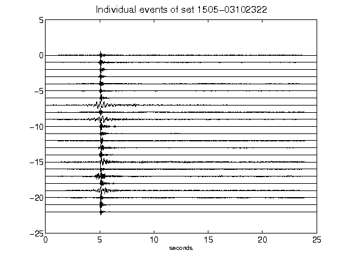](figures/1505-03102322_AllEv.png)[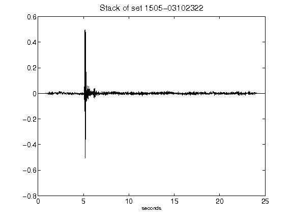](figures/1505-03102322_Stack.png)[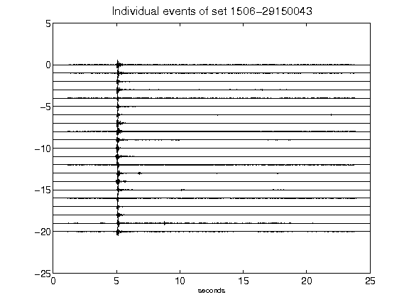](figures/1506-29150043_AllEv.png)[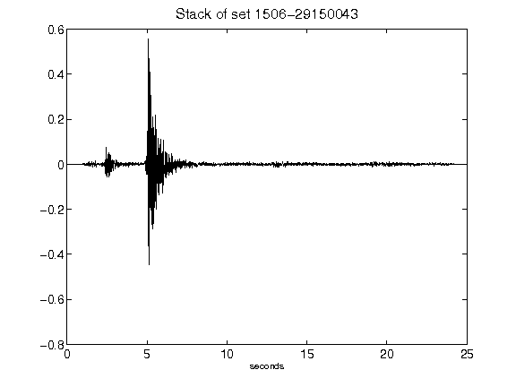](figures/1506-29150043_Stack.png)[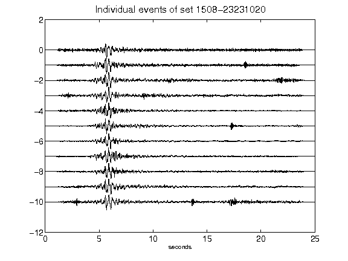](figures/1508-23231020_AllEv.png)[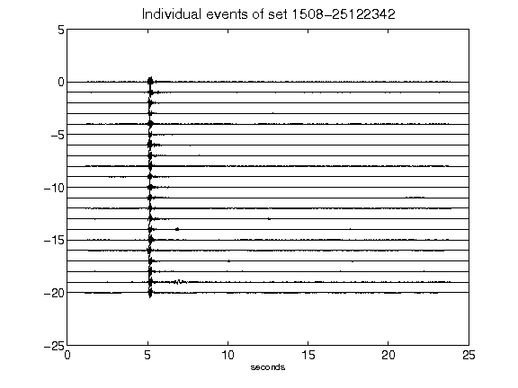](figures/1508-25122342_AllEv.png)[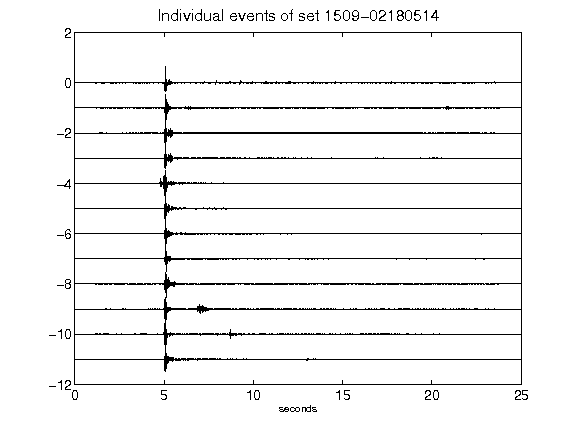](figures/1509-02180514_AllEv.png)[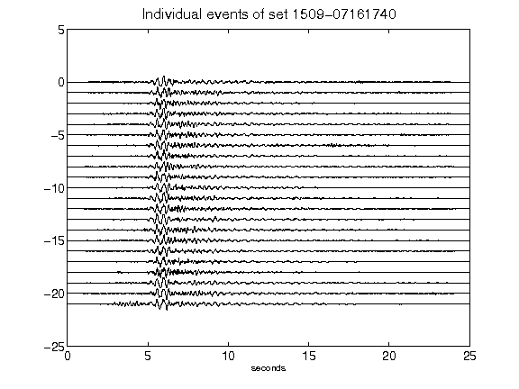](figures/1509-07161740_AllEv.png)[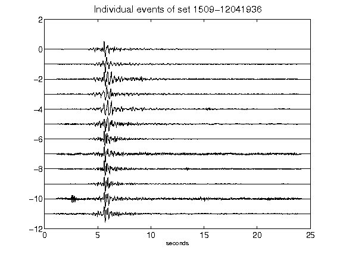](figures/1509-12041936_AllEv.png)[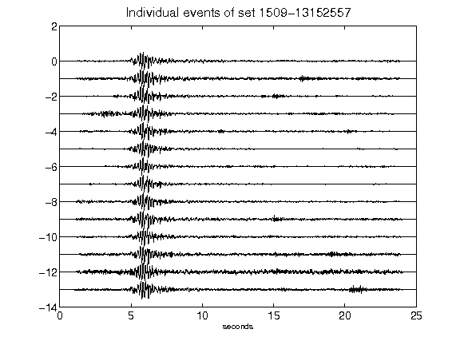](figures/1509-13152557_AllEv.png)[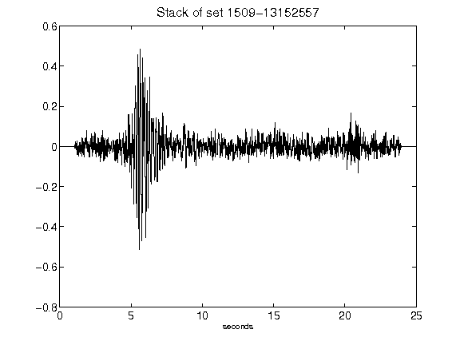](figures/1509-13152557_Stack.png)[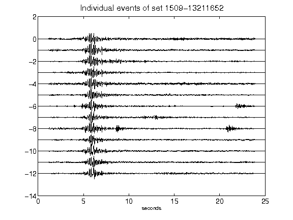](figures/1509-13211652_AllEv.png)[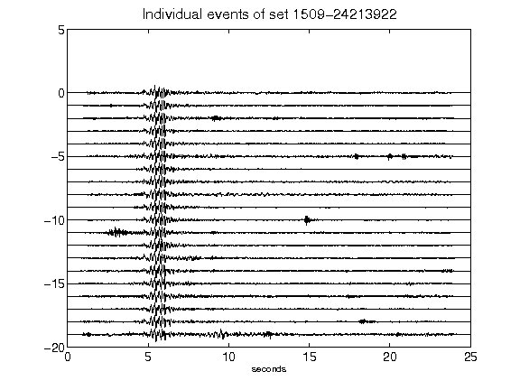](figures/1509-24213922_AllEv.png)