# Repeating Earthquake Activity at RCS

## Waveforms
[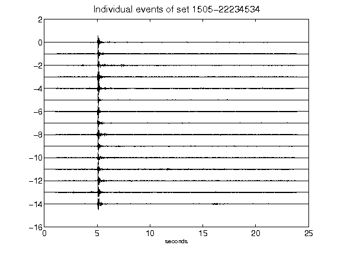](figures/1505-22234534_AllEv.png)[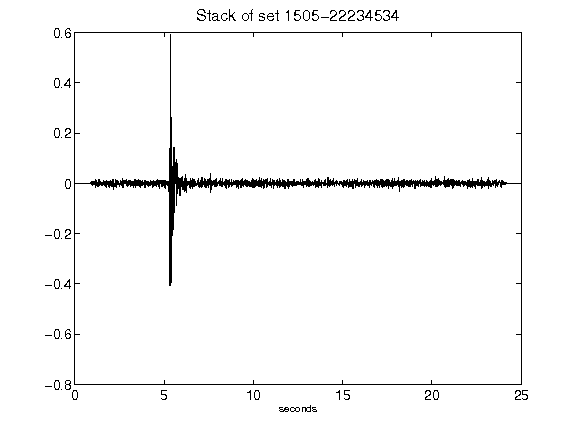](figures/1505-22234534_Stack.png)[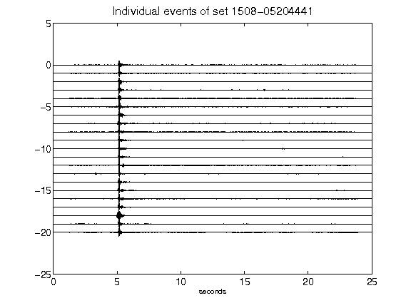](figures/1508-05204441_AllEv.png)[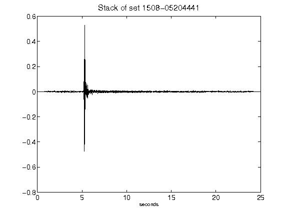](figures/1508-05204441_Stack.png)[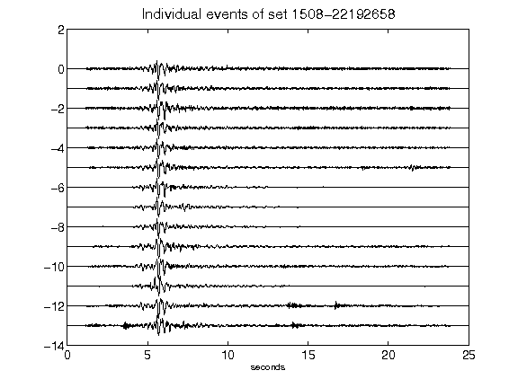](figures/1508-22192658_AllEv.png)[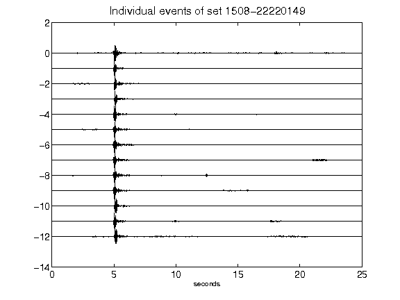](figures/1508-22220149_AllEv.png)[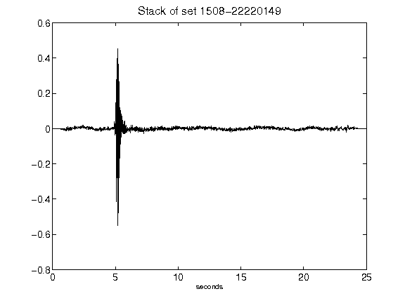](figures/1508-22220149_Stack.png)[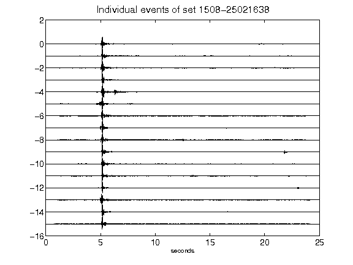](figures/1508-25021638_AllEv.png)[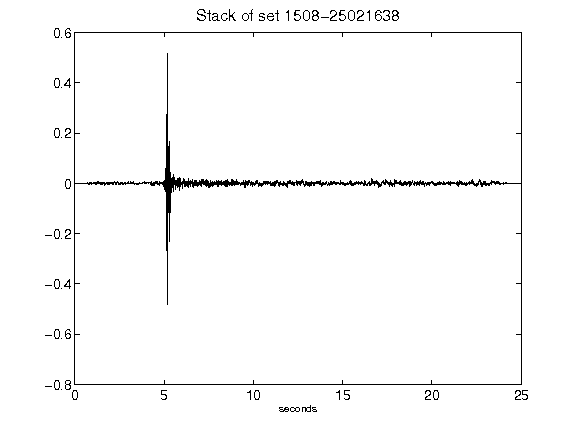](figures/1508-25021638_Stack.png)[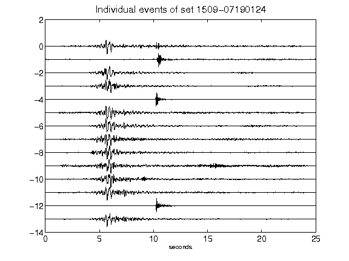](figures/1509-07190124_AllEv.png)[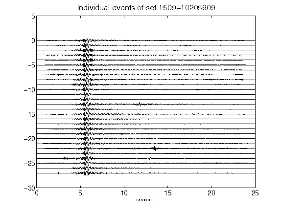](figures/1509-10205909_AllEv.png)[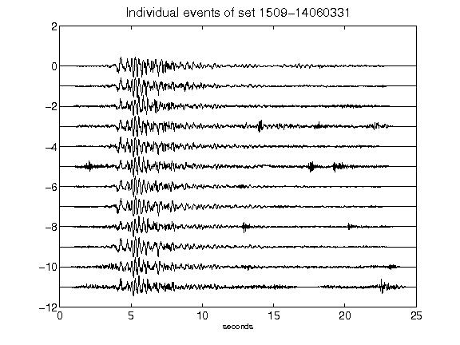](figures/1509-14060331_AllEv.png)[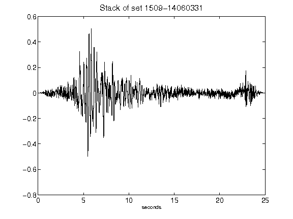](figures/1509-14060331_Stack.png)[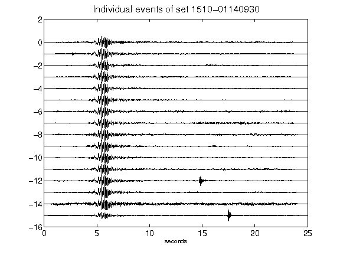](figures/1510-01140930_AllEv.png)[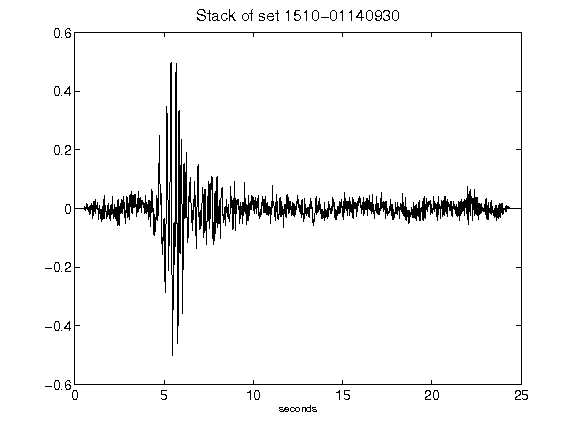](figures/1510-01140930_Stack.png)[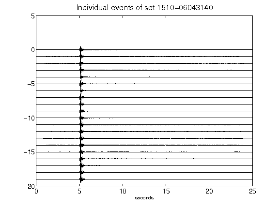](figures/1510-06043140_AllEv.png)