# Repeating Earthquake Activity at RCS

## Waveforms
[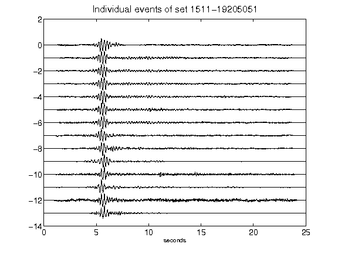](figures/1511-19205051_AllEv.png)[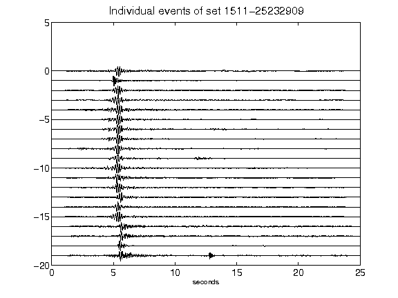](figures/1511-25232909_AllEv.png)[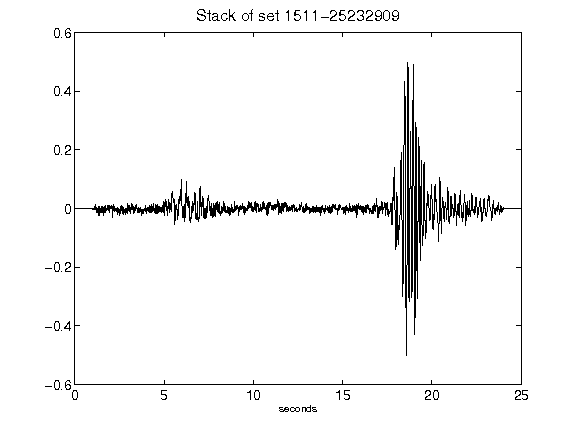](figures/1511-25232909_Stack.png)[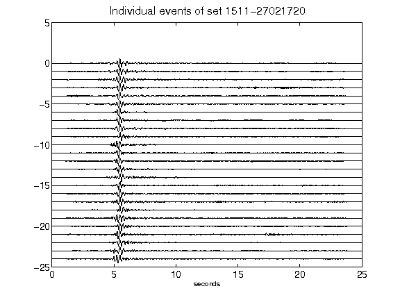](figures/1511-27021720_AllEv.png)[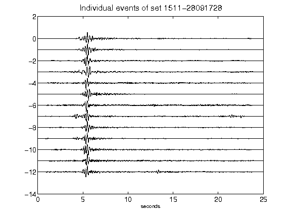](figures/1511-28091728_AllEv.png)[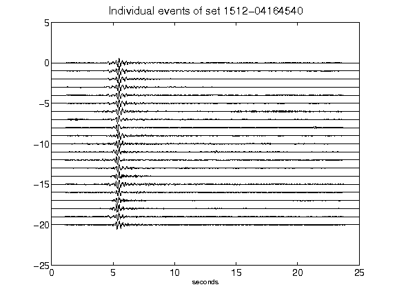](figures/1512-04164540_AllEv.png)[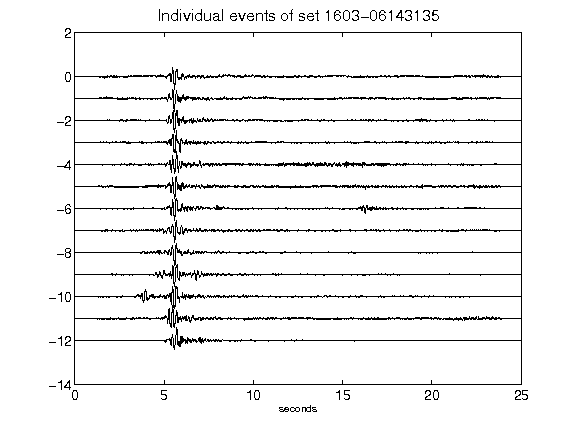](figures/1603-06143135_AllEv.png)[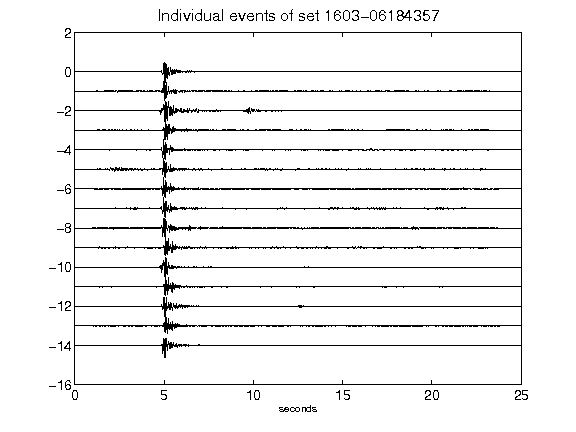](figures/1603-06184357_AllEv.png)[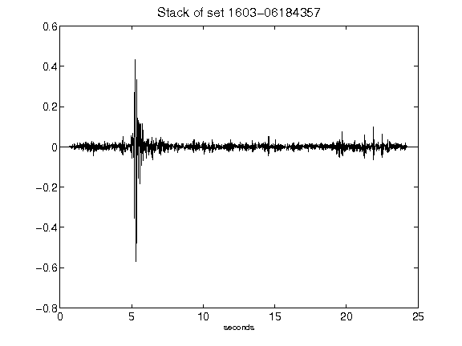](figures/1603-06184357_Stack.png)[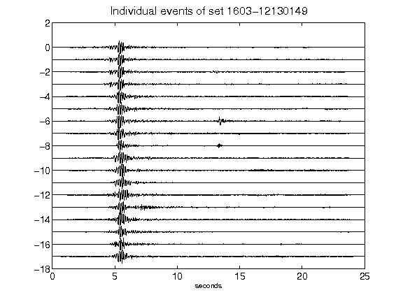](figures/1603-12130149_AllEv.png)[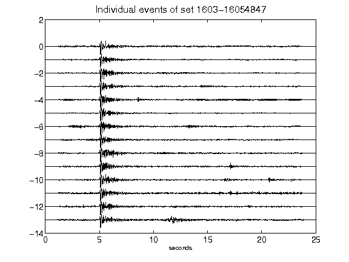](figures/1603-16054847_AllEv.png)[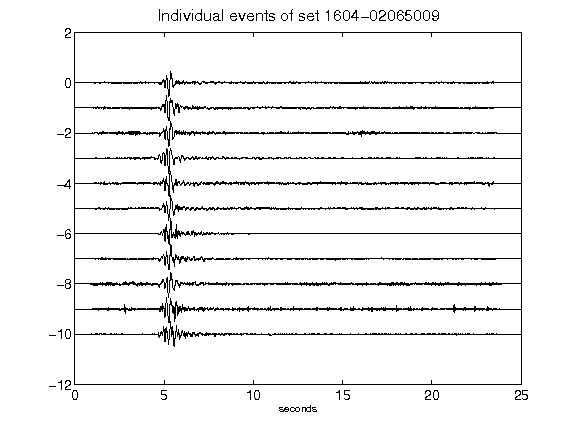](figures/1604-02065009_AllEv.png)[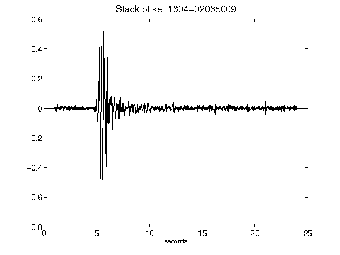](figures/1604-02065009_Stack.png)[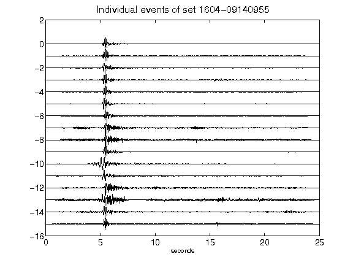](figures/1604-09140955_AllEv.png)[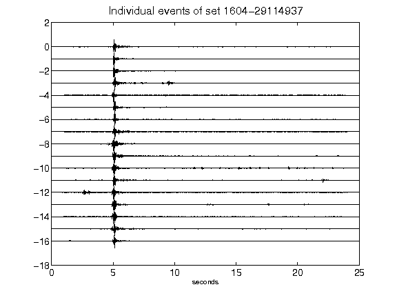](figures/1604-29114937_AllEv.png)[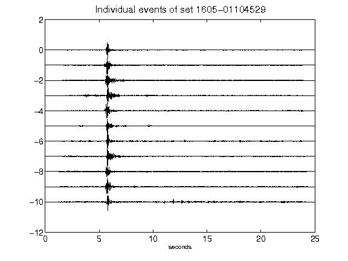](figures/1605-01104529_AllEv.png)[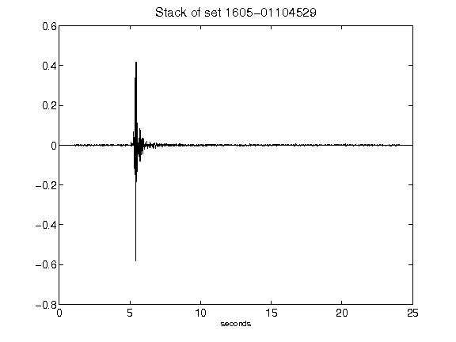](figures/1605-01104529_Stack.png)