# Repeating Earthquake Activity at RCS

## Waveforms
[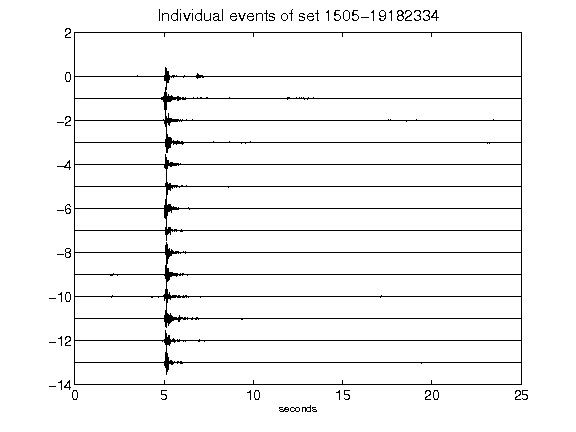](figures/1505-19182334_AllEv.png)[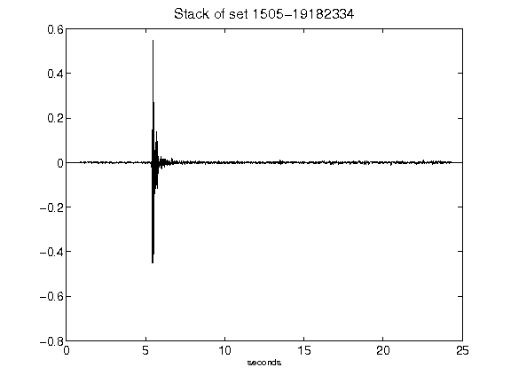](figures/1505-19182334_Stack.png)[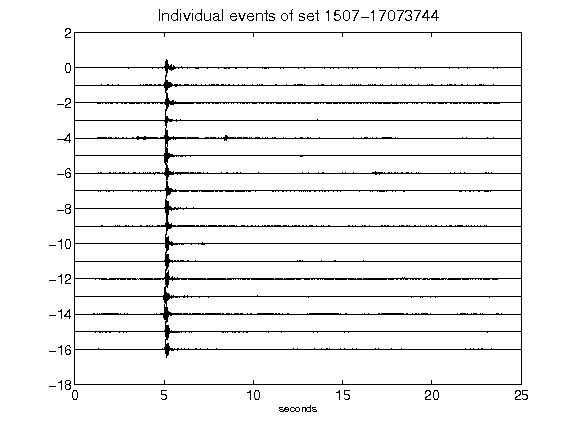](figures/1507-17073744_AllEv.png)[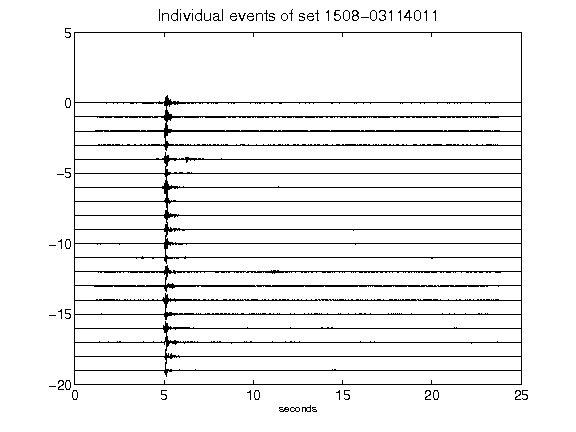](figures/1508-03114011_AllEv.png)[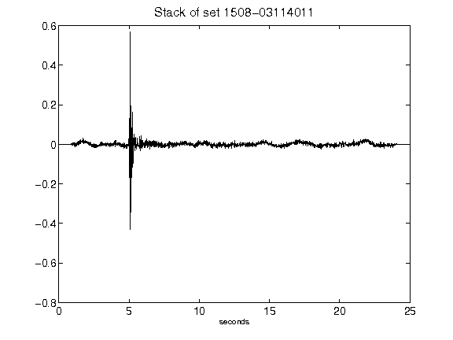](figures/1508-03114011_Stack.png)[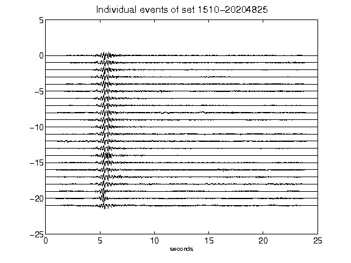](figures/1510-20204825_AllEv.png)[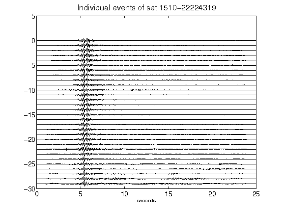](figures/1510-22224319_AllEv.png)[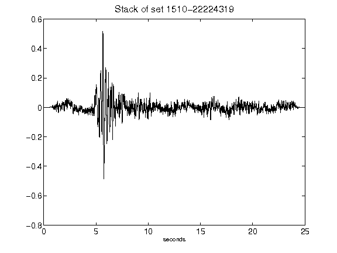](figures/1510-22224319_Stack.png)[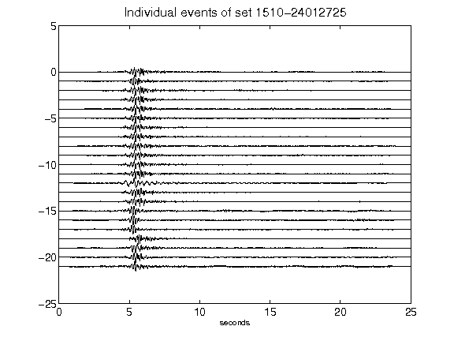](figures/1510-24012725_AllEv.png)[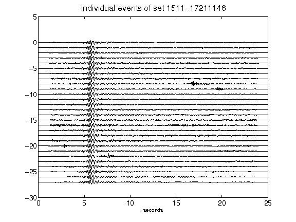](figures/1511-17211146_AllEv.png)[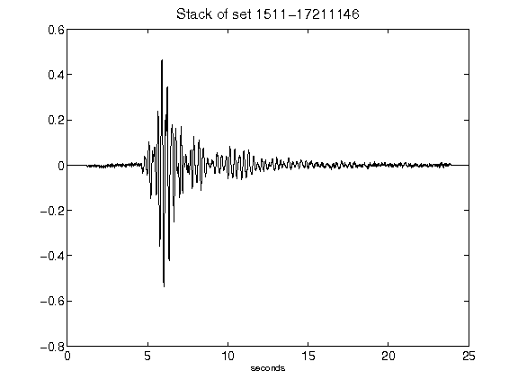](figures/1511-17211146_Stack.png)[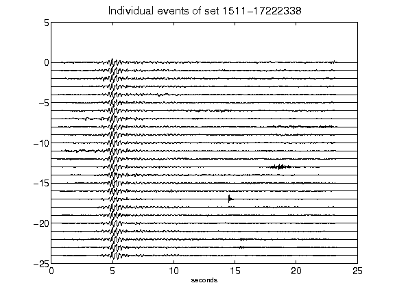](figures/1511-17222338_AllEv.png)[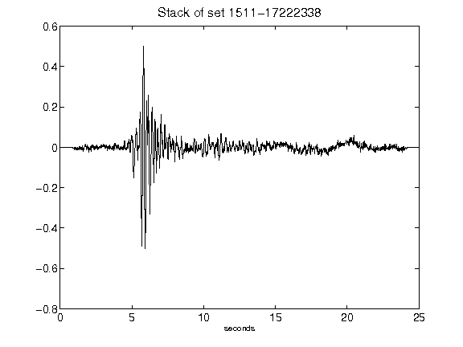](figures/1511-17222338_Stack.png)[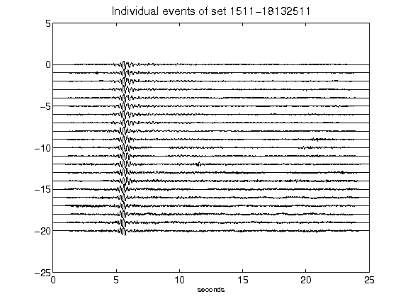](figures/1511-18132511_AllEv.png)[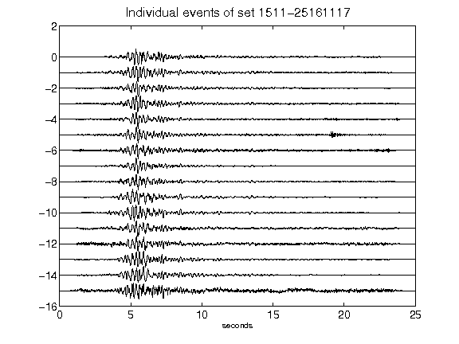](figures/1511-25161117_AllEv.png)[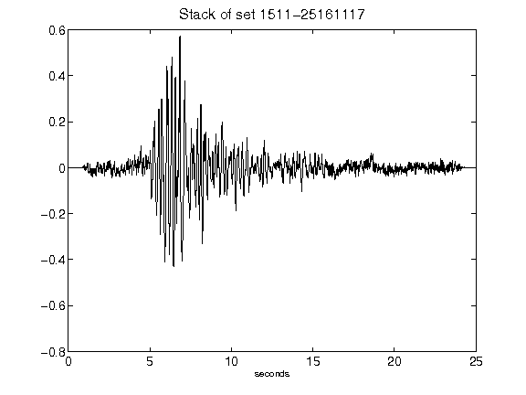](figures/1511-25161117_Stack.png)[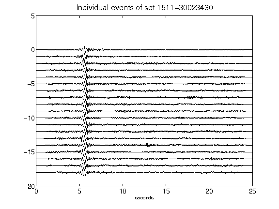](figures/1511-30023430_AllEv.png)[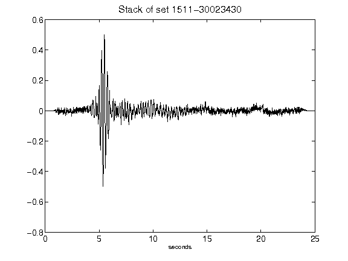](figures/1511-30023430_Stack.png)