# Repeating Earthquake Activity at RCS

## Waveforms
[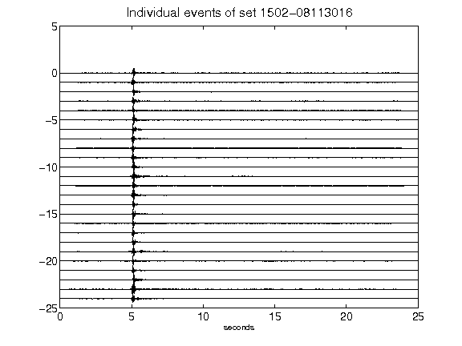](figures/1502-08113016_AllEv.png)[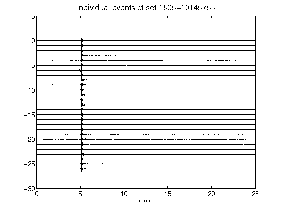](figures/1505-10145755_AllEv.png)[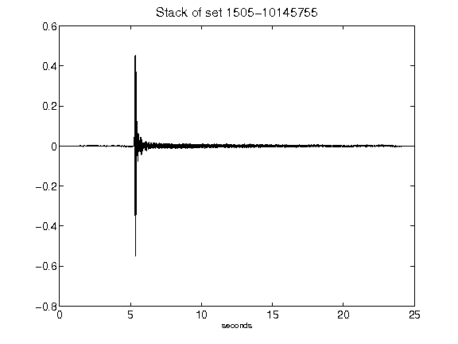](figures/1505-10145755_Stack.png)[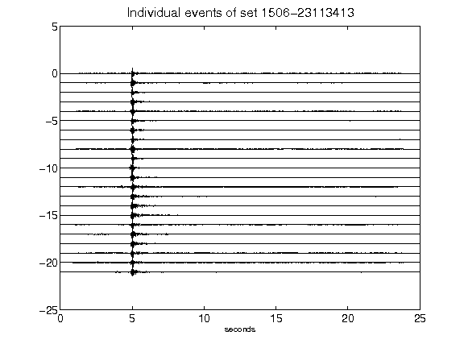](figures/1506-23113413_AllEv.png)[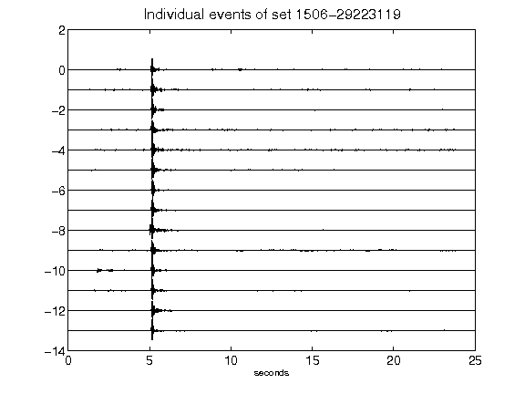](figures/1506-29223119_AllEv.png)[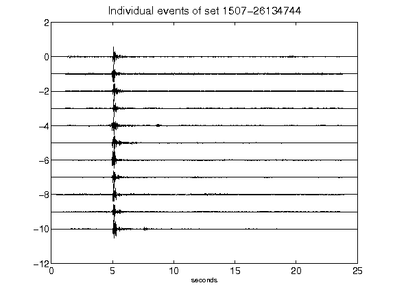](figures/1507-26134744_AllEv.png)[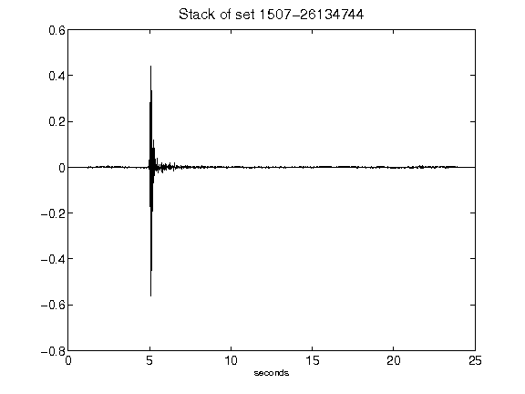](figures/1507-26134744_Stack.png)[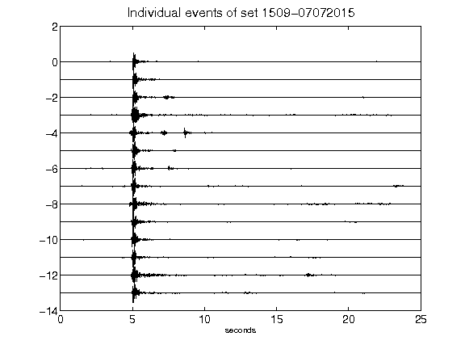](figures/1509-07072015_AllEv.png)[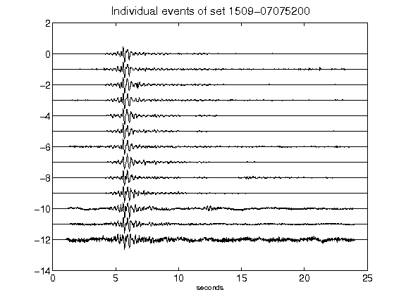](figures/1509-07075200_AllEv.png)[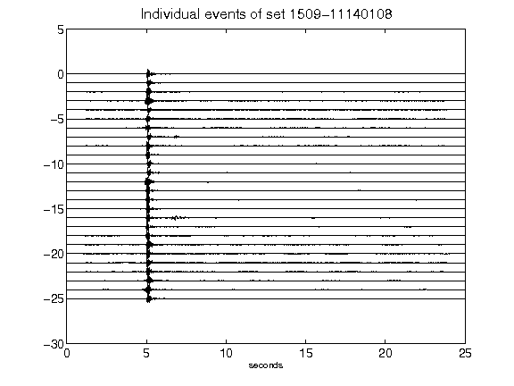](figures/1509-11140108_AllEv.png)[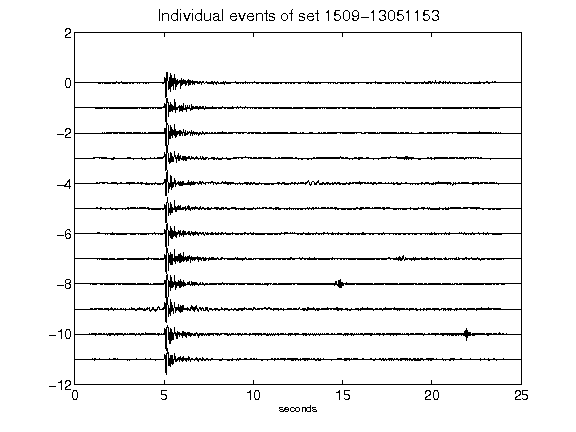](figures/1509-13051153_AllEv.png)[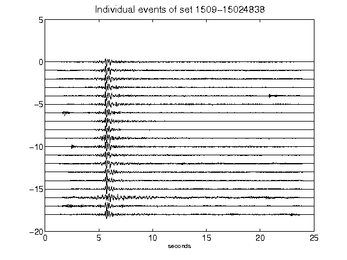](figures/1509-15024838_AllEv.png)[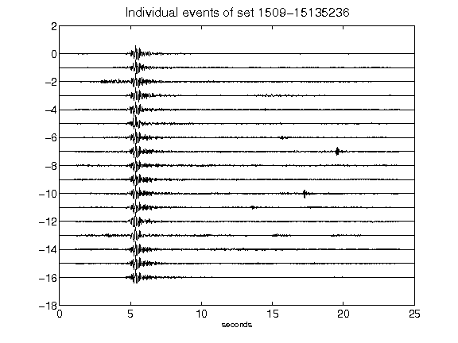](figures/1509-15135236_AllEv.png)[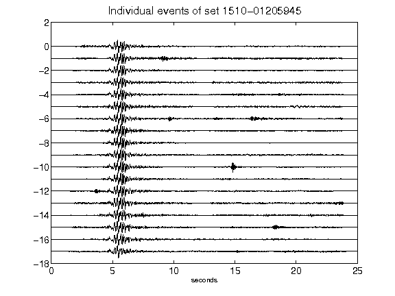](figures/1510-01205945_AllEv.png)[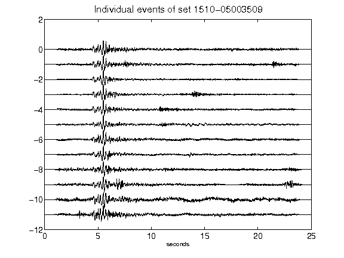](figures/1510-05003509_AllEv.png)[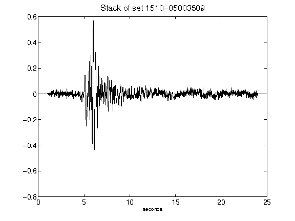](figures/1510-05003509_Stack.png)[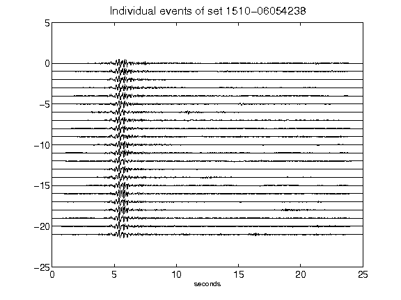](figures/1510-06054238_AllEv.png)[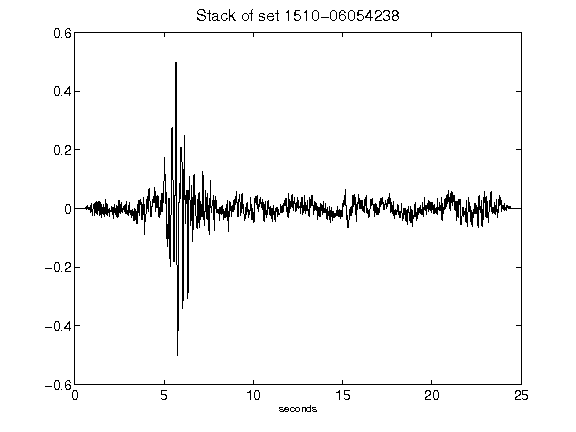](figures/1510-06054238_Stack.png)[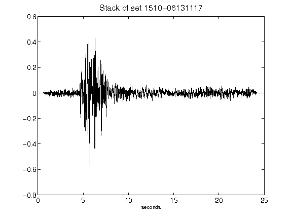](figures/1510-06131117_Stack.png)[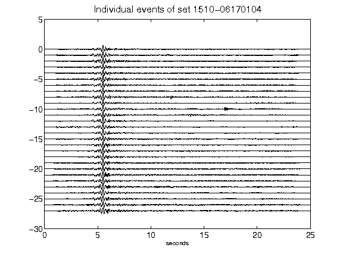](figures/1510-06170104_AllEv.png)[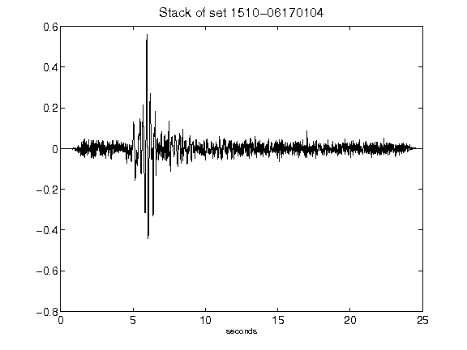](figures/1510-06170104_Stack.png)[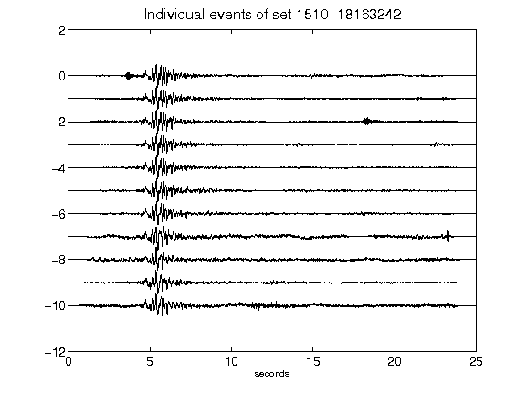](figures/1510-18163242_AllEv.png)[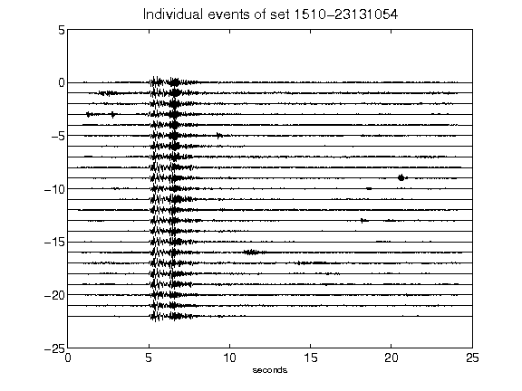](figures/1510-23131054_AllEv.png)[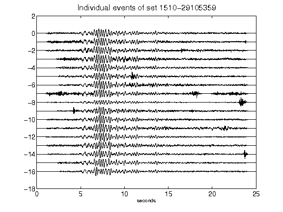](figures/1510-29105359_AllEv.png)[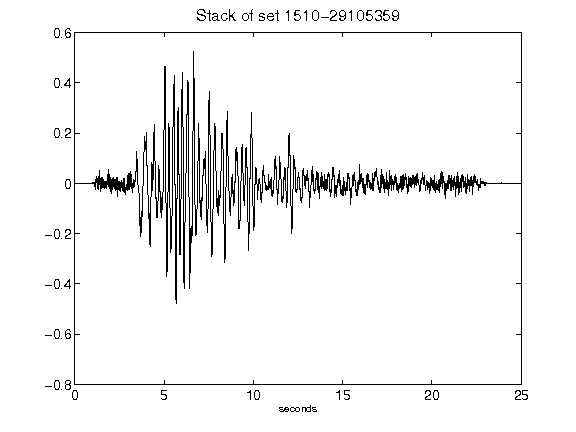](figures/1510-29105359_Stack.png)[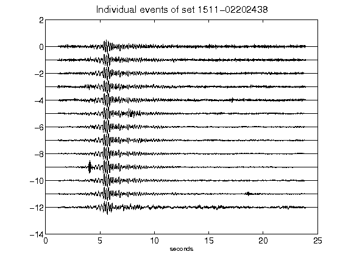](figures/1511-02202438_AllEv.png)[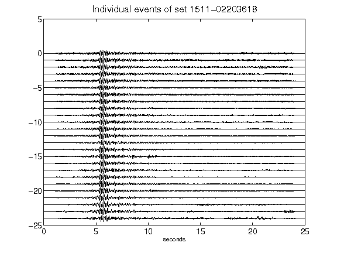](figures/1511-02203618_AllEv.png)[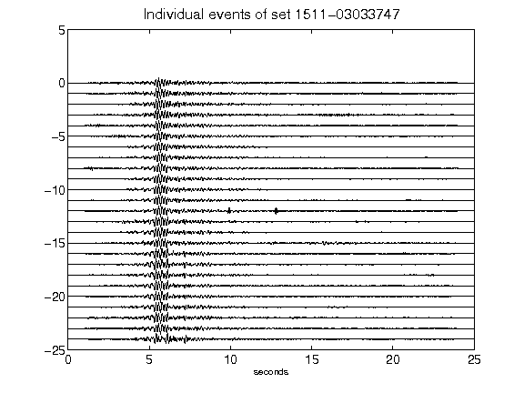](figures/1511-03033747_AllEv.png)[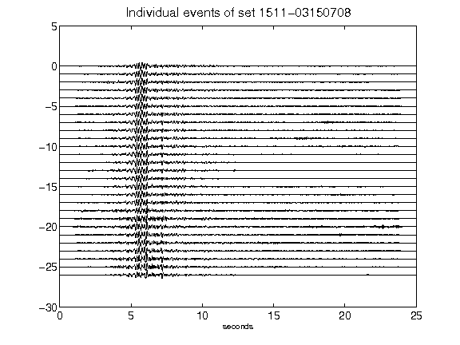](figures/1511-03150708_AllEv.png)[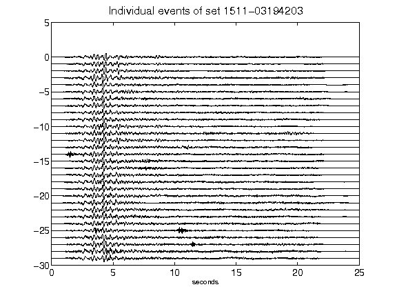](figures/1511-03194203_AllEv.png)[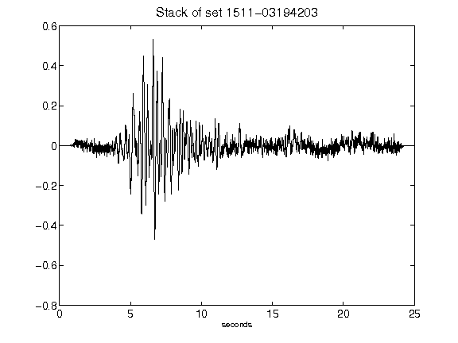](figures/1511-03194203_Stack.png)[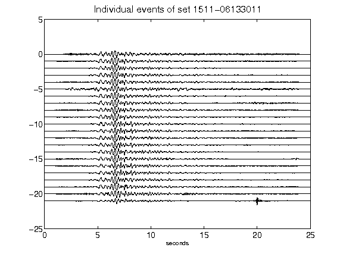](figures/1511-06133011_AllEv.png)[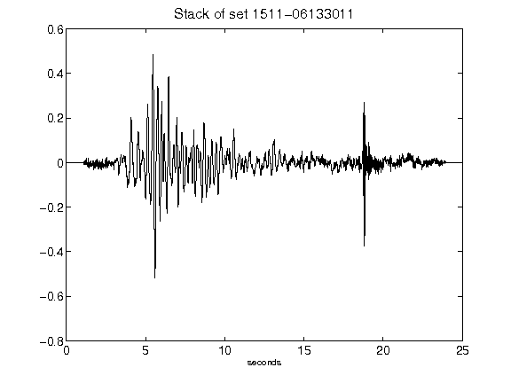](figures/1511-06133011_Stack.png)[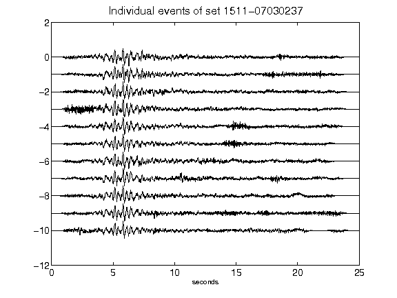](figures/1511-07030237_AllEv.png)[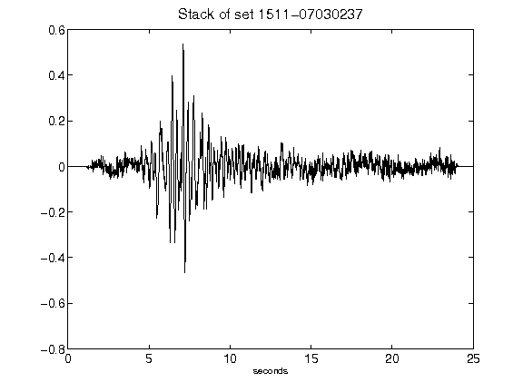](figures/1511-07030237_Stack.png)[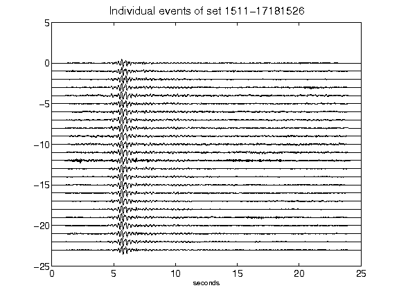](figures/1511-17181526_AllEv.png)[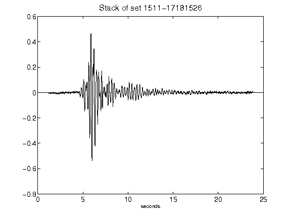](figures/1511-17181526_Stack.png)[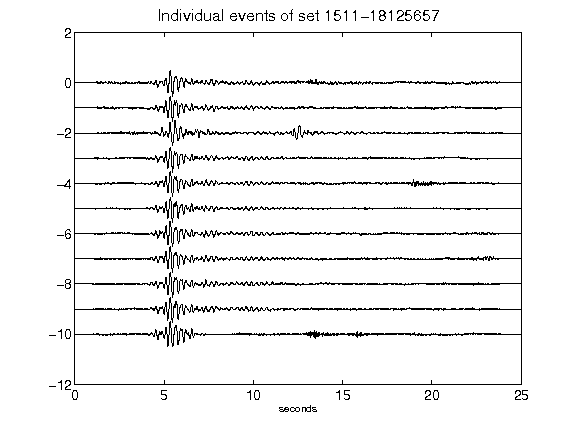](figures/1511-18125657_AllEv.png)[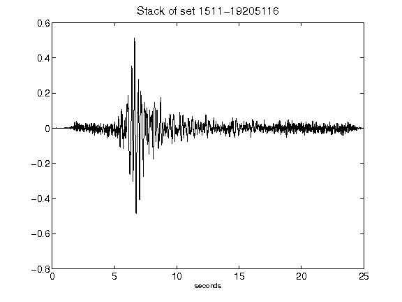](figures/1511-19205116_Stack.png)