# Repeating Earthquake Activity at RCS

## Waveforms
[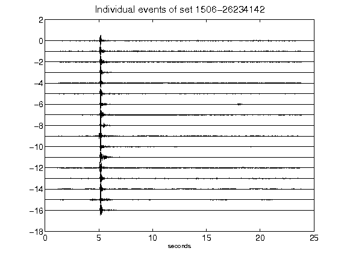](figures/1506-26234142_AllEv.png)[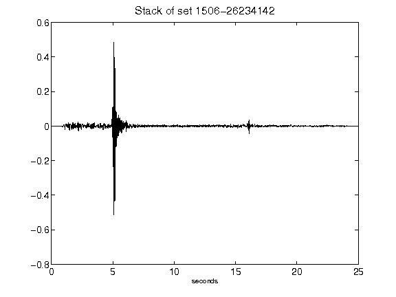](figures/1506-26234142_Stack.png)[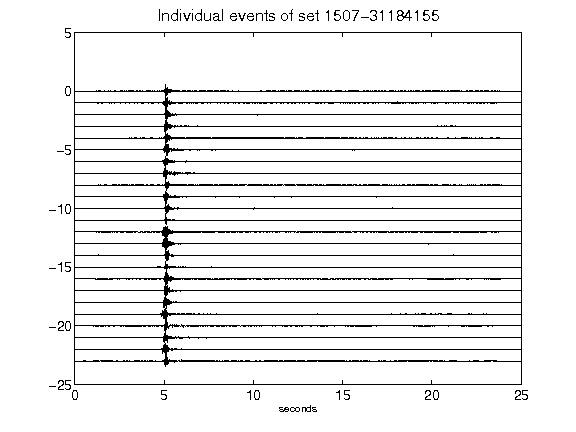](figures/1507-31184155_AllEv.png)[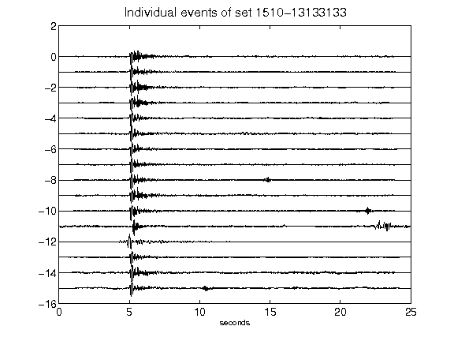](figures/1510-13133133_AllEv.png)[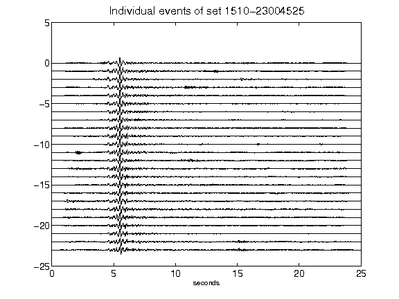](figures/1510-23004525_AllEv.png)[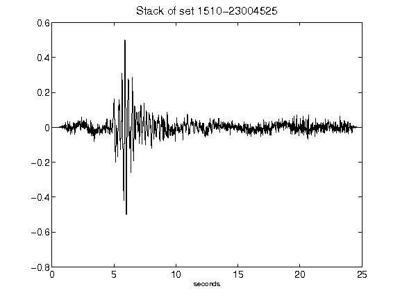](figures/1510-23004525_Stack.png)[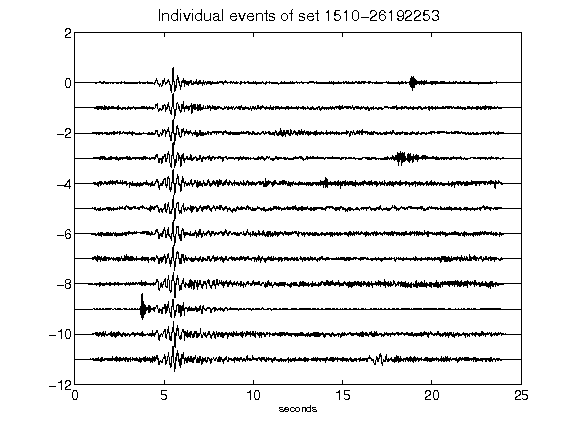](figures/1510-26192253_AllEv.png)[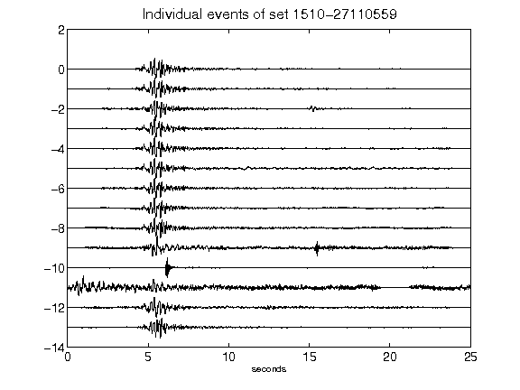](figures/1510-27110559_AllEv.png)[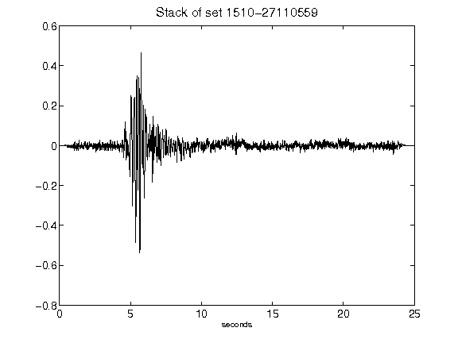](figures/1510-27110559_Stack.png)[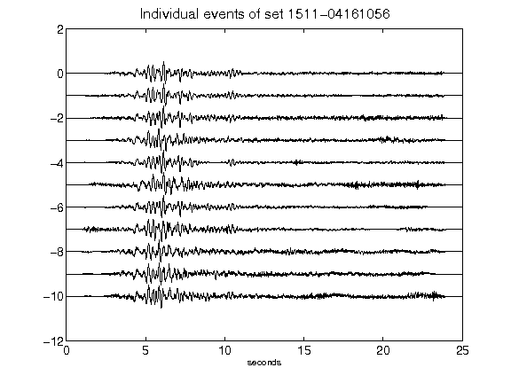](figures/1511-04161056_AllEv.png)[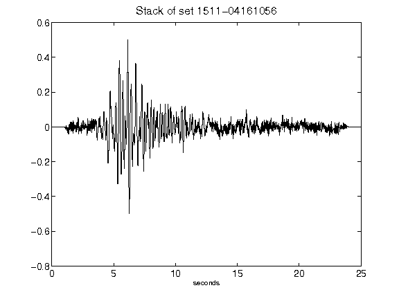](figures/1511-04161056_Stack.png)[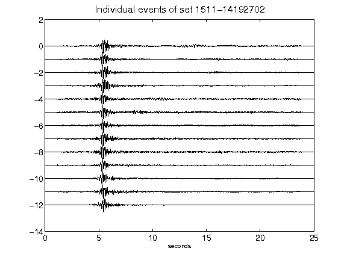](figures/1511-14192702_AllEv.png)