# Repeating Earthquake Activity at RCS

## Waveforms
[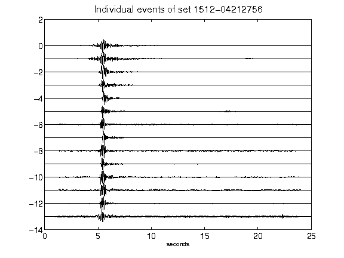](figures/1512-04212756_AllEv.png)[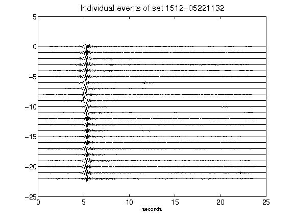](figures/1512-05221132_AllEv.png)[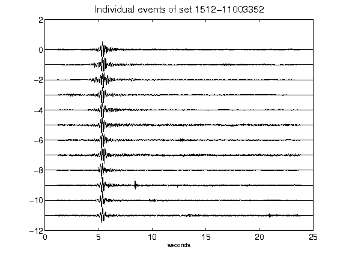](figures/1512-11003352_AllEv.png)[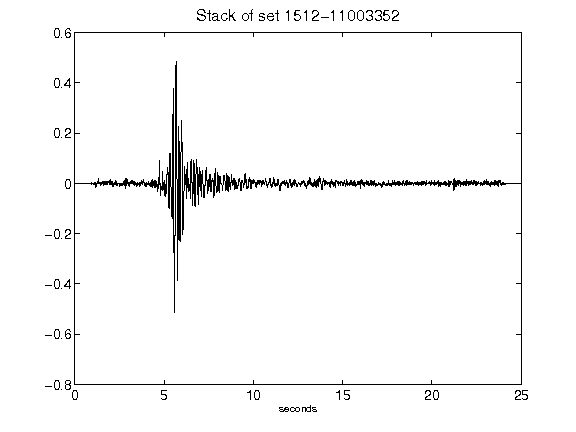](figures/1512-11003352_Stack.png)[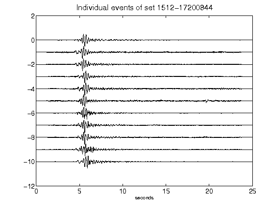](figures/1512-17200844_AllEv.png)[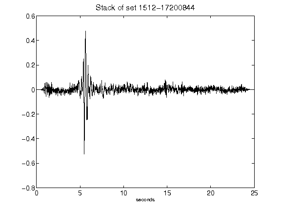](figures/1512-17200844_Stack.png)[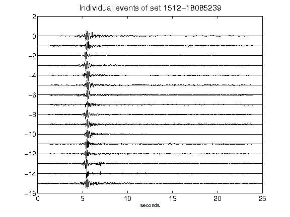](figures/1512-18085239_AllEv.png)[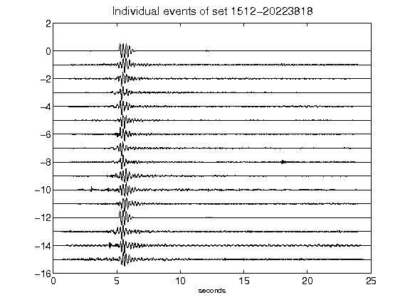](figures/1512-20223818_AllEv.png)[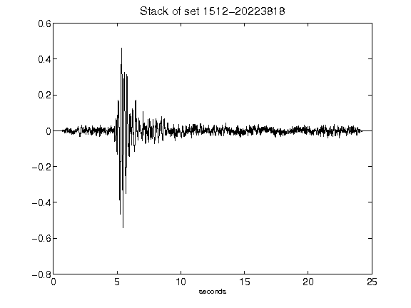](figures/1512-20223818_Stack.png)[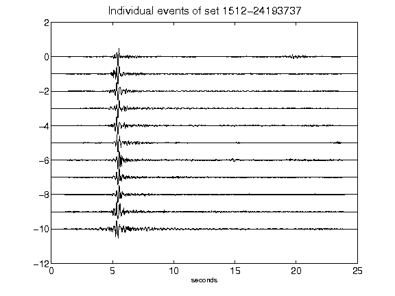](figures/1512-24193737_AllEv.png)[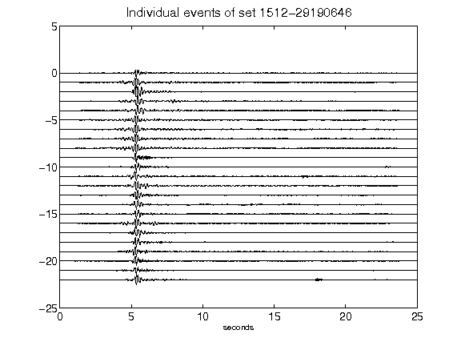](figures/1512-29190646_AllEv.png)[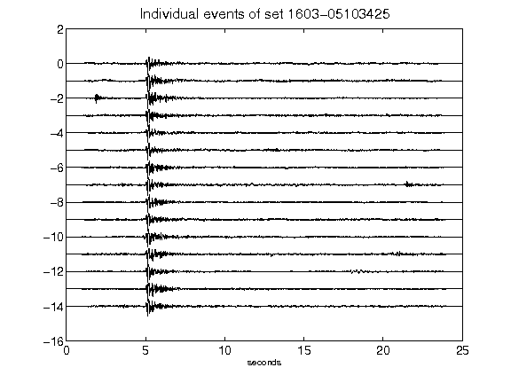](figures/1603-05103425_AllEv.png)[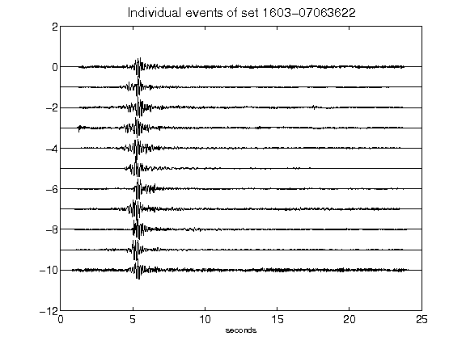](figures/1603-07063622_AllEv.png)[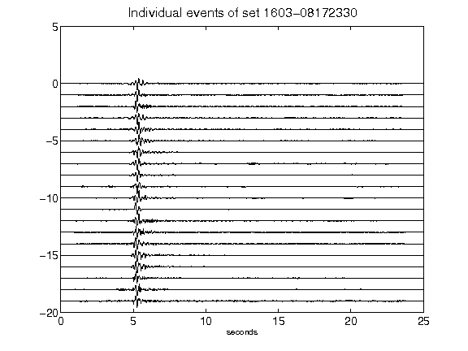](figures/1603-08172330_AllEv.png)[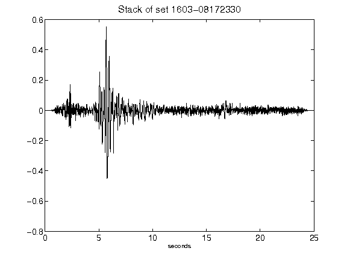](figures/1603-08172330_Stack.png)[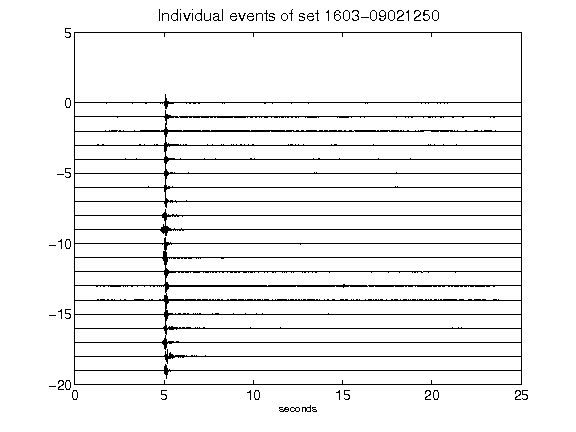](figures/1603-09021250_AllEv.png)[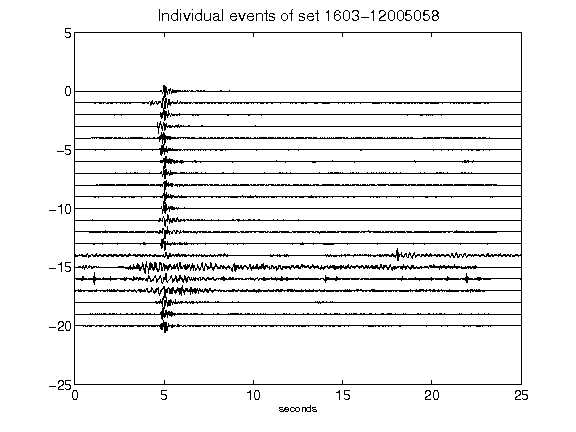](figures/1603-12005058_AllEv.png)[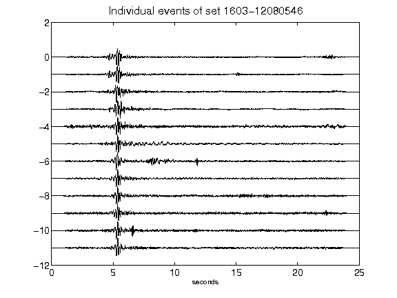](figures/1603-12080546_AllEv.png)[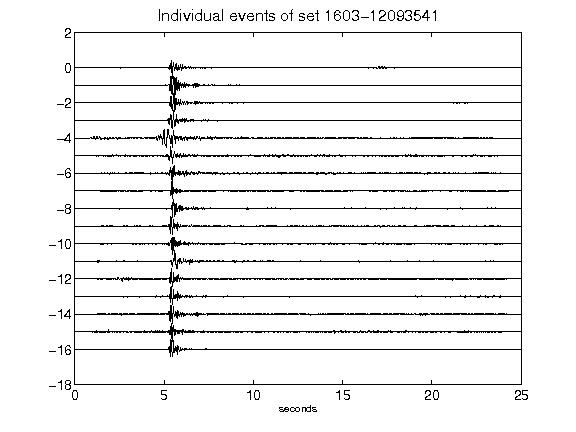](figures/1603-12093541_AllEv.png)[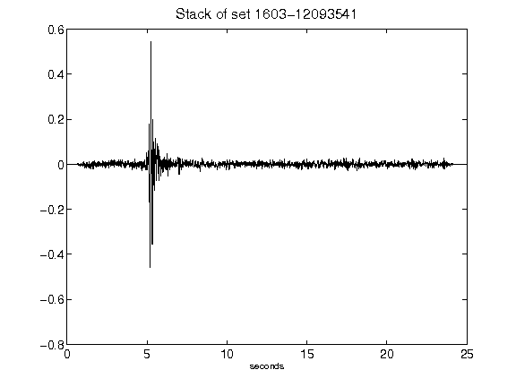](figures/1603-12093541_Stack.png)[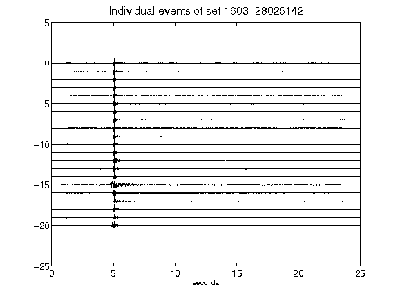](figures/1603-28025142_AllEv.png)[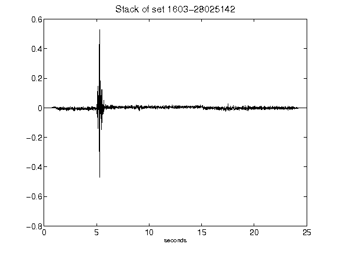](figures/1603-28025142_Stack.png)[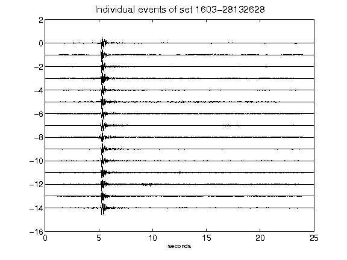](figures/1603-28132628_AllEv.png)[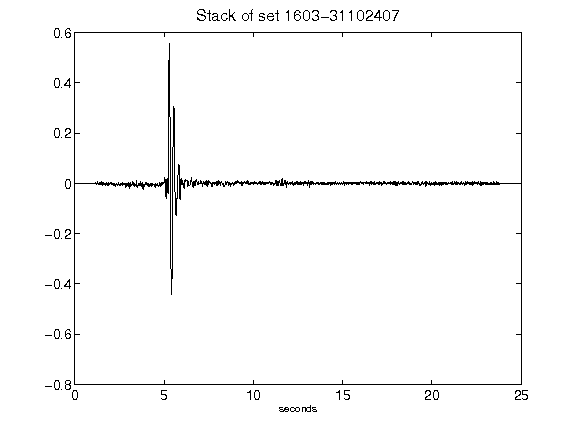](figures/1603-31102407_Stack.png)