# Repeating Earthquake Activity at RCS

## Waveforms
[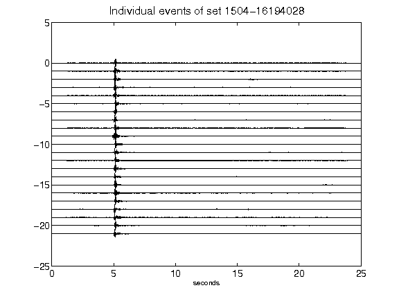](figures/1504-16194028_AllEv.png)[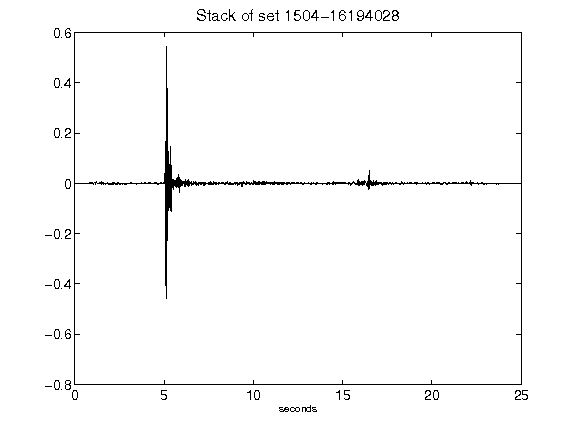](figures/1504-16194028_Stack.png)[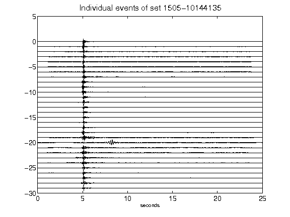](figures/1505-10144135_AllEv.png)[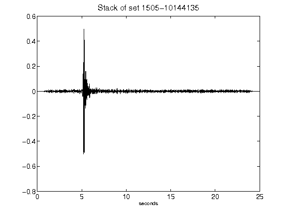](figures/1505-10144135_Stack.png)[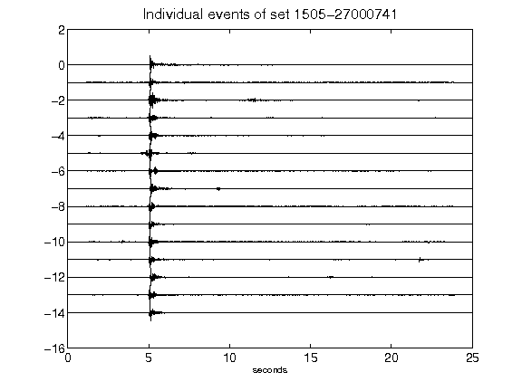](figures/1505-27000741_AllEv.png)[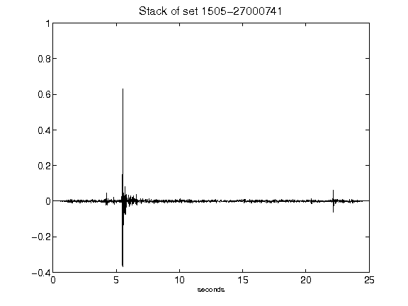](figures/1505-27000741_Stack.png)[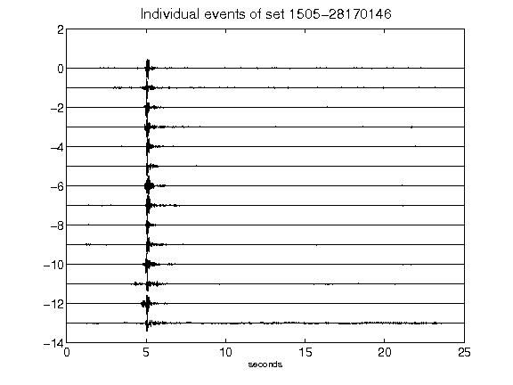](figures/1505-28170146_AllEv.png)[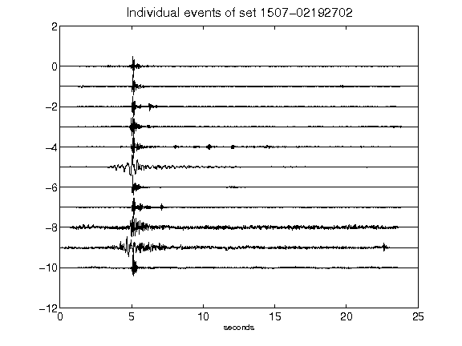](figures/1507-02192702_AllEv.png)[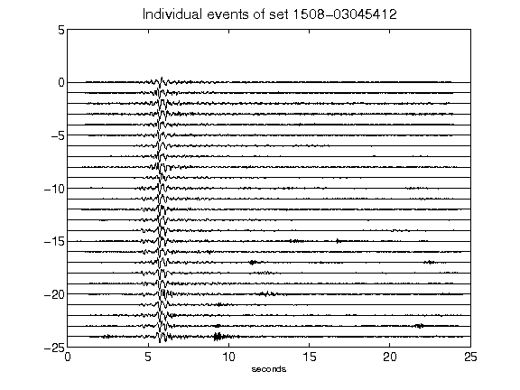](figures/1508-03045412_AllEv.png)[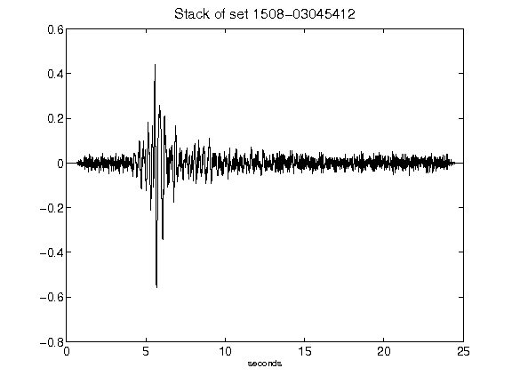](figures/1508-03045412_Stack.png)[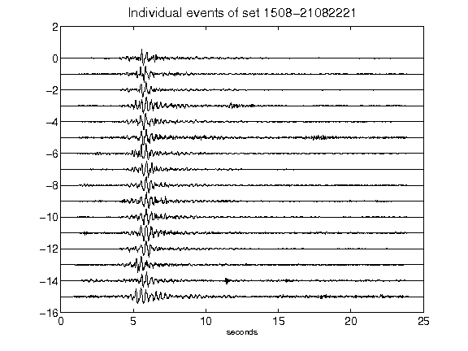](figures/1508-21082221_AllEv.png)[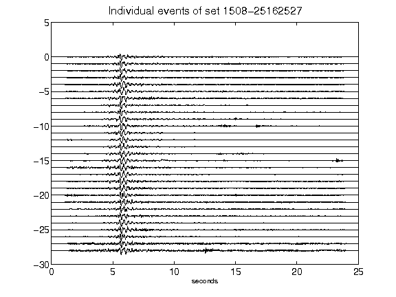](figures/1508-25162527_AllEv.png)[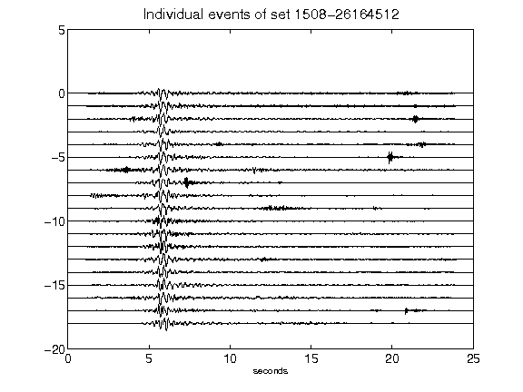](figures/1508-26164512_AllEv.png)[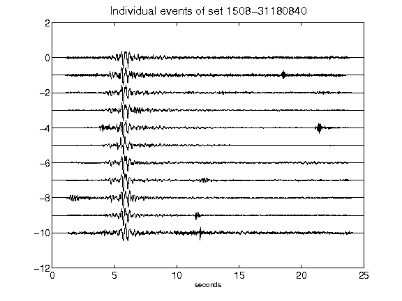](figures/1508-31180840_AllEv.png)[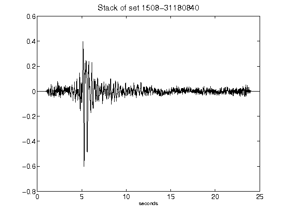](figures/1508-31180840_Stack.png)[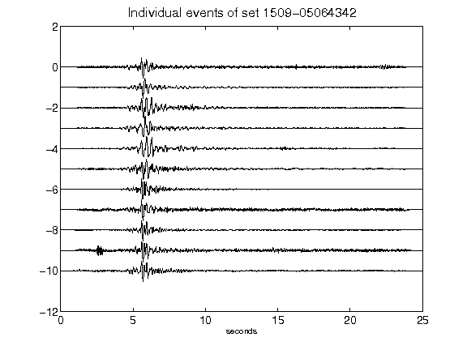](figures/1509-05064342_AllEv.png)[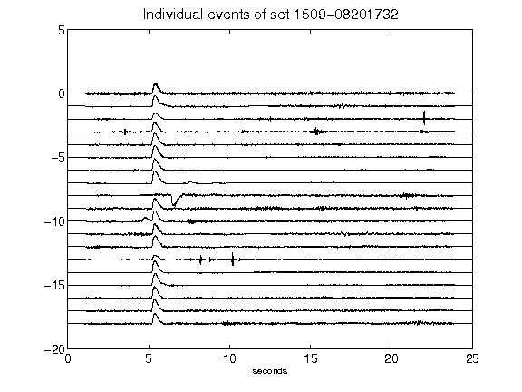](figures/1509-08201732_AllEv.png)[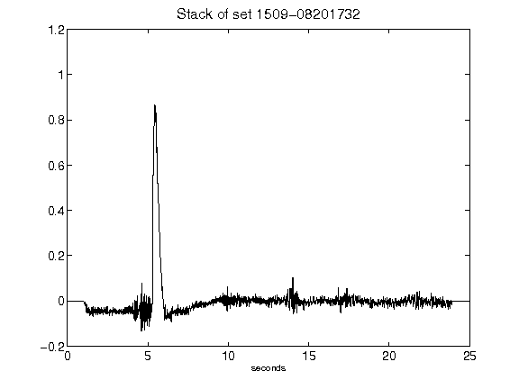](figures/1509-08201732_Stack.png)[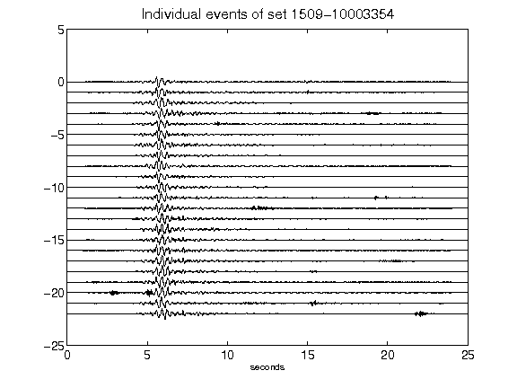](figures/1509-10003354_AllEv.png)[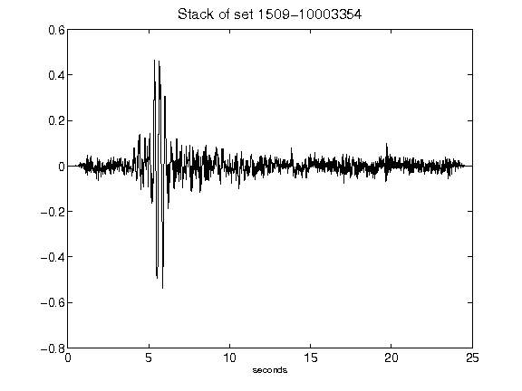](figures/1509-10003354_Stack.png)[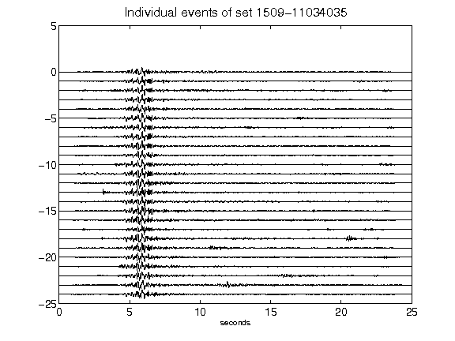](figures/1509-11034035_AllEv.png)[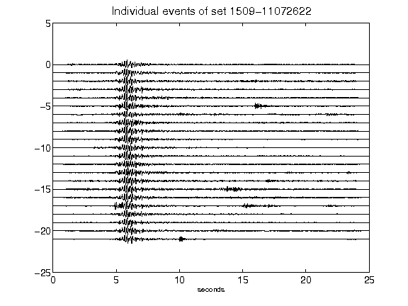](figures/1509-11072622_AllEv.png)[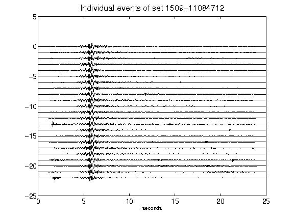](figures/1509-11084712_AllEv.png)[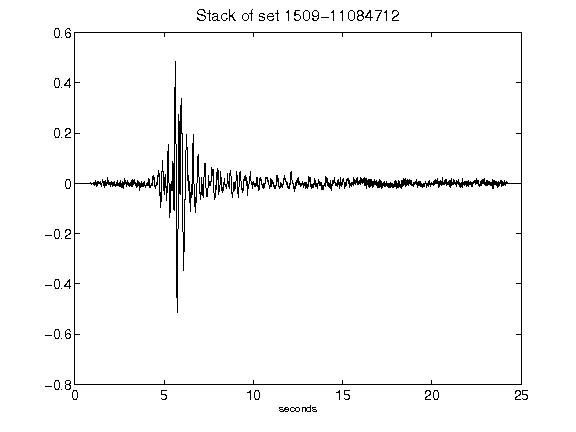](figures/1509-11084712_Stack.png)[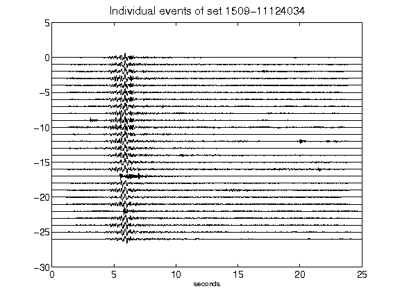](figures/1509-11124034_AllEv.png)[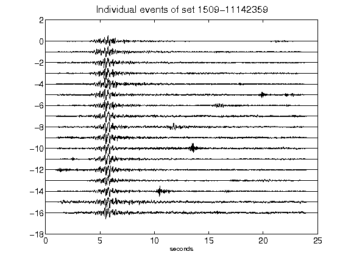](figures/1509-11142359_AllEv.png)[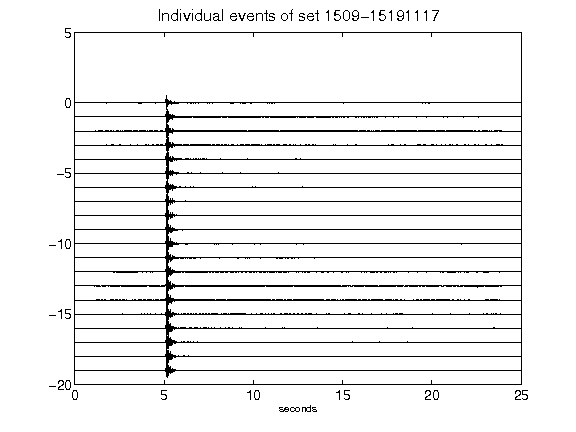](figures/1509-15191117_AllEv.png)[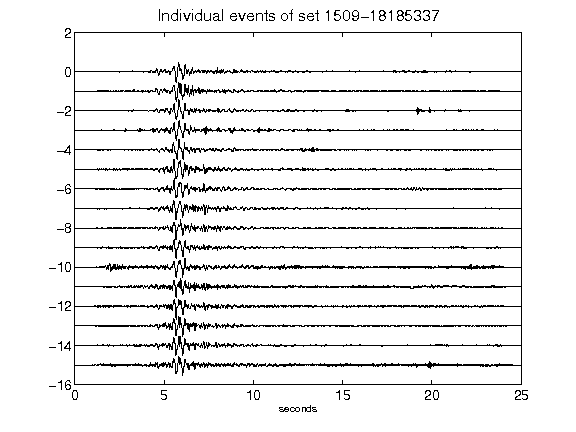](figures/1509-18185337_AllEv.png)[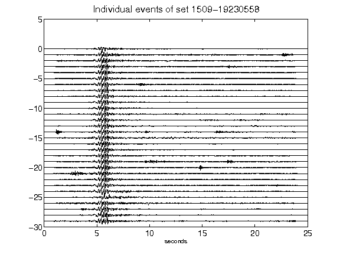](figures/1509-19230558_AllEv.png)[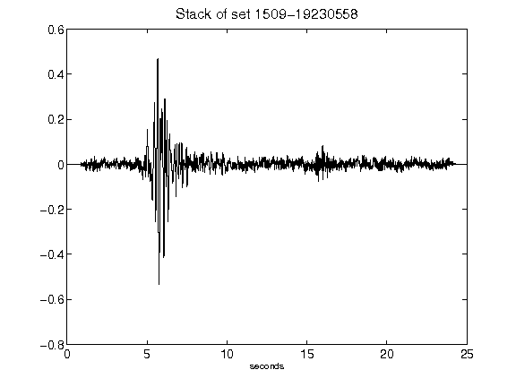](figures/1509-19230558_Stack.png)[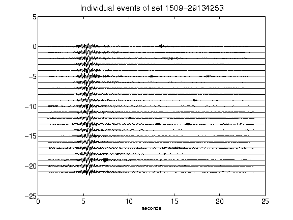](figures/1509-29134253_AllEv.png)[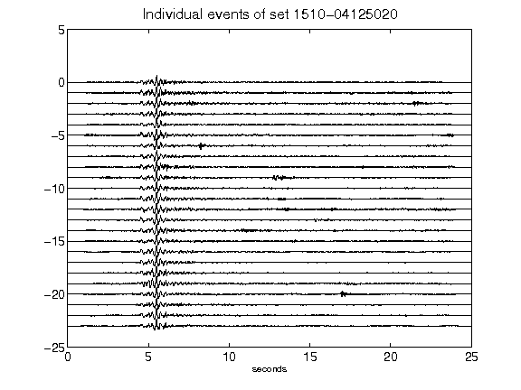](figures/1510-04125020_AllEv.png)