# Repeating Earthquake Activity at RCS

## Waveforms
[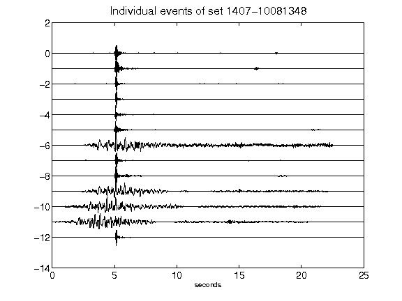](figures/1407-10081348_AllEv.png)[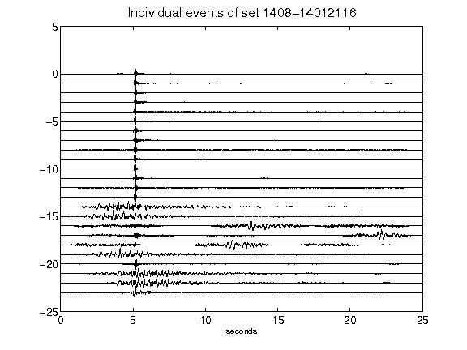](figures/1408-14012116_AllEv.png)[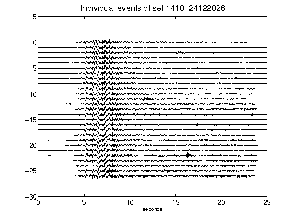](figures/1410-24122026_AllEv.png)[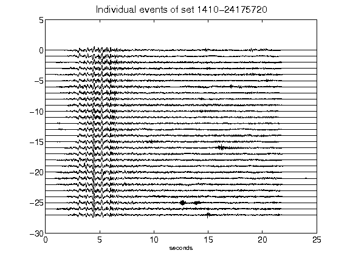](figures/1410-24175720_AllEv.png)[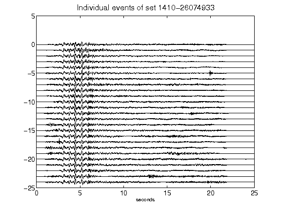](figures/1410-26074933_AllEv.png)[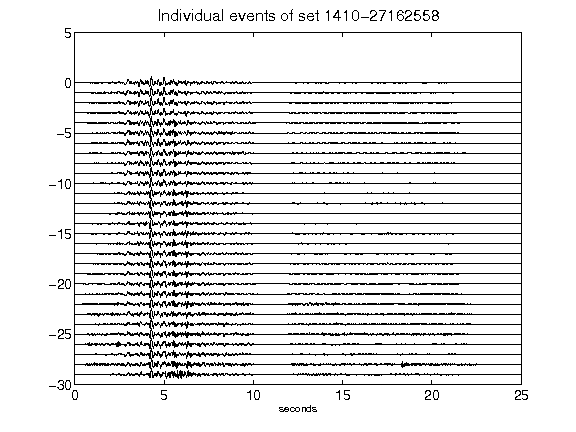](figures/1410-27162558_AllEv.png)[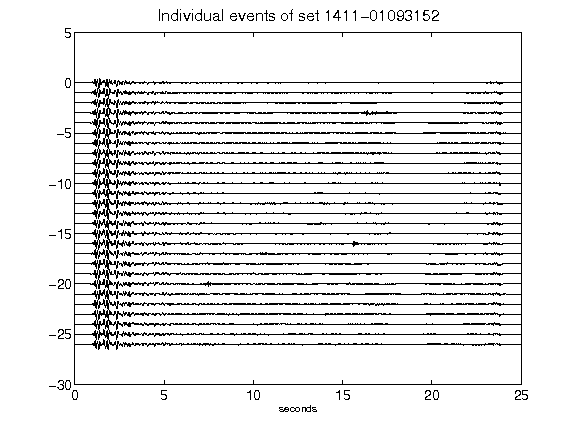](figures/1411-01093152_AllEv.png)[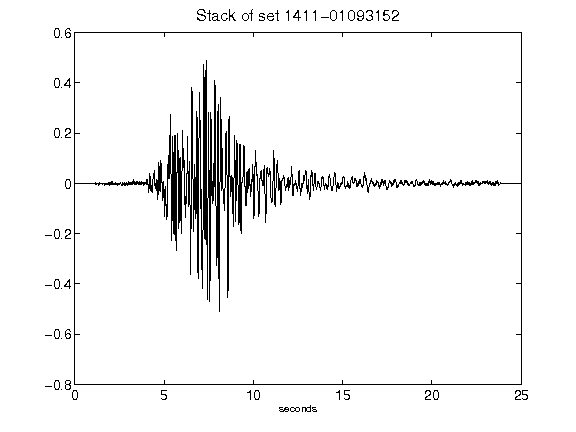](figures/1411-01093152_Stack.png)[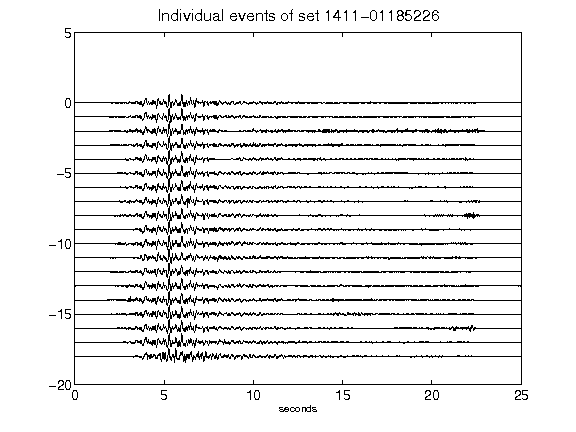](figures/1411-01185226_AllEv.png)[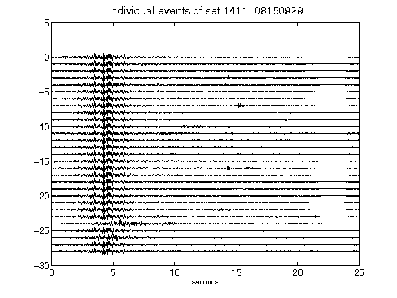](figures/1411-08150929_AllEv.png)[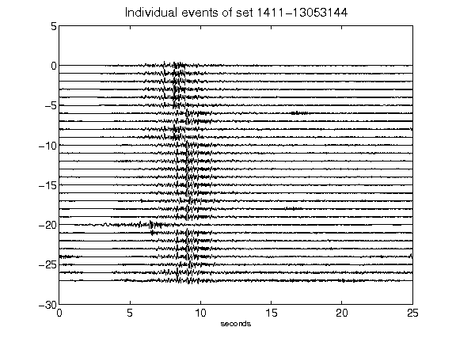](figures/1411-13053144_AllEv.png)[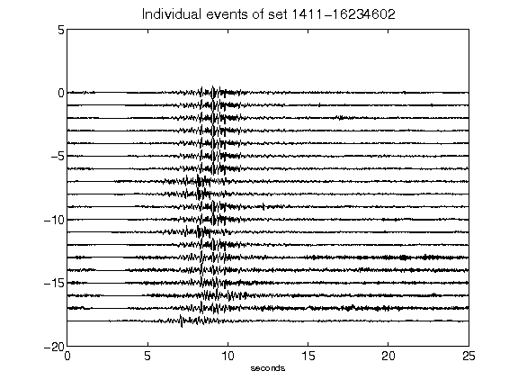](figures/1411-16234602_AllEv.png)[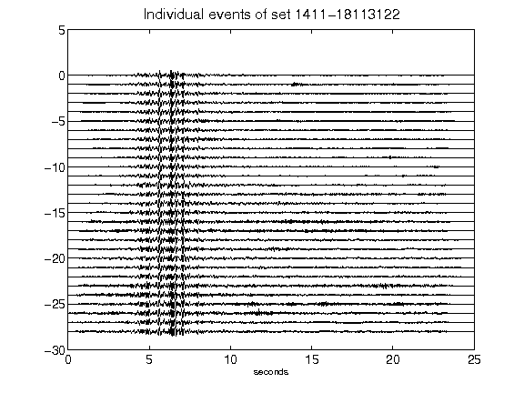](figures/1411-18113122_AllEv.png)[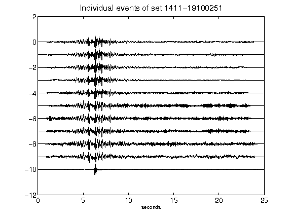](figures/1411-19100251_AllEv.png)[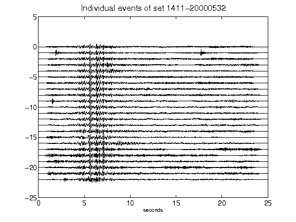](figures/1411-20000532_AllEv.png)[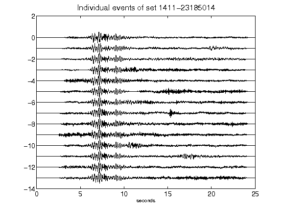](figures/1411-23185014_AllEv.png)[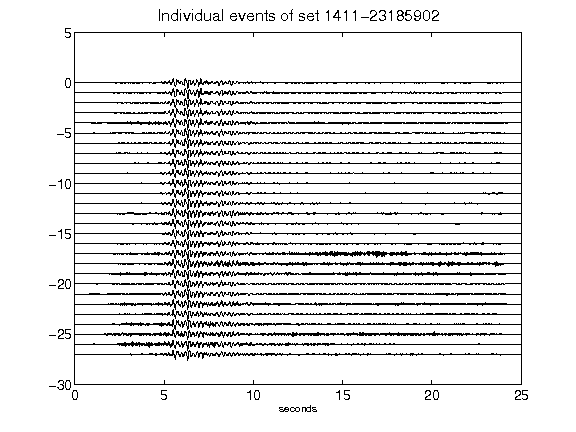](figures/1411-23185902_AllEv.png)[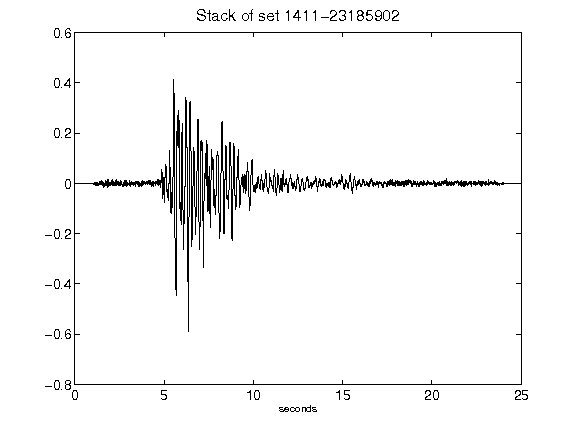](figures/1411-23185902_Stack.png)[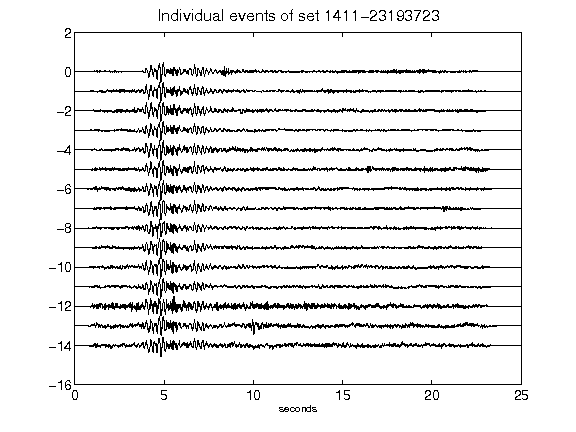](figures/1411-23193723_AllEv.png)[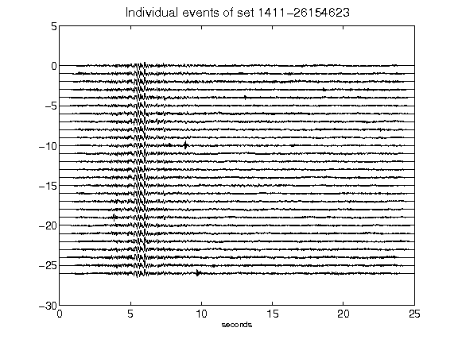](figures/1411-26154623_AllEv.png)