# Repeating Earthquake Activity at RCS

## Waveforms
[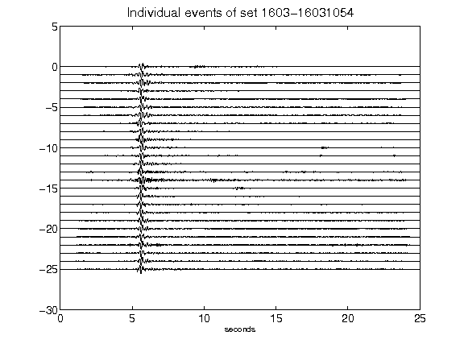](figures/1603-16031054_AllEv.png)[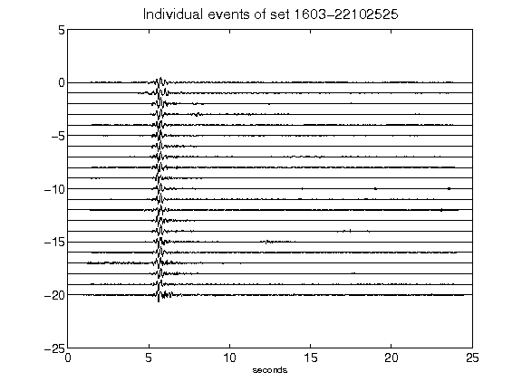](figures/1603-22102525_AllEv.png)[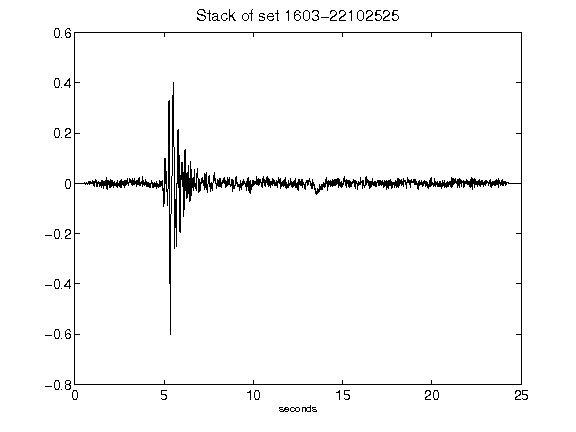](figures/1603-22102525_Stack.png)[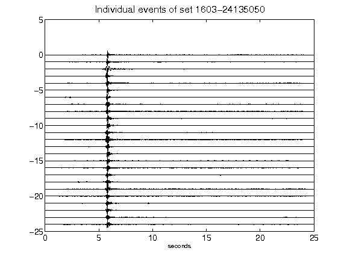](figures/1603-24135050_AllEv.png)[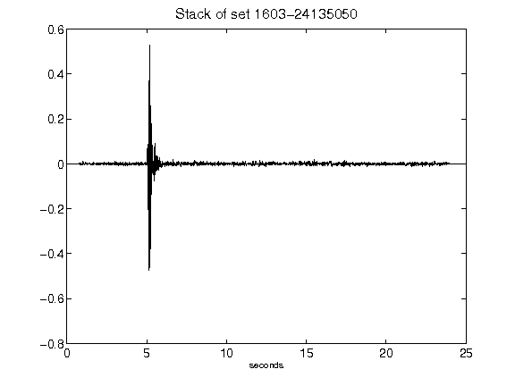](figures/1603-24135050_Stack.png)[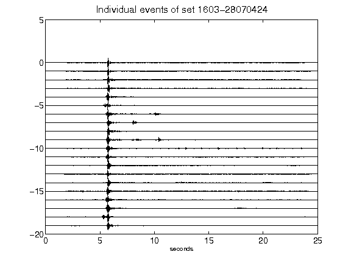](figures/1603-28070424_AllEv.png)[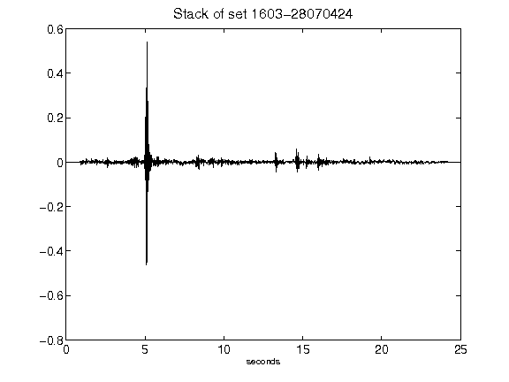](figures/1603-28070424_Stack.png)[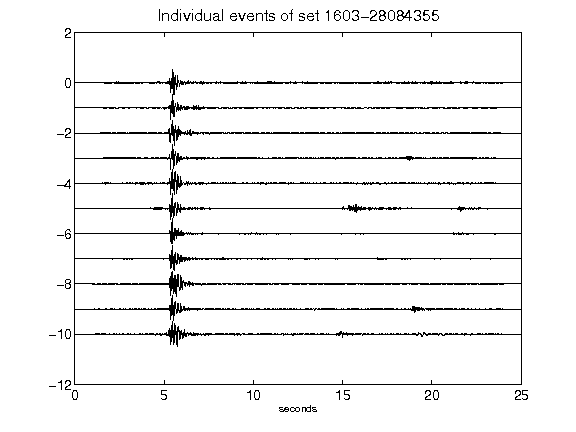](figures/1603-28084355_AllEv.png)[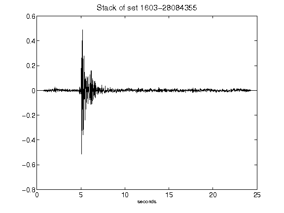](figures/1603-28084355_Stack.png)[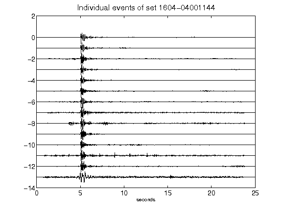](figures/1604-04001144_AllEv.png)[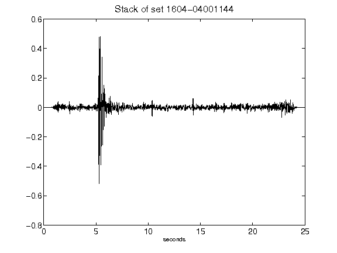](figures/1604-04001144_Stack.png)[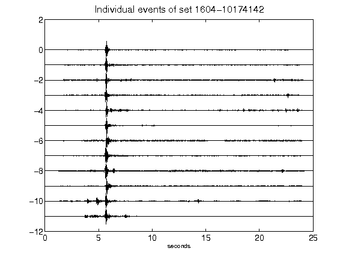](figures/1604-10174142_AllEv.png)[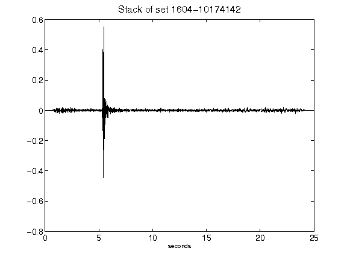](figures/1604-10174142_Stack.png)[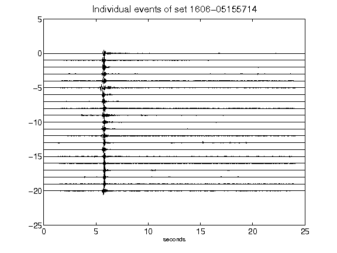](figures/1606-05155714_AllEv.png)[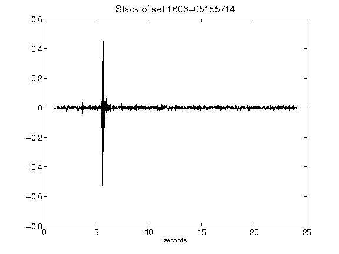](figures/1606-05155714_Stack.png)[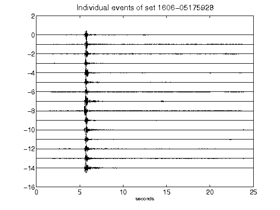](figures/1606-05175928_AllEv.png)[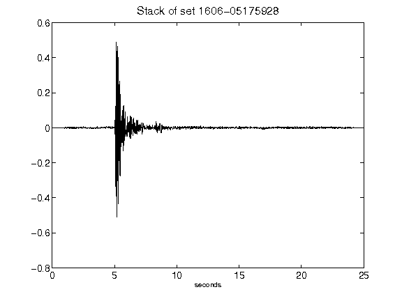](figures/1606-05175928_Stack.png)[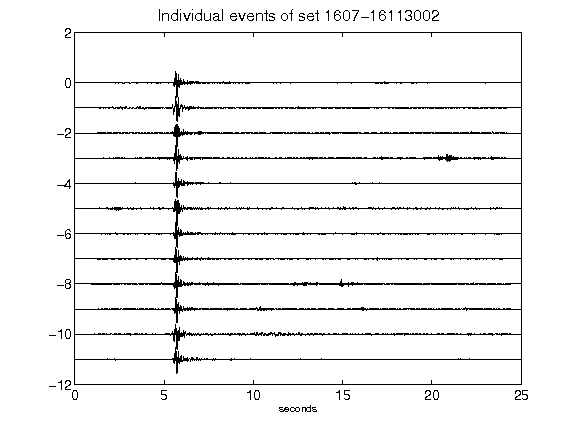](figures/1607-16113002_AllEv.png)[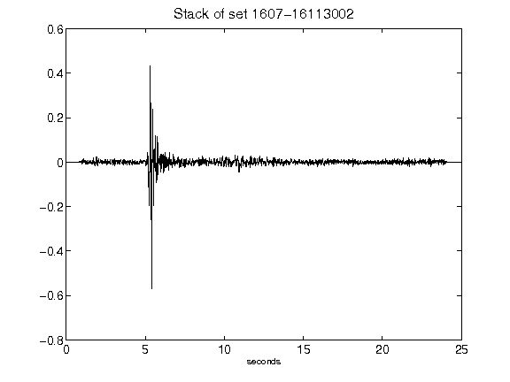](figures/1607-16113002_Stack.png)