# Repeating Earthquake Activity at RCS

## Waveforms
[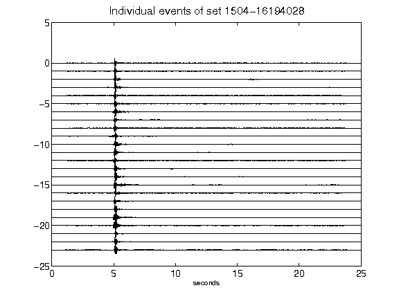](figures/1504-16194028_AllEv.png)[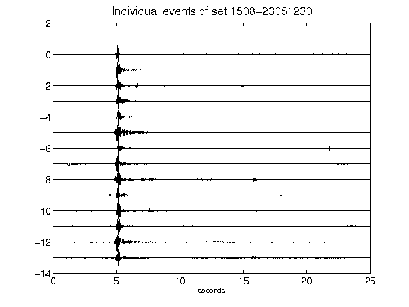](figures/1508-23051230_AllEv.png)[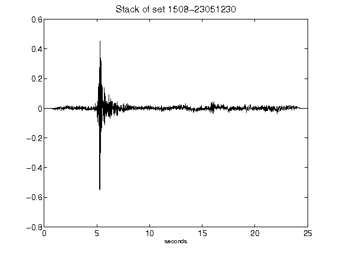](figures/1508-23051230_Stack.png)[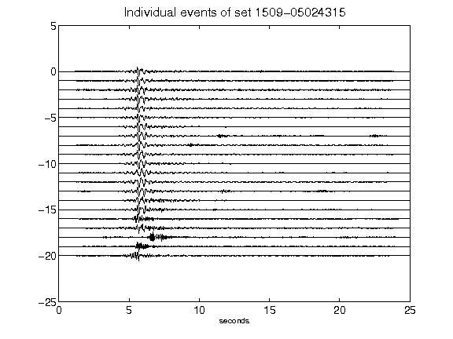](figures/1509-05024315_AllEv.png)[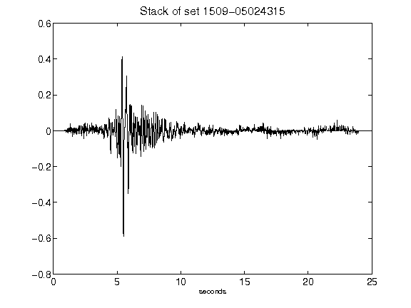](figures/1509-05024315_Stack.png)[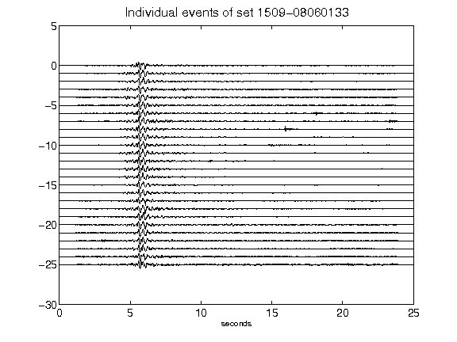](figures/1509-08060133_AllEv.png)[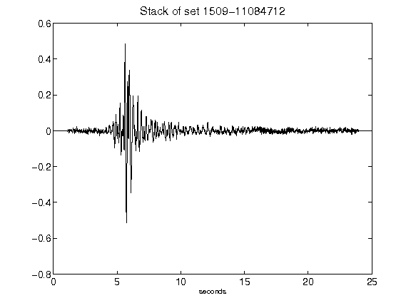](figures/1509-11084712_Stack.png)[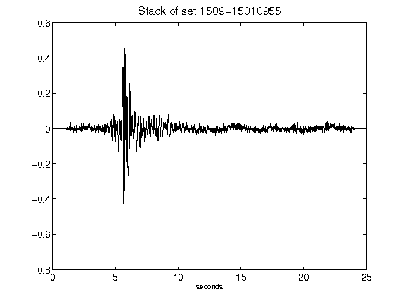](figures/1509-15010955_Stack.png)[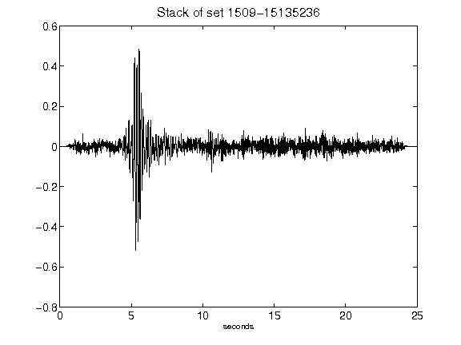](figures/1509-15135236_Stack.png)[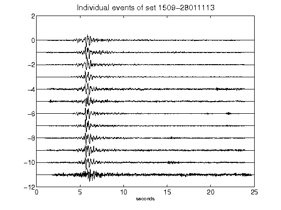](figures/1509-28011113_AllEv.png)[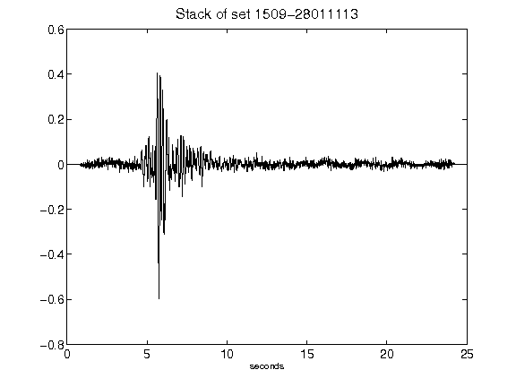](figures/1509-28011113_Stack.png)[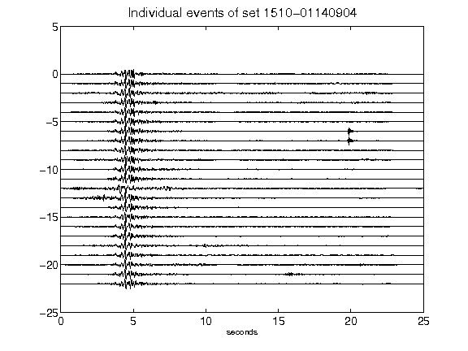](figures/1510-01140904_AllEv.png)[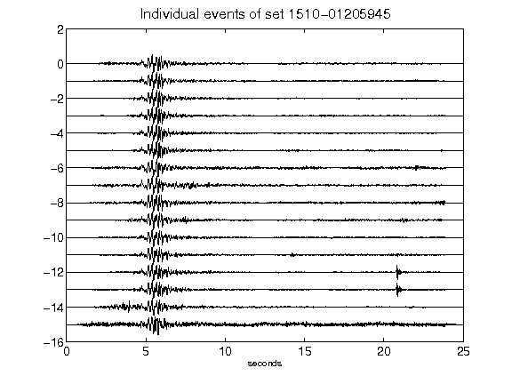](figures/1510-01205945_AllEv.png)[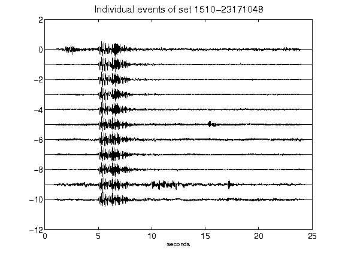](figures/1510-23171048_AllEv.png)[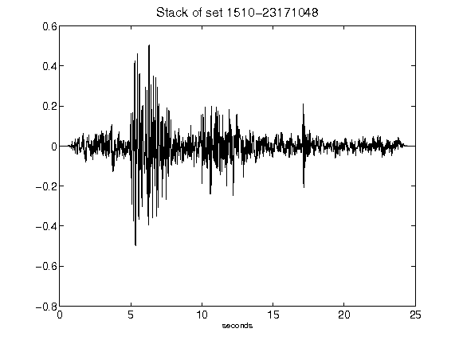](figures/1510-23171048_Stack.png)[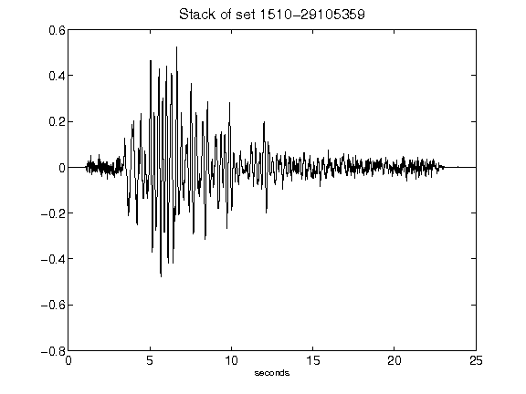](figures/1510-29105359_Stack.png)[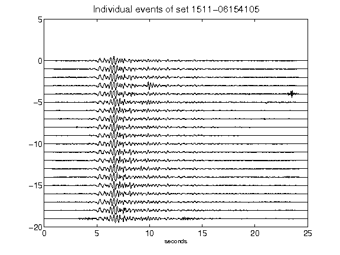](figures/1511-06154105_AllEv.png)[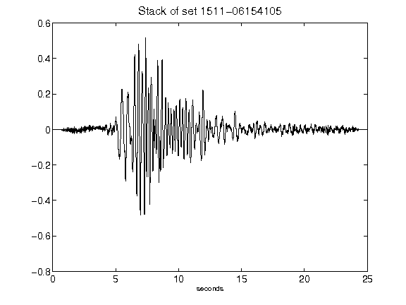](figures/1511-06154105_Stack.png)