# Repeating Earthquake Activity at RCS

## Waveforms
[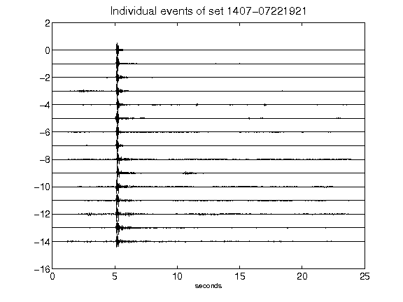](figures/1407-07221921_AllEv.png)[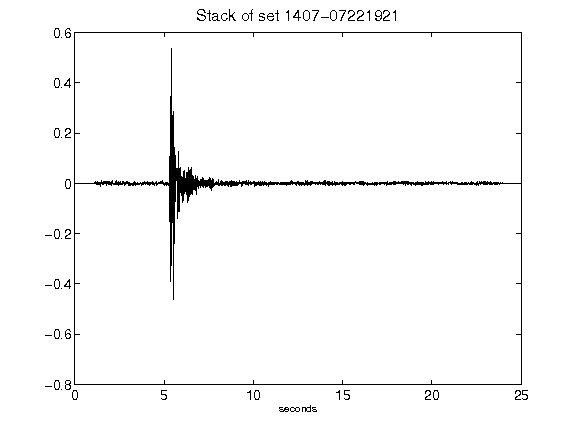](figures/1407-07221921_Stack.png)[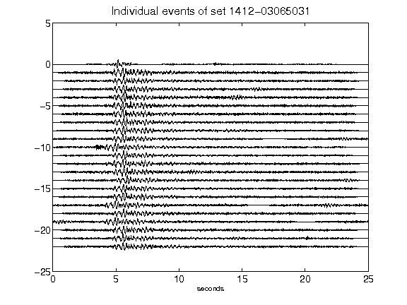](figures/1412-03065031_AllEv.png)[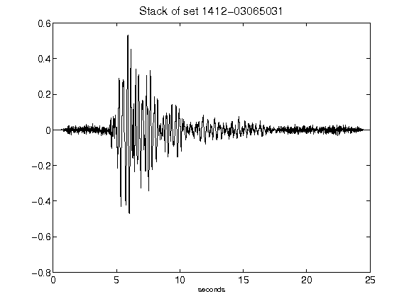](figures/1412-03065031_Stack.png)[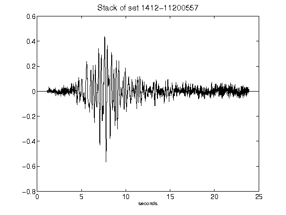](figures/1412-11200557_Stack.png)[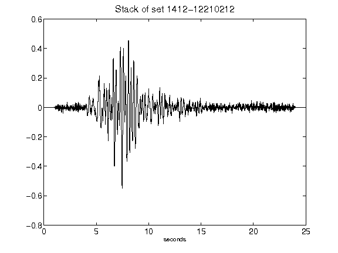](figures/1412-12210212_Stack.png)[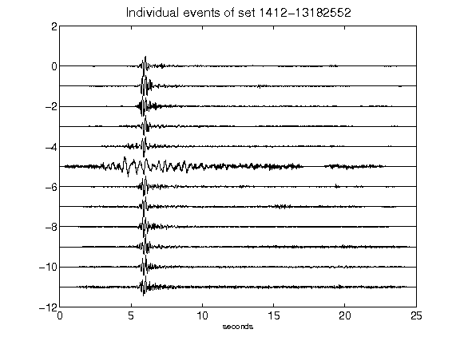](figures/1412-13182552_AllEv.png)[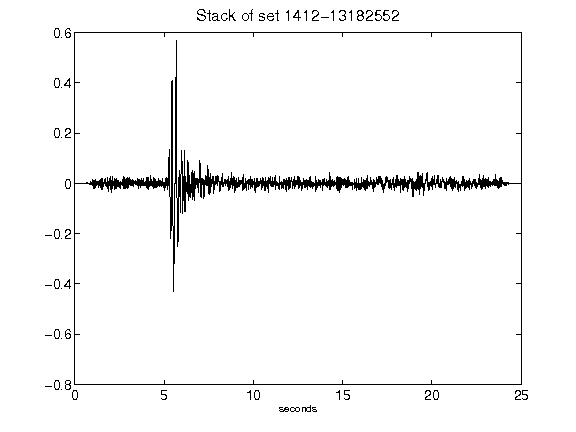](figures/1412-13182552_Stack.png)[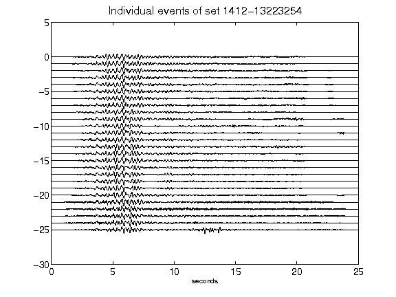](figures/1412-13223254_AllEv.png)[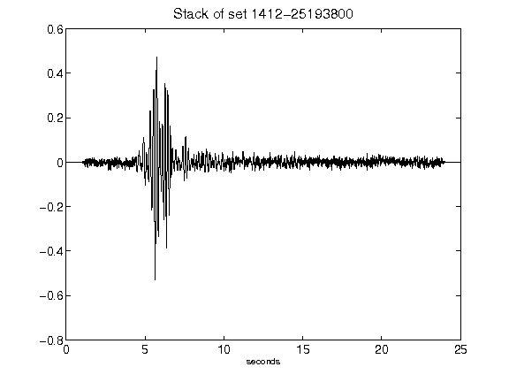](figures/1412-25193800_Stack.png)[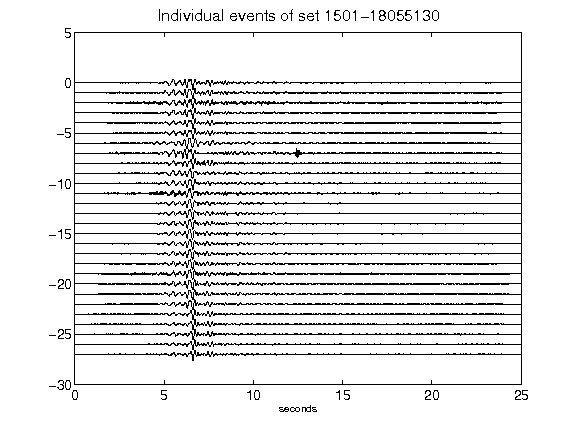](figures/1501-18055130_AllEv.png)[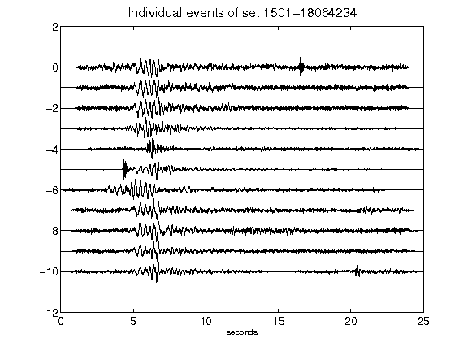](figures/1501-18064234_AllEv.png)[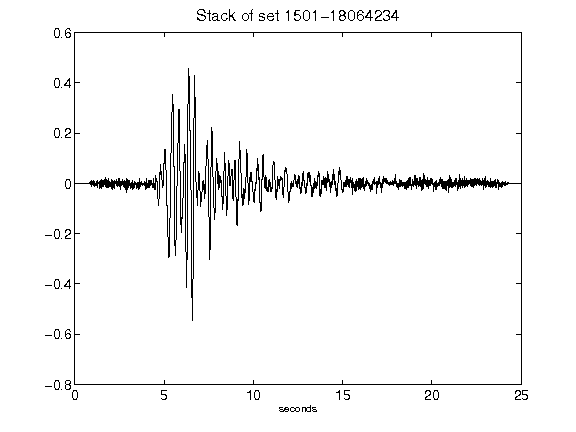](figures/1501-18064234_Stack.png)[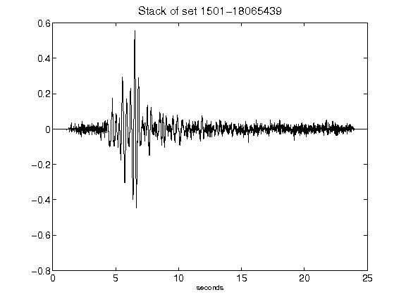](figures/1501-18065439_Stack.png)[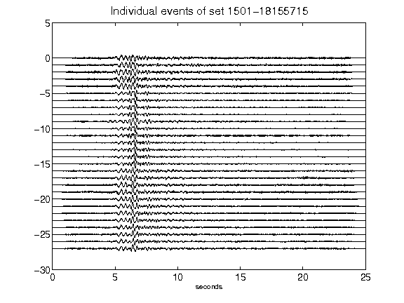](figures/1501-18155715_AllEv.png)[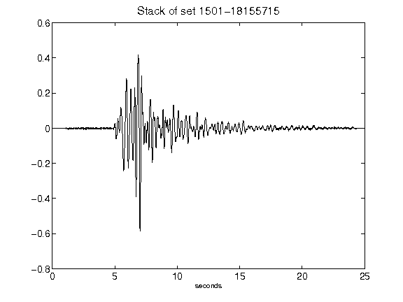](figures/1501-18155715_Stack.png)[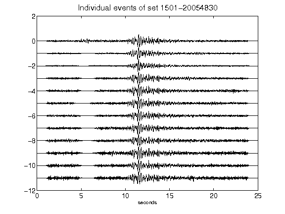](figures/1501-20054830_AllEv.png)[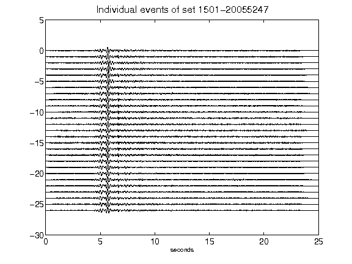](figures/1501-20055247_AllEv.png)[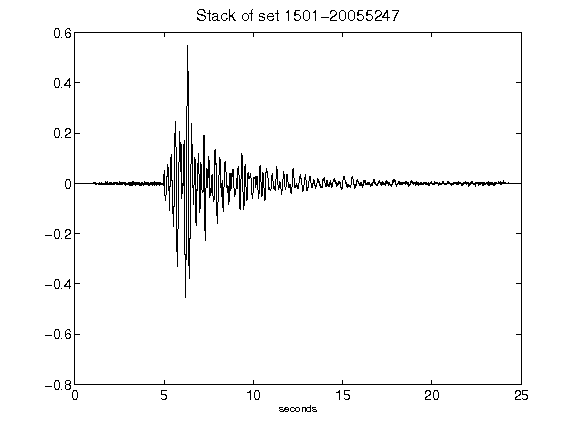](figures/1501-20055247_Stack.png)