# Repeating Earthquake Activity at RCS

## Waveforms
[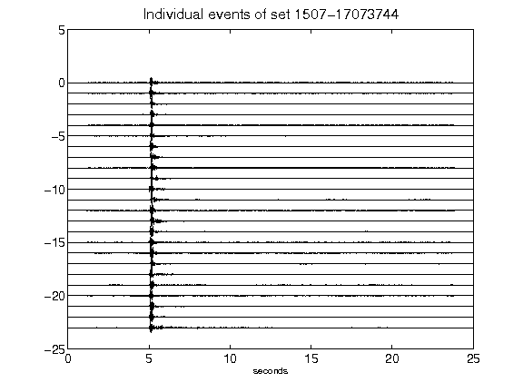](figures/1507-17073744_AllEv.png)[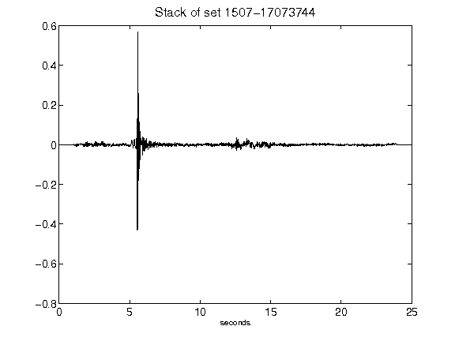](figures/1507-17073744_Stack.png)[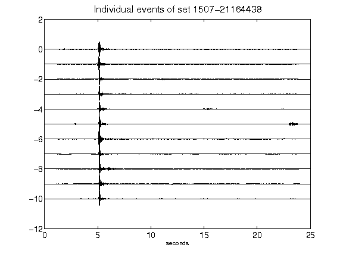](figures/1507-21164438_AllEv.png)[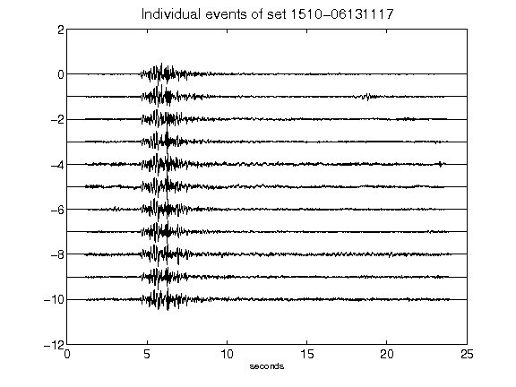](figures/1510-06131117_AllEv.png)[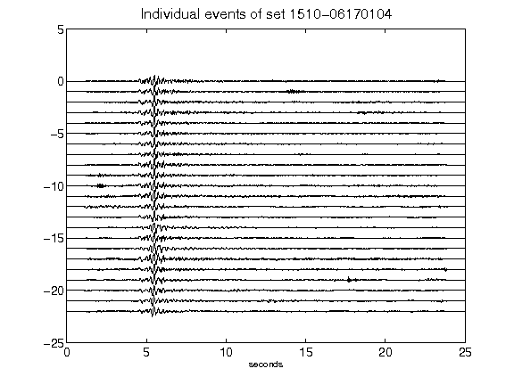](figures/1510-06170104_AllEv.png)[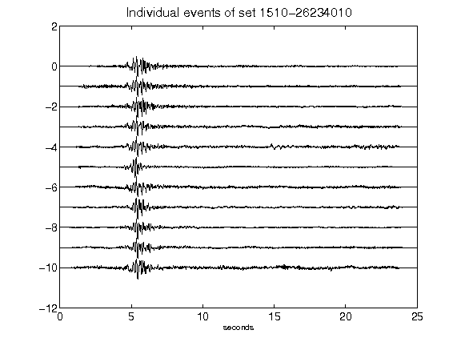](figures/1510-26234010_AllEv.png)[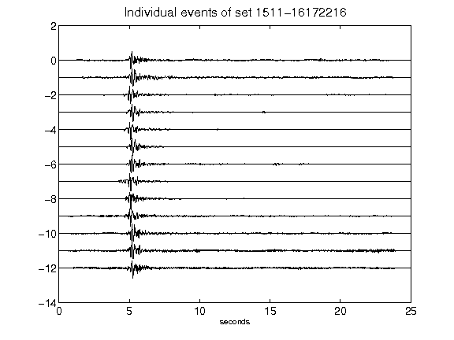](figures/1511-16172216_AllEv.png)[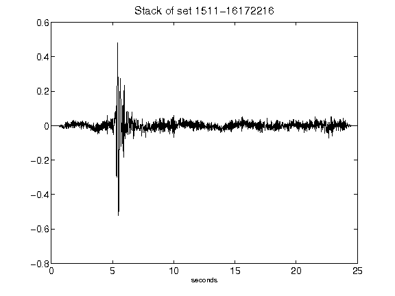](figures/1511-16172216_Stack.png)[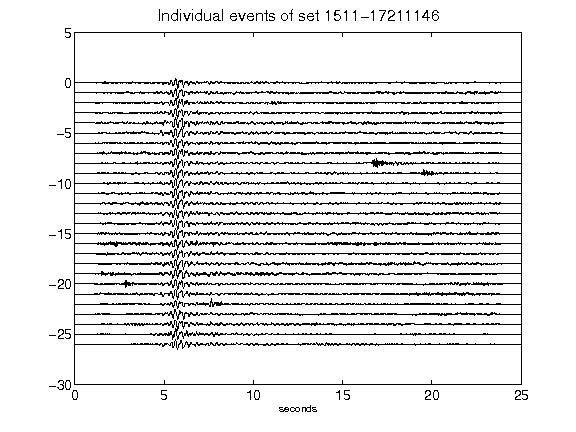](figures/1511-17211146_AllEv.png)[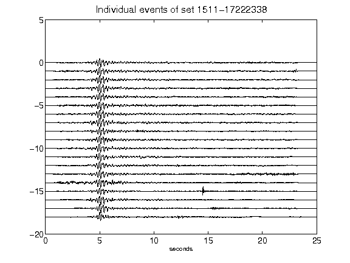](figures/1511-17222338_AllEv.png)[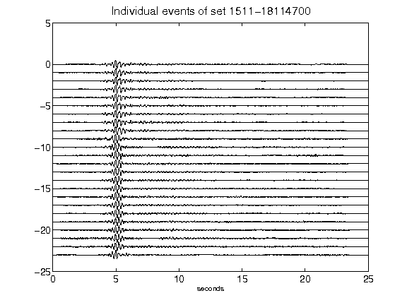](figures/1511-18114700_AllEv.png)[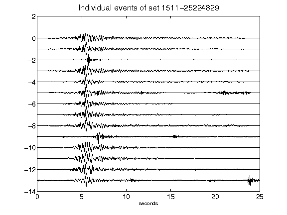](figures/1511-25224829_AllEv.png)[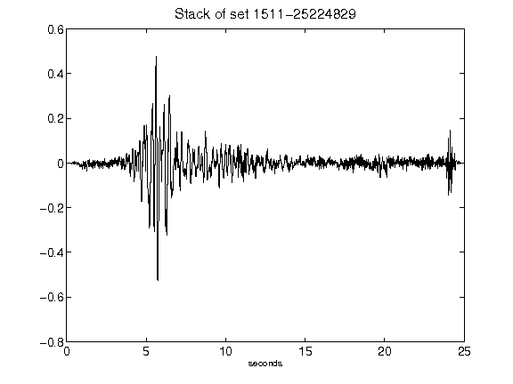](figures/1511-25224829_Stack.png)[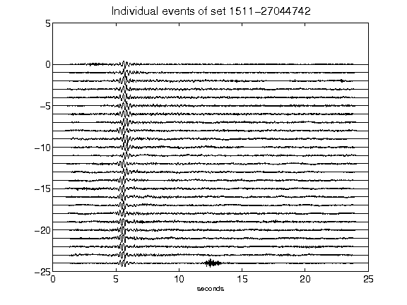](figures/1511-27044742_AllEv.png)[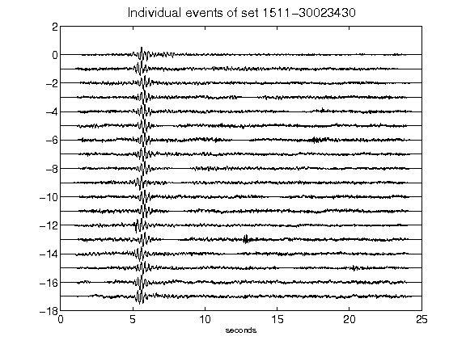](figures/1511-30023430_AllEv.png)[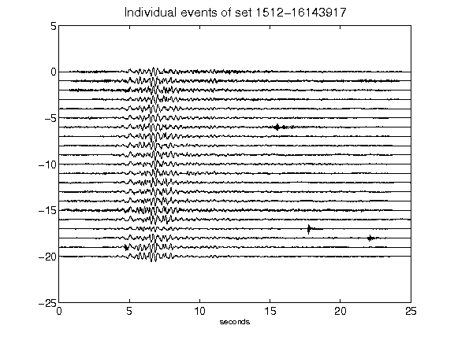](figures/1512-16143917_AllEv.png)[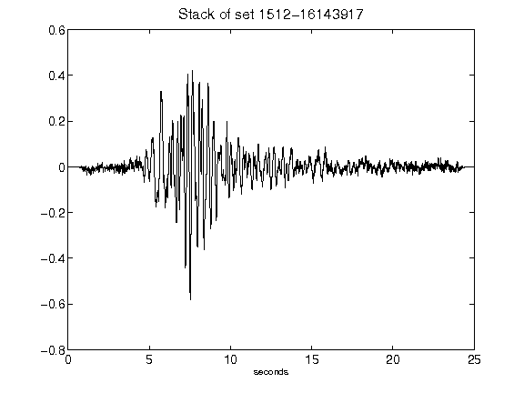](figures/1512-16143917_Stack.png)[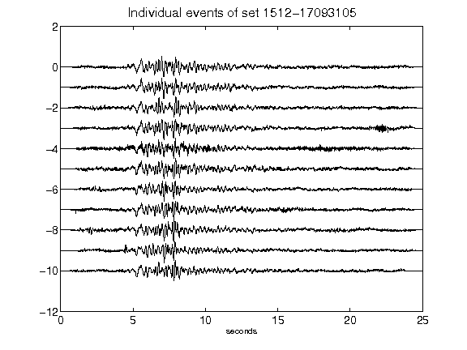](figures/1512-17093105_AllEv.png)[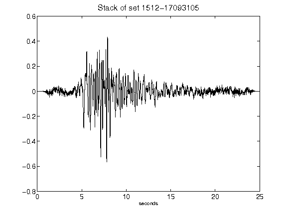](figures/1512-17093105_Stack.png)