# Repeating Earthquake Activity at RCS

## Waveforms
[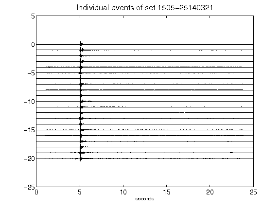](figures/1505-25140321_AllEv.png)[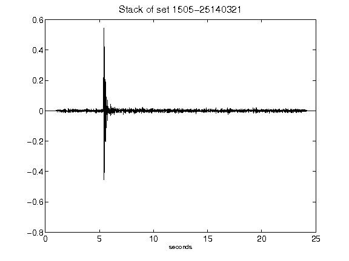](figures/1505-25140321_Stack.png)[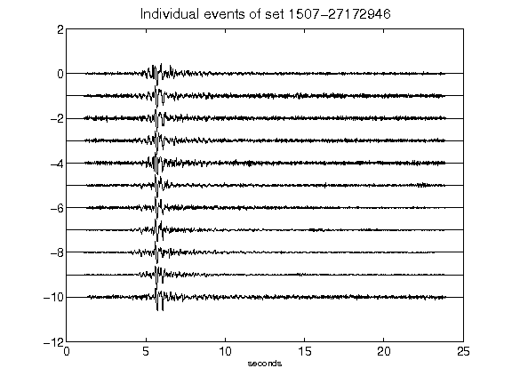](figures/1507-27172946_AllEv.png)[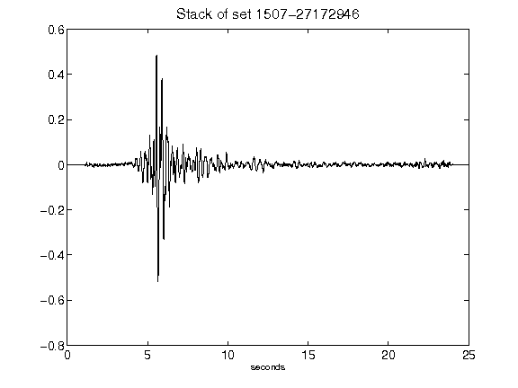](figures/1507-27172946_Stack.png)[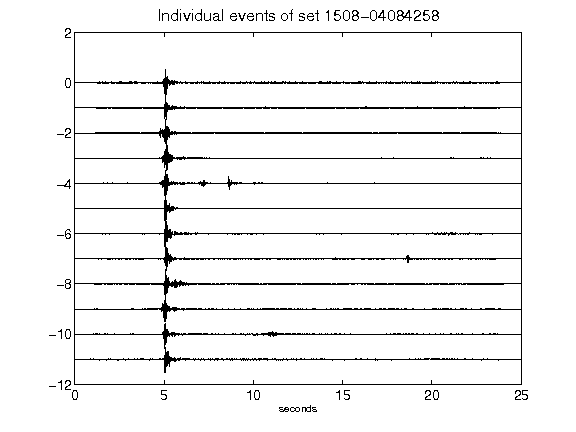](figures/1508-04084258_AllEv.png)[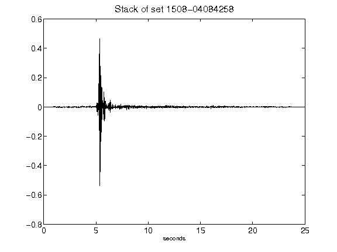](figures/1508-04084258_Stack.png)[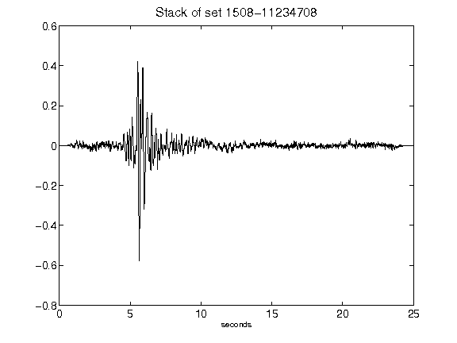](figures/1508-11234708_Stack.png)[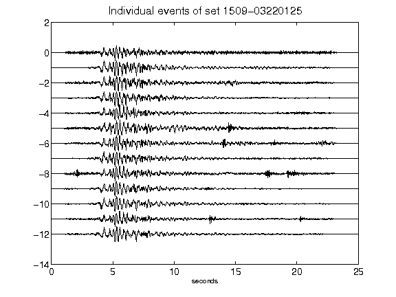](figures/1509-03220125_AllEv.png)[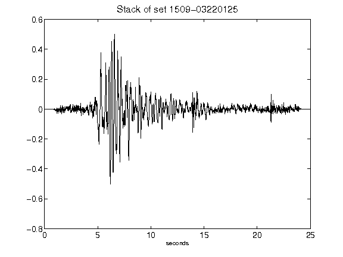](figures/1509-03220125_Stack.png)[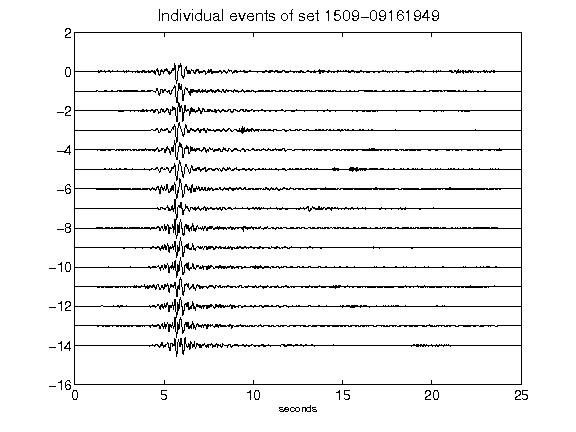](figures/1509-09161949_AllEv.png)[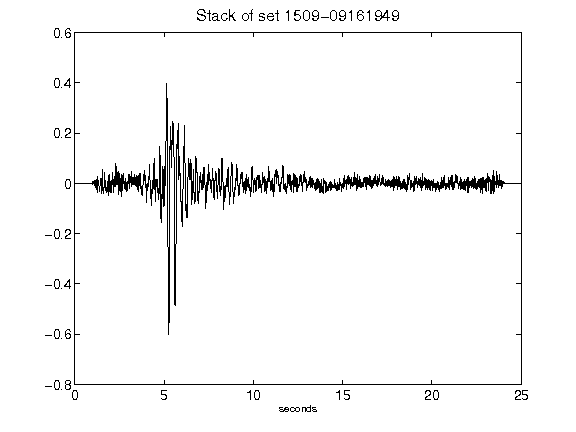](figures/1509-09161949_Stack.png)[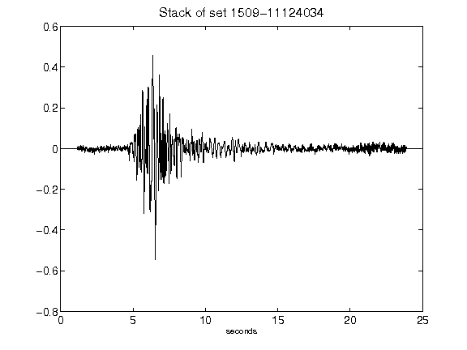](figures/1509-11124034_Stack.png)[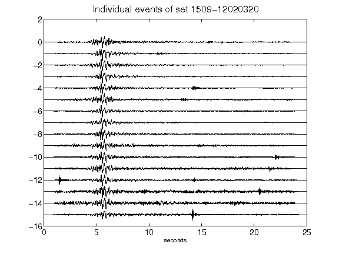](figures/1509-12020320_AllEv.png)[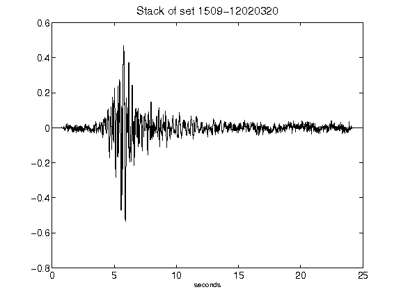](figures/1509-12020320_Stack.png)[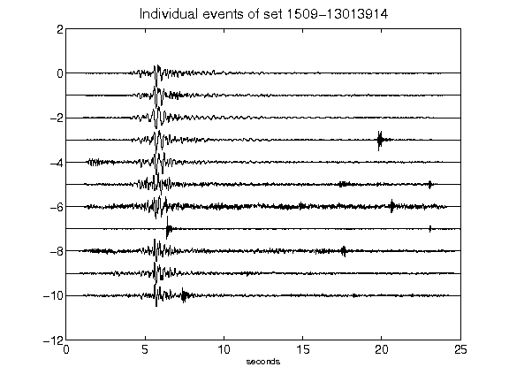](figures/1509-13013914_AllEv.png)[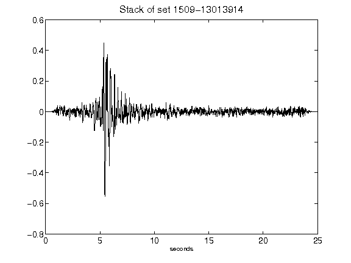](figures/1509-13013914_Stack.png)[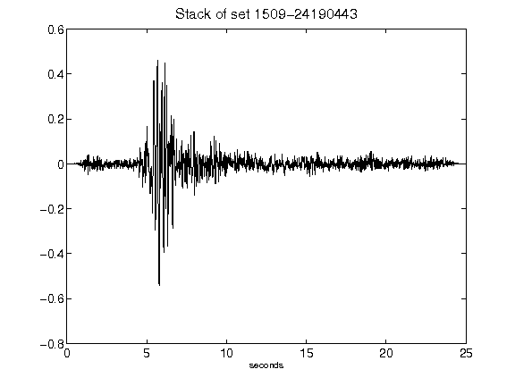](figures/1509-24190443_Stack.png)[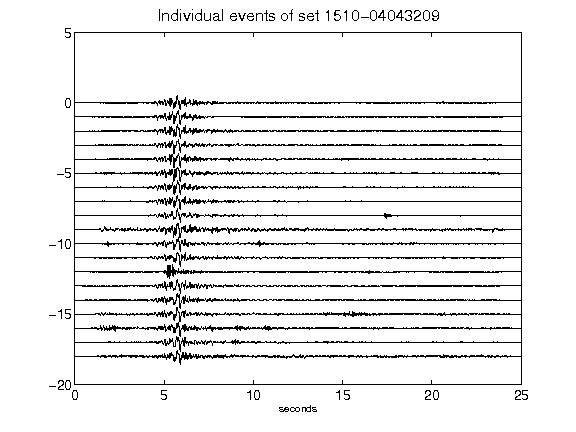](figures/1510-04043209_AllEv.png)[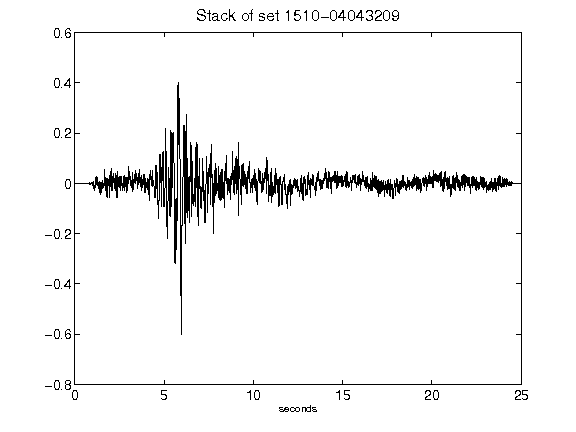](figures/1510-04043209_Stack.png)