# Repeating Earthquake Activity at RCS

## Waveforms
[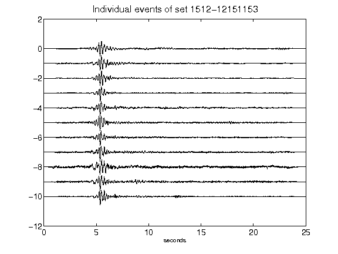](figures/1512-12151153_AllEv.png)[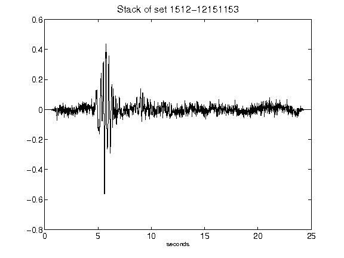](figures/1512-12151153_Stack.png)[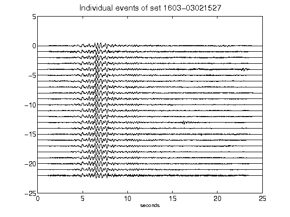](figures/1603-03021527_AllEv.png)[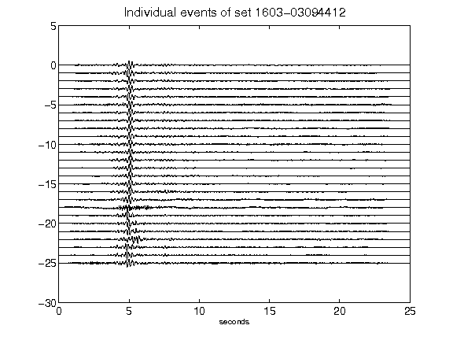](figures/1603-03094412_AllEv.png)[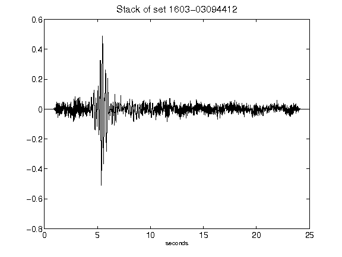](figures/1603-03094412_Stack.png)[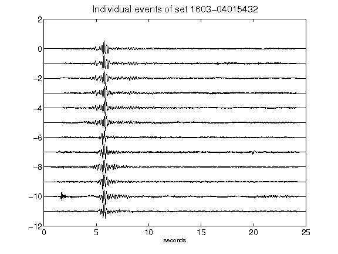](figures/1603-04015432_AllEv.png)[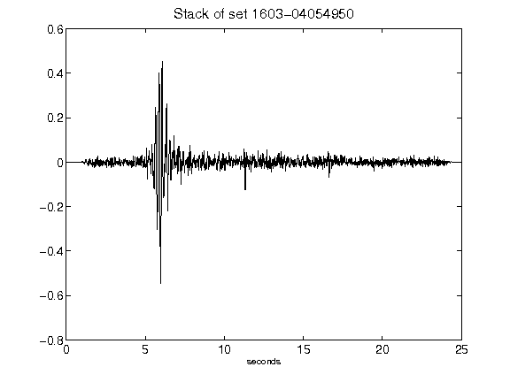](figures/1603-04054950_Stack.png)[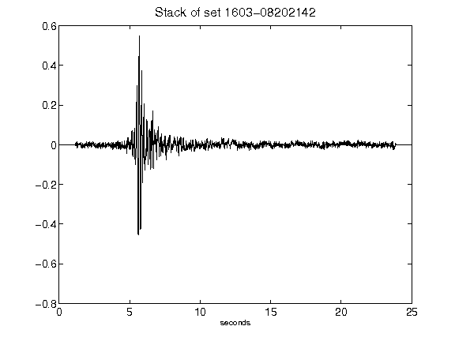](figures/1603-08202142_Stack.png)[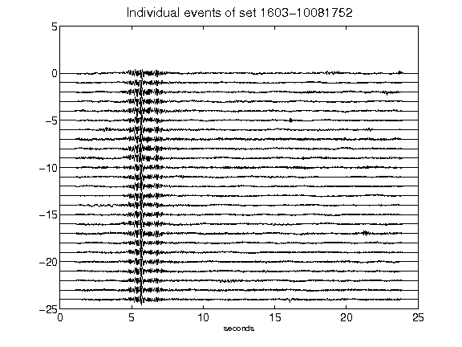](figures/1603-10081752_AllEv.png)[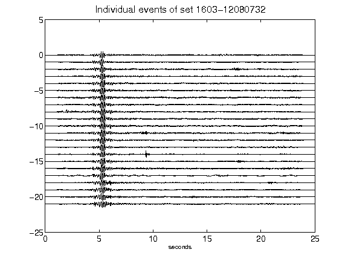](figures/1603-12080732_AllEv.png)[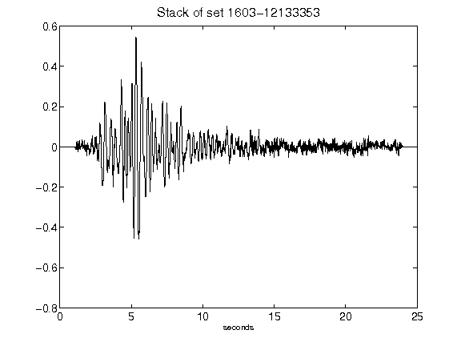](figures/1603-12133353_Stack.png)[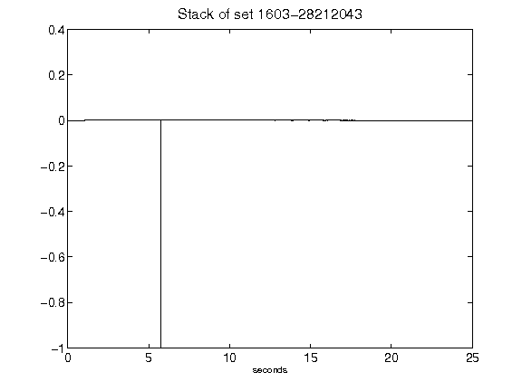](figures/1603-28212043_Stack.png)