# Repeating Earthquake Activity at RCS
  
  

## Waveforms
[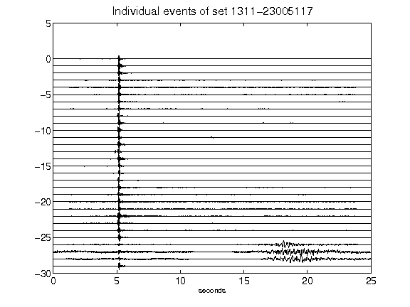](figures/1311-23005117_AllEv.png)[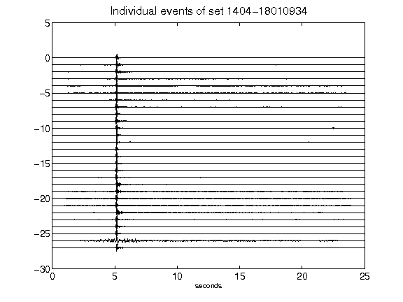](figures/1404-18010934_AllEv.png)[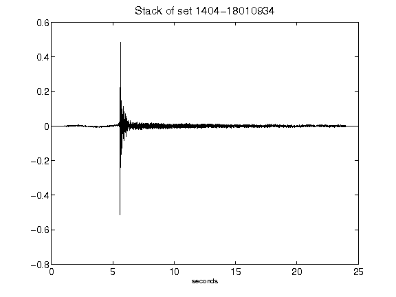](figures/1404-18010934_Stack.png)[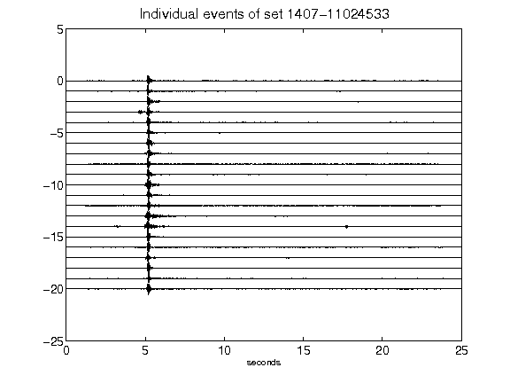](figures/1407-11024533_AllEv.png)[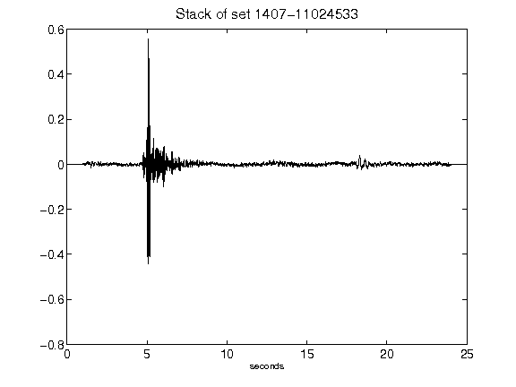](figures/1407-11024533_Stack.png)[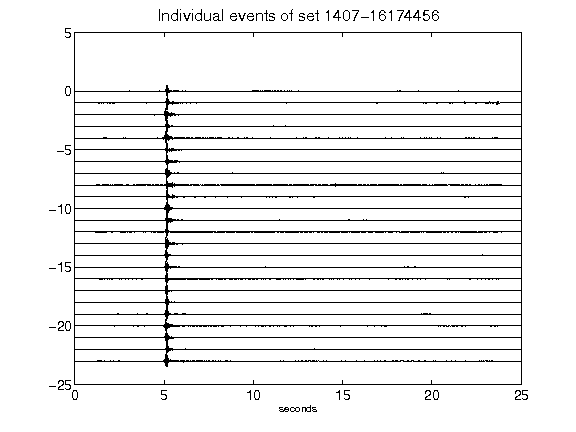](figures/1407-16174456_AllEv.png)[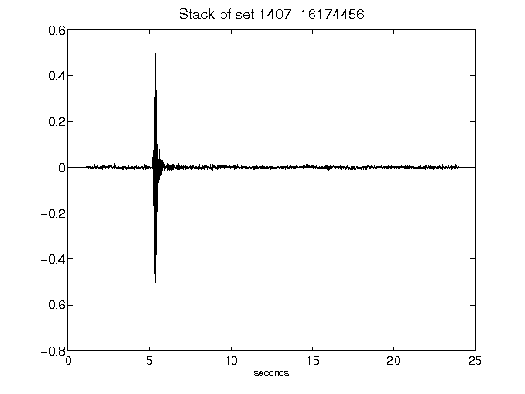](figures/1407-16174456_Stack.png)[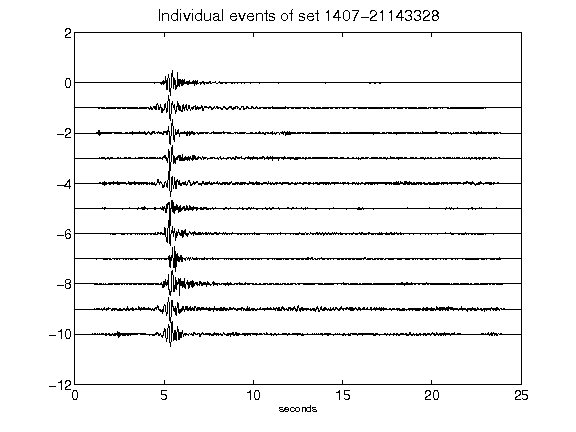](figures/1407-21143328_AllEv.png)[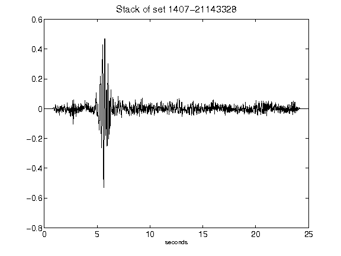](figures/1407-21143328_Stack.png)[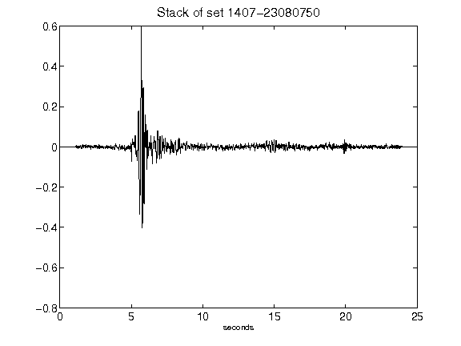](figures/1407-23080750_Stack.png)[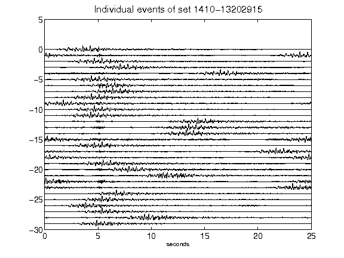](figures/1410-13202915_AllEv.png)[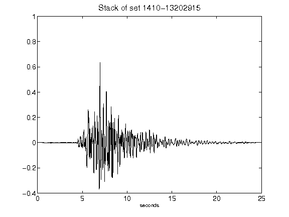](figures/1410-13202915_Stack.png)[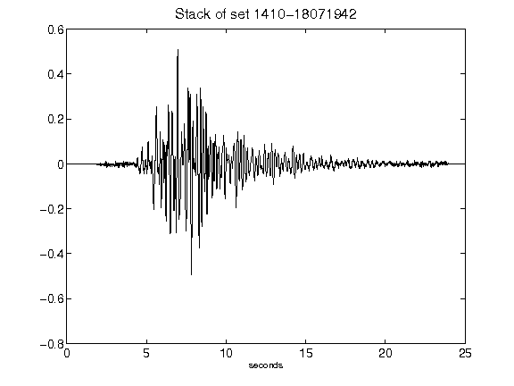](figures/1410-18071942_Stack.png)[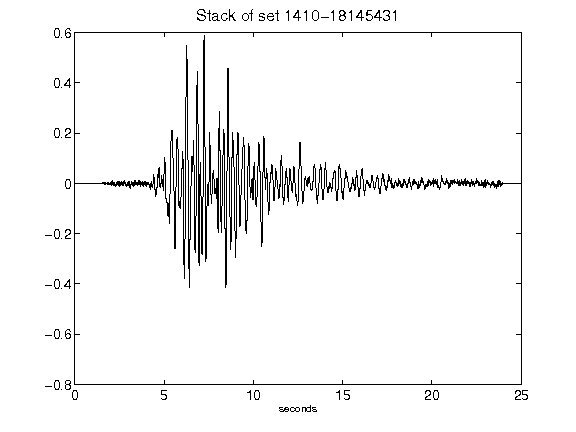](figures/1410-18145431_Stack.png)[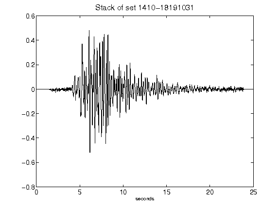](figures/1410-18191031_Stack.png)[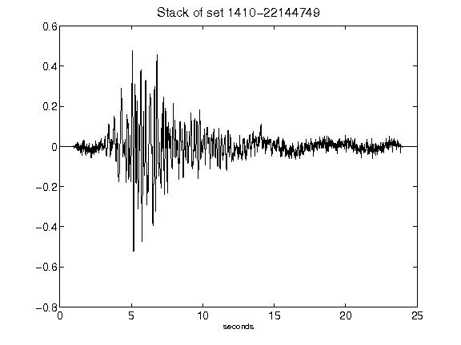](figures/1410-22144749_Stack.png)[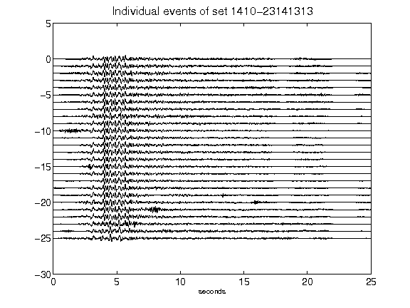](figures/1410-23141313_AllEv.png)[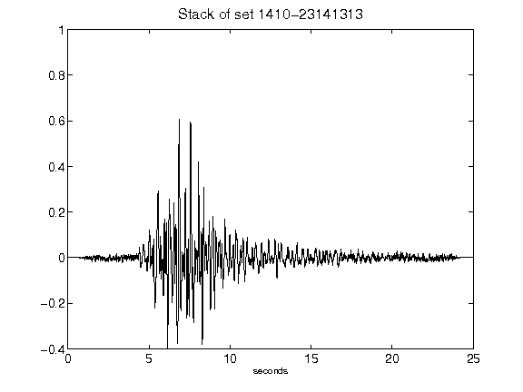](figures/1410-23141313_Stack.png)[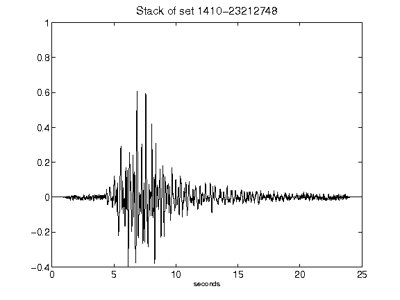](figures/1410-23212748_Stack.png)[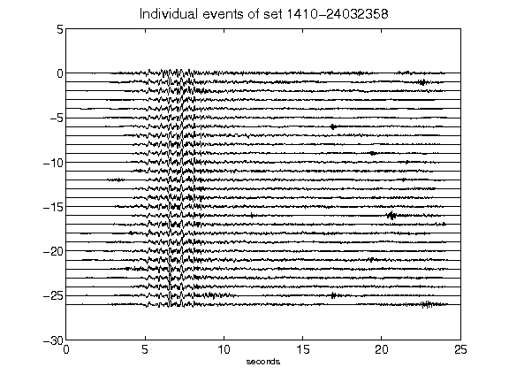](figures/1410-24032358_AllEv.png)[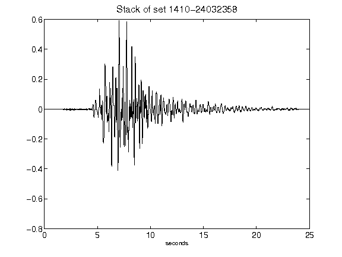](figures/1410-24032358_Stack.png)[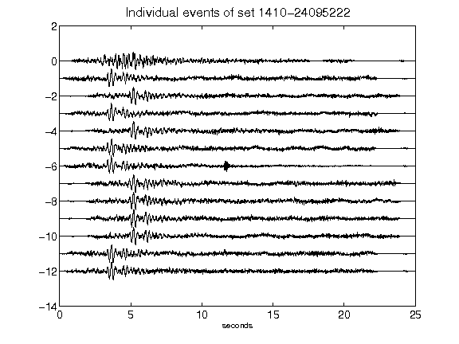](figures/1410-24095222_AllEv.png)[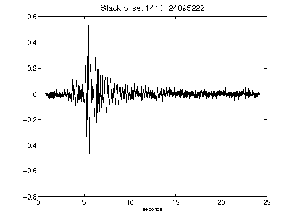](figures/1410-24095222_Stack.png)[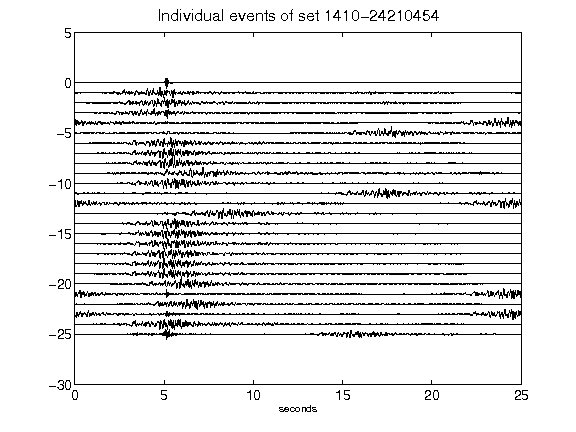](figures/1410-24210454_AllEv.png)[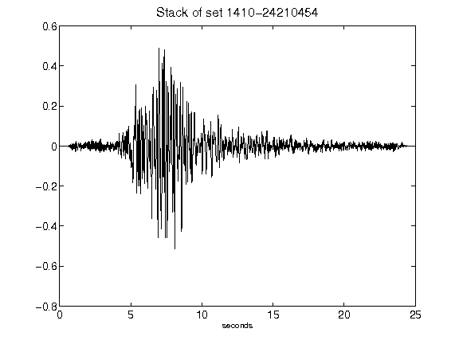](figures/1410-24210454_Stack.png)[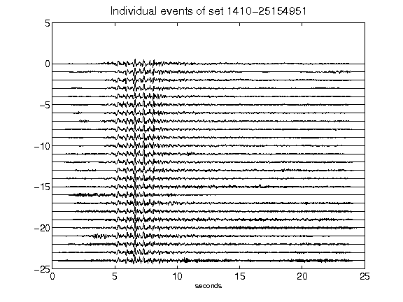](figures/1410-25154951_AllEv.png)[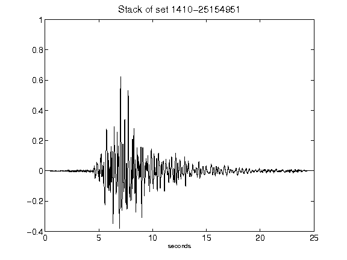](figures/1410-25154951_Stack.png)[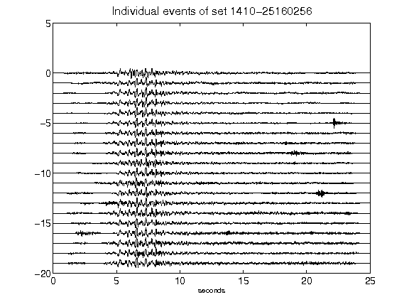](figures/1410-25160256_AllEv.png)[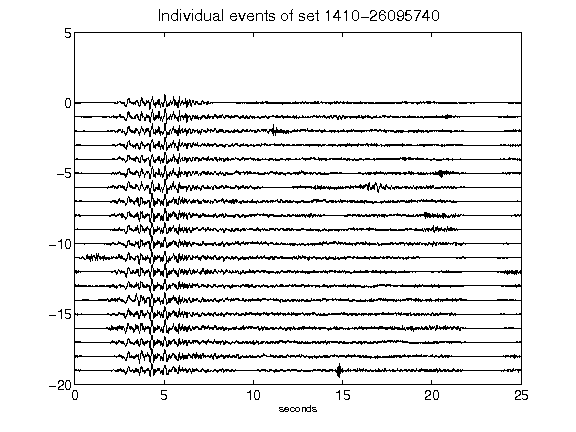](figures/1410-26095740_AllEv.png)[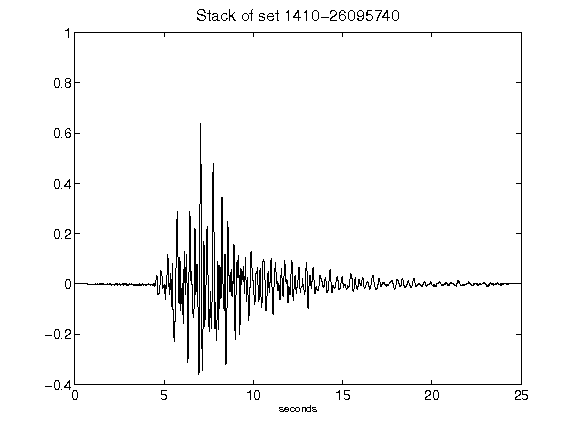](figures/1410-26095740_Stack.png)[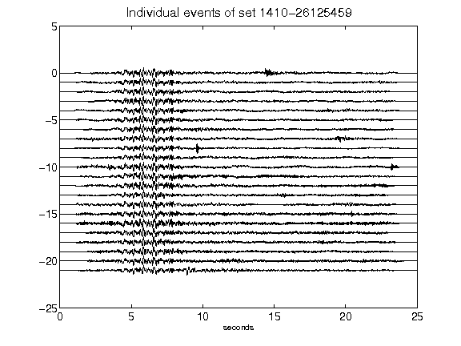](figures/1410-26125459_AllEv.png)[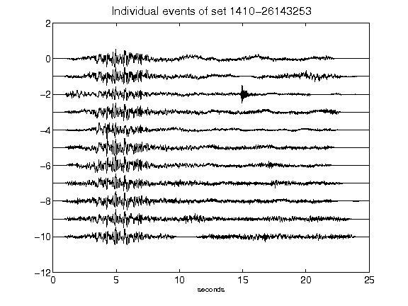](figures/1410-26143253_AllEv.png)[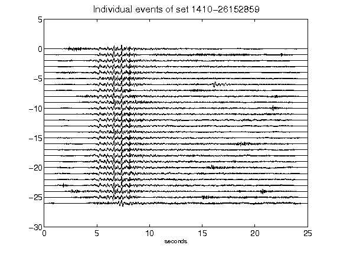](figures/1410-26152859_AllEv.png)[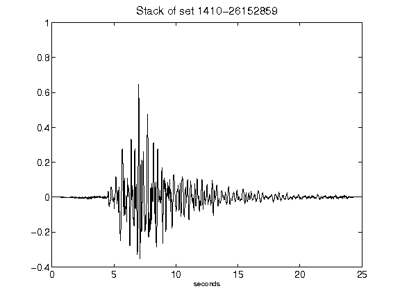](figures/1410-26152859_Stack.png)[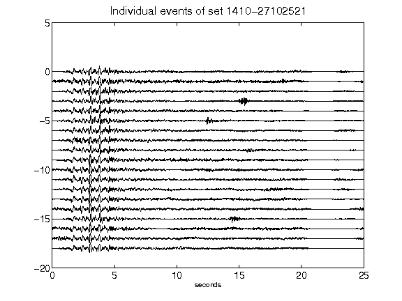](figures/1410-27102521_AllEv.png)