# Repeating Earthquake Activity at RCS

## Waveforms
[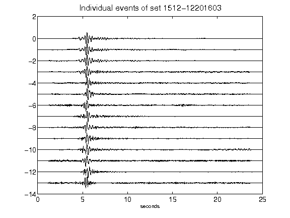](figures/1512-12201603_AllEv.png)[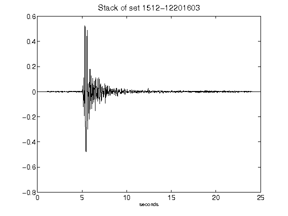](figures/1512-12201603_Stack.png)[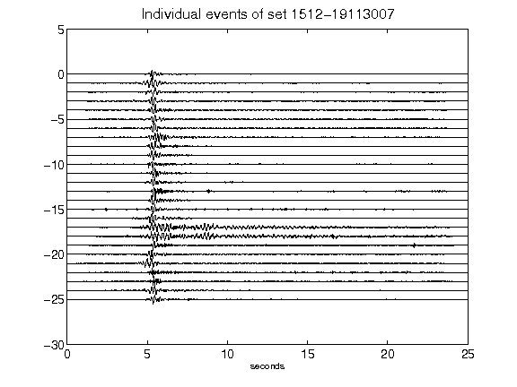](figures/1512-19113007_AllEv.png)[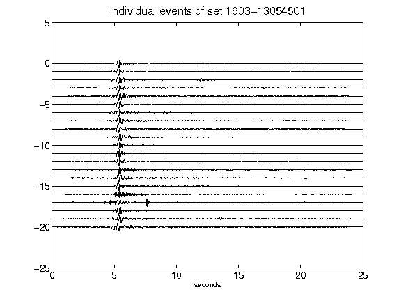](figures/1603-13054501_AllEv.png)[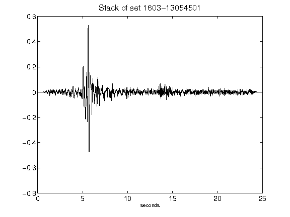](figures/1603-13054501_Stack.png)[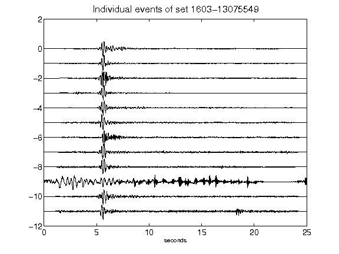](figures/1603-13075549_AllEv.png)[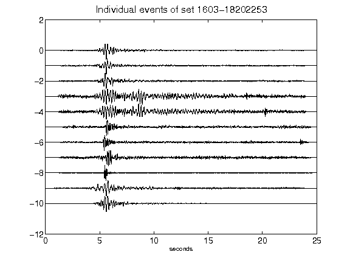](figures/1603-18202253_AllEv.png)[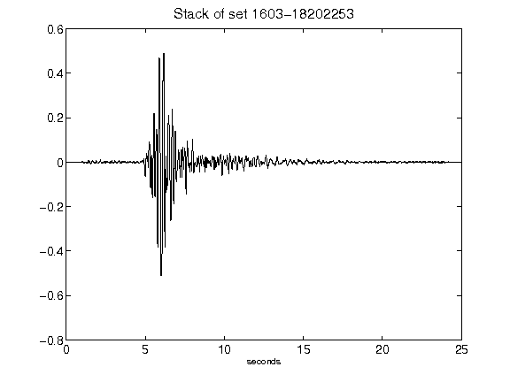](figures/1603-18202253_Stack.png)[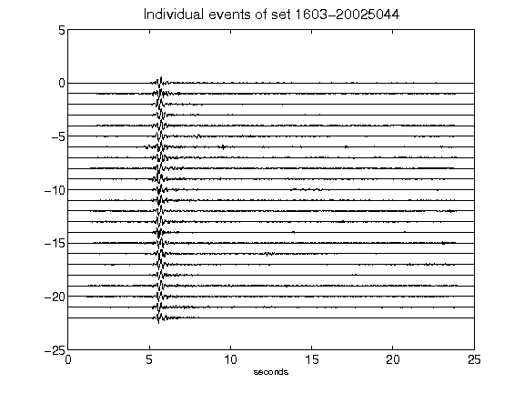](figures/1603-20025044_AllEv.png)[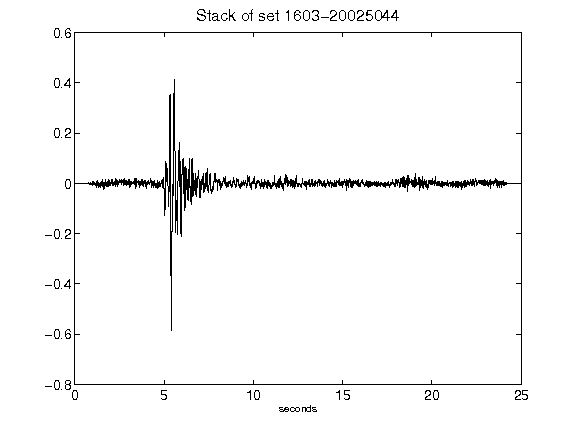](figures/1603-20025044_Stack.png)[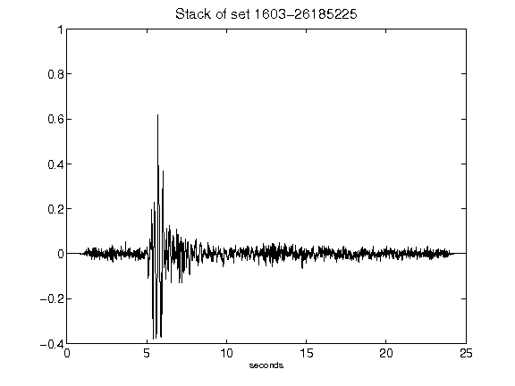](figures/1603-26185225_Stack.png)[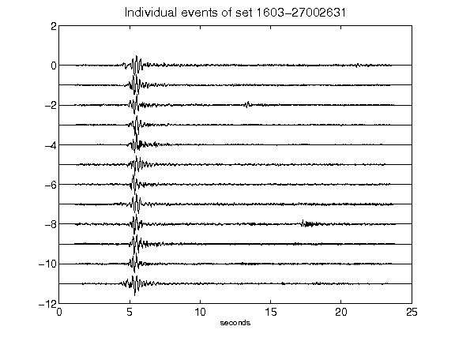](figures/1603-27002631_AllEv.png)[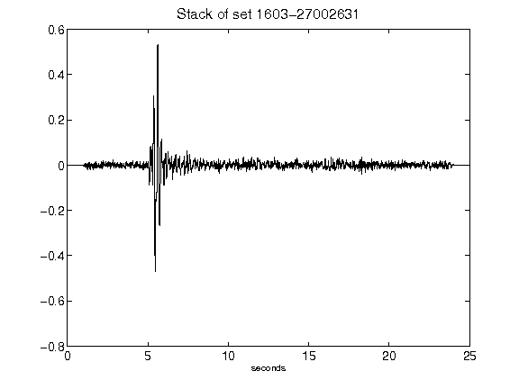](figures/1603-27002631_Stack.png)[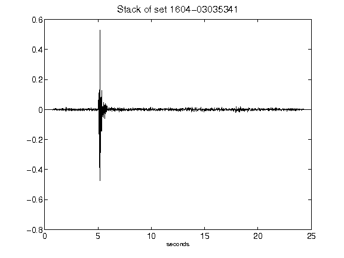](figures/1604-03035341_Stack.png)[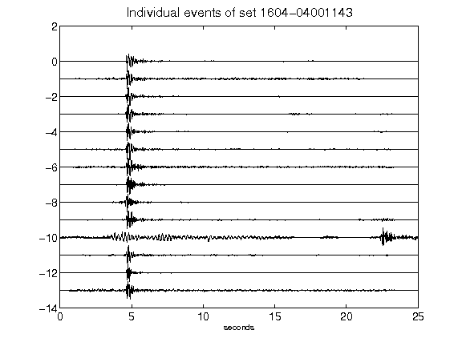](figures/1604-04001143_AllEv.png)[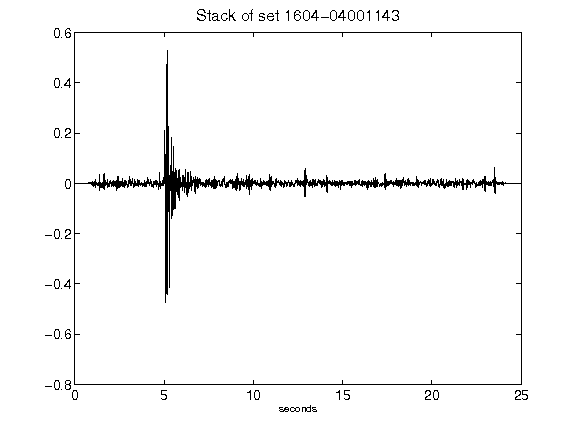](figures/1604-04001143_Stack.png)[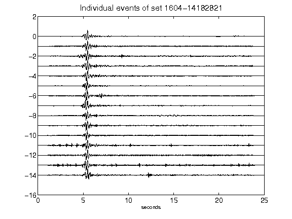](figures/1604-14182821_AllEv.png)[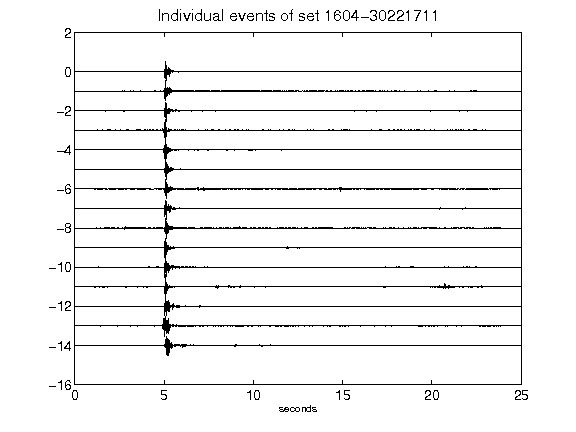](figures/1604-30221711_AllEv.png)[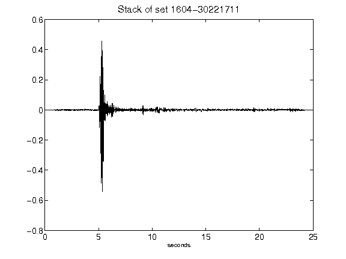](figures/1604-30221711_Stack.png)[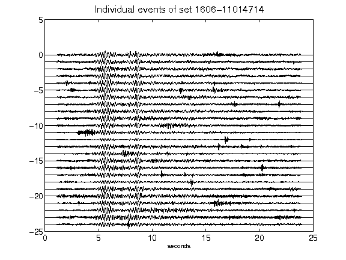](figures/1606-11014714_AllEv.png)