# Repeating Earthquake Activity at RCS

## Waveforms
[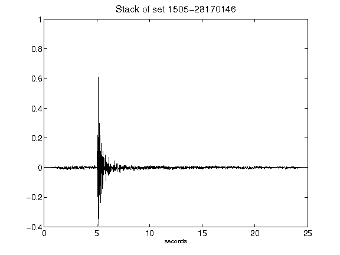](figures/1505-28170146_Stack.png)[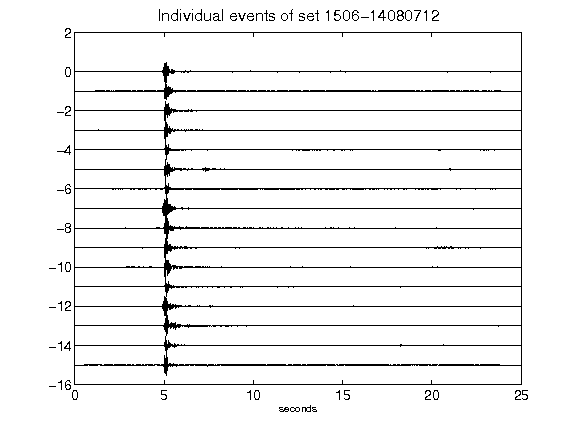](figures/1506-14080712_AllEv.png)[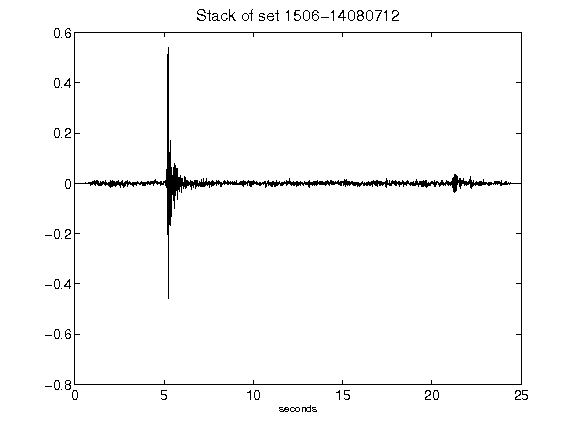](figures/1506-14080712_Stack.png)[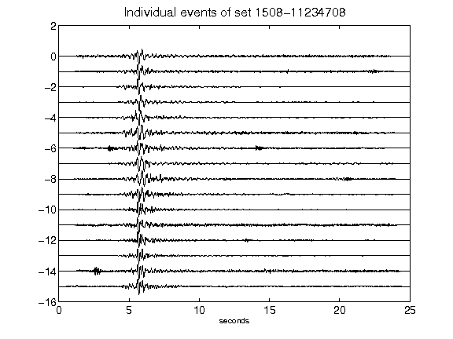](figures/1508-11234708_AllEv.png)[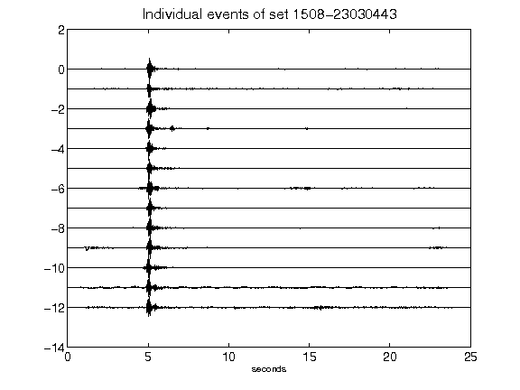](figures/1508-23030443_AllEv.png)[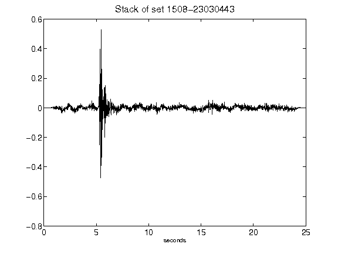](figures/1508-23030443_Stack.png)[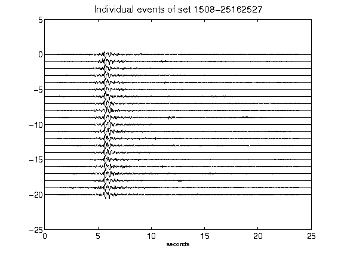](figures/1508-25162527_AllEv.png)[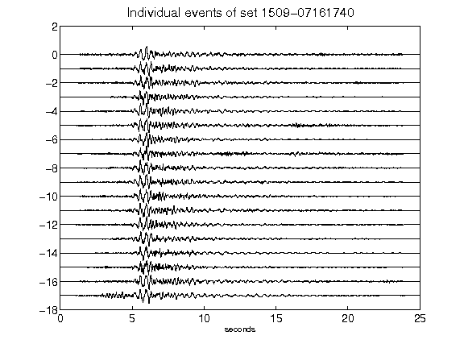](figures/1509-07161740_AllEv.png)[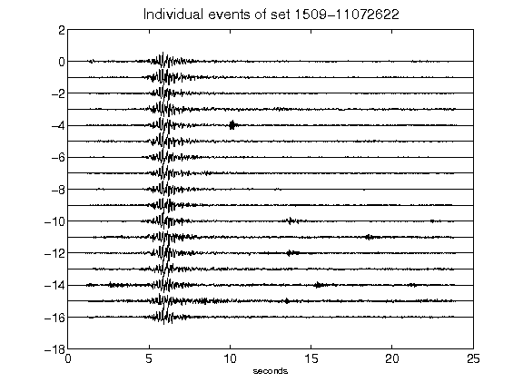](figures/1509-11072622_AllEv.png)[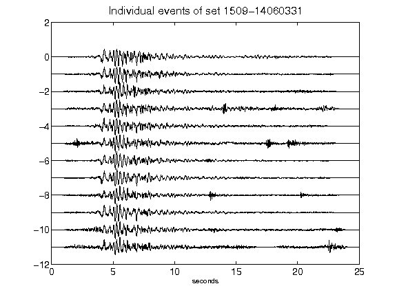](figures/1509-14060331_AllEv.png)[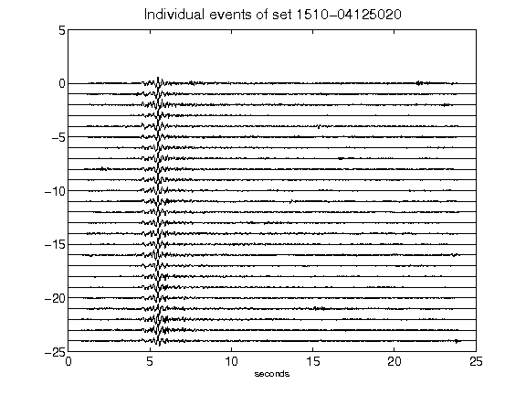](figures/1510-04125020_AllEv.png)[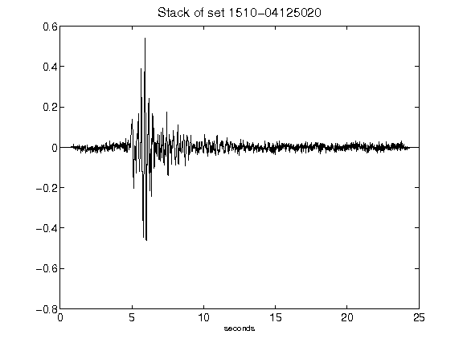](figures/1510-04125020_Stack.png)