# Repeating Earthquake Activity at RCS

## Waveforms
[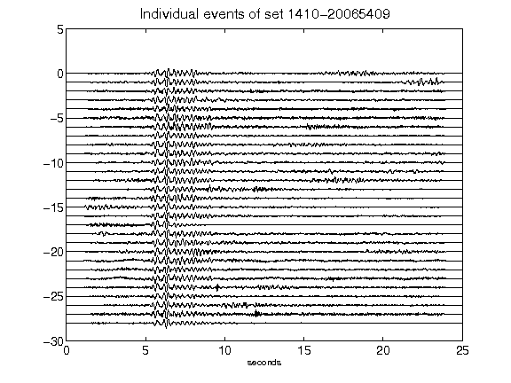](figures/1410-20065409_AllEv.png)[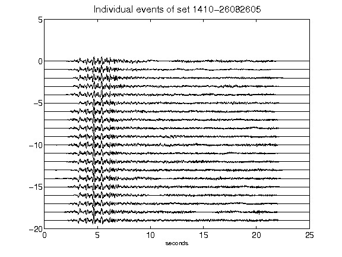](figures/1410-26082605_AllEv.png)[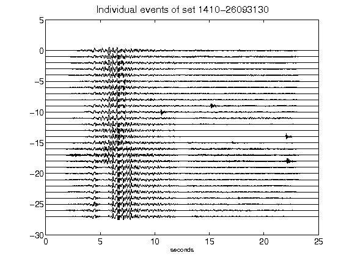](figures/1410-26093130_AllEv.png)[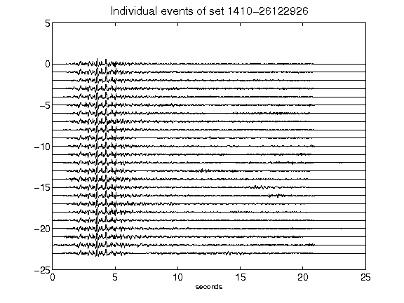](figures/1410-26122926_AllEv.png)[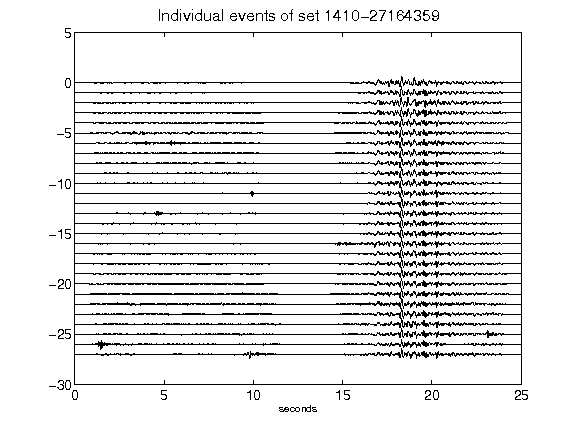](figures/1410-27164359_AllEv.png)[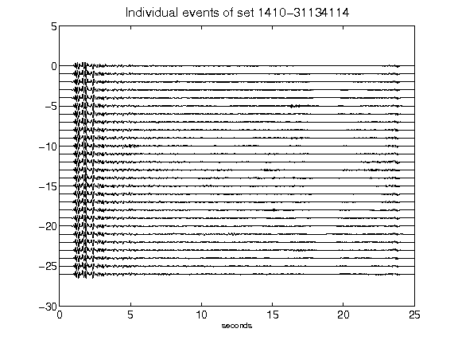](figures/1410-31134114_AllEv.png)[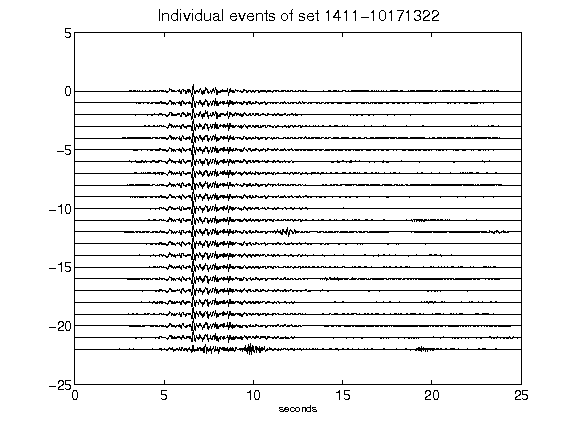](figures/1411-10171322_AllEv.png)[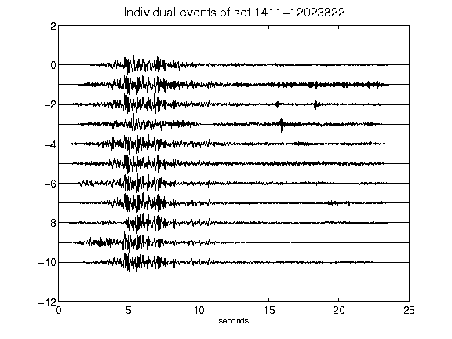](figures/1411-12023822_AllEv.png)[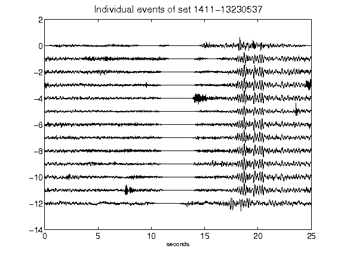](figures/1411-13230537_AllEv.png)[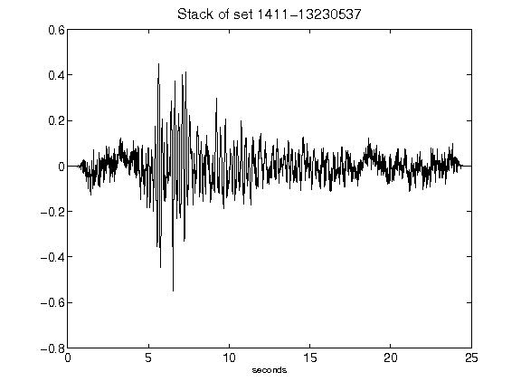](figures/1411-13230537_Stack.png)[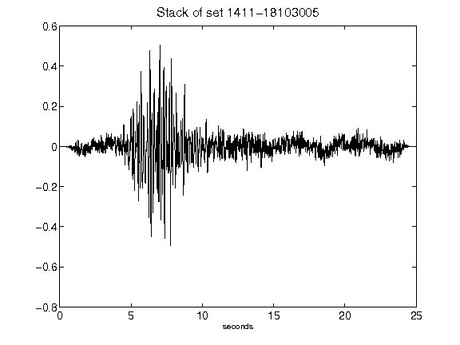](figures/1411-18103005_Stack.png)[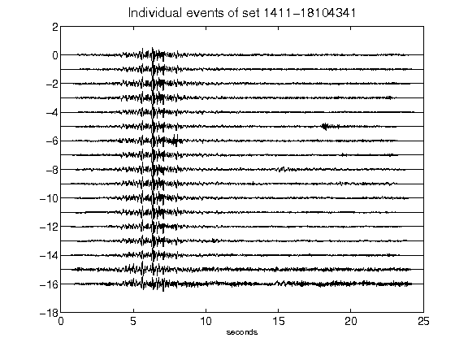](figures/1411-18104341_AllEv.png)[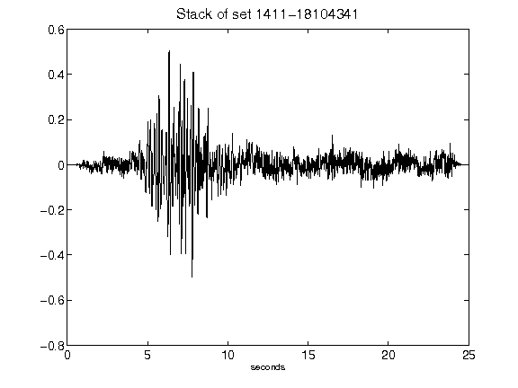](figures/1411-18104341_Stack.png)[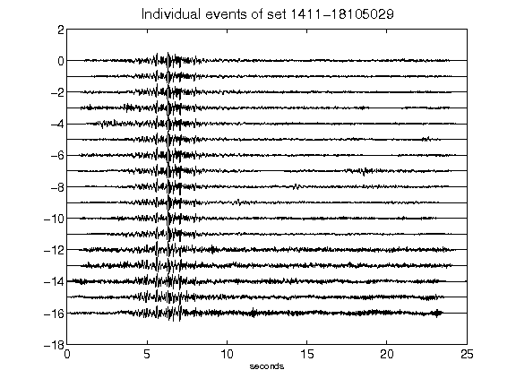](figures/1411-18105029_AllEv.png)