# Repeating Earthquake Activity at RCS

## Waveforms
[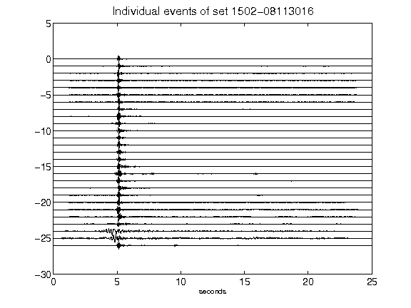](figures/1502-08113016_AllEv.png)[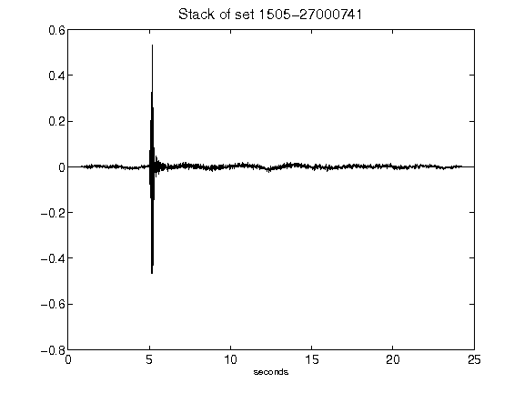](figures/1505-27000741_Stack.png)[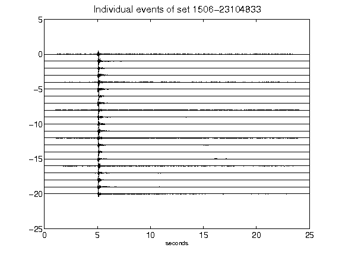](figures/1506-23104833_AllEv.png)[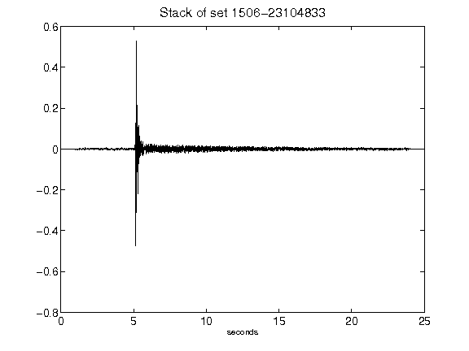](figures/1506-23104833_Stack.png)[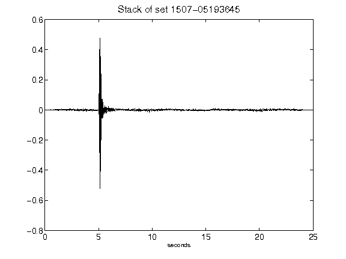](figures/1507-05193645_Stack.png)[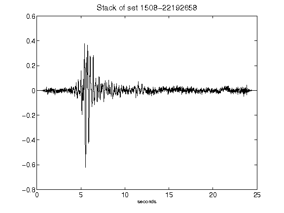](figures/1508-22192658_Stack.png)[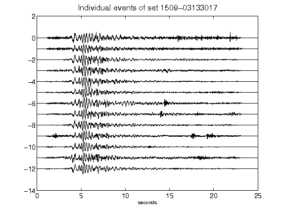](figures/1509-03133017_AllEv.png)[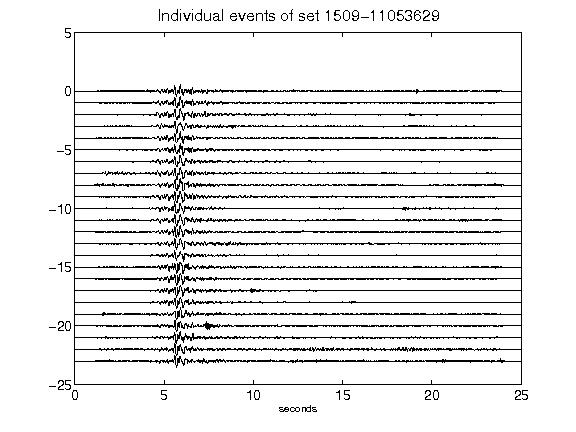](figures/1509-11053629_AllEv.png)[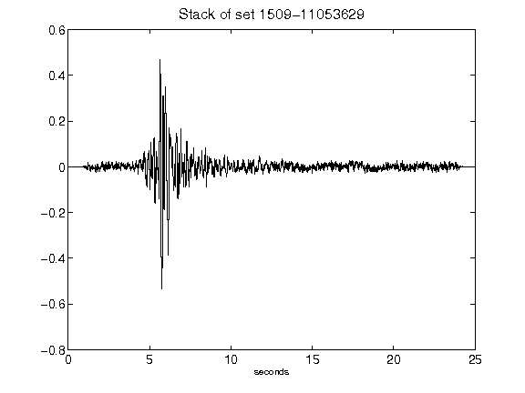](figures/1509-11053629_Stack.png)[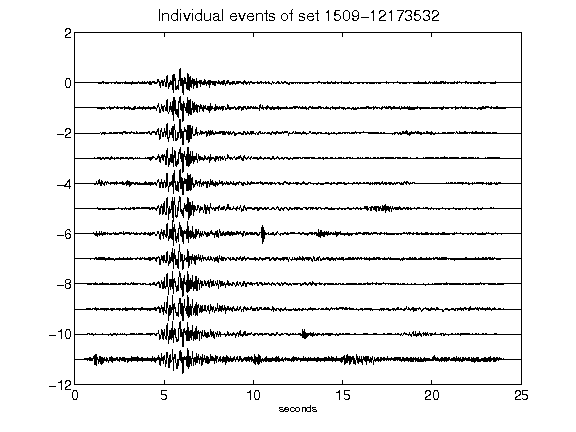](figures/1509-12173532_AllEv.png)[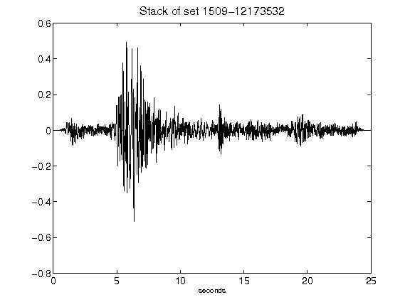](figures/1509-12173532_Stack.png)[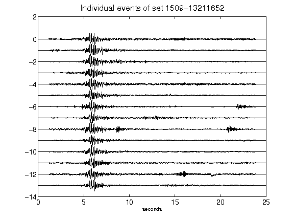](figures/1509-13211652_AllEv.png)